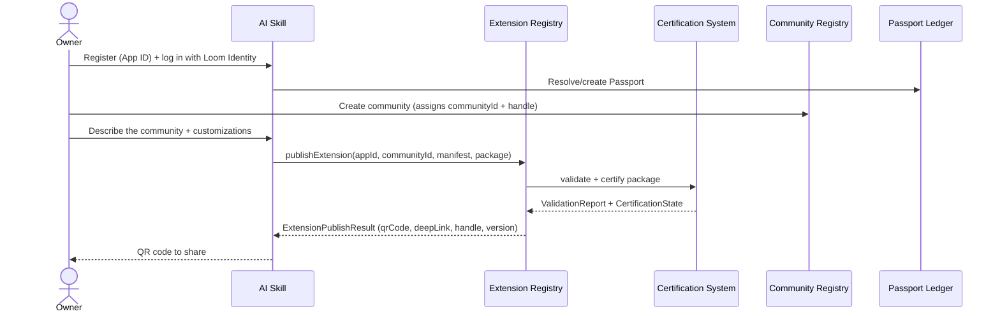
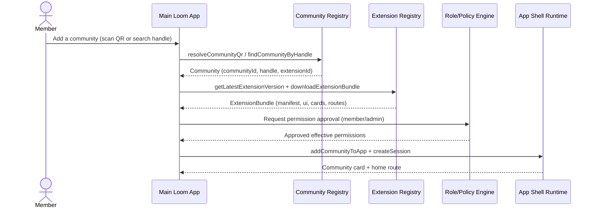
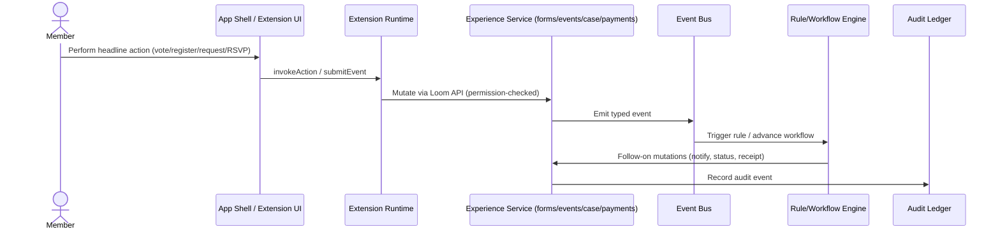
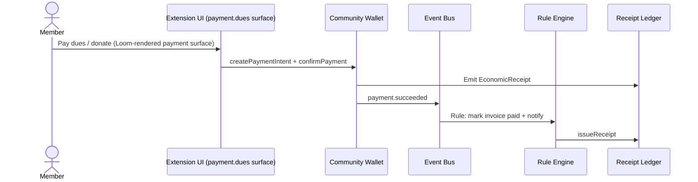
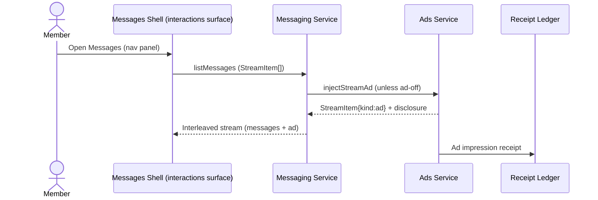
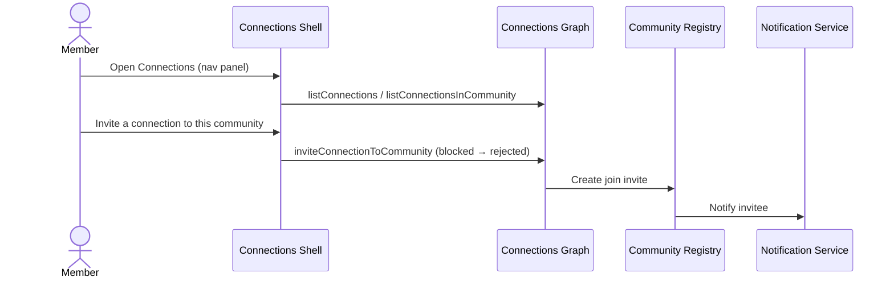
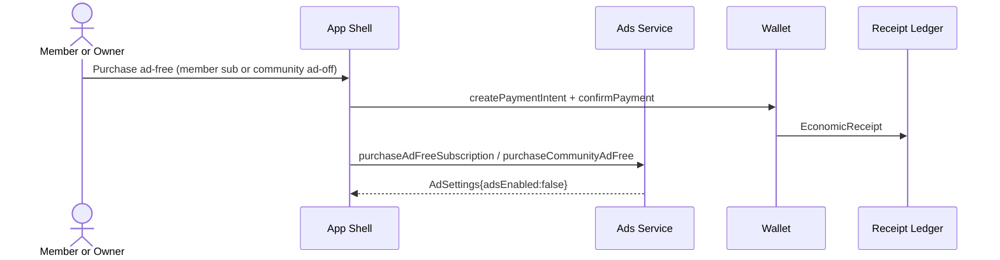
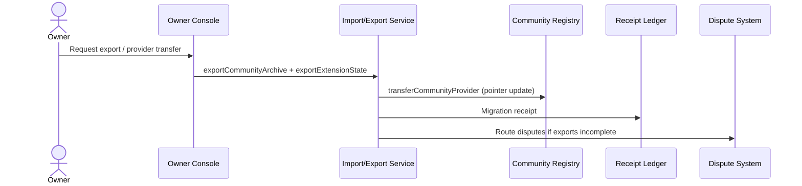

# Loom Communities Architecture 01: Overall System Architecture

Status: Draft for review
Source product doc: [docs/Product Docs V2/01-core-thesis-and-platform-principles.md](../Product%20Docs%20V2/01-core-thesis-and-platform-principles.md)
Design tenets: [Architecture V2/00 — System Design Tenets](./00-system-design-tenets.md) (this doc documents its components as two-tier Component Contract Cards and includes a tenet-adherence section, §8)
Predecessor: [Loom V1 Architecture 01](../Architecture/01-overall-system-architecture.md)

## 1. Purpose

This document defines the Loom Communities (V2) overall system architecture and maps the "life of a
packet" through the system for the end-to-end workflows defined in the Core Thesis V2.

A packet means a logical transaction envelope, not an IP packet. A packet starts with an owner, member,
builder, provider, advertiser, or governance action. It carries identity, authorization, manifest/
extension versions, policy context, request payload, and audit context through Loom services until the
workflow completes.

V2 is **additive over V1**: it reuses V1's identity, wallet, receipt/settlement, AI gateway, and
migration systems, and adds the community graph, the extension platform engines, the App Shell, the ads
delivery, and the protected vaults. The V1 creator/channel/fan subsystems remain available for
backward compatibility.

## 2. Overall System Diagram

```mermaid
flowchart TB
  subgraph Actors
    Owner[Community Owner / Admin]
    Member[Member]
    Builder[Extension Builder]
    Provider[Provider]
    Advertiser[Advertiser]
    Governance[Governance / Foundation]
  end

  subgraph ExperienceSurfaces[Experience Surfaces]
    Skill[AI Skill / Extension Builder]
    MainApp[Main Loom App + App Shell]
    OwnerConsole[Owner / Admin Console]
    BuilderConsole[Builder Console]
    AdvertiserConsole[Advertiser Console]
    GovernanceAdmin[Governance Admin]
  end

  subgraph ControlPlane[Control Plane and Registries]
    CommunityRegistry[Community Registry]
    SpacesService[Spaces Service]
    RolePolicyEngine[Role / Permission / Policy Engine]
    ExtensionRegistry[Community Extension Registry]
    CertificationSystem[Extension Certification System]
    AppShellRuntime[App Shell Runtime]
  end

  subgraph IdentityAndData[Identity and Member Data]
    PassportLedger[Fan Passport Ledger]
    ConnectionsGraph[Connections Graph]
    CoreVault[Core Member Vault]
    ProtectedVault[Protected-Visibility Vault]
    EntitlementLedger[Entitlement Ledger / Wallet]
    ConsentEngine[Consent / Data-Rights Engine]
  end

  subgraph ExtensionEngines[Extension Platform Engines]
    ExtensionRuntime[Extension Runtime Bridge]
    EventBus[Event Bus]
    RuleEngine[Rule Engine]
    WorkflowEngine[Workflow Engine]
    JobScheduler[Job Scheduler]
    FunctionRuntime[Sandboxed Function Runtime]
    DataSchemaStore[Extension Data Schema Store]
  end

  subgraph ExperienceServices[Community Experience Services]
    PublishingService[Publishing / Threads / Comments]
    MessagingService[Messaging / Stream Service]
    NotificationService[Notification Service]
    EventsService[Events / Registration / Ticketing]
    FormsVotingService[Forms / Polls / Voting]
    CaseTaskService[Case / Task / Approval]
    DocumentService[Documents / Files / Lists / Wiki]
    FacilitiesService[Facilities / Reservations / Inventory]
    SearchAIService[Search / AI / Digest]
  end

  subgraph EconomicPlane[Payments, Ads, Receipts, Settlement]
    Wallet[Community Wallet / Dues / Donations / Invoices]
    AdsService[Ads Service / Ad Decision]
    ReceiptLedger[Receipt Ledger]
    SettlementEngine[Settlement Engine]
  end

  subgraph TrustPlane[Trust, Safety, Governance, Portability]
    TrustSafety[Trust / Safety / Moderation]
    AuditLedger[Audit Ledger]
    DisputeSystem[Dispute Resolution]
    ImportExport[Import / Export / Provider Transfer]
    KeyManagement[Key Management]
  end

  Owner --> Skill
  Owner --> OwnerConsole
  Member --> MainApp
  Builder --> Skill
  Builder --> BuilderConsole
  Advertiser --> AdvertiserConsole
  Governance --> GovernanceAdmin

  Skill --> ExtensionRegistry
  Skill --> CertificationSystem
  OwnerConsole --> CommunityRegistry
  OwnerConsole --> RolePolicyEngine
  OwnerConsole --> Wallet

  MainApp --> AppShellRuntime
  MainApp --> PassportLedger
  MainApp --> CommunityRegistry
  MainApp --> ConnectionsGraph
  MainApp --> MessagingService
  MainApp --> AdsService

  AppShellRuntime --> ExtensionRuntime
  AppShellRuntime --> ExtensionRegistry
  ExtensionRegistry --> CertificationSystem
  CertificationSystem --> KeyManagement

  ExtensionRuntime --> RolePolicyEngine
  ExtensionRuntime --> EventBus
  ExtensionRuntime --> DataSchemaStore
  ExtensionRuntime --> PublishingService
  ExtensionRuntime --> MessagingService
  ExtensionRuntime --> EventsService
  ExtensionRuntime --> FormsVotingService
  ExtensionRuntime --> CaseTaskService
  ExtensionRuntime --> DocumentService
  ExtensionRuntime --> FacilitiesService
  ExtensionRuntime --> Wallet
  ExtensionRuntime --> ProtectedVault

  EventBus --> RuleEngine
  RuleEngine --> WorkflowEngine
  JobScheduler --> RuleEngine
  RuleEngine --> FunctionRuntime
  RuleEngine --> NotificationService
  WorkflowEngine --> CaseTaskService

  CommunityRegistry --> SpacesService
  RolePolicyEngine --> ConsentEngine
  RolePolicyEngine --> ProtectedVault

  MessagingService --> AdsService
  AdsService --> ReceiptLedger
  Wallet --> ReceiptLedger
  ReceiptLedger --> SettlementEngine
  SettlementEngine --> OwnerConsole
  SettlementEngine --> Provider

  EventBus --> AuditLedger
  RolePolicyEngine --> AuditLedger
  Wallet --> AuditLedger
  TrustSafety --> DisputeSystem
  ReceiptLedger --> TrustSafety
  CommunityRegistry --> ImportExport
  ImportExport --> DisputeSystem
```



## 3. System Components

| Component | Responsibility | Primary interfaces and outputs |
| --- | --- | --- |
| AI Skill / Extension Builder | Generates extension packages from an owner description; registers builder App IDs; publishes packages. | Emits `CommunityExtensionManifest` + package; calls publish/validate/certify; returns QR/handle. |
| Main Loom App + App Shell | Member-facing app: auth, community cards, the required nav panel (Messages + Connections), top ad banner, route rendering, and the JS bridge. | Calls registry, runtime, messaging, ads, connections; renders declarative cards/routes + WebView mini-apps. |
| Owner / Admin Console | Owner surface for community creation, permission approval, members/roles/spaces, payments, moderation, ad-off, export. | Calls registry, role/policy, wallet, trust/safety, import/export. |
| Builder Console | Builder surface for App ID, package validation, certification status, versions. | Calls extension registry + certification. |
| Advertiser Console | Advertiser surface for creatives, targeting policy, reporting. | Calls ads service; reads ad receipts. |
| Governance Admin | Certification approval, revocation, disputes, policy versions, registries. | Calls certification, audit, dispute, key management. |
| Community Registry | Canonical community identity, handle, profile, visibility, installed extensions; discovery by handle/QR; local add. | Exposes `CommunityRegistryApi`; returns `Community`, QR payloads, add-to-app. |
| Spaces Service | Arbitrary-depth nestable, user-extensible spaces. | Exposes `CommunitySpacesApi`; custom space-type registration. |
| Role / Permission / Policy Engine | Roles, scoped capabilities, effective-permission intersection, consent gates, sensitive-data gates. | Exposes `CommunityRolePolicyApi`; returns effective permissions; gates protected vault. |
| Community Extension Registry | Publish, validate, certify, install, configure, suspend, update, uninstall, download, export extensions; builder App IDs. | Exposes `CommunityExtensionRegistryApi`; returns `ExtensionPublishResult` (QR), `ExtensionBundle`. |
| Extension Certification System | Validates packages (schema, permissions, portability, UI/payment/minor/secrets/ad integrity) and assigns tiers. | Exposes `CommunityExtensionCertificationApi`; `ValidationReport`, `CertificationState`. |
| App Shell Runtime | Loads extensions; renders cards/routes/surfaces; owns the top ad banner and nav-panel contract; the API bridge. | Exposes `CommunityAppShellApi`; session + launch context. |
| Fan Passport Ledger | Portable member identity (reused from V1). | Exposes `FanPassportApi`; `passportId`, claims. |
| Connections Graph | Passport-level connections; invite-to-community unless blocked. | Exposes `CommunityConnectionsApi`. |
| Core Member Vault | Portable lightweight member state (preferences, saves, notification settings). | Member-owned portable state. |
| Protected-Visibility Vault | Sensitive data (care/minor/donor) with permissioned, audited, redacted access. | Exposes `CommunityVaultApi`. |
| Entitlement Ledger / Wallet | Memberships, dues, donations, tickets, ad-off entitlements (reused from V1). | Exposes wallet/entitlement APIs. |
| Consent / Data-Rights Engine | Consent grants, purpose-bound access, revocation, export. | Exposes consent APIs; `DataAccessReceipt`. |
| Extension Runtime Bridge | Typed, permissioned bridge between extension UI and Loom APIs; sessions, actions, events. | Exposes `CommunityExtensionRuntimeApi`. |
| Event Bus | Publishes/subscribes typed community events; replay; audit. | Exposes `CommunityEventBusApi`. |
| Rule Engine | Declarative event/time rules (Level 2). | Exposes `ExtensionRulesApi`; execution logs. |
| Workflow Engine | Stateful multi-step state machines (Level 3). | Exposes `ExtensionWorkflowApi`; instances, timelines. |
| Job Scheduler | Time-based jobs (reminders, recurring invoices, digests). | Exposes `ExtensionJobsApi`; job runs. |
| Sandboxed Function Runtime | Certified bounded functions (Level 4); mutations only via Loom APIs. | Exposes `ExtensionFunctionsApi`; run logs. |
| Extension Data Schema Store | Portable custom entity types and records. | Exposes `ExtensionDataSchemaApi`. |
| Publishing / Messaging / Notification / Events / Forms / Case / Document / Facilities / Search-AI services | The community experience primitives. | Expose their respective `Community*Api` families. |
| Messaging / Stream Service | Rich stream items (formatting + attachments); in-stream ad injection. | Exposes `CommunityMessagingApi`; `StreamItem`. |
| Community Wallet / Dues / Donations | Payments, dues, donations, invoices, receipts (reused from V1 wallet). | Exposes payment APIs; emits `EconomicReceipt`. |
| Ads Service / Ad Decision | Fills shell ad surfaces; injects in-stream ad items; resolves ad-off; emits ad receipts. | Exposes `CommunityAdsApi`. |
| Receipt Ledger | Immutable economic/audit/utility receipts (reused from V1). | Exposes `ReceiptIngestApi`; feeds settlement. |
| Settlement Engine | Applies settlement to receipts; owner/provider statements (reused from V1). | Exposes settlement APIs. |
| Trust / Safety / Moderation | Reports, moderation queues, restrictions, incidents. | Exposes `CommunityTrustSafetyApi`. |
| Audit Ledger | Immutable audit trail; redacted sensitive payloads. | Exposes `CommunityAuditApi`. |
| Import / Export / Provider Transfer | Portability and migration. | Exposes `CommunityImportExportApi`. |
| Key Management | Signing keys for extensions, providers, receipts. | Issues/rotates/revokes keys. |

### 3.1 Layer assignment

Per the [tenets layering rules](./00-system-design-tenets.md#4-dependency-graph--layering-rules),
each component sits in a layer; synchronous calls go downward only, "upward" effects via the Event Bus.

| Layer | Components (owned here or cross-referenced) |
| --- | --- |
| **Foundation (cross-cutting)** | Passport Ledger, Role/Permission/Policy/Consent Engine, Core Member Vault, Protected-Visibility Vault, Connections Graph, Entitlement Ledger/Wallet, Receipt Ledger, Audit Ledger, Event Bus, Key Management |
| **Registry / control-plane** | Community Registry, Spaces Service, Extension Registry, Certification System |
| **Service (experience + economic)** | Publishing, Messaging, Notification, Events, Forms/Voting, Case/Task, Documents, Facilities, Search/AI, Wallet/Dues/Donations, Ads, Settlement |
| **Extension engine** | Extension Runtime Bridge, Rule Engine, Workflow Engine, Job Scheduler, Function Runtime, Data Schema Store |
| **UX** | App Shell Runtime + UI micro-components (cards, nav panel, stream renderer, connections shell, ad slots, payment surface) |

### 3.2 Component Contract Cards (representative)

The full card for each component lives in the architecture doc that owns its domain (App Shell &
identity in [03](./03-identity-member-data-wallets-and-app-shell.md); community/spaces/roles in
[04](./04-community-spaces-membership-and-roles.md); payments/ads in
[05](./05-content-publishing-payments-ads-and-settlement.md); extension engines in
[08](./08-extension-platform-runtime.md)). Representative cards for the control-plane components this
doc anchors:

```text
Component: Community Registry            Layer: registry
Single responsibility: own canonical community identity, handle, profile, and discovery. (T1)
Interface contract: CommunityRegistryApi (v1), in loom_api_contracts (T2)
Capabilities (testable sub-units):
  - create/configure community → createCommunity/updateCommunityProfile/setVisibility → write+read-back test
  - discovery → findCommunityByHandle/generateCommunityQr/resolveCommunityQr → handle+QR round-trip test
  - local add → addCommunityToApp → triggers-download test (asserts download requested, not performed here)
Owned data: Community {communityId, handle, profile, visibility, installedExtensionIds} (T1)
Dependencies (by contract + fake): FanPassportApi (fake, owner identity), CommunityAuditApi (fake) (T3)
Events emitted: community.created, community.updated   Events consumed: none (T8)
Blast radius: changes here touch CommunityRegistryApi only; dependents (App Shell, Extension Registry)
  consume via contract; no sibling-registry edits. (T5)
Integration tests (definition of done):
  - component-level: CommunityRegistryApi conformance + idempotency
  - per-capability: create/configure, discovery (handle+QR), local-add
Agent workpackage: card is self-contained; acceptance = all suites green against Passport+Audit fakes. (T9)
```

```text
Component: Role/Permission/Policy/Consent Engine    Layer: foundation (cross-cutting)
Single responsibility: compute the effective-permission intersection and gate sensitive-data access. (T1)
Interface contract: CommunityRolePolicyApi (v1) (T2)
Capabilities (testable sub-units):
  - roles → create/assign/revokeRole → role-assignment test
  - effective permission → getEffectivePermissions/canPerformAction → intersection test (requested∩admin∩role∩consent∩safety)
  - consent → create/grant/revokeConsent → consent-gate test
  - sensitive gate → gate Protected Vault reads → deny-without-permission test
Owned data: Role, PermissionPolicy, ConsentGrant (T1)
Dependencies (by contract + fake): FanPassportApi (fake), CommunityAuditApi (fake) (T3)
Events emitted: role.assigned, consent.granted, consent.revoked   Events consumed: none (T8)
Blast radius: every gated action depends on this contract; changes are additive new capability checks;
  callers unchanged. (T5)
Integration tests: conformance + per-capability (roles, intersection, consent, sensitive gate). (T6)
Agent workpackage: implementable against Passport+Audit fakes; acceptance = suites green. (T9)
```

```text
Component: App Shell Runtime              Layer: ux / control-plane boundary
Single responsibility: load extensions; render cards/routes/surfaces; own the top ad banner and the
  nav-panel contract; expose the API bridge. (T1, T10)
Interface contract: CommunityAppShellApi (v1) (T2)
Capabilities (testable sub-units):
  - cards → registerCommunityCard/resolveCardData → card render+bind test
  - routes/surfaces → registerRoutes/openExtensionRoute → route-mount test
  - nav panel → registerNavigationPanel → required Messages+Connections lint test
  - shells → registerMessagingShell/registerConnectionsShell → reachability test
Owned data: CommunityCard, ExtensionRoute, NavigationPanel registrations (T1)
Dependencies (by contract + fake): CommunityExtensionRuntimeApi (fake), CommunityRegistryApi (fake),
  CommunityAdsApi (fake) (T3)
Events emitted: none   Events consumed: extension.installed/updated (to refresh cards) (T8)
Blast radius: UX surface registration only; extensions consume via contract; no service-storage edits. (T5)
Integration tests: conformance + per-capability (cards, routes, nav-panel invariant, shell reachability);
  visual/interaction tests per T10. (T6, T10)
Agent workpackage: buildable against Runtime/Registry/Ads fakes; acceptance = suites + UX invariants green. (T9)
```

## 4. Transaction Packet Model

Every workflow carries a packet with a common envelope.

| Packet field | Purpose |
| --- | --- |
| `actor` | Owner, member, builder, provider, advertiser, or governance. |
| `surface` | The surface where the action starts (Main App, Skill, Owner Console, …). |
| `actorIdentity` | Signed identity: Passport claim, builder App ID, provider key. |
| `communityContext` | `communityId` / handle, `spaceId`, and installed extension/version. |
| `capabilityScope` | The certification scope or extension tier required. |
| `requestIntent` | Declared purpose (create community, publish extension, pay dues, post message, inject ad, invite connection, export). |
| `permissionContext` | Effective permission = requested ∩ admin-approved ∩ role ∩ consent ∩ platform-safety. |
| `manifestContext` | Extension manifest id/version and any rule/workflow/job ids used. |
| `policyContext` | Safety, payment, minor/sensitive, ad, and export policy state. |
| `idempotencyKey` | Prevents duplicate writes/receipts/charges. |
| `auditTrace` | Correlation id across downstream calls, receipts, and disputes. |
| `responsePayload` | Result (manifest, QR, session, token, receipt, plan). |
| `downstreamReceipts` | Economic/audit/ad receipts generated or queued. |
| `downstreamStateChanges` | Durable writes (registry, vault, ledger, schema records, settlement). |

## 5. Shared Call Conventions

- Extensions never get raw DB credentials; they call Loom APIs through the runtime bridge.
- Durable writes are idempotent and versioned; sensitive mutations emit audit events.
- Effective permission is evaluated by the Role/Policy engine on every extension action.
- Sensitive data (care/minor/donor) is read/written only via the Protected Vault, with redacted audit.
- Payments, ad impressions, and ad-off purchases generate signed receipts before settlement.
- Shell ad surfaces and in-stream ad items are platform-controlled and cannot be suppressed by extensions.
- The nav panel + Messages/Connections contract is Skill-enforced and lintable at certification.
- Extension install requires validation + certification; uninstall disables rules/jobs immediately.
- Export/migration separates canonical portable state, required export state, optional export state, and non-portable runtime state.

## 6. Workflow Packet Overlays

### Workflow 1: Build And Publish (Skill → QR)

Goal: An owner builds and publishes a community extension with the Skill.



| Step | Packet movement | API or interface | Response | Downstream state |
| --- | --- | --- | --- | --- |
| 1 | Owner → Skill | `registerBuilderApp` | `appId` | Builder credential tied to Passport. |
| 2 | Skill → Passport Ledger | `FanPassportApi.createOrResolve` | Passport claim | Owner identity established. |
| 3 | Owner → Community Registry | `createCommunity` | `communityId` + handle | Canonical community + friendly handle. |
| 4 | Owner → Skill | (authoring) | Generated package | Manifest, cards, routes, schemas, rules, workflows. |
| 5 | Skill → Extension Registry | `publishExtension` | Publish accepted | Package stored. |
| 6 | Registry → Certification | `validatePackage` + `certifyPackage` | `ValidationReport`, tier | Certified package version. |
| 7 | Registry → Skill | publish result | QR + deep link + handle | Shareable add link. |

Primary state: builder App ID, Community + handle, certified extension version, QR/deep link.

### Workflow 2: Discover And Install (Add by handle/QR → latest version)

Goal: A member adds a community and runs the latest extension.



| Step | Packet movement | API or interface | Response | Downstream state |
| --- | --- | --- | --- | --- |
| 1 | Member → Main App | Add-community UI | Add request | Packet with handle or QR payload. |
| 2 | Main App → Community Registry | `resolveCommunityQr` / `findCommunityByHandle` | `Community` | Resolves target community. |
| 3 | Main App → Extension Registry | `getLatestExtensionVersion`, `downloadExtensionBundle` | `ExtensionBundle` | Local copy of latest certified version. |
| 4 | Main App → Role/Policy | Permission approval | Effective permissions | Approved surfaces/permissions. |
| 5 | Main App → App Shell | `addCommunityToApp`, `createSession` | Card + session | Community card; runtime session. |

Primary state: local install, member approval, runtime session, community card.

### Workflow 3: Headline Vertical Flow (rule/workflow + audit)

Goal: A member runs the community's core action; a rule/workflow fires; audit/receipt recorded.



| Step | Packet movement | API or interface | Response | Downstream state |
| --- | --- | --- | --- | --- |
| 1 | Member → Extension UI | Action | Intent packet | Headline action context. |
| 2 | Extension UI → Runtime | `invokeAction` / `submitEvent` | Action result | Permission-checked. |
| 3 | Runtime → Service | e.g. `submitForm`, `rsvp`, `createCase`, `createPaymentIntent` | Mutation version | Domain record written. |
| 4 | Service → Event Bus | `publishEvent` | Event id | Typed event emitted. |
| 5 | Event Bus → Rule/Workflow | rule trigger / workflow transition | Follow-on actions | Notifications, status, receipts. |
| 6 | Service → Audit Ledger | `recordAuditEvent` | Audit id | Immutable trail; redacted if sensitive. |

Primary state: domain record, event, rule/workflow execution, audit event, optional receipt.

### Workflow 4: Payments (dues/donation → receipt)

Goal: A member pays; a receipt issues; a rule updates status.



| Step | API | Response | State |
| --- | --- | --- | --- |
| 1 | `createPaymentIntent` | intent | Payment intent. |
| 2 | `confirmPayment` | confirmation | Charge captured (or simulated in MVP). |
| 3 | `payment.succeeded` event | event id | Triggers rule. |
| 4 | Rule `invoice.markPaid` + `receipt.issue` | receipt | Invoice paid; receipt; audit. |

Primary state: payment intent, economic receipt, invoice status, audit event.

### Workflow 5: Messaging And In-Stream Ads

Goal: A member opens Messages; the stream renders rich items; Loom injects an ad item.



| Step | API | Response | State |
| --- | --- | --- | --- |
| 1 | `listMessages` | `StreamItem[]` | Rich content (formatting + attachments). |
| 2 | `injectStreamAd` | `StreamItem{kind:ad}` | Native ad item with disclosure. |
| 3 | `recordAdImpression` | receipt | Ad economic receipt. |

Note: if `getAdSettings.adsEnabled == false` (subscription or owner ad-off), no ad item is injected and
the banner is suppressed.

Primary state: stream items, injected ad item, ad impression receipt.

### Workflow 6: Connections And Invitation

Goal: A member invites a connection to join a community (unless blocked).



Primary state: connection list view, community invite, notification.

### Workflow 7: Ad-Off Purchase

Goal: A member subscribes (or owner pays) to turn ads off.



Primary state: payment, ad-off entitlement, updated `AdSettings`.

### Workflow 8: Export And Migration

Goal: An owner exports the community and switches providers.



Primary state: export archive, extension state export, provider pointer update, migration receipt.

## 7. Cross-Workflow Invariants

| Invariant | Enforced by | Applies to workflows |
| --- | --- | --- |
| Community identity and state remain portable across providers. | Community Registry, Import/Export | 1, 8 |
| One Passport identity is reused across communities. | Passport Ledger, Role/Policy | 2, 3, 6 |
| Extension actions are gated by the effective-permission intersection. | Role/Policy Engine, Runtime Bridge | 2, 3, 4 |
| Sensitive data only via the protected vault, with redacted audit. | Protected Vault, Role/Policy, Audit | 3 |
| Payments and ad events produce signed receipts before settlement. | Wallet, Ads, Receipt Ledger | 4, 5, 7 |
| Shell ad surfaces + in-stream ad items can't be suppressed by extensions. | App Shell, Ads, Certification | 5, 7 |
| Nav panel + Messages/Connections always present and reachable. | Skill generation pattern, Certification lint | 2, 5, 6 |
| Install requires certification; uninstall disables rules/jobs immediately. | Extension Registry, Certification | 1, 2, 8 |
| Export separates portable from non-portable runtime state. | Import/Export, providers, governance | 8 |
| V1 channel/fan surfaces keep working unchanged. | Additive APIs, shared layers | all |

## 8. How These Components Adhere To The Tenets

Mapping this doc's components to the [tenets](./00-system-design-tenets.md#2-the-ten-tenets):

| Tenet | How it is met here | Deviations / notes |
| --- | --- | --- |
| T1 Single responsibility + owned data | Each component in §3 owns one domain; §3.2 cards state disjoint owned data (e.g. Registry owns `Community`, Spaces owns `CommunitySpace`). | Full owned-data tables for service/engine components live in their domain docs (04/05/08). |
| T2 Contract-first | Every component exposes exactly one `Community*Api`; consumers in the diagram call contracts, not implementations. | — |
| T3 Fakeability | Card Dependencies name fakes (Passport, Audit, Runtime, Ads); reuse `loom_fake_backend`. | — |
| T4 Acyclic layered graph | §3.1 assigns layers; §2 diagram + tenets §4 enforce downward-only sync calls; the `Service → EventBus → Rules/Workflows` edges are async, breaking the apparent cycle. | The dotted event edges in §2 are asynchronous, not synchronous cycles. |
| T5 Scoped change | §3.2 cards state blast radius; e.g. a Registry change touches `CommunityRegistryApi` only. | — |
| T6 Integration tests = done | §3.2 cards define component + per-capability suites; §5 of the tenets doc is the discipline. | Cross-component coverage is the §6 workflow overlays, not a per-component blocker. |
| T7 Idempotency/versioning/audit | §4 packet model + §5 conventions mandate `idempotencyKey`, versioned writes, audit on sensitive mutations. | — |
| T8 Event-driven decoupling | §2 routes state changes through the Event Bus to Rules/Workflows; §5 forbids extensions suppressing platform events. | Sibling services do not call each other synchronously (tenets §4 rule). |
| T9 Agent-workability | Each §3.2 card is a self-contained work package; acceptance = its suites green against fakes. | Remaining components get cards in their domain docs. |
| T10 UX micro-components | App Shell Runtime card + tenets §7 treat cards, nav panel, stream renderer, ad slots, and payment surface as contract-bearing UI components with invariants and tests. | Full UX cards in [Architecture 03](./03-identity-member-data-wallets-and-app-shell.md). |

## 9. Architecture Backlog Raised By This Diagram

The overlays imply the following V2 architecture docs (this set):

- Identity, member data, wallets, and app shell (Arch 03).
- Community, spaces, membership, and roles (Arch 04).
- Content, publishing, payments, ads, and settlement (Arch 05).
- Extension certification, governance, and builder supply chain (Arch 06).
- Search, discovery, connections, and AI (Arch 07).
- Extension platform runtime: rules, workflows, jobs, functions, event bus (Arch 08).
- Trust, safety, moderation, and compliance (Arch 09).
- Migration, export, and portability (Arch 10).
- Monetization and ad-delivery architecture (Arch 11).
- MVP prototype transaction slices (Arch 12).
