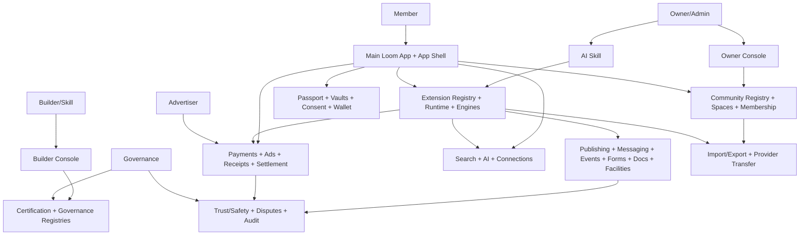

# Loom Communities Architecture 02: Workflow Inventory and Function Map

Status: Draft for review
Source product docs: [Product Docs V2 registry](../Product%20Docs%20V2/01-core-thesis-and-platform-principles.md#21-product-area-registry)
Design tenets: [Architecture V2/00 - System Design Tenets](./00-system-design-tenets.md)
Predecessor: [Loom V1 Architecture 02](../Architecture/02-workflow-inventory-and-function-map.md)

## 1. Purpose

This document is the functional inventory for the V2 architecture set. It maps Product Docs V2 areas to
architecture documents, component owners, packet overlays, and first-pass validation/workflow test IDs.
It is the routing table for later build-plan phases: every workflow should have an owning component for
each step and at least one validation, contract, or workflow test that will cover it.

## 2. Architecture Document Set

| # | Architecture doc | Product areas | Primary component families |
| --- | --- | --- | --- |
| 00 | System Design Tenets | All | Cross-cutting design rules |
| 01 | Overall System Architecture | 01 | All top-level systems |
| 02 | Workflow Inventory and Function Map | 01-22 | Workflow registry |
| 03 | Identity, Member Data, Wallets, and App Shell | 03, 05, 14, 15 | Passport, vaults, wallet, App Shell UX |
| 04 | Community, Spaces, Membership, and Roles | 02, 04, 12 | Registry, spaces, membership, roles, invitations |
| 05 | Content, Publishing, Payments, Ads, and Settlement | 08, 09, 18 | Publishing, events, forms, wallet, ads, receipts, settlement |
| 06 | Extension Certification, Governance, and Builder Supply Chain | 16, 19 | Extension registry, certification, App IDs, registries |
| 07 | Search, Discovery, Connections, and AI | 11, 12, 13 | Search, AI gateway, digest, connections |
| 08 | Extension Platform Runtime | 10 | Runtime, event bus, rules, workflows, jobs, functions, schemas |
| 09 | Trust, Safety, Moderation, and Compliance | 17 | Trust/safety, moderation, fraud, disputes |
| 10 | Migration, Export, and Portability | 06, 21 | Import/export, provider transfer, migration plans |
| 11 | Monetization and Ad-Delivery Architecture | 09, 18, 22 | Ad decision, ad-off, ad receipts, utility funding |
| 12 | MVP Prototype Transaction Slices | 20 | Vertical demo slices |

## 3. Functional System Diagram



## 4. Packet Envelope

Every workflow packet extends the shared envelope from [Architecture 01](./01-overall-system-architecture.md#4-transaction-packet-model).

| Field | Meaning in this inventory |
| --- | --- |
| `actorContext` | Owner, member, builder, advertiser, provider, or governance actor plus Passport/App ID. |
| `communityContext` | `communityId`, `spaceId`, membership state, role grants, installed extension versions. |
| `runtimeContext` | App Shell surface, extension id/version, route, package signature, runtime session. |
| `permissionContext` | Requested scope, owner approval, role, member consent, safety policy, platform invariant. |
| `dataContext` | Data class, schema, source, export state, protected-vault classification, search eligibility. |
| `economicContext` | Payment/ad/ad-off/settlement intent, receipt class, provider role, allocation policy. |
| `auditContext` | Correlation id, idempotency key, policy version, test fixture, receipt/audit requirements. |

## 5. Interfaces and Contracts

| Contract | Primary workflow coverage |
| --- | --- |
| `CommunityRegistryApi` | Create, discover, QR, add-to-app, export pointer. |
| `CommunityMembershipApi` | Join, invite, approve, leave, suspend. |
| `CommunityRolePolicyApi` | Effective permission, roles, policies, consent. |
| `CommunityAppShellApi` | Cards, routes, nav, stream, ad slots, payment surface. |
| `CommunityExtensionRegistryApi` | Publish, certify state, install, update, rollback. |
| `CommunityExtensionRuntimeApi` | Runtime sessions and API bridge. |
| `CommunityEventBusApi` | Typed events and subscriptions. |
| `CommunityWalletApi` | Dues, donations, invoices, payments, entitlements. |
| `CommunityAdsApi` | Fill/no-fill, ad-off, receipts. |
| `CommunitySearchAiApi` | Search, AI answer, digest, citations. |
| `CommunityImportExportApi` | Import, export, provider transfer, migration receipts. |
| `CommunityTrustSafetyApi` | Reports, moderation, fraud, disputes, incidents. |

## 6. Component Contract Cards

```text
Component: Workflow Inventory Registry        Layer: registry
Single responsibility: own the canonical map from product workflow to architecture owner and test id. (T1)
Interface contract: CommunityWorkflowInventoryApi (v1), in loom_api_contracts (T2)
Capabilities (testable sub-units):
  - register workflow -> registerWorkflow/updateWorkflowMap -> vt_workflow-inventory_register
  - map step owners -> mapWorkflowStepOwners -> vt_workflow-inventory_step-owner-map
  - generate test index -> listTestsByWorkflow/listTestsByComponent -> vt_workflow-inventory_test-index
Owned data: WorkflowDefinition, WorkflowStepOwnerMap, WorkflowTestIndex (T1)
Dependencies (by contract + fake): CommunityRegistryApi (fake), CommunityExtensionRegistryApi (fake) (T3)
Events emitted: workflow.inventory.updated   Events consumed: extension.certified, community.created (T8)
Blast radius / scoped change: changes update inventory docs/manifests only; component contracts remain untouched. (T5)
Integration tests:
  - component-level: workflow inventory conformance
  - per-capability: register, step-owner, test-index suites above
Agent workpackage: a single agent can maintain workflow-to-component/test mapping without changing runtime code. (T9)
```

```text
Component: Phase/Test Manifest Bridge        Layer: registry
Single responsibility: expose workflow inventory as phase-ready test metadata. (T1)
Interface contract: CommunityTestManifestApi (v1), in loom_api_contracts (T2)
Capabilities (testable sub-units):
  - enumerate tests -> listPlannedTests -> vt_test-manifest_enumerate
  - detect stale owners -> compareComponentVersions -> vt_test-manifest_staleness
  - resolve pending counterparts -> resolvePendingContractTests -> vt_test-manifest_pending-resolution
Owned data: PlannedTest, ComponentVersionStamp, PendingTestCounterpart (T1)
Dependencies (by contract + fake): CommunityWorkflowInventoryApi (fake), CommunityAuditApi (fake) (T3)
Events emitted: manifest.updated, manifest.stale-detected   Events consumed: component.versioned (T8)
Blast radius / scoped change: touches manifest metadata and gate output; no business data. (T5)
Integration tests:
  - component-level: manifest bridge conformance
  - per-capability: enumerate, staleness, pending-resolution suites
Agent workpackage: accepts workflow inventory and emits phase/test gate metadata in isolation. (T9)
```

## 7. Workflow Packet Models

| Workflow | Product docs | Primary architecture owner | Components covered | First workflow test |
| --- | --- | --- | --- | --- |
| `wf_build-publish-discover-install` | 10, 11, 15, 16, 19 | Arch 06 + 08 | Skill, Extension Registry, Certification, App Shell, Registry | `wf_build-publish-discover-install` |
| `wf_book-club-headline` | 04, 10, 12, 13, 15 | Arch 12 | Registry, Events, Forms/Voting, Publishing, Search/AI | `wf_book-club-headline` |
| `wf_youth-soccer-headline` | 04, 05, 08, 10, 14, 15 | Arch 12 | Spaces, Protected Vault, Wallet, Events, Notifications | `wf_youth-soccer-headline` |
| `wf_hoa-headline` | 04, 08, 10, 14, 15, 21 | Arch 12 | Dues, Documents, Facilities, Case/Task, Export | `wf_hoa-headline` |
| `wf_mosque-headline` | 05, 08, 10, 14, 15 | Arch 12 | Donations, Events, Volunteers, Care Vault, Notifications | `wf_mosque-headline` |
| `wf_messaging-ads-connections` | 09, 12, 15, 18 | Arch 03 + 11 | Messaging, Connections, Ads, App Shell | `wf_messaging-ads-connections` |
| `wf_ad-off` | 08, 09, 18, 22 | Arch 11 | Wallet, Entitlements, Ads, Settlement | `wf_ad-off` |
| `wf_export-migration` | 06, 14, 21 | Arch 10 | Import/Export, Provider Transfer, Protected Redaction | `wf_export-migration` |

## 8. Step-by-Step Life of a Packet Overlays

### 8.1 `wf_build-publish-discover-install`

| Step | Packet action | Owning component | Covering test |
| --- | --- | --- | --- |
| 1 | Owner describes app to Skill; Skill emits package. | AI Skill / Extension Builder | `vt_ai-skill_generate-package` |
| 2 | Package is signed with App ID. | Builder/App ID Service | `vt_builder-app-id_sign-artifact` |
| 3 | Registry stores immutable version. | Extension Registry | `vt_extension-registry_publish-version` |
| 4 | Certification validates manifest, tests, shell invariants, data rights, and supply chain. | Certification System | `ct_certification__extension-registry_certify-package` |
| 5 | Community registry creates handle/QR. | Community Registry | `vt_community-registry_discovery` |
| 6 | Member resolves QR and App Shell loads latest certified version. | App Shell Runtime | `wf_build-publish-discover-install` |

### 8.2 `wf_export-migration`

| Step | Packet action | Owning component | Covering test |
| --- | --- | --- | --- |
| 1 | Owner requests export/transfer. | Import/Export Service | `vt_import-export_request-export` |
| 2 | Component manifests enumerate ordinary, protected, economic, and extension data. | Test Manifest Bridge / Data Schema Store | `ct_data-schema-store__import-export_schema-enumeration` |
| 3 | Protected data is redacted or split by policy. | Protected Vault | `ct_protected-vault__import-export_redaction` |
| 4 | Package is assembled with receipts and checksums. | Import/Export Service | `vt_import-export_package-integrity` |
| 5 | Provider transfer updates registry pointers after verification. | Provider Transfer Service | `wf_export-migration` |

## 9. Error, Denial, and Recovery Behavior

- A workflow without an owning component is invalid and must be sent back to architecture review.
- A workflow step without a test id can be documented as planned, but cannot be considered build-ready.
- If a component is not built yet, contract tests are pending, not removed.
- If a policy, role, or consent check denies a workflow step, the packet must return a typed denial
  reason and emit redacted audit where sensitive data is involved.

## 10. How These Components Adhere To The Tenets

| Tenet | How this doc satisfies it |
| --- | --- |
| T1 | The inventory registry and manifest bridge own metadata only; they do not own business data. |
| T2 | Both cards expose explicit `Community*Api` contracts. |
| T3 | Dependencies are named by contract and fake. |
| T4 | Both components sit in registry/control-plane and call only registry/foundation fakes. |
| T5 | Blast radius is limited to workflow/test metadata. |
| T6 | Each capability maps to validation tests. |
| T7 | Inventory and manifest mutations use version stamps and audit. |
| T8 | Inventory emits update/staleness events instead of synchronously driving runtime components. |
| T9 | Each card is an isolated agent work package. |
| T10 | Workflow inventory includes UX micro-component tests such as App Shell route/ad/nav coverage. |

## 11. Architecture Backlog

- Keep this inventory synchronized with the Build Plan V2 test manifest.
- Add exact component version hashes once code packages exist.
- Decide whether workflow inventory remains documentation-only or becomes a generated machine artifact.
