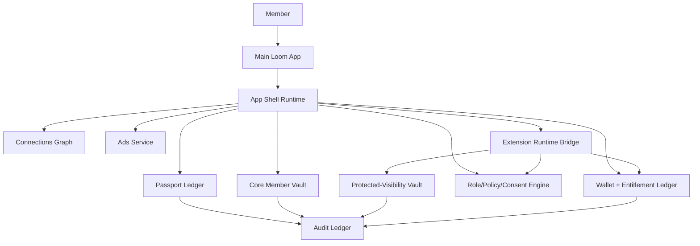

# Loom Communities Architecture 03: Identity, Member Data, Wallets, and App Shell

Status: Draft for review
Source product docs: [Product 03](../Product%20Docs%20V2/03-member-experience.md), [Product 05](../Product%20Docs%20V2/05-identity-passport-wallet-and-protected-vaults.md), [Product 14](../Product%20Docs%20V2/14-member-data-rights-consent-and-sensitive-data-vaults.md), [Product 15](../Product%20Docs%20V2/15-main-loom-app-app-shell-and-required-structure.md)
Design tenets: [Architecture V2/00 - System Design Tenets](./00-system-design-tenets.md)
Predecessor: [Loom V1 Architecture 03](../Architecture/03-identity-fan-data-wallets-and-fan-app-shell.md)

## 1. Purpose

This document defines the architecture for portable member identity, Passport sessions, core/protected
vaults, consent, wallet/entitlement state, and the Main Loom App/App Shell UX micro-components. It is
the boundary where member-owned identity meets community-scoped membership and extension-rendered
experience.

## 2. Functional System Diagram



## 3. Packet Envelope

| Field | Meaning |
| --- | --- |
| `memberIdentity` | Passport id, keys, recovery state, selected persona, account assurance. |
| `appShellContext` | App version, community card, route, surface, nav/ad/payment/data-dashboard state. |
| `vaultContext` | Core vault scopes, protected class, retention, redaction policy, access purpose. |
| `consentContext` | Requested fields, owner approval, role, member consent, safety invariant, grant version. |
| `walletContext` | Payment intent, entitlement, dues/donation/ad-off state, receipt refs. |
| `connectionContext` | Connection id, block/mute state, invite permissions. |
| `auditContext` | Idempotency key, policy version, redacted audit requirement, receipt requirement. |

## 4. Interfaces and Contracts

| Interface | Packet responsibility |
| --- | --- |
| `CommunityPassportApi` | Create/resolve Passport, persona, session, recovery. |
| `CommunityCoreVaultApi` | Store portable preferences, grants, saves, app settings. |
| `CommunityProtectedVaultApi` | Store/read protected care/minor/donor/hardship/safety data with redacted audit. |
| `CommunityRolePolicyApi` | Compute effective permission and consent/role intersections. |
| `CommunityWalletApi` | Payment intents, dues/donations/ad-off, entitlements, refunds. |
| `CommunityConnectionsApi` | Passport-level connections, invites, blocks. |
| `CommunityAppShellApi` | Cards, nav panel, route host, stream renderer, ad slots, payment surface. |
| `CommunityAuditApi` | Redacted audit for identity, consent, vault, wallet, and shell actions. |

## 5. Component Contract Cards

```text
Component: Passport Ledger                 Layer: foundation
Single responsibility: own portable member identity, sessions, personas, and recovery state. (T1)
Interface contract: CommunityPassportApi (v1), in loom_api_contracts (T2)
Capabilities (testable sub-units):
  - create/resolve passport -> createOrResolvePassport -> vt_passport_create-resolve
  - persona -> setCommunityPersona/listPersonas -> vt_passport_persona
  - recovery -> startRecovery/completeRecovery -> vt_passport_recovery
Owned data: Passport, PassportKey, PassportRecoveryState, CommunityPersonaPointer (T1)
Dependencies (by contract + fake): CommunityAuditApi (fake), CommunityKeyManagementApi (fake) (T3)
Events emitted: passport.created, passport.persona.updated   Events consumed: key.revoked (T8)
Blast radius / scoped change: identity contract and dependent App Shell/Registry reads only; no community membership writes. (T5)
Integration tests: conformance plus create-resolve, persona, recovery suites. (T6)
Agent workpackage: implement identity in isolation against audit/key fakes; acceptance = suites green. (T9)
```

```text
Component: Core Member Vault               Layer: foundation
Single responsibility: own portable non-sensitive member preferences, grants, saves, and app settings. (T1)
Interface contract: CommunityCoreVaultApi (v1), in loom_api_contracts (T2)
Capabilities (testable sub-units):
  - preferences -> read/write preferences -> vt_core-vault_preferences
  - app grants -> listGrantPointers/updateGrantPointer -> vt_core-vault_grants
  - export -> exportCoreVault -> vt_core-vault_export
Owned data: CoreMemberVaultRecord, MemberPreference, AppSetting, GrantPointer (T1)
Dependencies (by contract + fake): CommunityPassportApi (fake), CommunityAuditApi (fake) (T3)
Events emitted: member.preference.updated, member.core-vault.exported   Events consumed: consent.revoked (T8)
Blast radius / scoped change: core vault data only; protected classes live in Protected Vault. (T5)
Integration tests: conformance plus preferences, grants, export suites. (T6)
Agent workpackage: all owned data is local to vault; tests use passport/audit fakes. (T9)
```

```text
Component: Protected-Visibility Vault      Layer: foundation
Single responsibility: own sensitive care, minor, donor, hardship, and safety records. (T1)
Interface contract: CommunityProtectedVaultApi (v1), in loom_api_contracts (T2)
Capabilities (testable sub-units):
  - protected write -> writeProtectedRecord -> vt_protected-vault_write
  - protected read -> readProtectedRecord -> vt_protected-vault_read-gated
  - redacted audit/export -> exportProtectedRecords -> vt_protected-vault_redacted-export
Owned data: ProtectedRecord, ProtectedClassPolicy, ProtectedAccessReceipt (T1)
Dependencies (by contract + fake): CommunityRolePolicyApi (fake), CommunityAuditApi (fake) (T3)
Events emitted: protected-record.created, protected-record.accessed   Events consumed: consent.revoked, role.revoked (T8)
Blast radius / scoped change: protected records and redacted audit only; search/ads receive exclusion events. (T5)
Integration tests: conformance plus write, gated-read, redacted-export suites. (T6)
Agent workpackage: policy fake drives allow/deny paths; no extension storage edits allowed. (T9)
```

```text
Component: App Shell Runtime               Layer: ux
Single responsibility: own community cards, required nav, route hosting, stream renderer, ad slots, and shell-owned payment/consent surfaces. (T1, T10)
Interface contract: CommunityAppShellApi (v1), in loom_api_contracts (T2)
Capabilities (testable sub-units):
  - community cards -> resolveCard/renderCard -> vt_app-shell_cards
  - nav panel -> renderNavigationPanel -> vt_app-shell_required-nav
  - routes -> openExtensionRoute -> vt_app-shell_route-host
  - ad slots -> renderTopAdSlot/renderStreamAdItem -> vt_app-shell_ad-slots
  - payment/consent surfaces -> renderPaymentSurface/renderConsentPrompt -> vt_app-shell_shell-owned-surfaces
Owned data: CommunityCardCache, RouteMountState, NavigationPanelState, ShellSurfaceState (T1)
Dependencies (by contract + fake): CommunityPassportApi (fake), CommunityRegistryApi (fake), CommunityExtensionRuntimeApi (fake), CommunityAdsApi (fake), CommunityWalletApi (fake) (T3)
Events emitted: shell.route.opened, shell.ad-slot.rendered   Events consumed: extension.certified, entitlement.ad-off.updated (T8)
Blast radius / scoped change: App Shell UI contracts only; no service storage writes. (T5)
Integration tests: conformance plus cards, nav, routes, ad slots, shell-owned surfaces. (T6)
Agent workpackage: UI micro-component accepts typed props/fakes; tests prove invariants locally. (T9/T10)
```

## 6. Workflow Transaction Packet Models

| Ref | Trigger | Primary path | Durable writes / receipts | Completion response |
| --- | --- | --- | --- | --- |
| `03/W1` | Member joins first community. | App Shell -> Passport -> Membership boundary -> Core Vault. | Passport, persona, app grant pointer, audit. | Member sees community card. |
| `03/W2` | Member grants/revokes extension data. | App Shell -> Role/Policy/Consent -> Core Vault/Protected Vault. | Consent grant/revocation, redacted audit. | Runtime access narrows immediately. |
| `03/W3` | Protected data is written/read. | Runtime/App Shell -> Policy -> Protected Vault -> Audit. | Protected record, access receipt, redacted audit. | Authorized actor sees record or denial. |
| `03/W4` | Member pays dues/donation/ad-off. | Payment Surface -> Wallet -> Entitlement -> Receipt Ledger. | Payment receipt, entitlement, settlement ref. | Payment state and receipt visible. |
| `03/W5` | App Shell opens extension route. | App Shell -> Extension Runtime -> Ads/Wallet/Policy fakes. | Route-opened audit, ad/no-fill receipt where needed. | Route renders inside required shell. |

## 7. Step-by-Step Life of a Packet Overlays

### 7.1 `03/W1`: Member Joins First Community

| Step | Packet action | Owning component | Covering test |
| --- | --- | --- | --- |
| 1 | App opens handle/QR/invite context. | App Shell Runtime | `vt_app-shell_cards` |
| 2 | Passport is created or resolved. | Passport Ledger | `vt_passport_create-resolve` |
| 3 | Persona/default visibility is selected. | Passport Ledger | `vt_passport_persona` |
| 4 | Core vault stores app preferences and grant pointers. | Core Member Vault | `vt_core-vault_preferences` |
| 5 | App Shell renders community card and required nav. | App Shell Runtime | `vt_app-shell_required-nav` |

### 7.2 `03/W3`: Protected Data Write and Read

| Step | Packet action | Owning component | Covering test |
| --- | --- | --- | --- |
| 1 | Extension submits protected form through runtime. | Extension Runtime Bridge | `ct_extension-runtime__protected-vault_write` |
| 2 | Policy engine evaluates role, consent, purpose, and class. | Role/Policy/Consent Engine | `vt_role-policy_effective-permission` |
| 3 | Protected vault writes record and emits event. | Protected-Visibility Vault | `vt_protected-vault_write` |
| 4 | Later read request re-evaluates current policy. | Protected-Visibility Vault | `vt_protected-vault_read-gated` |
| 5 | Audit records redacted access; search/ads receive exclusion. | Audit Ledger / Ads Service | `ct_protected-vault__ads_no-fill-sensitive` |

### 7.3 `03/W5`: App Shell Route Rendering

| Step | Packet action | Owning component | Covering test |
| --- | --- | --- | --- |
| 1 | Member opens community card. | App Shell Runtime | `vt_app-shell_cards` |
| 2 | Shell resolves latest certified extension version. | Extension Registry | `ct_extension-registry__app-shell_resolve-latest` |
| 3 | Shell starts runtime session with member/role/surface context. | Extension Runtime Bridge | `ct_extension-runtime__app-shell_session` |
| 4 | Shell renders required nav and top ad slot. | App Shell Runtime | `vt_app-shell_required-nav`, `vt_app-shell_ad-slots` |
| 5 | Extension route renders inside shell constraints. | App Shell Runtime | `vt_app-shell_route-host` |

## 8. Error, Denial, and Revocation Behavior

- Passport recovery failure returns typed denial without revealing account existence where policy
  requires.
- Consent revocation immediately invalidates runtime access and emits `consent.revoked`.
- Protected vault denial returns a safe reason and writes redacted audit if an authenticated actor made
  the request.
- Ad-off or sensitive no-fill must preserve layout without letting extensions draw fake ad surfaces.
- Revoked extension versions must stop route rendering at the App Shell before runtime starts.

## 9. How These Components Adhere To The Tenets

| Tenet | How it is met here |
| --- | --- |
| T1 | Passport, core vault, protected vault, wallet, and shell each own disjoint data/state. |
| T2 | All entry points are `Community*Api` contracts. |
| T3 | Cards list dependency fakes for identity, audit, policy, runtime, ads, and wallet. |
| T4 | UX calls runtime/registry/foundation contracts; foundation components do not call UX. |
| T5 | Blast radius is stated per component; protected data cannot leak into extension storage. |
| T6 | Every capability maps to validation tests. |
| T7 | Identity, vault, wallet, and shell actions are idempotent/versioned/audited. |
| T8 | State changes emit typed events for consent, vault, entitlement, and route changes. |
| T9 | Each card can be assigned to one agent with local acceptance tests. |
| T10 | App Shell is explicitly decomposed into UI micro-components with tests. |

## 10. Open Architecture Questions

- Which wallet/payment operations live in Arch 03 versus Arch 05/11 once code packages are split?
- Should protected AI summaries be a Protected Vault capability or an AI Gateway capability?
- How much App Shell cache state should be exportable versus rebuildable?
