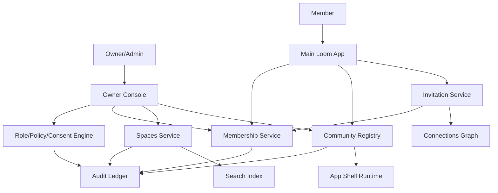

# Loom Communities Architecture 04: Community, Spaces, Membership, and Roles

Status: Draft for review
Source product docs: [Product 02](../Product%20Docs%20V2/02-community-owner-and-admin-experience.md), [Product 04](../Product%20Docs%20V2/04-community-spaces-and-membership-architecture.md), [Product 12](../Product%20Docs%20V2/12-community-discovery-connections-and-invitations.md)
Design tenets: [Architecture V2/00 - System Design Tenets](./00-system-design-tenets.md)
Predecessor: [Loom V1 Architecture 04](../Architecture/04-creator-tools-and-channel-metadata.md)

## 1. Purpose

This document defines the architecture for the community control plane: community registry, spaces,
membership, roles, policies, invitations, handles, QR discovery, and owner/admin operations. It is the
V2 replacement for V1 creator-channel metadata.

## 2. Functional System Diagram



## 3. Packet Envelope

| Field | Meaning |
| --- | --- |
| `communityContext` | `communityId`, handle, profile, visibility, installed extension refs, export policy. |
| `spaceContext` | `spaceId`, parent, type, visibility, inherited policy, extension bindings. |
| `membershipContext` | Member Passport, membership state, join policy, invite id, approval state. |
| `roleContext` | Role grants, scope, permission set, policy version, consent pointer. |
| `inviteContext` | Link/QR/connection invite payload, expiry, target role/space, revocation state. |
| `auditContext` | Idempotency key, actor, policy version, audit/receipt requirement. |

## 4. Interfaces and Contracts

| Interface | Packet responsibility |
| --- | --- |
| `CommunityRegistryApi` | Create, update, resolve handle/QR, visibility, installed extension refs. |
| `CommunitySpacesApi` | Create/update/archive spaces and parent-child relationships. |
| `CommunityMembershipApi` | Invite, join, approve, suspend, leave, remove, membership export. |
| `CommunityRolePolicyApi` | Create roles, assign grants, compute effective permissions. |
| `CommunityInvitationApi` | Signed invite payloads, revocation, accept/deny, connection invites. |
| `CommunityConnectionsApi` | Connection state, blocks, invite permission. |
| `CommunityAuditApi` | Append-only audit for control-plane changes. |

## 5. Component Contract Cards

```text
Component: Community Registry              Layer: registry
Single responsibility: own canonical community identity, handle, profile, visibility, and installed-extension pointers. (T1)
Interface contract: CommunityRegistryApi (v1), in loom_api_contracts (T2)
Capabilities (testable sub-units):
  - create/configure -> createCommunity/updateCommunityProfile -> vt_community-registry_create-configure
  - discovery -> findByHandle/generateQr/resolveQr -> vt_community-registry_discovery
  - install pointers -> setInstalledExtensionRefs -> vt_community-registry_extension-pointers
Owned data: Community, CommunityHandle, CommunityProfile, CommunityVisibility, InstalledExtensionPointer (T1)
Dependencies (by contract + fake): CommunityPassportApi (fake), CommunityAuditApi (fake) (T3)
Events emitted: community.created, community.updated, community.extension-pointers.changed   Events consumed: extension.certified (T8)
Blast radius / scoped change: registry state only; does not write membership, spaces, or extension packages. (T5)
Integration tests: conformance plus create/configure, discovery, extension-pointer suites. (T6)
Agent workpackage: implement registry against passport/audit fakes; acceptance = registry tests green. (T9)
```

```text
Component: Spaces Service                   Layer: registry
Single responsibility: own community spaces and parent-child space hierarchy. (T1)
Interface contract: CommunitySpacesApi (v1), in loom_api_contracts (T2)
Capabilities (testable sub-units):
  - create space -> createSpace/updateSpace -> vt_spaces_create-update
  - nesting -> moveSpace/listChildren -> vt_spaces_nesting
  - visibility -> setSpaceVisibility -> vt_spaces_visibility
Owned data: CommunitySpace, SpaceHierarchyEdge, SpaceVisibilityPolicy (T1)
Dependencies (by contract + fake): CommunityRegistryApi (fake), CommunityRolePolicyApi (fake), CommunityAuditApi (fake) (T3)
Events emitted: space.created, space.updated, space.archived   Events consumed: community.archived (T8)
Blast radius / scoped change: space records only; membership and role assignments remain in their owners. (T5)
Integration tests: conformance plus create-update, nesting, visibility suites. (T6)
Agent workpackage: space hierarchy can be built/tested with registry/policy fakes. (T9)
```

```text
Component: Membership Service               Layer: registry
Single responsibility: own member lifecycle inside communities and spaces. (T1)
Interface contract: CommunityMembershipApi (v1), in loom_api_contracts (T2)
Capabilities (testable sub-units):
  - join/request -> requestMembership/approveMembership -> vt_membership_join-approval
  - lifecycle -> suspend/leave/remove/archive -> vt_membership_lifecycle
  - export -> exportMemberships -> vt_membership_export
Owned data: CommunityMembership, SpaceMembership, MembershipState, MembershipApprovalRequest (T1)
Dependencies (by contract + fake): CommunityPassportApi (fake), CommunityRegistryApi (fake), CommunitySpacesApi (fake), CommunityRolePolicyApi (fake), CommunityAuditApi (fake) (T3)
Events emitted: membership.requested, membership.joined, membership.left, membership.suspended   Events consumed: invite.accepted, role.revoked (T8)
Blast radius / scoped change: membership state only; does not own Passport identity or role definitions. (T5)
Integration tests: conformance plus join-approval, lifecycle, export suites. (T6)
Agent workpackage: lifecycle implemented against passport/registry/space/policy fakes. (T9)
```

```text
Component: Role/Policy/Consent Engine       Layer: foundation
Single responsibility: own role grants, permission policies, consent grants, and effective-permission calculation. (T1)
Interface contract: CommunityRolePolicyApi (v1), in loom_api_contracts (T2)
Capabilities (testable sub-units):
  - roles -> createRole/assignRole/revokeRole -> vt_role-policy_roles
  - effective permission -> canPerform/getEffectivePermissions -> vt_role-policy_effective-permission
  - consent -> grantConsent/revokeConsent -> vt_role-policy_consent
Owned data: Role, RoleGrant, PermissionPolicy, ConsentGrant, EffectivePermissionSnapshot (T1)
Dependencies (by contract + fake): CommunityPassportApi (fake), CommunityAuditApi (fake) (T3)
Events emitted: role.assigned, role.revoked, consent.granted, consent.revoked   Events consumed: membership.left, safety.policy.updated (T8)
Blast radius / scoped change: permission/consent data only; consumers must call the contract for decisions. (T5)
Integration tests: conformance plus role, effective-permission, consent suites. (T6)
Agent workpackage: policy math is local and testable with passport/audit fakes. (T9)
```

## 6. Workflow Transaction Packet Models

| Ref | Trigger | Primary path | Durable writes | Completion response |
| --- | --- | --- | --- | --- |
| `04/W1` | Owner creates community. | Owner Console -> Registry -> Role/Policy -> Audit. | Community, handle, owner role. | Community card and QR available. |
| `04/W2` | Admin creates nested space. | Owner Console -> Spaces -> Policy -> Search. | CommunitySpace, hierarchy, audit. | Space appears in nav/search if visible. |
| `04/W3` | Member accepts invite. | App Shell -> Invitation -> Membership -> Role/Policy. | Membership, role grant, audit. | Member joins or enters approval queue. |
| `04/W4` | Admin changes role. | Owner Console -> Role/Policy -> Runtime/App Shell event. | RoleGrant version. | New effective permissions apply. |
| `04/W5` | Member leaves or is removed. | App Shell/Owner Console -> Membership -> Policy. | Membership state, revoked grants. | Access narrows immediately. |

## 7. Step-by-Step Life of a Packet Overlays

### 7.1 `04/W1`: Create Community

| Step | Packet action | Owning component | Covering test |
| --- | --- | --- | --- |
| 1 | Owner submits community profile and handle. | Community Registry | `vt_community-registry_create-configure` |
| 2 | Registry validates Passport owner identity. | Passport Ledger | `ct_passport__community-registry_owner-identity` |
| 3 | Registry writes community and handle. | Community Registry | `vt_community-registry_discovery` |
| 4 | Policy engine assigns owner role. | Role/Policy/Consent Engine | `ct_role-policy__community-registry_owner-role` |
| 5 | Audit records creation and App Shell can render card. | Audit Ledger / App Shell Runtime | `wf_build-publish-discover-install` |

### 7.2 `04/W3`: Accept Invite

| Step | Packet action | Owning component | Covering test |
| --- | --- | --- | --- |
| 1 | Admin creates invite with role/space/expiry. | Invitation Service | `vt_invitation_create-revoke` |
| 2 | Member opens signed invite. | App Shell Runtime | `ct_invitation__app-shell_resolve` |
| 3 | Connections/block state is checked. | Connections Graph | `ct_connections__invitation_blocked-path` |
| 4 | Membership service creates or queues membership. | Membership Service | `vt_membership_join-approval` |
| 5 | Role grants and notifications are applied. | Role/Policy/Consent Engine | `ct_role-policy__membership_default-grants` |

## 8. Error and Recovery Behavior

- Duplicate handles return deterministic conflict errors.
- Invite expiry, revocation, block, capacity, and policy denial return typed join denial.
- Role changes are versioned; stale clients must refresh before mutating.
- Space archival does not delete audit, membership history, or exportable records.

## 9. How These Components Adhere To The Tenets

| Tenet | How it is met here |
| --- | --- |
| T1 | Registry, spaces, membership, and policy own distinct data. |
| T2 | All entry points are `Community*Api` contracts. |
| T3 | Dependency fakes are named in every card. |
| T4 | Registry/control-plane components depend on foundation and avoid service/UX writes. |
| T5 | Blast radius is bounded per owned data set. |
| T6 | Each capability maps to validation tests. |
| T7 | Community, role, invite, and membership mutations are idempotent/versioned/audited. |
| T8 | Events propagate changes to shell, runtime, search, and notifications. |
| T9 | Each card is a single-agent work package. |
| T10 | App Shell consumes community/space metadata through contracts to render micro-components. |

## 10. Open Architecture Questions

- Should invitation be its own component or part of membership in the first build phase?
- How much role-template vocabulary should be hardcoded versus extension-defined?
- Does space nesting need arbitrary depth in MVP or can tests target one-level hierarchy first?
