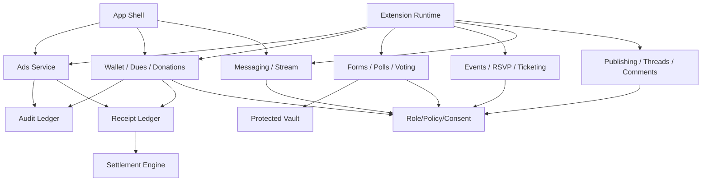

# Loom Communities Architecture 05: Content, Publishing, Payments, Ads, and Settlement

Status: Draft for review
Source product docs: [Product 08](../Product%20Docs%20V2/08-payments-dues-donations-receipts-and-settlement.md), [Product 09](../Product%20Docs%20V2/09-monetization-free-backend-ads-and-ad-off.md), [Product 18](../Product%20Docs%20V2/18-advertising-and-ad-delivery-tools.md)
Design tenets: [Architecture V2/00 - System Design Tenets](./00-system-design-tenets.md)
Predecessor: [Loom V1 Architecture 05](../Architecture/05-content-hosting-playback-monetization-and-settlement.md)

## 1. Purpose

This document defines the service-layer architecture for community content and economic flows:
publishing, messaging/stream items, events, forms/voting, payments, dues, donations, ads, ad-off,
receipts, and settlement. It provides the shared service substrate that extensions compose.

## 2. Functional System Diagram



## 3. Packet Envelope

| Field | Meaning |
| --- | --- |
| `contentContext` | Post/thread/comment/message/event/form id, space, visibility, moderation labels. |
| `economicContext` | Payment intent, dues/donation/ticket/ad-off, entitlement, provider, allocation policy. |
| `adContext` | Surface, slot, stream position, ad-off state, sensitive-context flag, category policy. |
| `receiptContext` | Receipt type, signature state, manifest version, settlement refs. |
| `permissionContext` | Effective permission for write/read/payment/ad decision. |
| `auditContext` | Idempotency key, policy version, actor, redaction requirement. |

## 4. Interfaces and Contracts

| Interface | Packet responsibility |
| --- | --- |
| `CommunityPublishingApi` | Posts, threads, comments, announcements, visibility, moderation state. |
| `CommunityMessagingApi` | Streams, direct/group messages, stream items, attachments. |
| `CommunityEventsApi` | Events, RSVP, registration, ticketing. |
| `CommunityFormsVotingApi` | Forms, polls, votes, surveys, protected-field routing. |
| `CommunityWalletApi` | Dues, donations, invoices, payments, refunds, entitlements. |
| `CommunityAdsApi` | Fill/no-fill, ad-off checks, creative policy, ad receipts. |
| `CommunityReceiptLedgerApi` | Append/read signed receipts and receipt export. |
| `CommunitySettlementApi` | Settlement runs, statements, adjustments, allocation. |

## 5. Component Contract Cards

```text
Component: Publishing Service              Layer: service
Single responsibility: own posts, threads, comments, and announcements. (T1)
Interface contract: CommunityPublishingApi (v1), in loom_api_contracts (T2)
Capabilities (testable sub-units):
  - publish -> createPost/updatePost -> vt_publishing_publish
  - discussion -> createThread/addComment -> vt_publishing_discussion
  - visibility -> setVisibility/listVisible -> vt_publishing_visibility
Owned data: CommunityPost, Thread, Comment, Announcement (T1)
Dependencies (by contract + fake): CommunityRolePolicyApi (fake), CommunityAuditApi (fake), CommunityEventBusApi (fake) (T3)
Events emitted: post.created, thread.comment-added   Events consumed: moderation.label.applied (T8)
Blast radius / scoped change: content records only; no messaging, wallet, or search storage writes. (T5)
Integration tests: conformance plus publish, discussion, visibility suites. (T6)
Agent workpackage: content behavior testable against policy/audit/event fakes. (T9)
```

```text
Component: Wallet / Dues / Donations       Layer: service
Single responsibility: own community payment intents, dues, donations, invoices, and entitlements. (T1)
Interface contract: CommunityWalletApi (v1), in loom_api_contracts (T2)
Capabilities (testable sub-units):
  - dues/invoices -> createDuesPlan/generateInvoices -> vt_wallet_dues
  - payment -> createPaymentIntent/confirmPayment -> vt_wallet_payment
  - donations -> createDonation/recordDonorVisibility -> vt_wallet_donations
  - ad-off -> purchaseAdOff/resolveAdOffEntitlement -> vt_wallet_ad-off
Owned data: PaymentIntent, DuesPlan, Invoice, Donation, Entitlement, RefundChargebackRecord (T1)
Dependencies (by contract + fake): CommunityRolePolicyApi (fake), CommunityReceiptLedgerApi (fake), CommunityProtectedVaultApi (fake), CommunityAuditApi (fake) (T3)
Events emitted: payment.confirmed, entitlement.updated, donation.received   Events consumed: refund.requested (T8)
Blast radius / scoped change: payment state only; settlement reads receipts, protected donor detail lives in Protected Vault. (T5)
Integration tests: conformance plus dues, payment, donation, ad-off suites. (T6)
Agent workpackage: payment provider can be fake; ledger/protected-vault dependencies are faked. (T9)
```

```text
Component: Ads Service                      Layer: service
Single responsibility: own ad decisions, ad-off checks, sensitive no-fill, and ad receipts. (T1)
Interface contract: CommunityAdsApi (v1), in loom_api_contracts (T2)
Capabilities (testable sub-units):
  - fill/no-fill -> fillAdSlot -> vt_ads_fill-no-fill
  - ad-off -> resolveAdEligibility -> vt_ads_ad-off
  - sensitive exclusion -> noFillSensitiveContext -> vt_ads_sensitive-no-fill
  - receipts -> recordAdReceipt -> vt_ads_receipts
Owned data: AdCampaign, AdDecision, AdPolicySnapshot, AdReceiptPointer (T1)
Dependencies (by contract + fake): CommunityWalletApi (fake), CommunityRolePolicyApi (fake), CommunityReceiptLedgerApi (fake), CommunityAuditApi (fake) (T3)
Events emitted: ad.filled, ad.no-filled, ad.receipt-recorded   Events consumed: entitlement.ad-off.updated, safety.ad-policy.updated (T8)
Blast radius / scoped change: ad decision data only; App Shell renders returned decisions. (T5)
Integration tests: conformance plus fill/no-fill, ad-off, sensitive-no-fill, receipts. (T6)
Agent workpackage: all decisions tested with wallet/policy/receipt fakes. (T9)
```

```text
Component: Receipt Ledger                   Layer: foundation
Single responsibility: own append-only signed economic, audit, utility, ad, and workflow receipts. (T1)
Interface contract: CommunityReceiptLedgerApi (v1), in loom_api_contracts (T2)
Capabilities (testable sub-units):
  - append receipt -> appendReceipt -> vt_receipt-ledger_append
  - validate signature/scope -> validateReceipt -> vt_receipt-ledger_validate
  - export -> exportReceipts -> vt_receipt-ledger_export
Owned data: Receipt, ReceiptSignature, ReceiptExportCursor (T1)
Dependencies (by contract + fake): CommunityKeyManagementApi (fake), CommunityAuditApi (fake) (T3)
Events emitted: receipt.appended   Events consumed: key.revoked (T8)
Blast radius / scoped change: receipt ledger only; settlement consumes but does not mutate original receipts. (T5)
Integration tests: conformance plus append, validate, export suites. (T6)
Agent workpackage: append-only ledger isolated behind key/audit fakes. (T9)
```

```text
Component: Settlement Engine                Layer: service
Single responsibility: own settlement runs, allocation, statements, and adjustments from receipts. (T1)
Interface contract: CommunitySettlementApi (v1), in loom_api_contracts (T2)
Capabilities (testable sub-units):
  - run settlement -> createSettlementRun -> vt_settlement_run
  - statements -> generateStatements -> vt_settlement_statements
  - adjustments -> applyAdjustment -> vt_settlement_adjustments
Owned data: SettlementRun, SettlementStatement, SettlementAdjustment, PayoutInstructionSnapshot (T1)
Dependencies (by contract + fake): CommunityReceiptLedgerApi (fake), CommunityAuditApi (fake) (T3)
Events emitted: settlement.run.completed, settlement.adjusted   Events consumed: receipt.appended, fraud.adjustment.created (T8)
Blast radius / scoped change: settlement records only; original receipts remain immutable. (T5)
Integration tests: conformance plus run, statement, adjustment suites. (T6)
Agent workpackage: computes from receipt fake; no direct payment-provider dependency. (T9)
```

## 6. Workflow Transaction Packet Models

| Ref | Trigger | Primary path | Durable writes / receipts | Completion response |
| --- | --- | --- | --- | --- |
| `05/W1` | Member publishes post/comment. | Runtime/App Shell -> Publishing -> Event Bus. | Post/comment, audit. | Content visible to allowed actors. |
| `05/W2` | Member pays dues/donation/ticket. | Payment Surface -> Wallet -> Receipt Ledger. | Payment receipt, entitlement, donation record. | Payment confirmation and receipt. |
| `05/W3` | App requests ad fill. | App Shell -> Ads -> Wallet/Policy -> Receipt Ledger. | Ad/no-fill receipt. | Render ad or no-fill. |
| `05/W4` | Settlement run executes. | Settlement -> Receipt Ledger -> Statements. | Settlement run, statements, adjustments. | Statements ready. |
| `05/W5` | Protected form submit with payment. | Runtime -> Forms -> Protected Vault -> Wallet. | Protected record, payment receipt, audit. | Form/payment complete or denial. |

## 7. Step-by-Step Life of a Packet Overlays

### 7.1 `05/W2`: Dues or Donation Payment

| Step | Packet action | Owning component | Covering test |
| --- | --- | --- | --- |
| 1 | Member opens payment surface. | App Shell Runtime | `vt_app-shell_shell-owned-surfaces` |
| 2 | Wallet creates idempotent payment intent. | Wallet / Dues / Donations | `vt_wallet_payment` |
| 3 | Payment provider fake confirms payment. | Wallet / Dues / Donations | `ct_payment-provider__wallet_confirm` |
| 4 | Receipt ledger appends payment/donation/dues receipt. | Receipt Ledger | `ct_receipt-ledger__wallet_append-payment` |
| 5 | Entitlement or invoice state updates and event emits. | Wallet / Dues / Donations | `vt_wallet_dues` |

### 7.2 `05/W3`: Ad Decision

| Step | Packet action | Owning component | Covering test |
| --- | --- | --- | --- |
| 1 | App Shell requests banner or stream ad fill. | App Shell Runtime | `vt_app-shell_ad-slots` |
| 2 | Ads service checks ad-off entitlement. | Ads Service | `vt_ads_ad-off` |
| 3 | Ads service checks sensitive context and community policy. | Ads Service | `vt_ads_sensitive-no-fill` |
| 4 | Fill/no-fill decision returned. | Ads Service | `vt_ads_fill-no-fill` |
| 5 | Receipt ledger records ad or no-fill receipt. | Receipt Ledger | `ct_receipt-ledger__ads_append-ad-receipt` |

### 7.3 `05/W4`: Settlement Run

| Step | Packet action | Owning component | Covering test |
| --- | --- | --- | --- |
| 1 | Settlement reads eligible receipts. | Settlement Engine | `ct_receipt-ledger__settlement_read-window` |
| 2 | Allocation policy applies to ads, ad-off, payments, provider fees, utilities. | Settlement Engine | `vt_settlement_run` |
| 3 | Statements generated for actors. | Settlement Engine | `vt_settlement_statements` |
| 4 | Fraud/refund adjustments append without deleting receipts. | Settlement Engine | `vt_settlement_adjustments` |
| 5 | Audit records run completion. | Audit Ledger | `wf_ad-off` |

## 8. Error and Recovery Behavior

- Duplicate payment confirmation with same idempotency key returns the same result.
- Failed payment leaves invoice due and writes failure audit without entitlement.
- Sensitive ad contexts return no-fill, not fallback targeting.
- Settlement never mutates or deletes original receipts; corrections are adjustments.
- Publishing denial returns role/visibility reason without leaking hidden content.

## 9. How These Components Adhere To The Tenets

| Tenet | How it is met here |
| --- | --- |
| T1 | Publishing, wallet, ads, receipts, and settlement own disjoint data. |
| T2 | Each exposes a `Community*Api` contract. |
| T3 | Cards name policy, receipt, wallet, protected-vault, key, and audit fakes. |
| T4 | Services call registry/foundation dependencies and coordinate with sibling services through events/receipts. |
| T5 | Blast radius is limited per service; receipts are immutable. |
| T6 | Capability tests are enumerated for each card. |
| T7 | Payments, ads, receipts, and settlement are idempotent/versioned/audited. |
| T8 | Economic and content changes emit events. |
| T9 | Each service is implementable by one agent against fakes. |
| T10 | App Shell owns payment and ad UI surfaces while services own decisions/state. |

## 10. Open Architecture Questions

- Should Messaging be split into Arch 03/07 instead of this service doc?
- Which receipt signatures are real in MVP versus stubbed?
- Does settlement own utility funding directly or delegate to Architecture 11?
