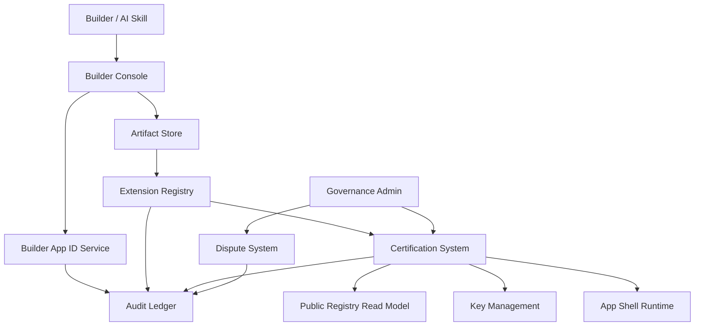

# Loom Communities Architecture 06: Extension Certification, Governance, and Builder Supply Chain

Status: Draft for review
Source product docs: [Product 16](../Product%20Docs%20V2/16-builder-ecosystem-app-ids-and-extension-supply-chain.md), [Product 19](../Product%20Docs%20V2/19-governance-extension-certification-and-foundation-model.md)
Design tenets: [Architecture V2/00 - System Design Tenets](./00-system-design-tenets.md)
Predecessor: [Loom V1 Architecture 06](../Architecture/06-provider-certification-governance-and-developer-supply-chain.md)

## 1. Purpose

This document defines the architecture for builder identity, App IDs, artifact signing, extension
registry submission, certification, public registries, key management, governance decisions, and
disputes. It ensures AI-generated and hand-built extensions are attributable, testable, certifiable,
and revocable.

## 2. Functional System Diagram



## 3. Packet Envelope

| Field | Meaning |
| --- | --- |
| `builderContext` | Builder identity, App ID, signing key, organization/team delegation. |
| `artifactContext` | Package id, version, signature, SBOM, attestation, immutable artifact pointer. |
| `certificationContext` | Risk tier, requested capabilities, test evidence, restrictions, status. |
| `registryContext` | Listing state, installability, latest version, revocation/rollback state. |
| `governanceContext` | Policy version, manual review, dispute, incident, key state. |
| `auditContext` | Idempotency key, actor, timestamp, attestation refs, decision refs. |

## 4. Interfaces and Contracts

| Interface | Packet responsibility |
| --- | --- |
| `CommunityBuilderAppIdApi` | Create/delegate/revoke App IDs and signing scopes. |
| `CommunityArtifactApi` | Store immutable package artifacts, signatures, SBOMs, attestations. |
| `CommunityExtensionRegistryApi` | Submit, version, list, install, latest, rollback, revoke. |
| `CommunityCertificationApi` | Validate package, assign tier/status, store evidence/restrictions. |
| `CommunityPublicRegistryApi` | Read certification, keys, incidents, versions, listings. |
| `CommunityKeyManagementApi` | Issue, rotate, suspend, revoke keys. |
| `CommunityDisputeApi` | File/review appeals, certification disputes, incident outcomes. |

## 5. Component Contract Cards

```text
Component: Builder App ID Service          Layer: foundation
Single responsibility: own builder App IDs, signing scope, delegation, and revocation. (T1)
Interface contract: CommunityBuilderAppIdApi (v1), in loom_api_contracts (T2)
Capabilities (testable sub-units):
  - create app id -> createAppId -> vt_builder-app-id_create
  - sign scope -> issueSigningScope -> vt_builder-app-id_signing-scope
  - revoke/delegate -> revokeAppId/delegateAppId -> vt_builder-app-id_revoke-delegate
Owned data: BuilderAppId, SigningScope, BuilderDelegation, AppIdRevocation (T1)
Dependencies (by contract + fake): CommunityPassportApi (fake), CommunityKeyManagementApi (fake), CommunityAuditApi (fake) (T3)
Events emitted: builder-app-id.created, builder-app-id.revoked   Events consumed: key.revoked (T8)
Blast radius / scoped change: builder credential state only; does not own artifacts or certification status. (T5)
Integration tests: conformance plus create, signing-scope, revoke/delegate suites. (T6)
Agent workpackage: credentials are local and tested against key/passport fakes. (T9)
```

```text
Component: Extension Registry              Layer: registry
Single responsibility: own extension package versions, listings, installability, latest, rollback, and revocation pointers. (T1)
Interface contract: CommunityExtensionRegistryApi (v1), in loom_api_contracts (T2)
Capabilities (testable sub-units):
  - publish version -> submitPackageVersion -> vt_extension-registry_publish-version
  - resolve latest -> resolveLatestCertified -> vt_extension-registry_resolve-latest
  - install/rollback/revoke -> installExtension/rollbackVersion/revokeVersion -> vt_extension-registry_lifecycle
Owned data: ExtensionPackageVersion, ExtensionListing, InstallableVersionPointer, RollbackPointer, RevocationState (T1)
Dependencies (by contract + fake): CommunityCertificationApi (fake), CommunityArtifactApi (fake), CommunityAuditApi (fake) (T3)
Events emitted: extension.version.published, extension.certified, extension.revoked   Events consumed: certification.status.changed (T8)
Blast radius / scoped change: registry pointers only; artifacts and certification evidence owned elsewhere. (T5)
Integration tests: conformance plus publish, resolve-latest, lifecycle suites. (T6)
Agent workpackage: build against certification/artifact fakes and local registry store. (T9)
```

```text
Component: Certification System            Layer: registry
Single responsibility: own validation/certification decisions, risk tiers, evidence, and restrictions. (T1)
Interface contract: CommunityCertificationApi (v1), in loom_api_contracts (T2)
Capabilities (testable sub-units):
  - validate package -> validatePackage -> vt_certification_validate-package
  - assign tier/status -> certifyPackage -> vt_certification_tier-status
  - revoke/limit -> limitCertification/revokeCertification -> vt_certification_revoke-limit
Owned data: CertificationScopeRecord, CertificationEvidence, RiskTierAssignment, CertificationRestriction (T1)
Dependencies (by contract + fake): CommunityArtifactApi (fake), CommunityKeyManagementApi (fake), CommunityPublicRegistryApi (fake), CommunityAuditApi (fake) (T3)
Events emitted: certification.status.changed, certification.revoked   Events consumed: artifact.submitted, incident.created (T8)
Blast radius / scoped change: certification records only; registry and shell consume decisions. (T5)
Integration tests: conformance plus validate, tier-status, revoke-limit suites. (T6)
Agent workpackage: certification rules testable against artifact/key/public-registry fakes. (T9)
```

```text
Component: Public Registry Read Model      Layer: registry
Single responsibility: own public/cached read models for certification, keys, incidents, versions, and listings. (T1)
Interface contract: CommunityPublicRegistryApi (v1), in loom_api_contracts (T2)
Capabilities (testable sub-units):
  - publish status -> publishCertificationStatus -> vt_public-registry_status
  - lookup keys/incidents -> lookupActorTrustState -> vt_public-registry_trust-lookup
  - listing projection -> listInstallableExtensions -> vt_public-registry_listings
Owned data: PublicCertificationStatus, PublicKeyStatus, PublicIncidentSummary, PublicExtensionListing (T1)
Dependencies (by contract + fake): CommunityCertificationApi (fake), CommunityKeyManagementApi (fake), CommunityAuditApi (fake) (T3)
Events emitted: public-registry.updated   Events consumed: certification.status.changed, key.revoked, incident.published (T8)
Blast radius / scoped change: read-model projections only; source records stay in owning components. (T5)
Integration tests: conformance plus status, trust-lookup, listings suites. (T6)
Agent workpackage: projection component can be implemented against event and source fakes. (T9)
```

## 6. Workflow Transaction Packet Models

| Ref | Trigger | Primary path | Durable writes | Completion response |
| --- | --- | --- | --- | --- |
| `06/W1` | Builder creates App ID. | Builder Console -> App ID -> Keys -> Audit. | App ID, signing scope. | Builder can sign artifacts. |
| `06/W2` | Builder submits package. | Artifact Store -> Extension Registry -> Certification. | Artifact, package version, evidence. | Certified, limited, or rejected. |
| `06/W3` | Owner installs certified package. | App Shell/Owner Console -> Extension Registry -> Public Registry. | Install grant pointer. | Latest certified package active. |
| `06/W4` | Governance revokes package/key. | Governance -> Certification/Keys -> Registry -> Shell. | Revocation state, incident/audit. | Runtime fails closed. |
| `06/W5` | Builder appeals decision. | Builder -> Dispute -> Certification/Governance. | Dispute case, outcome. | Decision upheld or changed. |

## 7. Step-by-Step Life of a Packet Overlays

### 7.1 `06/W2`: Submit and Certify Package

| Step | Packet action | Owning component | Covering test |
| --- | --- | --- | --- |
| 1 | Builder uploads signed artifact, SBOM, attestation. | Artifact Store | `vt_artifact-store_store-signed-artifact` |
| 2 | Extension Registry records package version. | Extension Registry | `vt_extension-registry_publish-version` |
| 3 | Certification validates manifest, permissions, tests, UI, ads, data rights, export. | Certification System | `vt_certification_validate-package` |
| 4 | Risk tier/status/restrictions are written. | Certification System | `vt_certification_tier-status` |
| 5 | Public registry projects installable status. | Public Registry Read Model | `ct_public-registry__certification_status-projection` |

### 7.2 `06/W4`: Revoke Package or Key

| Step | Packet action | Owning component | Covering test |
| --- | --- | --- | --- |
| 1 | Incident or governance action starts revocation. | Governance Admin / Dispute System | `vt_dispute_incident-route` |
| 2 | Key or certification scope is limited/revoked. | Key Management / Certification System | `vt_certification_revoke-limit` |
| 3 | Extension Registry marks version non-installable. | Extension Registry | `vt_extension-registry_lifecycle` |
| 4 | Public registry updates trust state. | Public Registry Read Model | `vt_public-registry_trust-lookup` |
| 5 | App Shell refuses to launch revoked version. | App Shell Runtime | `ct_extension-registry__app-shell_revoked-fail-closed` |

## 8. Error and Recovery Behavior

- Invalid artifact signatures fail before certification starts.
- Certification rejections return structured remediation and do not create installable versions.
- Revoked keys invalidate future signatures; historical receipts remain key-time verifiable.
- Rollback cannot load a version whose certification or key is revoked.
- Dispute outcomes append new records; they do not erase original decisions.

## 9. How These Components Adhere To The Tenets

| Tenet | How it is met here |
| --- | --- |
| T1 | App IDs, registry versions, certification records, and public projections are separately owned. |
| T2 | Each component exposes an explicit `Community*Api`. |
| T3 | Dependencies list artifact, key, audit, certification, and registry fakes. |
| T4 | Registry/control-plane components call foundation and projection fakes; shell only consumes decisions. |
| T5 | Revocation/certification blast radius is explicit and consumed by dependents. |
| T6 | Capability tests cover signing, versioning, certification, projection, and revocation. |
| T7 | Versioning, attestations, decisions, and revocations are audited. |
| T8 | Events project status to public registry and App Shell. |
| T9 | Each supply-chain component is one agent work package. |
| T10 | Certification explicitly tests UX micro-component invariants. |

## 10. Open Architecture Questions

- Should artifact storage be a separate provider role or part of Extension Registry in MVP?
- What SBOM/build-attestation format is required first?
- How much of public registry should be generated from events versus direct queries?
