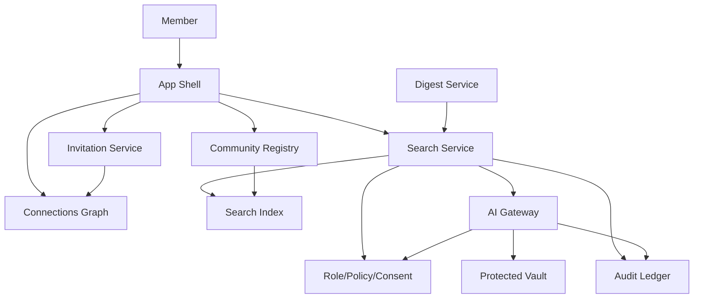

# Loom Communities Architecture 07: Search, Discovery, Connections, and AI

Status: Draft for review
Source product docs: [Product 11](../Product%20Docs%20V2/11-ai-layer-and-the-skill.md), [Product 12](../Product%20Docs%20V2/12-community-discovery-connections-and-invitations.md), [Product 13](../Product%20Docs%20V2/13-search-and-permission-aware-discovery.md)
Design tenets: [Architecture V2/00 - System Design Tenets](./00-system-design-tenets.md)
Predecessor: [Loom V1 Architecture 07](../Architecture/07-search-recommendations-and-ai.md)

## 1. Purpose

This document defines permission-aware discovery: handle/QR lookup, invitations, connections, public
and internal search, AI answers, digests, citations, source policy, and de-indexing. It preserves V1's
neutral search principle while pivoting from creator recommendations to real-world community discovery.

## 2. Functional System Diagram



## 3. Packet Envelope

| Field | Meaning |
| --- | --- |
| `discoveryContext` | Handle, QR, invite, search query, source, community/space visibility. |
| `connectionContext` | Connection id, invite permission, block/mute state, shared communities. |
| `searchContext` | Query, actor, filters, index visibility, source ids, ranking policy. |
| `aiContext` | Prompt, model/provider, retrieved citations, safety/source policy, retention. |
| `permissionContext` | Effective permission, consent, protected class, member data mode. |
| `auditContext` | Search/AI receipt, idempotency key, policy version, redaction requirement. |

## 4. Interfaces and Contracts

| Interface | Packet responsibility |
| --- | --- |
| `CommunitySearchApi` | Public/internal search, result explanation, de-indexing. |
| `CommunityAiGatewayApi` | AI answer, digest, source attribution, policy checks. |
| `CommunityConnectionsApi` | Connections, blocks, invites, shared context. |
| `CommunityInvitationApi` | Signed invite payloads and accept/deny flow. |
| `CommunityDigestApi` | Periodic and on-demand digests from permitted sources. |
| `CommunityIndexingApi` | Index records, visibility policy, deletion/protected exclusions. |

## 5. Component Contract Cards

```text
Component: Connections Graph               Layer: foundation
Single responsibility: own Passport-level person connections, blocks, and invite permissions. (T1)
Interface contract: CommunityConnectionsApi (v1), in loom_api_contracts (T2)
Capabilities (testable sub-units):
  - connect -> requestConnection/acceptConnection -> vt_connections_connect
  - block/mute -> blockMember/muteConnection -> vt_connections_block
  - invite permission -> canInviteConnection -> vt_connections_invite-permission
Owned data: ConnectionEdge, BlockRecord, ConnectionInvitePermission (T1)
Dependencies (by contract + fake): CommunityPassportApi (fake), CommunityAuditApi (fake) (T3)
Events emitted: connection.created, connection.blocked   Events consumed: membership.left (T8)
Blast radius / scoped change: connection graph only; no membership writes. (T5)
Integration tests: conformance plus connect, block, invite-permission suites. (T6)
Agent workpackage: graph state testable with passport/audit fakes. (T9)
```

```text
Component: Search Service                  Layer: service
Single responsibility: own permission-aware query execution and neutral result ranking. (T1)
Interface contract: CommunitySearchApi (v1), in loom_api_contracts (T2)
Capabilities (testable sub-units):
  - public search -> searchPublicCommunities -> vt_search_public
  - internal search -> searchVisibleRecords -> vt_search_permission-aware
  - de-index -> removeOrNarrowIndexEntry -> vt_search_deindex
  - explanation -> explainResult -> vt_search_explanations
Owned data: SearchQueryReceiptPointer, SearchResultExplanation, SearchPolicySnapshot (T1)
Dependencies (by contract + fake): CommunityIndexingApi (fake), CommunityRolePolicyApi (fake), CommunityAuditApi (fake) (T3)
Events emitted: search.performed, search.result-opened   Events consumed: index.updated, role.revoked, content.deleted (T8)
Blast radius / scoped change: query/result state only; source records stay in owning services. (T5)
Integration tests: conformance plus public, permission-aware, deindex, explanation suites. (T6)
Agent workpackage: index and policy fakes drive all allow/deny/ranking paths. (T9)
```

```text
Component: AI Gateway                      Layer: service
Single responsibility: own permission-aware AI answer/digest calls, source attribution, and AI usage audit. (T1)
Interface contract: CommunityAiGatewayApi (v1), in loom_api_contracts (T2)
Capabilities (testable sub-units):
  - answer -> answerWithCitations -> vt_ai-gateway_answer
  - summarize/digest -> generateDigest -> vt_ai-gateway_digest
  - source policy -> validateSourcePolicy -> vt_ai-gateway_source-policy
Owned data: AiRequestRecord, AiCitationSet, AiUsageReceiptPointer, AiPolicySnapshot (T1)
Dependencies (by contract + fake): CommunitySearchApi (fake), CommunityRolePolicyApi (fake), CommunityProtectedVaultApi (fake), CommunityAuditApi (fake) (T3)
Events emitted: ai.answer.generated, ai.digest.generated   Events consumed: consent.revoked, source.deleted (T8)
Blast radius / scoped change: AI request/audit records only; does not own source content. (T5)
Integration tests: conformance plus answer, digest, source-policy suites. (T6)
Agent workpackage: model provider can be fake; all source policy paths are local tests. (T9)
```

```text
Component: Digest Service                  Layer: service
Single responsibility: own scheduled and on-demand community digests from permitted sources. (T1)
Interface contract: CommunityDigestApi (v1), in loom_api_contracts (T2)
Capabilities (testable sub-units):
  - on-demand digest -> createDigest -> vt_digest_on-demand
  - scheduled digest -> scheduleDigest -> vt_digest_scheduled
  - source filtering -> filterDigestSources -> vt_digest_source-filter
Owned data: DigestRequest, DigestSchedule, DigestDeliveryRecord (T1)
Dependencies (by contract + fake): CommunitySearchApi (fake), CommunityAiGatewayApi (fake), CommunityNotificationApi (fake), CommunityAuditApi (fake) (T3)
Events emitted: digest.created, digest.delivered   Events consumed: schedule.tick, membership.left (T8)
Blast radius / scoped change: digest records/delivery only; no content ownership. (T5)
Integration tests: conformance plus on-demand, scheduled, source-filter suites. (T6)
Agent workpackage: digest orchestration can be built with search/AI/notification fakes. (T9)
```

## 6. Workflow Transaction Packet Models

| Ref | Trigger | Primary path | Durable writes / receipts | Completion response |
| --- | --- | --- | --- | --- |
| `07/W1` | Member resolves handle or QR. | App Shell -> Registry -> Search/Discovery. | Discovery audit/search receipt. | Community card or denial. |
| `07/W2` | Member invites connection. | Connections -> Invitation -> Membership boundary. | Invite record, connection audit. | Invite sent or denied. |
| `07/W3` | Member searches community. | App Shell -> Search -> Index/Policy. | Search receipt. | Visible results only. |
| `07/W4` | Member asks AI question. | Search -> AI Gateway -> Citations. | AI usage record, source citations. | Answer with citations. |
| `07/W5` | Weekly digest runs. | Digest -> Search -> AI Gateway -> Notification. | Digest record/delivery audit. | Digest delivered. |

## 7. Step-by-Step Life of a Packet Overlays

### 7.1 `07/W3`: Permission-Aware Search

| Step | Packet action | Owning component | Covering test |
| --- | --- | --- | --- |
| 1 | Member submits query in App Shell. | App Shell Runtime | `ct_app-shell__search_submit-query` |
| 2 | Search resolves actor role/consent/policy. | Search Service | `vt_search_permission-aware` |
| 3 | Index filters visibility and protected exclusions. | Indexing Service | `ct_indexing__search_visibility-filter` |
| 4 | Neutral ranking produces result list and explanations. | Search Service | `vt_search_explanations` |
| 5 | Audit/search receipt records query metadata. | Audit Ledger | `wf_search-permission-aware` |

### 7.2 `07/W4`: AI Answer With Citations

| Step | Packet action | Owning component | Covering test |
| --- | --- | --- | --- |
| 1 | Member asks natural-language question. | App Shell Runtime | `ct_app-shell__ai_question` |
| 2 | Search retrieves permitted sources. | Search Service | `ct_search__ai-gateway_retrieval` |
| 3 | AI Gateway validates source policy and protected exclusions. | AI Gateway | `vt_ai-gateway_source-policy` |
| 4 | AI provider fake returns answer with citations. | AI Gateway | `vt_ai-gateway_answer` |
| 5 | Usage/audit records model, source set, and policy version. | AI Gateway / Audit Ledger | `wf_ai-answer-with-citations` |

### 7.3 `07/W2`: Connection Invite

| Step | Packet action | Owning component | Covering test |
| --- | --- | --- | --- |
| 1 | Member selects connection and invite target. | Connections Graph | `vt_connections_invite-permission` |
| 2 | Block/mute and community policy checked. | Connections Graph / Invitation Service | `ct_connections__invitation_blocked-path` |
| 3 | Signed invite is created. | Invitation Service | `vt_invitation_create-revoke` |
| 4 | Recipient accepts or denies. | Invitation Service | `ct_invitation__membership_accept` |
| 5 | Membership service creates requested/approved state. | Membership Service | `vt_membership_join-approval` |

## 8. Error and Recovery Behavior

- Private or invite-only communities are hidden unless discovery policy allows a preview.
- Search denial must not leak protected snippets or hidden member identities.
- AI answers fail closed when citations are unavailable or policy is stale.
- Connection invites are blocked by member blocks, revocation, invite limits, and community policy.
- De-index events must be idempotent and tolerate repeated deletion events.

## 9. How These Components Adhere To The Tenets

| Tenet | How it is met here |
| --- | --- |
| T1 | Connections, search, AI, and digest own separate state; source records remain with source services. |
| T2 | All components expose versioned contracts. |
| T3 | Search/index/policy/AI/notification dependencies are fakeable. |
| T4 | Service components call foundation/registry dependencies and coordinate by events. |
| T5 | Blast radius excludes source content and membership storage. |
| T6 | Each capability has a validation suite. |
| T7 | Search/AI/digest actions are versioned and audited. |
| T8 | Index, consent, membership, and source changes drive async updates. |
| T9 | Each component is a local work package. |
| T10 | App Shell owns search and AI entry UI while services own logic. |

## 10. Open Architecture Questions

- Should search index be its own component card in the first build phase or internal to Search Service?
- What result explanations are required for neutral search in MVP?
- How much AI provider abstraction is needed before real model integration?
