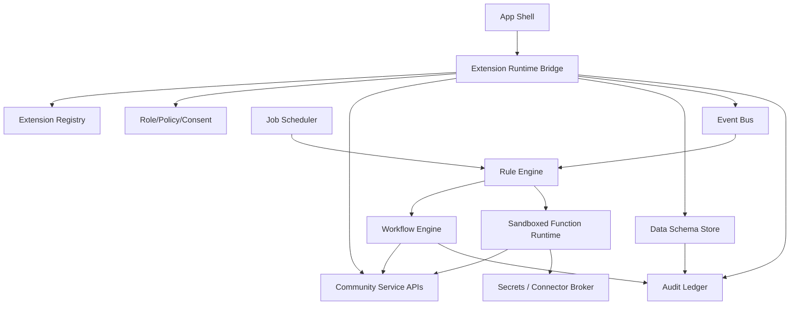

# Loom Communities Architecture 08: Extension Platform Runtime

Status: Draft for review
Source product docs: [Product 10](../Product%20Docs%20V2/10-extension-platform.md), [Product 11](../Product%20Docs%20V2/11-ai-layer-and-the-skill.md)
Design tenets: [Architecture V2/00 - System Design Tenets](./00-system-design-tenets.md)
Predecessor: [Loom V1 Architecture 08](../Architecture/08-extensions-campaigns-and-sponsor-tools.md)

## 1. Purpose

This document defines the extension execution architecture: runtime bridge, event bus, rules, workflows,
jobs, sandboxed functions, data schema store, secrets/connectors, package sessions, and export behavior.
It is the core engine layer that lets extensions compose Loom APIs without bypassing platform trust
boundaries.

## 2. Functional System Diagram



## 3. Packet Envelope

| Field | Meaning |
| --- | --- |
| `extensionContext` | Extension id/version, package signature, certification state, install grant. |
| `sessionContext` | Community, space, member, route, surface, runtime session id, idempotency key. |
| `capabilityContext` | Requested capability, owner approval, role, consent, safety, platform invariant. |
| `eventContext` | Event type, source component, version, payload, dedupe key. |
| `workflowContext` | Workflow id/version, state, transition, timers, compensation. |
| `schemaContext` | Extension entity schema, record id, export policy, indexability. |
| `auditContext` | Package version, actor, policy version, receipt/audit requirements. |

## 4. Interfaces and Contracts

| Interface | Packet responsibility |
| --- | --- |
| `CommunityExtensionRuntimeApi` | Scoped runtime sessions and bridge calls. |
| `CommunityEventBusApi` | Publish/subscribe typed events, dedupe, replay cursor. |
| `CommunityRuleEngineApi` | Event-condition-action rules. |
| `CommunityWorkflowApi` | Versioned state machines, transitions, compensation. |
| `CommunityJobSchedulerApi` | Scheduled and recurring jobs. |
| `CommunityFunctionRuntimeApi` | Sandboxed functions with bounded permissions. |
| `CommunityDataSchemaApi` | Extension schemas, records, validation, export/index policy. |
| `CommunitySecretsConnectorApi` | External secrets/connectors for high-tier packages. |

## 5. Component Contract Cards

```text
Component: Extension Runtime Bridge        Layer: engine
Single responsibility: own scoped extension sessions and permissioned calls into Loom APIs. (T1)
Interface contract: CommunityExtensionRuntimeApi (v1), in loom_api_contracts (T2)
Capabilities (testable sub-units):
  - session -> startSession/endSession -> vt_extension-runtime_session
  - api bridge -> callCommunityApi -> vt_extension-runtime_bridge-call
  - permission enforcement -> enforceCapability -> vt_extension-runtime_permission
Owned data: RuntimeSession, RuntimeCallRecord, RuntimePermissionSnapshot (T1)
Dependencies (by contract + fake): CommunityExtensionRegistryApi (fake), CommunityRolePolicyApi (fake), CommunityAuditApi (fake), service API fakes (T3)
Events emitted: extension.session.started, extension.call.completed   Events consumed: extension.revoked, consent.revoked (T8)
Blast radius / scoped change: runtime session/call state only; service data stays with service owners. (T5)
Integration tests: conformance plus session, bridge-call, permission suites. (T6)
Agent workpackage: bridge can be implemented with registry/policy/service fakes. (T9)
```

```text
Component: Event Bus                        Layer: foundation
Single responsibility: own typed event delivery, dedupe, replay, and subscription cursors. (T1)
Interface contract: CommunityEventBusApi (v1), in loom_api_contracts (T2)
Capabilities (testable sub-units):
  - publish -> publishEvent -> vt_event-bus_publish
  - subscribe/replay -> subscribe/replayFromCursor -> vt_event-bus_replay
  - dedupe -> publishIdempotent -> vt_event-bus_dedupe
Owned data: EventEnvelope, EventSubscription, ReplayCursor, EventDedupeKey (T1)
Dependencies (by contract + fake): CommunityAuditApi (fake) (T3)
Events emitted: event.published   Events consumed: none (T8)
Blast radius / scoped change: event transport state only; consumers own reactions. (T5)
Integration tests: conformance plus publish, replay, dedupe suites. (T6)
Agent workpackage: no higher-layer dependencies; local transport tests define acceptance. (T9)
```

```text
Component: Rule Engine                      Layer: engine
Single responsibility: own declarative event-condition-action rules for extensions. (T1)
Interface contract: CommunityRuleEngineApi (v1), in loom_api_contracts (T2)
Capabilities (testable sub-units):
  - evaluate -> evaluateRule -> vt_rule-engine_evaluate
  - action dispatch -> dispatchRuleAction -> vt_rule-engine_action
  - versioning -> activateRuleVersion -> vt_rule-engine_versioning
Owned data: ExtensionRule, RuleVersion, RuleExecutionRecord (T1)
Dependencies (by contract + fake): CommunityEventBusApi (fake), CommunityExtensionRuntimeApi (fake), CommunityAuditApi (fake) (T3)
Events emitted: rule.executed, rule.failed   Events consumed: typed platform events (T8)
Blast radius / scoped change: rule execution only; actions call service contracts through runtime. (T5)
Integration tests: conformance plus evaluate, action, versioning suites. (T6)
Agent workpackage: rules can be built against event/runtime/audit fakes. (T9)
```

```text
Component: Workflow Engine                  Layer: engine
Single responsibility: own extension state machines, transitions, timers, and compensation. (T1)
Interface contract: CommunityWorkflowApi (v1), in loom_api_contracts (T2)
Capabilities (testable sub-units):
  - start workflow -> startWorkflow -> vt_workflow-engine_start
  - transition -> transitionWorkflow -> vt_workflow-engine_transition
  - compensate -> compensateWorkflow -> vt_workflow-engine_compensation
Owned data: WorkflowDefinition, WorkflowInstance, WorkflowTransitionRecord (T1)
Dependencies (by contract + fake): CommunityExtensionRuntimeApi (fake), CommunityEventBusApi (fake), CommunityAuditApi (fake) (T3)
Events emitted: workflow.started, workflow.transitioned, workflow.completed   Events consumed: rule.action.requested, job.triggered (T8)
Blast radius / scoped change: workflow instance state only; service mutations go through runtime. (T5)
Integration tests: conformance plus start, transition, compensation suites. (T6)
Agent workpackage: state machine is local and service effects are faked via runtime. (T9)
```

```text
Component: Data Schema Store                Layer: engine
Single responsibility: own extension-defined schemas, records, validation, export, and indexability metadata. (T1)
Interface contract: CommunityDataSchemaApi (v1), in loom_api_contracts (T2)
Capabilities (testable sub-units):
  - register schema -> registerSchema -> vt_data-schema_register
  - record CRUD -> createRecord/queryRecords -> vt_data-schema_records
  - export/index policy -> exportSchemaRecords/setIndexability -> vt_data-schema_export-index
Owned data: ExtensionSchema, ExtensionRecord, SchemaExportPolicy, SchemaIndexPolicy (T1)
Dependencies (by contract + fake): CommunityRolePolicyApi (fake), CommunityAuditApi (fake), CommunitySearchApi (fake) (T3)
Events emitted: extension-record.created, schema.updated   Events consumed: extension.uninstalled (T8)
Blast radius / scoped change: extension-defined records only; protected classes delegate to Protected Vault. (T5)
Integration tests: conformance plus register, records, export-index suites. (T6)
Agent workpackage: schema and record behavior can be implemented against policy/search/audit fakes. (T9)
```

## 6. Workflow Transaction Packet Models

| Ref | Trigger | Primary path | Durable writes / receipts | Completion response |
| --- | --- | --- | --- | --- |
| `08/W1` | App Shell opens extension. | Shell -> Runtime -> Registry/Policy. | Runtime session/call audit. | Extension route active or denied. |
| `08/W2` | Service event triggers rule. | Service -> Event Bus -> Rule Engine -> Runtime. | Rule execution record. | Action dispatched or failed. |
| `08/W3` | Workflow starts. | Rule/Runtime -> Workflow Engine -> Services. | Workflow instance, transitions. | State updated. |
| `08/W4` | Scheduled job fires. | Job Scheduler -> Rule/Workflow. | Job execution record. | Rule/workflow invoked. |
| `08/W5` | Extension record exported. | Data Schema Store -> Import/Export. | Export package records. | Portable custom data delivered. |

## 7. Step-by-Step Life of a Packet Overlays

### 7.1 `08/W1`: Start Runtime Session

| Step | Packet action | Owning component | Covering test |
| --- | --- | --- | --- |
| 1 | App Shell resolves extension version and route. | App Shell Runtime | `ct_extension-registry__app-shell_resolve-latest` |
| 2 | Runtime fetches install grant and certification state. | Extension Runtime Bridge | `vt_extension-runtime_session` |
| 3 | Policy engine computes effective permission. | Role/Policy/Consent Engine | `ct_role-policy__extension-runtime_effective-permission` |
| 4 | Runtime starts scoped session. | Extension Runtime Bridge | `vt_extension-runtime_permission` |
| 5 | Extension calls APIs through bridge only. | Extension Runtime Bridge | `vt_extension-runtime_bridge-call` |

### 7.2 `08/W2`: Event Rule Executes

| Step | Packet action | Owning component | Covering test |
| --- | --- | --- | --- |
| 1 | Service publishes typed event with dedupe key. | Event Bus | `vt_event-bus_publish` |
| 2 | Rule Engine receives event by subscription. | Rule Engine | `vt_rule-engine_evaluate` |
| 3 | Rule conditions evaluate against allowed context. | Rule Engine | `vt_rule-engine_evaluate` |
| 4 | Action dispatches through Runtime Bridge. | Rule Engine / Runtime Bridge | `ct_rule-engine__extension-runtime_action-dispatch` |
| 5 | Audit records execution and failures. | Rule Engine | `vt_rule-engine_action` |

### 7.3 `08/W5`: Export Extension Data

| Step | Packet action | Owning component | Covering test |
| --- | --- | --- | --- |
| 1 | Export service requests schemas and records. | Import/Export Service | `ct_import-export__data-schema_request` |
| 2 | Data Schema Store checks export policy. | Data Schema Store | `vt_data-schema_export-index` |
| 3 | Protected data pointers are delegated to Protected Vault. | Protected-Visibility Vault | `ct_data-schema__protected-vault_export-delegate` |
| 4 | Records are serialized with schema version. | Data Schema Store | `vt_data-schema_records` |
| 5 | Export package receives checksums and manifest. | Import/Export Service | `wf_export-migration` |

## 8. Error and Recovery Behavior

- Runtime fails closed on revoked extension, invalid signature, stale certification, or missing grant.
- Rule and workflow executions are idempotent by event id and execution key.
- Failed workflow transitions preserve state and allow retry/compensation.
- Job scheduler must not execute disabled/uninstalled extension jobs.
- Data schema export must include schema version and deny unexportable/protected classes with typed
  reasons.

## 9. How These Components Adhere To The Tenets

| Tenet | How it is met here |
| --- | --- |
| T1 | Runtime, event bus, rules, workflows, jobs/functions, and schema store own separate state. |
| T2 | Engine entry points are typed contracts. |
| T3 | Every dependency has a fake. |
| T4 | Engine calls service/registry/foundation layers; upward effects arrive via Event Bus. |
| T5 | Service mutations are only through Runtime Bridge contracts. |
| T6 | Every capability lists validation suites. |
| T7 | Sessions, events, rules, workflows, jobs, and schemas are versioned/audited/idempotent. |
| T8 | Event Bus is the decoupling mechanism. |
| T9 | Each engine component is assignable to one agent. |
| T10 | Runtime receives UX surface context from App Shell instead of owning shell UI. |

## 10. Open Architecture Questions

- Should Job Scheduler and Function Runtime receive separate cards in the first implementation phase?
- Which function sandbox is acceptable for MVP?
- How much schema query language is needed before custom records become too complex?
