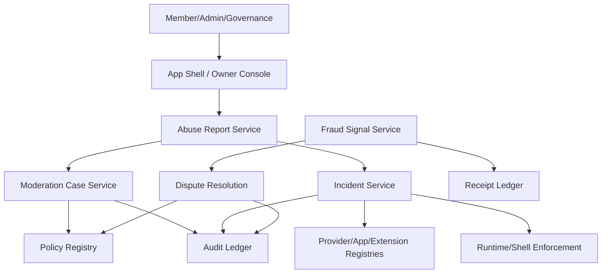

# Loom Communities Architecture 09: Trust, Safety, Moderation, and Compliance

Status: Draft for review
Source product docs: [Product 17](../Product%20Docs%20V2/17-trust-safety-moderation-and-compliance.md), [Product 14](../Product%20Docs%20V2/14-member-data-rights-consent-and-sensitive-data-vaults.md)
Design tenets: [Architecture V2/00 - System Design Tenets](./00-system-design-tenets.md)
Predecessor: [Loom V1 Architecture 09](../Architecture/09-trust-safety-fraud-and-compliance.md)

## 1. Purpose

This document defines abuse reports, moderation cases, blocks, takedowns, protected-data incidents,
fraud signals, provider/extension/app incidents, disputes, appeals, policy versions, and compliance
exports. It keeps safety enforcement contract-first and auditable across custom communities.

## 2. Functional System Diagram



## 3. Packet Envelope

| Field | Meaning |
| --- | --- |
| `safetyContext` | Report type, target, evidence, policy category, severity, immediate action. |
| `caseContext` | Moderation case id, reviewer role, labels, restrictions, appeal state. |
| `fraudContext` | Receipt ids, signal type, confidence, hold/adjustment, dispute window. |
| `incidentContext` | Actor type, package/provider/app/key/version, impacted data classes, remediation. |
| `policyContext` | Policy version, jurisdiction, community override, governance rule. |
| `auditContext` | Evidence refs, redaction, retention, notifications, idempotency key. |

## 4. Interfaces and Contracts

| Interface | Packet responsibility |
| --- | --- |
| `CommunityAbuseReportApi` | Submit reports and evidence. |
| `CommunityModerationApi` | Cases, labels, takedowns, restrictions, appeals. |
| `CommunityFraudApi` | Fraud signals, holds, invalid traffic, payment/ad abuse. |
| `CommunityIncidentApi` | Provider/app/extension/protected-data incidents. |
| `CommunityDisputeApi` | Disputes, appeals, outcomes, settlement adjustments. |
| `CommunityPolicyRegistryApi` | Policy versions, rules, jurisdiction/community overlays. |

## 5. Component Contract Cards

```text
Component: Abuse Report Service            Layer: service
Single responsibility: own intake and routing for abuse reports across members, content, messages, ads, AI, extensions, and providers. (T1)
Interface contract: CommunityAbuseReportApi (v1), in loom_api_contracts (T2)
Capabilities (testable sub-units):
  - submit report -> submitReport -> vt_abuse-report_submit
  - attach evidence -> attachEvidence -> vt_abuse-report_evidence
  - route case -> routeReport -> vt_abuse-report_route
Owned data: AbuseReport, ReportEvidencePointer, ReportRoutingDecision (T1)
Dependencies (by contract + fake): CommunityPassportApi (fake), CommunityPolicyRegistryApi (fake), CommunityAuditApi (fake) (T3)
Events emitted: abuse-report.submitted, abuse-report.routed   Events consumed: none (T8)
Blast radius / scoped change: report intake only; moderation outcomes owned by Moderation Case Service. (T5)
Integration tests: conformance plus submit, evidence, route suites. (T6)
Agent workpackage: intake/routing can be built with policy/audit fakes. (T9)
```

```text
Component: Moderation Case Service         Layer: service
Single responsibility: own moderation cases, labels, restrictions, takedowns, and appeals. (T1)
Interface contract: CommunityModerationApi (v1), in loom_api_contracts (T2)
Capabilities (testable sub-units):
  - case lifecycle -> openCase/assign/resolve -> vt_moderation_case-lifecycle
  - labels/restrictions -> applyLabel/applyRestriction -> vt_moderation_labels
  - appeal -> openAppeal/resolveAppeal -> vt_moderation_appeal
Owned data: ModerationCase, ModerationLabel, RestrictionRecord, AppealRecord (T1)
Dependencies (by contract + fake): CommunityPolicyRegistryApi (fake), CommunityAuditApi (fake), CommunityNotificationApi (fake) (T3)
Events emitted: moderation.case.opened, moderation.restriction.applied, moderation.appeal.resolved   Events consumed: abuse-report.routed (T8)
Blast radius / scoped change: safety labels/restrictions only; source content remains owned by source service. (T5)
Integration tests: conformance plus case-lifecycle, labels, appeal suites. (T6)
Agent workpackage: moderation state local; source service effects are events/contracts. (T9)
```

```text
Component: Fraud Signal Service            Layer: service
Single responsibility: own payment, ad, invite, receipt, and settlement fraud signals and holds. (T1)
Interface contract: CommunityFraudApi (v1), in loom_api_contracts (T2)
Capabilities (testable sub-units):
  - create signal -> createFraudSignal -> vt_fraud_create-signal
  - hold/adjust -> placeHold/recommendAdjustment -> vt_fraud_hold-adjust
  - dispute link -> linkDispute -> vt_fraud_dispute-link
Owned data: FraudSignal, FraudHold, FraudAdjustmentRecommendation (T1)
Dependencies (by contract + fake): CommunityReceiptLedgerApi (fake), CommunitySettlementApi (fake), CommunityAuditApi (fake) (T3)
Events emitted: fraud.signal.created, fraud.hold.placed   Events consumed: receipt.appended, dispute.resolved (T8)
Blast radius / scoped change: fraud annotations only; receipts remain immutable and settlement owns final adjustments. (T5)
Integration tests: conformance plus create-signal, hold-adjust, dispute-link suites. (T6)
Agent workpackage: fraud state can be developed against receipt/settlement fakes. (T9)
```

```text
Component: Incident Service                Layer: service
Single responsibility: own provider/app/extension/protected-data incident lifecycle and remediation state. (T1)
Interface contract: CommunityIncidentApi (v1), in loom_api_contracts (T2)
Capabilities (testable sub-units):
  - create incident -> createIncident -> vt_incident_create
  - remediation -> setRemediationPlan -> vt_incident_remediation
  - publish/notify -> publishIncidentSummary -> vt_incident_publish-notify
Owned data: IncidentRecord, IncidentRemediationPlan, IncidentNotificationState (T1)
Dependencies (by contract + fake): CommunityPublicRegistryApi (fake), CommunityCertificationApi (fake), CommunityAuditApi (fake), CommunityNotificationApi (fake) (T3)
Events emitted: incident.created, incident.published, incident.remediated   Events consumed: certification.revoked, protected-data.exposure-detected (T8)
Blast radius / scoped change: incident lifecycle only; revocation state remains in certification/key owners. (T5)
Integration tests: conformance plus create, remediation, publish-notify suites. (T6)
Agent workpackage: incident state can be built with registry/certification/audit fakes. (T9)
```

## 6. Workflow Transaction Packet Models

| Ref | Trigger | Primary path | Durable writes | Completion response |
| --- | --- | --- | --- | --- |
| `09/W1` | Member reports abuse. | App Shell -> Abuse Report -> Moderation. | Report, case, audit. | Case opened and immediate controls applied. |
| `09/W2` | Moderator applies takedown/restriction. | Moderation -> Source service/runtime. | Label/restriction, notifications. | Content/action limited. |
| `09/W3` | Fraud signal affects settlement. | Fraud -> Receipt Ledger -> Settlement. | Fraud signal/hold/adjustment recommendation. | Hold or adjustment visible. |
| `09/W4` | Extension/provider incident. | Incident -> Certification/Public Registry/Shell. | Incident record, certification/key changes. | Runtime fails closed if revoked. |
| `09/W5` | Actor disputes outcome. | Dispute -> Policy/Evidence -> Outcome. | Dispute case/outcome. | Decision upheld or changed. |

## 7. Step-by-Step Life of a Packet Overlays

### 7.1 `09/W1`: Abuse Report

| Step | Packet action | Owning component | Covering test |
| --- | --- | --- | --- |
| 1 | Reporter submits target/evidence/category. | Abuse Report Service | `vt_abuse-report_submit` |
| 2 | Evidence is attached with redaction policy. | Abuse Report Service | `vt_abuse-report_evidence` |
| 3 | Policy registry maps report to routing rules. | Policy Registry | `ct_policy-registry__abuse-report_route` |
| 4 | Moderation case opens. | Moderation Case Service | `ct_abuse-report__moderation_open-case` |
| 5 | Reporter receives safe status update. | Notification Service | `wf_abuse-report-moderation` |

### 7.2 `09/W3`: Fraud Adjustment

| Step | Packet action | Owning component | Covering test |
| --- | --- | --- | --- |
| 1 | Receipt or ad/payment anomaly is detected. | Fraud Signal Service | `vt_fraud_create-signal` |
| 2 | Hold or recommendation is created. | Fraud Signal Service | `vt_fraud_hold-adjust` |
| 3 | Settlement consumes signal and appends adjustment. | Settlement Engine | `ct_fraud__settlement_apply-adjustment` |
| 4 | Actor can open dispute. | Dispute Resolution | `vt_dispute_open-case` |
| 5 | Outcome appends final adjustment/clearance. | Dispute Resolution / Settlement | `wf_fraud-dispute-regression` |

### 7.3 `09/W4`: Extension Incident

| Step | Packet action | Owning component | Covering test |
| --- | --- | --- | --- |
| 1 | Incident is created with package/key/version. | Incident Service | `vt_incident_create` |
| 2 | Certification limits or revokes scope. | Certification System | `ct_incident__certification_revoke` |
| 3 | Public registry publishes trust state. | Public Registry Read Model | `ct_public-registry__incident_publish` |
| 4 | App Shell rejects revoked package. | App Shell Runtime | `ct_extension-registry__app-shell_revoked-fail-closed` |
| 5 | Owners/members receive remediation. | Incident Service | `vt_incident_publish-notify` |

## 8. Error and Recovery Behavior

- Reports can be deduped but not silently dropped.
- Safety evidence and protected data use redacted audit and role-scoped access.
- Moderation decisions are append-only; appeal records supersede rather than erase.
- Fraud holds are reversible through dispute/settlement adjustment records.
- Incidents can be private, owner-visible, member-visible, or public depending on policy.

## 9. How These Components Adhere To The Tenets

| Tenet | How it is met here |
| --- | --- |
| T1 | Reports, cases, fraud signals, incidents, disputes, and policies own distinct records. |
| T2 | Safety functions expose typed `Community*Api` contracts. |
| T3 | Dependencies on policy, registry, certification, settlement, notification, and audit are fakeable. |
| T4 | Safety services coordinate via events and contracts rather than sibling storage writes. |
| T5 | Enforcement blast radius is via labels/revocations/holds, not direct unrelated edits. |
| T6 | Capability validation suites are listed. |
| T7 | Cases, policy versions, fraud holds, and incidents are audited/versioned. |
| T8 | Reports, incidents, fraud, and moderation produce typed events. |
| T9 | Each safety component is agent-workable. |
| T10 | App Shell owns report/block UI entry points while safety services own state. |

## 10. Open Architecture Questions

- Should Dispute System receive a separate full card in MVP?
- Which safety categories are hardcoded platform policy versus community policy records?
- What notification level is required for protected-data incidents?
