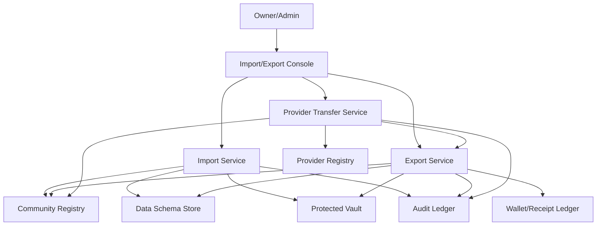

# Loom Communities Architecture 10: Migration, Export, and Portability

Status: Draft for review
Source product docs: [Product 06](../Product%20Docs%20V2/06-hosting-provider-lifecycle-and-portability.md), [Product 21](../Product%20Docs%20V2/21-migration-and-onboarding-from-existing-tools.md)
Design tenets: [Architecture V2/00 - System Design Tenets](./00-system-design-tenets.md)
Predecessor: [Loom V1 Architecture 10](../Architecture/10-migration-export-and-portability.md)

## 1. Purpose

This document defines import, onboarding, export, migration, provider transfer, export redaction,
checksums, migration receipts, dry runs, rollback, and portability scorecards. It makes portability a
system function rather than a promise in marketing copy.

## 2. Functional System Diagram



## 3. Packet Envelope

| Field | Meaning |
| --- | --- |
| `migrationContext` | Source tool/provider, target community/provider, dry-run id, plan version. |
| `dataMappingContext` | Source fields, target component/schema, protected class, validation errors. |
| `exportContext` | Requested scope, actor, package format, checksums, redaction policy. |
| `providerContext` | Source/destination provider roles, certification, transfer capability, downtime. |
| `receiptContext` | Migration receipt, export receipt, error/skipped-row records. |
| `auditContext` | Idempotency key, actor, policy version, provenance and retention. |

## 4. Interfaces and Contracts

| Interface | Packet responsibility |
| --- | --- |
| `CommunityImportApi` | Dry-run/import external data into community components. |
| `CommunityExportApi` | Assemble export packages across platform and extension data. |
| `CommunityProviderTransferApi` | Move provider roles/data and update registry pointers. |
| `CommunityMigrationMappingApi` | Source-to-target mapping, validation, protected classification. |
| `CommunityPortabilityScorecardApi` | Provider export SLA, incidents, cost, support, conformance. |

## 5. Component Contract Cards

```text
Component: Import Service                  Layer: service
Single responsibility: own dry-run and committed imports from external tools/files into Loom contracts. (T1)
Interface contract: CommunityImportApi (v1), in loom_api_contracts (T2)
Capabilities (testable sub-units):
  - dry run -> dryRunImport -> vt_import_dry-run
  - commit import -> commitImport -> vt_import_commit
  - provenance/errors -> listImportErrors -> vt_import_errors-provenance
Owned data: ImportPlan, ImportDryRun, ImportRowResult, ImportReceiptPointer (T1)
Dependencies (by contract + fake): CommunityMigrationMappingApi (fake), CommunityRegistryApi (fake), CommunityDataSchemaApi (fake), CommunityProtectedVaultApi (fake), CommunityAuditApi (fake) (T3)
Events emitted: import.dry-run.completed, import.committed   Events consumed: none (T8)
Blast radius / scoped change: import metadata only; target components own imported records via contracts. (T5)
Integration tests: conformance plus dry-run, commit, errors-provenance suites. (T6)
Agent workpackage: importer calls target fakes; never writes target storage directly. (T9)
```

```text
Component: Export Service                  Layer: service
Single responsibility: own export package assembly, checksums, redaction, and export receipts. (T1)
Interface contract: CommunityExportApi (v1), in loom_api_contracts (T2)
Capabilities (testable sub-units):
  - assemble package -> createExportPackage -> vt_export_assemble
  - redaction -> applyExportRedaction -> vt_export_redaction
  - checksum/receipt -> finalizeExport -> vt_export_checksum-receipt
Owned data: ExportRequest, ExportPackageManifest, ExportChecksum, ExportReceiptPointer (T1)
Dependencies (by contract + fake): CommunityRegistryApi (fake), CommunityDataSchemaApi (fake), CommunityProtectedVaultApi (fake), CommunityReceiptLedgerApi (fake), CommunityAuditApi (fake) (T3)
Events emitted: export.started, export.completed, export.failed   Events consumed: schema.updated, protected-policy.updated (T8)
Blast radius / scoped change: export package metadata only; source data remains with owner components. (T5)
Integration tests: conformance plus assemble, redaction, checksum-receipt suites. (T6)
Agent workpackage: export orchestration is local against component fakes. (T9)
```

```text
Component: Provider Transfer Service       Layer: service
Single responsibility: own provider-role transfer plans, execution, verification, rollback, and registry pointer updates. (T1)
Interface contract: CommunityProviderTransferApi (v1), in loom_api_contracts (T2)
Capabilities (testable sub-units):
  - plan transfer -> createTransferPlan -> vt_provider-transfer_plan
  - execute/verify -> executeTransfer/verifyTransfer -> vt_provider-transfer_execute-verify
  - rollback -> rollbackTransfer -> vt_provider-transfer_rollback
Owned data: ProviderTransferPlan, TransferVerification, TransferRollbackRecord (T1)
Dependencies (by contract + fake): CommunityProviderRegistryApi (fake), CommunityExportApi (fake), CommunityRegistryApi (fake), CommunityAuditApi (fake) (T3)
Events emitted: provider-transfer.planned, provider-transfer.completed, provider-transfer.rolled-back   Events consumed: provider.revoked (T8)
Blast radius / scoped change: provider transfer metadata and registry pointer update through contract only. (T5)
Integration tests: conformance plus plan, execute-verify, rollback suites. (T6)
Agent workpackage: source/destination providers are faked; registry update is contractual. (T9)
```

## 6. Workflow Transaction Packet Models

| Ref | Trigger | Primary path | Durable writes / receipts | Completion response |
| --- | --- | --- | --- | --- |
| `10/W1` | Owner dry-runs import. | Import UI -> Import Service -> Mapping. | Dry-run results/errors. | Import plan ready or blocked. |
| `10/W2` | Owner commits import. | Import -> Target component APIs -> Audit. | Imported records, migration receipts. | Data visible in community. |
| `10/W3` | Owner exports community. | Export -> Component APIs -> Package. | Export manifest, checksums, receipt. | Download/transfer ready. |
| `10/W4` | Owner transfers provider role. | Transfer -> Export -> Provider Registry -> Community Registry. | Transfer plan, verification, registry pointer. | Provider role switched. |
| `10/W5` | Member export/delete. | Export -> Vault/Data Rights -> Package/redaction. | Member export/deletion receipt. | Member receives package or retained exception. |

## 7. Step-by-Step Life of a Packet Overlays

### 7.1 `10/W2`: Commit Import

| Step | Packet action | Owning component | Covering test |
| --- | --- | --- | --- |
| 1 | Owner approves dry-run import plan. | Import Service | `vt_import_dry-run` |
| 2 | Mapping service classifies fields and protected data. | Migration Mapping Service | `ct_migration-mapping__import_classify-protected` |
| 3 | Importer calls target component APIs. | Import Service | `vt_import_commit` |
| 4 | Protected fields go through Protected Vault. | Protected-Visibility Vault | `ct_import__protected-vault_write` |
| 5 | Import receipts and errors are recorded. | Import Service / Audit Ledger | `vt_import_errors-provenance` |

### 7.2 `10/W3`: Export Community

| Step | Packet action | Owning component | Covering test |
| --- | --- | --- | --- |
| 1 | Owner requests export scope. | Export Service | `vt_export_assemble` |
| 2 | Exporter calls Registry, Membership, Wallet, Schema, Receipt, and Vault APIs. | Export Service | `ct_export__components_enumerate` |
| 3 | Protected/member data redaction applies. | Export Service / Protected Vault | `vt_export_redaction` |
| 4 | Package manifest/checksums generated. | Export Service | `vt_export_checksum-receipt` |
| 5 | Export receipt stored and package delivered. | Receipt Ledger / Audit Ledger | `wf_export-migration` |

### 7.3 `10/W4`: Provider Transfer

| Step | Packet action | Owning component | Covering test |
| --- | --- | --- | --- |
| 1 | Owner chooses destination certified provider. | Provider Transfer Service | `vt_provider-transfer_plan` |
| 2 | Transfer plan checks certification, SLA, cost, downtime. | Provider Transfer Service | `ct_provider-registry__provider-transfer_certified-destination` |
| 3 | Export package created for provider role. | Export Service | `ct_export__provider-transfer_package` |
| 4 | Destination verifies checksums/import. | Provider Transfer Service | `vt_provider-transfer_execute-verify` |
| 5 | Community Registry pointer updates or rollback executes. | Provider Transfer Service / Community Registry | `vt_provider-transfer_rollback` |

## 8. Error and Recovery Behavior

- Import dry runs can have blocking errors, warnings, skipped rows, and protected-field warnings.
- Commit import must be idempotent by import plan version and row key.
- Export failure preserves partial package only as internal diagnostic, not a delivered export.
- Provider transfer updates registry pointers only after verification.
- Rollback cannot resurrect data if destination accepted writes outside transfer contract.

## 9. How These Components Adhere To The Tenets

| Tenet | How it is met here |
| --- | --- |
| T1 | Import, export, transfer, mapping, and scorecard own separate metadata. |
| T2 | Import/export/transfer are typed contracts. |
| T3 | Target components and providers are accessed through fakes/contracts. |
| T4 | Services call registry/foundation/provider contracts; no sibling storage writes. |
| T5 | Blast radius is orchestration metadata; source data remains with owners. |
| T6 | Each capability lists tests. |
| T7 | Imports, exports, transfers, and receipts are idempotent/versioned/audited. |
| T8 | Completion/failure/rollback events coordinate downstream state. |
| T9 | Each portability component is an agent work package. |
| T10 | Import/export UI is shell/console-owned; components own data operations. |

## 10. Open Architecture Questions

- What export package format should be canonical for MVP?
- Which external tools get first-class mappers?
- Should provider transfer require a full export/import cycle even for same-vendor role changes?
