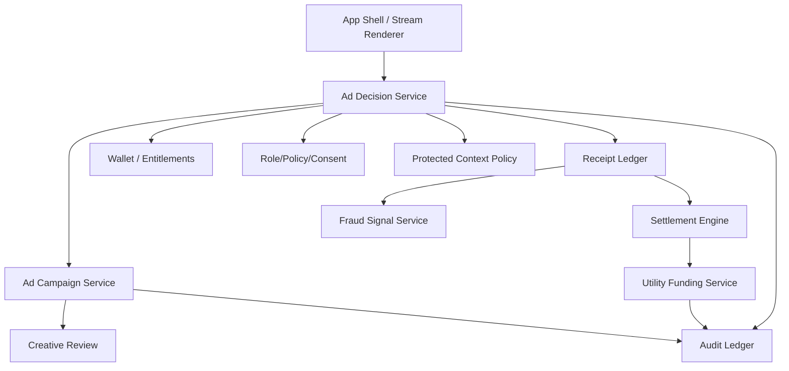

# Loom Communities Architecture 11: Monetization and Ad-Delivery Architecture

Status: Draft for review
Source product docs: [Product 09](../Product%20Docs%20V2/09-monetization-free-backend-ads-and-ad-off.md), [Product 18](../Product%20Docs%20V2/18-advertising-and-ad-delivery-tools.md), [Product 22](../Product%20Docs%20V2/22-business-model-and-incentive-design.md)
Design tenets: [Architecture V2/00 - System Design Tenets](./00-system-design-tenets.md)
Predecessor: [Loom V1 Architecture 11](../Architecture/11-business-model-and-incentive-architecture.md)

## 1. Purpose

This document defines the internals for free-backend monetization, ad decisioning, ad-off, shell banner
and in-stream inventory, community ad policy, advertiser campaigns, sensitive no-fill, ad receipts,
fraud signals, settlement, and utility funding.

## 2. Functional System Diagram



## 3. Packet Envelope

| Field | Meaning |
| --- | --- |
| `adRequestContext` | Slot, surface, community, space, stream position, app version, context category. |
| `eligibilityContext` | Ad-off entitlement, sensitive context, community policy, global policy, frequency cap. |
| `campaignContext` | Advertiser, creative, budget, categories, restrictions, reporting policy. |
| `receiptContext` | Fill/no-fill/impression/click/conversion/ad-off receipt and settlement refs. |
| `utilityContext` | Shared infrastructure cost center, allocation, cap, policy version. |
| `auditContext` | Idempotency key, policy version, fraud state, redaction. |

## 4. Interfaces and Contracts

| Interface | Packet responsibility |
| --- | --- |
| `CommunityAdDecisionApi` | Fill/no-fill, eligibility, ad-off, sensitive context, frequency caps. |
| `CommunityAdCampaignApi` | Campaigns, creatives, budgets, targeting constraints, reporting. |
| `CommunityAdPolicyApi` | Community/global ad category, brand, format, and surface policy. |
| `CommunityUtilityFundingApi` | Utility allocation from ads/ad-off/provider receipts. |
| `CommunityAdReportingApi` | Aggregate advertiser/community reports. |

## 5. Component Contract Cards

```text
Component: Ad Decision Service             Layer: service
Single responsibility: own fill/no-fill decisions for shell banner and stream ad inventory. (T1)
Interface contract: CommunityAdDecisionApi (v1), in loom_api_contracts (T2)
Capabilities (testable sub-units):
  - slot eligibility -> decideAdSlot -> vt_ad-decision_slot-eligibility
  - ad-off -> applyAdOffEntitlement -> vt_ad-decision_ad-off
  - sensitive no-fill -> enforceSensitiveNoFill -> vt_ad-decision_sensitive-no-fill
  - receipt -> recordAdDecisionReceipt -> vt_ad-decision_receipts
Owned data: AdDecision, AdEligibilitySnapshot, FrequencyCapState, AdDecisionReceiptPointer (T1)
Dependencies (by contract + fake): CommunityAdCampaignApi (fake), CommunityWalletApi (fake), CommunityAdPolicyApi (fake), CommunityReceiptLedgerApi (fake), CommunityAuditApi (fake) (T3)
Events emitted: ad.decision.made, ad.no-fill.sensitive, ad-off.applied   Events consumed: entitlement.ad-off.updated, campaign.updated (T8)
Blast radius / scoped change: ad decision data only; App Shell renders decisions and Campaign owns campaigns. (T5)
Integration tests: conformance plus slot eligibility, ad-off, sensitive no-fill, receipts. (T6)
Agent workpackage: decision logic testable with campaign/wallet/policy/receipt fakes. (T9)
```

```text
Component: Ad Campaign Service             Layer: service
Single responsibility: own advertiser campaigns, creatives, budgets, reporting configuration, and campaign lifecycle. (T1)
Interface contract: CommunityAdCampaignApi (v1), in loom_api_contracts (T2)
Capabilities (testable sub-units):
  - campaign setup -> createCampaign/updateCampaign -> vt_ad-campaign_setup
  - creative review -> submitCreative/setCreativeStatus -> vt_ad-campaign_creative-review
  - budget pacing -> reserveBudget/recordSpend -> vt_ad-campaign_budget
Owned data: AdCampaign, Creative, CampaignBudget, CampaignReportingConfig (T1)
Dependencies (by contract + fake): CommunityAdPolicyApi (fake), CommunityReceiptLedgerApi (fake), CommunityAuditApi (fake) (T3)
Events emitted: campaign.created, creative.approved, campaign.paused   Events consumed: fraud.hold.placed, policy.updated (T8)
Blast radius / scoped change: campaign data only; decisions consume campaign snapshots. (T5)
Integration tests: conformance plus setup, creative-review, budget suites. (T6)
Agent workpackage: campaign lifecycle isolated behind policy/receipt fakes. (T9)
```

```text
Component: Utility Funding Service         Layer: service
Single responsibility: own transparent utility allocation from ads, ad-off, provider, and marketplace receipts. (T1)
Interface contract: CommunityUtilityFundingApi (v1), in loom_api_contracts (T2)
Capabilities (testable sub-units):
  - calculate allocation -> calculateUtilityFunding -> vt_utility-funding_calculate
  - cap/enforce policy -> enforceUtilityCaps -> vt_utility-funding_caps
  - report -> publishUtilityReport -> vt_utility-funding_report
Owned data: UtilityFundingPolicySnapshot, UtilityAllocation, UtilityReport (T1)
Dependencies (by contract + fake): CommunityReceiptLedgerApi (fake), CommunitySettlementApi (fake), CommunityAuditApi (fake) (T3)
Events emitted: utility.allocation.calculated, utility.report.published   Events consumed: settlement.run.completed (T8)
Blast radius / scoped change: utility allocation/reporting only; settlement owns actor statements. (T5)
Integration tests: conformance plus calculate, caps, report suites. (T6)
Agent workpackage: utility math implemented against receipt/settlement fakes. (T9)
```

## 6. Workflow Transaction Packet Models

| Ref | Trigger | Primary path | Durable writes / receipts | Completion response |
| --- | --- | --- | --- | --- |
| `11/W1` | Shell requests ad fill. | Shell -> Ad Decision -> Campaign/Wallet/Policy. | Ad/no-fill receipt. | Ad creative or no-fill. |
| `11/W2` | Member/community buys ad-off. | Payment Surface -> Wallet -> Ad Decision. | Payment/ad-off receipt, entitlement. | Eligible ads suppressed. |
| `11/W3` | Advertiser creates campaign. | Campaign -> Creative Review -> Policy. | Campaign, creative status, budget. | Campaign eligible or rejected. |
| `11/W4` | Fraud signal detects invalid ad traffic. | Receipt -> Fraud -> Campaign/Settlement. | Fraud hold/adjustment. | Spend/settlement adjusted. |
| `11/W5` | Utility allocation runs. | Settlement -> Utility Funding -> Report. | Utility allocation/report. | Public or admin report ready. |

## 7. Step-by-Step Life of a Packet Overlays

### 7.1 `11/W1`: Ad Fill or No-Fill

| Step | Packet action | Owning component | Covering test |
| --- | --- | --- | --- |
| 1 | App Shell requests banner/stream fill. | App Shell Runtime | `vt_app-shell_ad-slots` |
| 2 | Ad Decision checks ad-off entitlement. | Ad Decision Service | `vt_ad-decision_ad-off` |
| 3 | Sensitive context/global/community policy checked. | Ad Decision Service | `vt_ad-decision_sensitive-no-fill` |
| 4 | Eligible campaign selected or no-fill returned. | Ad Decision Service | `vt_ad-decision_slot-eligibility` |
| 5 | Receipt recorded for fill/no-fill. | Receipt Ledger | `ct_receipt-ledger__ad-decision_append` |

### 7.2 `11/W2`: Ad-Off

| Step | Packet action | Owning component | Covering test |
| --- | --- | --- | --- |
| 1 | Member/community opens ad-off checkout. | App Shell Payment Surface | `vt_app-shell_shell-owned-surfaces` |
| 2 | Wallet creates payment intent and entitlement. | Wallet / Dues / Donations | `vt_wallet_ad-off` |
| 3 | Receipt ledger records payment/ad-off receipt. | Receipt Ledger | `ct_receipt-ledger__wallet_append-payment` |
| 4 | Ad Decision consumes entitlement update. | Ad Decision Service | `vt_ad-decision_ad-off` |
| 5 | Settlement allocates ad-off value. | Settlement Engine | `wf_ad-off` |

### 7.3 `11/W5`: Utility Funding Allocation

| Step | Packet action | Owning component | Covering test |
| --- | --- | --- | --- |
| 1 | Settlement run completes. | Settlement Engine | `vt_settlement_run` |
| 2 | Utility Funding reads eligible receipts/statements. | Utility Funding Service | `vt_utility-funding_calculate` |
| 3 | Caps and governance policy apply. | Utility Funding Service | `vt_utility-funding_caps` |
| 4 | Utility report is published. | Utility Funding Service | `vt_utility-funding_report` |
| 5 | Audit records report version. | Audit Ledger | `ct_audit__utility-funding_report` |

## 8. Error and Recovery Behavior

- Ad decision must return explicit no-fill reasons: ad-off, sensitive context, policy block, no
  eligible campaign, frequency cap, or fraud hold.
- Campaign creative rejection keeps campaign inactive until fixed.
- Ad receipts are append-only; fraud creates adjustments.
- Utility allocations are recalculated by policy version, not hidden manual edits.
- Extensions cannot render substitute ads when platform ads no-fill.

## 9. How These Components Adhere To The Tenets

| Tenet | How it is met here |
| --- | --- |
| T1 | Ad decisions, campaigns, utility funding, receipts, and settlement own disjoint state. |
| T2 | Ad and funding APIs are typed contracts. |
| T3 | Campaign, wallet, policy, receipt, settlement, and audit dependencies are fakeable. |
| T4 | Service components coordinate by events/receipts, not sibling storage writes. |
| T5 | Ad decisions do not own shell rendering or campaign setup. |
| T6 | Validation tests cover each ad/funding capability. |
| T7 | Ad/off/payment/funding records are idempotent/versioned/audited. |
| T8 | Entitlement, campaign, policy, fraud, and settlement events decouple updates. |
| T9 | Each monetization component is agent-workable. |
| T10 | App Shell owns ad slot UI; Ad Decision owns decision data. |

## 10. Open Architecture Questions

- How should local sponsorships differ from platform ads in API shape?
- Which ad receipt types are required before real advertisers?
- How should member-level ad-off allocation work across multiple communities?
