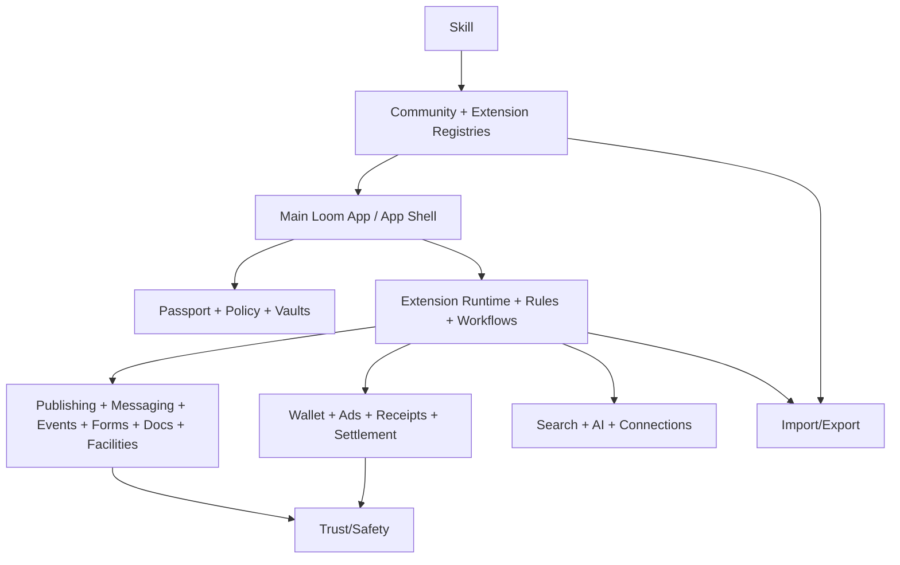

# Loom Communities Architecture 12: MVP Prototype Transaction Slices

Status: Draft for review
Source product doc: [Product 20](../Product%20Docs%20V2/20-mvp-prototype-roadmap.md)
Design tenets: [Architecture V2/00 - System Design Tenets](./00-system-design-tenets.md)
Predecessor: [Loom V1 Architecture 12](../Architecture/12-mvp-prototype-transaction-slices.md)

## 1. Purpose

This document defines the MVP transaction slices that prove the V2 architecture end-to-end. It bundles
the anchor verticals and the cross-cutting platform workflow into testable slices: build/publish/install,
book club, youth soccer, HOA, mosque, messaging/ads/connections, ad-off, and export/migration.

## 2. Functional System Diagram



## 3. Packet Envelope

| Field | Meaning |
| --- | --- |
| `sliceContext` | MVP slice id, vertical, fixture set, expected end state. |
| `componentContext` | Components involved and current fake/provider bindings. |
| `extensionContext` | Package id/version, install grant, rules/workflows/schemas. |
| `memberContext` | Passport, membership, role, consent, protected data, payment state. |
| `assertionContext` | End-state checks, validation tests, contract tests, workflow test id. |
| `auditContext` | Idempotency key, fixture id, receipt/audit expectations. |

## 4. Interfaces and Contracts

| Interface | MVP responsibility |
| --- | --- |
| `CommunityWorkflowInventoryApi` | Lists slices, step owners, expected tests. |
| `CommunityExtensionRuntimeApi` | Runs generated vertical packages. |
| `CommunityAppShellApi` | Renders required shell and vertical routes. |
| `CommunityWalletApi` | Simulated dues/donations/ad-off payments. |
| `CommunityProtectedVaultApi` | Youth/minor, donor/care, confidential request records. |
| `CommunityImportExportApi` | Export community + extension custom data. |
| `CommunitySearchAiApi` | Search/digest over permitted sources. |

## 5. Component Contract Cards

```text
Component: MVP Slice Harness               Layer: registry
Single responsibility: own fixture orchestration, slice execution metadata, and end-state assertions for MVP workflows. (T1)
Interface contract: CommunityMvpSliceHarnessApi (v1), in loom_api_contracts (T2)
Capabilities (testable sub-units):
  - seed slice -> seedMvpSlice -> vt_mvp-slice-harness_seed
  - run slice -> runMvpSlice -> vt_mvp-slice-harness_run
  - assert end state -> assertMvpSliceEndState -> vt_mvp-slice-harness_assert
Owned data: MvpSliceDefinition, MvpFixtureSet, MvpSliceRun, MvpEndStateAssertion (T1)
Dependencies (by contract + fake): CommunityWorkflowInventoryApi (fake), CommunityExtensionRegistryApi (fake), CommunityAppShellApi (fake), CommunityAuditApi (fake) (T3)
Events emitted: mvp-slice.started, mvp-slice.completed, mvp-slice.failed   Events consumed: component.versioned (T8)
Blast radius / scoped change: test harness metadata only; components own real domain state. (T5)
Integration tests: conformance plus seed, run, assert suites. (T6)
Agent workpackage: harness agent wires fakes/fixtures and assertions without editing component implementations. (T9)
```

```text
Component: Vertical Fixture Library        Layer: registry
Single responsibility: own reusable fixtures for book club, youth soccer, HOA, mosque, and cross-cutting flows. (T1)
Interface contract: CommunityVerticalFixtureApi (v1), in loom_api_contracts (T2)
Capabilities (testable sub-units):
  - book club fixtures -> loadBookClubFixtures -> vt_vertical-fixtures_book-club
  - youth soccer fixtures -> loadYouthSoccerFixtures -> vt_vertical-fixtures_youth-soccer
  - HOA fixtures -> loadHoaFixtures -> vt_vertical-fixtures_hoa
  - mosque fixtures -> loadMosqueFixtures -> vt_vertical-fixtures_mosque
Owned data: VerticalFixture, FixtureMember, FixtureCommunity, FixtureExtensionPackage (T1)
Dependencies (by contract + fake): CommunitySeedDataApi (fake), CommunityAuditApi (fake) (T3)
Events emitted: fixtures.loaded   Events consumed: none (T8)
Blast radius / scoped change: fixture data only; does not mutate production docs/components. (T5)
Integration tests: conformance plus one fixture suite per vertical. (T6)
Agent workpackage: fixture generation is local and deterministic. (T9)
```

## 6. Workflow Transaction Packet Models

| Slice | Trigger | Primary path | End state | Workflow test |
| --- | --- | --- | --- | --- |
| `12/S1` Build/Publish/Discover/Install | Owner asks Skill to create app. | Skill -> Registry -> Certification -> Shell. | Member opens latest certified package. | `wf_build-publish-discover-install` |
| `12/S2` Book club | Owner installs book club package. | Runtime -> Events/Forms/Publishing/Search. | Book selected, event created, discussion searchable. | `wf_book-club-headline` |
| `12/S3` Youth soccer | Parent registers child. | Membership -> Protected Vault -> Wallet -> Events. | Player roster/payment/protected data complete. | `wf_youth-soccer-headline` |
| `12/S4` HOA | Member submits request/pays dues. | Wallet -> Docs/Facilities/CaseTask. | Dues paid, request decided, docs exportable. | `wf_hoa-headline` |
| `12/S5` Mosque | Member donates/volunteers/care request. | Wallet -> Events/Forms/Protected Vault. | Donation/volunteer/care flows complete. | `wf_mosque-headline` |
| `12/S6` Messaging/Ads/Connections | Member uses required shell surfaces. | Shell -> Messaging/Connections/Ads. | Messages, connections, ads visible or no-fill. | `wf_messaging-ads-connections` |
| `12/S7` Ad-off | Member/community buys ad-off. | Wallet -> Entitlement -> Ads -> Settlement. | Eligible ads suppressed and settlement updated. | `wf_ad-off` |
| `12/S8` Export/Migration | Owner exports community. | Export -> Registry/Vault/Schema/Receipts. | Export package with redaction/checksums. | `wf_export-migration` |

## 7. Step-by-Step Life of a Packet Overlays

### 7.1 `12/S1`: Build, Publish, Discover, Install

| Step | Packet action | Owning component | Covering test |
| --- | --- | --- | --- |
| 1 | Skill generates package and tests. | AI Skill / Extension Builder | `vt_ai-skill_generate-package` |
| 2 | Builder signs and submits package. | Builder App ID Service / Extension Registry | `vt_builder-app-id_signing-scope`, `vt_extension-registry_publish-version` |
| 3 | Certification approves package. | Certification System | `vt_certification_validate-package` |
| 4 | Community gets handle/QR and installed pointer. | Community Registry | `vt_community-registry_extension-pointers` |
| 5 | Member opens Main App and loads latest. | App Shell Runtime | `wf_build-publish-discover-install` |

### 7.2 `12/S3`: Youth Soccer

| Step | Packet action | Owning component | Covering test |
| --- | --- | --- | --- |
| 1 | Parent joins team space by invite. | Membership Service | `vt_membership_join-approval` |
| 2 | Guardian/minor form writes protected record. | Protected-Visibility Vault | `vt_protected-vault_write` |
| 3 | Registration fee paid. | Wallet / Dues / Donations | `vt_wallet_payment` |
| 4 | Team event schedule and notifications created. | Events Service / Notification Service | `wf_youth-soccer-headline` |
| 5 | Coach views roster under role policy. | Role/Policy/Consent Engine | `vt_role-policy_effective-permission` |

### 7.3 `12/S4`: HOA

| Step | Packet action | Owning component | Covering test |
| --- | --- | --- | --- |
| 1 | Member pays dues. | Wallet / Dues / Donations | `vt_wallet_dues` |
| 2 | Member submits architectural request and attachments. | Case/Task Service / Documents Service | `wf_hoa-headline` |
| 3 | Committee workflow transitions review/decision. | Workflow Engine | `vt_workflow-engine_transition` |
| 4 | Decision notice and audit emitted. | Notification Service / Audit Ledger | `wf_hoa-headline` |
| 5 | Export includes request, decision, docs, and receipts. | Export Service | `vt_export_assemble` |

### 7.4 `12/S7`: Ad-Off

| Step | Packet action | Owning component | Covering test |
| --- | --- | --- | --- |
| 1 | Member opens ad-off payment surface. | App Shell Runtime | `vt_app-shell_shell-owned-surfaces` |
| 2 | Wallet creates payment and entitlement. | Wallet / Dues / Donations | `vt_wallet_ad-off` |
| 3 | Ads service suppresses eligible ads. | Ad Decision Service | `vt_ad-decision_ad-off` |
| 4 | Receipts and settlement update. | Receipt Ledger / Settlement Engine | `wf_ad-off` |
| 5 | Sensitive contexts still no-fill regardless of paid state. | Ad Decision Service | `vt_ad-decision_sensitive-no-fill` |

### 7.5 `12/S8`: Export and Migration

| Step | Packet action | Owning component | Covering test |
| --- | --- | --- | --- |
| 1 | Owner requests export. | Export Service | `vt_export_assemble` |
| 2 | Export enumerates community, membership, payments, extension records. | Export Service / Data Schema Store | `ct_export__components_enumerate` |
| 3 | Protected records are redacted/split. | Protected-Visibility Vault | `ct_protected-vault__import-export_redaction` |
| 4 | Package checksums/receipts generated. | Export Service / Receipt Ledger | `vt_export_checksum-receipt` |
| 5 | Provider transfer or download completes. | Provider Transfer Service | `wf_export-migration` |

## 8. Error and Recovery Behavior

- A slice fails if the required shell nav/ad/payment surfaces are absent.
- Sensitive data assertions must fail if protected records appear in search, ads, or ordinary export.
- Payment failures should leave workflows in resumable pending states.
- Certification failure blocks install but should preserve remediation output.
- Export failure must identify the component that could not provide data.

## 9. How These Components Adhere To The Tenets

| Tenet | How it is met here |
| --- | --- |
| T1 | Harness and fixture library own test metadata only; domain state remains with components. |
| T2 | Harness and fixtures expose contracts. |
| T3 | Slice execution uses component fakes and seed data. |
| T4 | Slices validate the bottom-up component graph rather than introducing sync cycles. |
| T5 | Failing slice routes fix to owning component. |
| T6 | Every slice maps to `wf_` tests plus supporting `vt_`/`ct_` tests. |
| T7 | Slice packets assert idempotency, versioning, receipts, and audit. |
| T8 | Slice behavior relies on events for rules/workflows/notifications. |
| T9 | Slices are agent-workable as workflow-phase packages. |
| T10 | Required App Shell micro-components are explicit slice assertions. |

## 10. Open Architecture Questions

- Which slice should be the first demo once the build plan executes?
- Should MVP slice harness be a real package under `app/packages/tooling` or test-only fixture code?
- How much screenshot/visual assertion coverage is required for App Shell slices?
