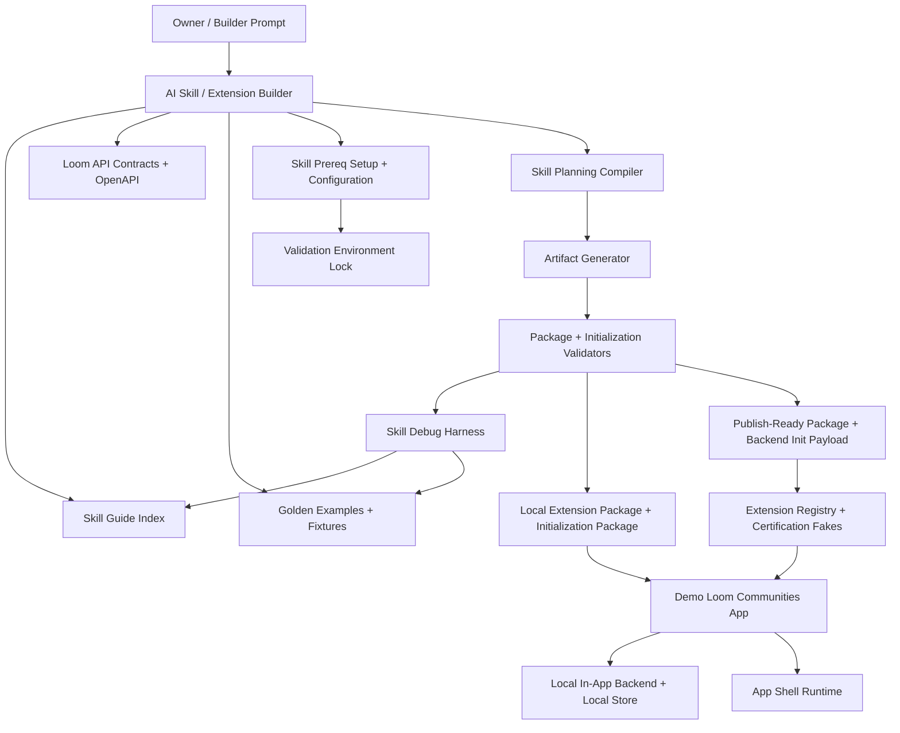

# Loom Communities Architecture 13: AI Skill / Extension Builder Architecture

Status: Draft for review
Source product docs: [Product 11](../Product%20Docs%20V2/11-ai-layer-and-the-skill.md), [Product 10](../Product%20Docs%20V2/10-extension-platform.md), [Product 20](../Product%20Docs%20V2/20-mvp-prototype-roadmap.md)
Design tenets: [Architecture V2/00 - System Design Tenets](./00-system-design-tenets.md)
Related architecture: [01](./01-overall-system-architecture.md), [08](./08-extension-platform-runtime.md), [12](./12-mvp-prototype-transaction-slices.md)

## 1. Purpose

This document defines the architecture of the AI Skill / Extension Builder. The Skill is a builder and
compiler for Loom Communities extension packages. It is not the runtime authority and it is not a
backend. It reads Loom contracts, architecture docs, component guides, workflow guides, examples, and
validator output, then emits portable Loom artifacts that the Loom platform validates and runs.

The Skill supports two delivery modes:

| Mode | Output | Validation target |
| --- | --- | --- |
| `local-demo` | Downloadable extension package plus downloadable initialization package for the Demo Loom Communities App with the Local Backend. | Demo Loom Communities App with Local Backend. |
| `real-backend-publish` | Publish-ready extension package plus backend initialization payloads for a real Loom Communities backend. | Demo Loom Communities App with Local Backend using local stubs/contracts for hosted APIs. |

All workflow validation in the V2 build plan runs against the Demo Loom Communities App with the Local
Backend before any external backend is required.

The canonical execution targets for the first Skill iteration are local coding agents: Codex and
Claude Code. Online-only ChatGPT, Claude.ai, and Gemini.com support is deferred until Loom has a
hosted build and validation backend that can perform the same setup, package, sideload, and workflow
validation steps.

## 2. Functional System Diagram



## 3. Packet Envelope

The Skill packet is the authoring transaction envelope. It carries enough context to produce,
validate, debug, and replay an extension build.

| Field | Meaning |
| --- | --- |
| `skillMode` | `local-demo` or `real-backend-publish`. |
| `promptContext` | Owner request, constraints, vertical, surfaces, roles, data sensitivity, payment/ad needs. |
| `sourceContext` | Loom source tree, API specs, Architecture V2 cards, Product docs, Skill component/workflow guides. |
| `environmentContext` | Execution target, host capabilities, prereq manifest, install plan, tool versions, environment lock. |
| `planningContext` | Derived component map, APIs required, permission plan, data classes, workflow plan. |
| `artifactContext` | Extension package, initialization package, bundled assets, fixtures, validation tests, owner/member notes. |
| `validationContext` | Package validator output, initialization validator output, App Shell lint, permission-negative tests. |
| `debugContext` | Prompt fixture id, transcript hash, package diff, golden comparison, failure diagnostics. |
| `deliveryContext` | Local file paths for `local-demo`; publish payload/stub calls for `real-backend-publish`. |
| `auditContext` | Artifact hashes, tool versions, component versions, test hashes, reproducibility metadata. |

## 4. Interfaces and Contracts

| Interface | Responsibility |
| --- | --- |
| `LoomExtensionSkill` | Skill entry contract: accepts prompt + mode + source context, returns build plan, artifacts, validation report. |
| `LoomSkillGuideIndexApi` | Reads component/workflow guides and examples without duplicating OpenAPI specs. |
| `LoomSkillPrereqSetupApi` | Detects, installs/configures, verifies, and locks the local toolchain needed for validation. |
| `LoomValidationEnvironmentApi` | Reports the validation-ready state consumed by workflow gates and debug replay. |
| `LoomSkillPlanningApi` | Converts prompt intent into Loom surfaces, permissions, schemas, rules, workflows, jobs, and tests. |
| `LoomSkillArtifactApi` | Emits extension package, initialization package, bundled assets, fixtures, and docs. |
| `LoomSkillDebugHarnessApi` | Replays prompt fixtures, compares golden packages, captures diagnostics and transcript hashes. |
| `CommunityExtensionPackageApi` | Validates extension package shape, signatures, routes, cards, permissions, and App Shell invariants. |
| `CommunityInitializationPackageApi` | Validates seed data, rules, workflows, schemas, idempotency keys, and import reports. |
| `LocalLoomBackendApi` | Imports initialization packages into fake in-app backend/local DB for validation. |
| `CommunityExtensionRegistryApi` | Real-backend-publish publish/install contract, exercised through local fakes in Set B. |
| `CommunityCertificationApi` | Certification/validation contract, exercised through local fakes in Set B. |

## 5. Artifact Boundaries

| Artifact | Owned by | Purpose | Must not contain |
| --- | --- | --- | --- |
| `loom.extension.json` | Extension package validator | Runtime manifest: package id/version, routes, cards, permissions, schemas, rules, workflows, jobs, functions, asset defaults, and card presentation defaults. | Raw DB credentials, unapproved capabilities, hidden shell overrides. |
| `loom.initialization.json` | Initialization package schema | Local/fake-backend and real-backend seed payload: community metadata, community branding, spaces, roles, initial records, rules, workflows, jobs. | Direct table writes, unredacted sensitive payloads outside protected-vault APIs. |
| extension assets | Extension package validator | Bundled icon, default community logo, default card image, default hero image, images, icons, thumbnails, hashes, dimensions, and alt/decorative metadata. | Remote-only assets for local-demo, oversized files, hidden executable payloads, or assets not declared in the manifest. |
| initialization assets | Initialization package schema | Community-specific logo, card image, hero image, and seed images for the installed community. | Direct DB paths, undeclared remote dependencies, or private/sensitive member media. |
| fixtures/tests | Skill debug harness | Reproducible examples and validation cases. | Provider-specific secrets or nonportable host assumptions. |
| owner/member notes | Skill artifact generator | Human operating docs for the generated community. | Claims that bypass Loom trust boundaries. |
| debug transcript bundle | Skill debug harness | Replayable prompt, outputs, validator diagnostics, package diffs, artifact hashes. | Long-lived sensitive member data or secrets. |
| `Skill/setup/prereq-manifest.json` | Skill prereq setup | Source of truth for required tools, version ranges, install commands, verify commands, and supported execution targets. | Secrets, host-specific absolute paths, or user credentials. |
| `Skill/setup/validation-environment.lock.json` | Skill prereq setup | Captured host/tool versions and validation-ready evidence for the current local environment. | Access tokens, personal account identifiers, or private file contents. |
| execution target notes | Skill prereq setup | Codex and Claude Code setup differences, sandbox assumptions, and supported commands. | Claims that online-only chat surfaces can run local validation without a backend. |

## 6. Component Contract Cards

```text
Component: AI Skill / Extension Builder        Layer: builder tooling
Single responsibility: compile an owner/builder request into portable Loom extension artifacts. (T1)
Interface contract: LoomExtensionSkill (v1), in Skill/SKILL.md + loom_api_contracts adapter (T2)
Capabilities (testable sub-units):
  - mode selection -> choose local-demo or real-backend-publish -> vt_skill_skeleton
  - package generation -> generateExtensionPackage -> vt_skill_generate-downloadable-extension
  - initialization generation -> generateInitializationPackage -> vt_skill_generate-initialization-package
  - brand assets -> generateBrandAssets -> vt_skill_generate-brand-assets
  - publish-ready generation -> generatePublishPayload -> vt_ai-skill_generate-package
Owned data: SkillRun, SkillBuildPlan, ArtifactHash, ValidationReportPointer (T1)
Dependencies (by contract + fake): LoomSkillGuideIndexApi (fake), CommunityExtensionPackageApi (fake), CommunityInitializationPackageApi (fake), LocalLoomBackendApi (fake), CommunityExtensionRegistryApi (fake) (T3)
Events emitted: skill.package.generated, skill.validation.failed   Events consumed: component.guide.updated, validator.rule.updated (T8)
Blast radius / scoped change: authoring artifacts only; runtime behavior remains owned by App Shell, Runtime Bridge, and service APIs. (T5)
Integration tests: skeleton, local package generation, initialization generation, brand asset generation, publish-ready generation. (T6)
Agent workpackage: one agent can build against guide/validator/backend fakes and golden fixtures. (T9)
```

```text
Component: Skill Guide Index                  Layer: builder tooling
Single responsibility: expose the current component guides, workflow guides, examples, and API references to the Skill. (T1)
Interface contract: LoomSkillGuideIndexApi (v1) (T2)
Capabilities (testable sub-units):
  - component guide lookup -> readComponentGuide -> vt_skill-guide-index_component-lookup
  - workflow guide lookup -> readWorkflowGuide -> vt_skill-guide-index_workflow-lookup
  - source citation -> citeSourceDoc -> vt_skill-guide-index_citations
Owned data: GuideIndex, GuideVersion, ExampleIndex, SourceReference (T1)
Dependencies (by contract + fake): file-system/resource reader fake, API spec inventory fake (T3)
Events emitted: guide.indexed   Events consumed: skill.guide.updated (T8)
Blast radius / scoped change: guide metadata only; does not rewrite OpenAPI or component docs. (T5)
Integration tests: guide lookup, workflow lookup, citation suites. (T6)
Agent workpackage: guide index can be implemented with static fixture docs. (T9)
```

```text
Component: Skill Prereq Setup & Configuration Layer: builder tooling / validation boundary
Single responsibility: prepare and verify the local execution environment before Skill validation runs. (T1)
Interface contract: LoomSkillPrereqSetupApi (v1), LoomValidationEnvironmentApi (v1) (T2)
Capabilities (testable sub-units):
  - read prereq manifest -> loadPrereqManifest -> vt_skill-prereq_manifest-complete
  - detect host -> detectExecutionTarget -> vt_skill-prereq_host-detection
  - create install plan -> planToolInstall -> vt_skill-prereq_install-plan
  - verify and lock tools -> writeEnvironmentLock -> vt_skill-prereq_environment-lock
  - smoke demo validation target -> smokeDemoAppTarget -> vt_skill-prereq_demo-app-smoke
Owned data: PrereqManifest, InstallPlan, ToolVersionReport, ValidationEnvironmentLock, SetupDiagnostic (T1)
Dependencies (by contract + fake): file-system/tool-runner fake, emulator runner fake, Demo App smoke fake, workflow harness fake (T3)
Events emitted: skill.prereq.ready, skill.prereq.failed   Events consumed: tool.version.updated, validator.rule.updated (T8)
Blast radius / scoped change: local setup artifacts and diagnostics only; no extension package or runtime data writes. (T5)
Integration tests: manifest completeness, host detection, install plan, lockfile generation, demo-app smoke, environment-ready contract. (T6)
Agent workpackage: setup can be built and tested independently against command-runner fakes and local smoke fixtures. (T9)
```

```text
Component: Skill Planning Compiler            Layer: builder tooling
Single responsibility: turn prompt intent into a Loom-safe build plan before artifacts are generated. (T1)
Interface contract: LoomSkillPlanningApi (v1) (T2)
Capabilities (testable sub-units):
  - capability plan -> deriveCapabilityPlan -> vt_skill-planner_capabilities
  - permission plan -> derivePermissionPlan -> vt_skill-planner_permissions
  - workflow plan -> deriveWorkflowPlan -> vt_skill-planner_workflows
Owned data: SkillPlan, CapabilityRequest, PermissionRequest, WorkflowDraft (T1)
Dependencies (by contract + fake): LoomSkillGuideIndexApi (fake), CommunityRolePolicyApi (fake), API spec inventory fake (T3)
Events emitted: skill.plan.created   Events consumed: none (T8)
Blast radius / scoped change: plans only; invalid plans fail before artifact generation. (T5)
Integration tests: capabilities, permissions, workflows, negative unsafe-request tests. (T6)
Agent workpackage: planner is deterministic over prompt fixtures and guide fakes. (T9)
```

```text
Component: Skill Debug Harness                Layer: tooling
Single responsibility: make Skill changes reproducible, testable, and debuggable. (T1)
Interface contract: LoomSkillDebugHarnessApi (v1) (T2)
Capabilities (testable sub-units):
  - replay prompt fixture -> replaySkillRun -> vt_skill-debug-harness_fixture-replay
  - compare golden package -> compareGoldenArtifact -> vt_skill_debug_golden-flow
  - capture diagnostics -> captureValidatorDiagnostics -> vt_skill-debug-harness_diagnostics
Owned data: PromptFixture, GoldenArtifact, SkillRunTranscript, PackageDiff, DiagnosticBundle (T1)
Dependencies (by contract + fake): LoomExtensionSkill (fake), validators (fake), Demo App workflow harness (fake) (T3)
Events emitted: skill.debug.failed, skill.debug.passed   Events consumed: validator.failed (T8)
Blast radius / scoped change: test fixtures and debug metadata only. (T5)
Integration tests: fixture replay, golden comparison, diagnostics capture. (T6)
Agent workpackage: harness agent can run without editing runtime components. (T9)
```

```text
Component: Local Demo Delivery Adapter        Layer: builder tooling / UX boundary
Single responsibility: deliver Skill artifacts to the Demo App local file loader and fake backend import path. (T1)
Interface contract: LoomLocalSkillDeliveryApi (v1) (T2)
Capabilities (testable sub-units):
  - write local package -> writeExtensionPackage -> vt_skill_generate-downloadable-extension
  - write initialization package -> writeInitializationPackage -> vt_skill_generate-initialization-package
  - handoff to demo loader -> loadIntoDemoApp -> wf_local-build-download-sideload-install
Owned data: LocalArtifactPath, LocalArtifactHash, DemoLoadRequest (T1)
Dependencies (by contract + fake): LocalLoomBackendApi (fake), CommunityAppShellApi (fake), CommunityExtensionPackageApi (fake) (T3)
Events emitted: local-demo.package.ready   Events consumed: none (T8)
Blast radius / scoped change: local artifacts only; no hosted registry writes. (T5)
Integration tests: package write, initialization write, sideload workflow. (T6)
Agent workpackage: adapter can be built against emulator file-system and local backend fakes. (T9)
```

```text
Component: Real Backend Publish Adapter       Layer: builder tooling / registry boundary
Single responsibility: prepare publish-ready payloads and exercise hosted publish contracts through fakes. (T1)
Interface contract: LoomRealBackendPublishAdapterApi (v1) (T2)
Capabilities (testable sub-units):
  - prepare publish payload -> buildPublishPayload -> vt_ai-skill_generate-package
  - validate certification contract -> validateCertificationPayload -> ct_certification__extension-registry_certify-package
  - simulate publish/install -> publishThroughFakeRegistry -> wf_build-publish-discover-install
Owned data: PublishPayload, BackendInitializationPayload, PublishSimulationRecord (T1)
Dependencies (by contract + fake): CommunityExtensionRegistryApi (fake), CommunityCertificationApi (fake), CommunityRegistryApi (fake), CommunityAppShellApi (fake) (T3)
Events emitted: publish.payload.ready   Events consumed: certification.policy.updated (T8)
Blast radius / scoped change: publish payloads and fake registry interactions only; no external backend dependency in Set B. (T5)
Integration tests: publish payload, certification fake, publish/discover/install workflow. (T6)
Agent workpackage: publish adapter can be built entirely against registry/certification fakes. (T9)
```

## 7. Workflow Transaction Packet Models

| Ref | Trigger | Primary path | Durable writes / artifacts | Workflow test |
| --- | --- | --- | --- | --- |
| `13/W0` Prepare local validation environment | Skill run begins on Codex or Claude Code. | Skill -> Prereq Setup -> tool install/configure -> environment lock -> workflow harness. | Prereq manifest, install plan, validation environment lock, smoke report. | `wf_local-demo-prereq-to-validation-ready` |
| `13/W1` Local demo build | Owner asks Skill for a local community extension. | Skill -> Prereq-ready gate -> Guide Index -> Planner -> Artifact Generator -> Validators -> Demo App local loader. | Downloadable extension package, initialization package, debug bundle. | `wf_local-build-download-sideload-install` |
| `13/W2` Real-backend publish build | Owner asks Skill for publish-ready extension. | Skill -> Planner -> Artifact Generator -> Validators -> Registry/Certification fakes -> App Shell. | Publish package, backend initialization payload, certification report. | `wf_build-publish-discover-install` |
| `13/W3` Skill debug replay | A Skill change or validation failure occurs. | Debug Harness -> Skill fixture replay -> Validators -> Golden diff -> failing component owner. | Transcript hash, diagnostic bundle, package diff, updated fixture. | `vt_skill_debug_golden-flow` |
| `13/W4` Phase guide enrichment | A component or workflow phase completes. | Phase agent -> Skill component/workflow guide -> Guide Index -> Skill validation. | Updated guide, example fragment, guide index version. | `vt_skill-guide-index_component-lookup` |

## 8. Step-by-Step Life of a Packet Overlays

### 8.0 `13/W0`: Prepare Local Validation Environment

| Step | Packet action | Owning component | Covering test |
| --- | --- | --- | --- |
| 1 | Skill selects a supported local execution target: Codex or Claude Code. | Skill Prereq Setup & Configuration | `vt_skill-prereq_host-detection` |
| 2 | Skill reads `Skill/setup/prereq-manifest.json` and resolves required tools for `local-demo`. | Skill Prereq Setup & Configuration | `vt_skill-prereq_manifest-complete` |
| 3 | Skill produces an install/configuration plan before changing the environment. | Skill Prereq Setup & Configuration | `vt_skill-prereq_install-plan` |
| 4 | Approved tools are installed or configured, then verified by version and smoke commands. | Skill Prereq Setup & Configuration | `vt_skill-prereq_environment-lock` |
| 5 | Demo App local validation target boots far enough to prove the harness is reachable. | Skill Prereq Setup & Configuration / Workflow Validation Harness | `vt_skill-prereq_demo-app-smoke`, `ct_skill-prereq-setup__workflow-validation-harness_environment-ready` |
| 6 | Environment lock is stamped before any package or workflow validation runs. | Skill Prereq Setup & Configuration | `wf_local-demo-prereq-to-validation-ready` |

### 8.1 `13/W1`: Local Demo Build, Download, Sideload, Install

| Step | Packet action | Owning component | Covering test |
| --- | --- | --- | --- |
| 1 | Workflow gate verifies a current validation environment lock. | Skill Prereq Setup & Configuration | `wf_local-demo-prereq-to-validation-ready` |
| 2 | Owner selects `local-demo` and describes community. | AI Skill / Extension Builder | `vt_skill_skeleton` |
| 3 | Skill reads component/workflow guides and API specs. | Skill Guide Index | `vt_skill-guide-index_component-lookup` |
| 4 | Skill derives permissions, schemas, rules, workflows, jobs, asset requirements, and card presentation defaults. | Skill Planning Compiler | `vt_skill-planner_permissions` |
| 5 | Skill emits extension package, initialization package, and local branding assets. | AI Skill / Extension Builder | `vt_skill_generate-downloadable-extension`, `vt_skill_generate-initialization-package`, `vt_skill_generate-brand-assets` |
| 6 | Validators check package shape, asset manifest, App Shell invariants, permissions, and initialization schema. | Extension Package Validator / Initialization Package Schema | `vt_extension-package_downloadable-shape`, `vt_extension-package_asset-manifest`, `vt_initialization-package_schema`, `vt_initialization-package_community-branding` |
| 7 | Demo App loads local package from emulator file system. | Loom Communities Demo App | `vt_demo-app_local-file-load-extension` |
| 8 | Local Backend imports initialization package into local DB. | Local In-App Backend Adapter | `vt_fake-backend_import-init-package`, `vt_local-store_persist-reload` |
| 9 | App Shell renders branded card with fallback priority and opens local extension. | App Shell Runtime / Community Card | `vt_demo-app_cards-after-load`, `vt_demo-app_card-image-after-load`, `vt_community-card_branding-priority`, `vt_demo-app_open-local-extension` |
| 10 | End-to-end local workflow is stamped in manifest. | Workflow harness | `wf_local-build-download-sideload-install` |

### 8.2 `13/W2`: Real-Backend Publish Mode Validated Locally

| Step | Packet action | Owning component | Covering test |
| --- | --- | --- | --- |
| 1 | Owner selects `real-backend-publish`. | AI Skill / Extension Builder | `vt_ai-skill_generate-package` |
| 2 | Skill emits publish-ready extension package and backend initialization payload. | AI Skill / Extension Builder | `vt_ai-skill_generate-package` |
| 3 | Package is signed with builder App ID. | Builder App ID Service | `vt_builder-app-id_signing-scope` |
| 4 | Registry fake accepts publish payload. | Real Backend Publish Adapter / Extension Registry | `ct_builder-app-id__extension-registry_signing-scope` |
| 5 | Certification fake validates package and returns report. | Certification System | `ct_certification__extension-registry_certify-package` |
| 6 | Demo App installs and opens through local backend stubs/contracts. | App Shell Runtime | `ct_extension-registry__app-shell_resolve-latest` |
| 7 | Hosted publish workflow is stamped without external backend dependency. | Workflow harness | `wf_build-publish-discover-install` |

### 8.3 `13/W3`: Skill Debug Replay

| Step | Packet action | Owning component | Covering test |
| --- | --- | --- | --- |
| 1 | Failing prompt, transcript, package, and validator output are captured. | Skill Debug Harness | `vt_skill-debug-harness_diagnostics` |
| 2 | Fixture replay reproduces the Skill run. | Skill Debug Harness | `vt_skill-debug-harness_fixture-replay` |
| 3 | Generated package is diffed against golden output. | Skill Debug Harness | `vt_skill_debug_golden-flow` |
| 4 | Failure is assigned to Skill instruction, package validator, or owning Loom component. | Skill Debug Harness | `vt_skill_debug_golden-flow` |
| 5 | Catching validation/contract test is added before the fix. | Owning component agent | `vt_skill_debug_golden-flow` |

## 9. Error and Recovery Behavior

- Unsafe requests fail in the planning compiler before artifact generation.
- Missing API capability fails with a guide/spec citation and proposed component gap.
- Missing or incompatible local tools fail in prereq setup before package generation or workflow
  validation starts.
- Package validator failures return typed diagnostics that the Skill can use for self-repair.
- Initialization import failures include idempotency key, failed record path, rollback state, and import
  report.
- Local-demo mode never writes to hosted registries.
- Real-backend-publish mode is validated through local fakes/stubs until a later hosted smoke test is
  explicitly approved.
- Skill debug replay must preserve enough fixture context to reproduce a failure without private
  member data or secrets.

## 10. How These Components Adhere To The Tenets

| Tenet | How it is met here |
| --- | --- |
| T1 | Skill, guide index, prereq setup, planner, debug harness, local delivery, and publish adapter own distinct state and artifacts. |
| T2 | Skill entry, guide lookup, prereq setup, validation environment reporting, planning, artifact generation, debug replay, package validation, initialization import, and publish simulation are contract-first. |
| T3 | Registry, certification, local backend, package validator, guide index, command runner, emulator runner, and App Shell dependencies are fakeable. |
| T4 | Skill tooling does not introduce runtime dependency cycles; runtime effects happen through package install and API contracts. |
| T5 | Skill changes affect generated artifacts and guide fixtures, not service-owned data or runtime internals. |
| T6 | Every capability maps to validation, contract, or workflow tests in the manifest. |
| T7 | Artifacts, assets, tool versions, environment locks, and tests are versioned and hashed; imports are idempotent; debug bundles and validation reports are auditable. |
| T8 | Skill emits events for generated/failed runs; runtime community behavior remains event-driven after install. |
| T9 | Each Skill subcomponent is an agent-sized work package with fakes and golden fixtures. |
| T10 | Generated UI must preserve App Shell, nav, ads, payment, and card micro-component contracts. |

## 11. Open Architecture Questions

- Should `LoomExtensionSkill` live only as a portable `SKILL.md` convention, or should a thin typed
  adapter also live under `loom_api_contracts` for test harnesses?
- How much of the guide index should be generated from docs versus maintained by phase agents?
- Which hosted smoke test, if any, should follow local fake validation for `real-backend-publish`?
- Should Skill debug bundles be retained in git fixtures, build artifacts, or both?
- What hosted build/validation backend is required before online-only chat surfaces can become
  supported execution targets?
