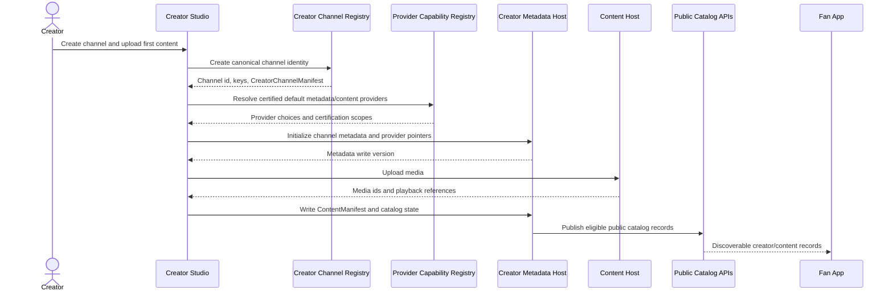
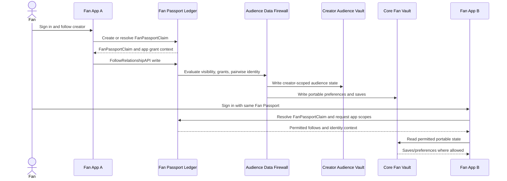
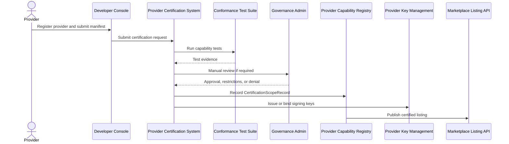
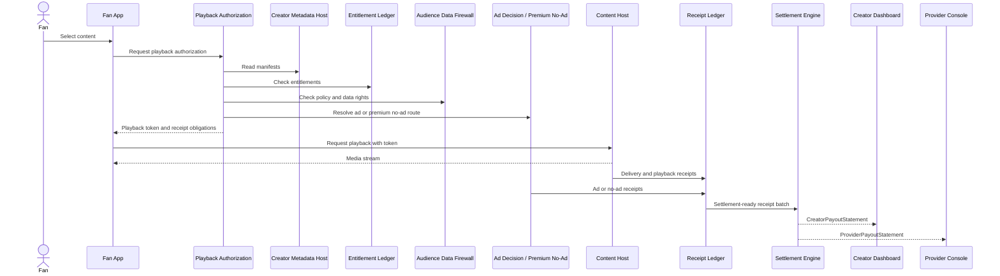
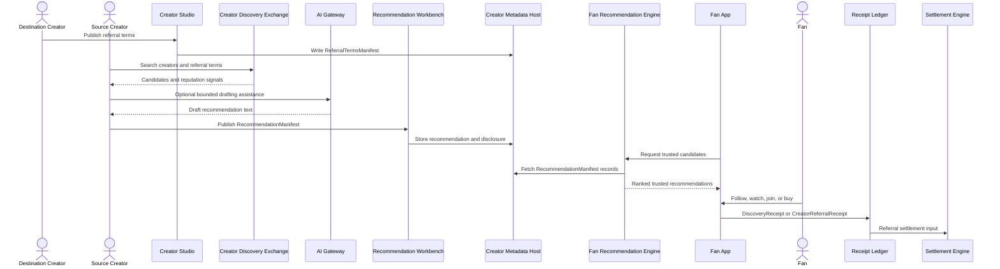
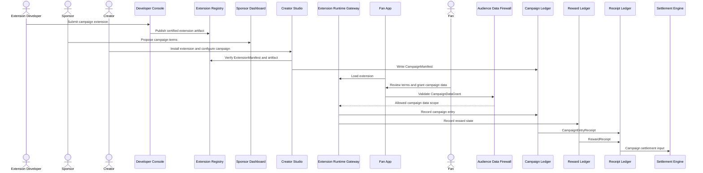
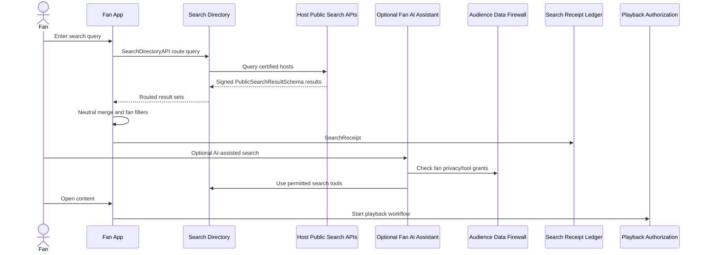
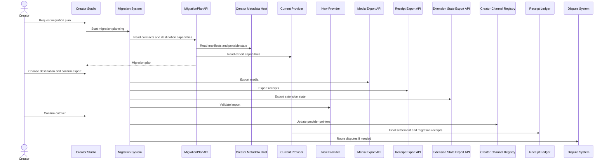

# Loom Architecture 01: Overall System Architecture

Status: Draft for review  
Source product doc: `docs/Product Docs/01-core-thesis-and-platform-principles.md`

## 1. Purpose

This document defines Loom's overall system architecture and maps the "life of a packet" through the system for every end-to-end workflow currently defined in the Core Thesis and Platform Principles product definition.

In this document, a packet means a logical transaction envelope, not an IP packet. A packet starts with a creator, fan, provider, developer, sponsor, or governance action. It carries identity, authorization, manifest versions, policy context, request payload, and audit context through Loom services until the workflow completes.

## 2. Overall System Diagram

```mermaid
flowchart TB
  subgraph Actors
    Creator[Creator]
    Fan[Fan]
    Provider[Provider]
    ExtensionDeveloper[Extension Developer]
    Sponsor[Sponsor / Brand]
    Governance[Governance / Foundation]
  end

  subgraph ExperienceSurfaces[Experience Surfaces]
    CreatorStudio[Creator Studio]
    FanApp[Certified Fan Apps]
    ProviderConsole[Provider Console]
    DeveloperConsole[Developer Console]
    SponsorDashboard[Sponsor Dashboard]
    GovernanceAdmin[Governance Admin]
  end

  subgraph ControlPlane[Control Plane and Registries]
    CreatorChannelRegistry[Creator Channel Registry]
    CreatorMetadataHost[Creator Metadata Host]
    ProviderCapabilityRegistry[Provider Capability Registry]
    MarketplaceListing[Marketplace Listing API]
    CertificationSystem[Provider / App / Extension Certification System]
    ExtensionRegistry[Extension Registry]
    SearchDirectory[Search Directory]
    MigrationSystem[Migration System]
  end

  subgraph FanIdentityAndData[Fan Identity and Data Rights]
    FanPassportLedger[Fan Passport Ledger]
    CoreFanVault[Core Fan Vault]
    PrivateEventVault[Private Event Vault]
    CreatorAudienceVault[Creator Audience Vault]
    EntitlementLedger[Entitlement Ledger]
    AudienceDataFirewall[Audience Data Firewall]
  end

  subgraph DataPlane[Content, Discovery, and Runtime Data Plane]
    ContentHost[Content Host / CDN]
    PlaybackAuthorization[Playback Authorization Service]
    AdPremiumDecision[Ad Decision / Premium No-Ad Service]
    PublicCatalog[Public Catalog APIs]
    HostSearch[Host Public Search APIs]
    RecommendationExchange[Creator Discovery Exchange]
    RecommendationWorkbench[Recommendation Workbench]
    FanRecommendationEngine[Fan Scoped Recommendation Engine]
    ExtensionRuntime[Extension Runtime Gateway]
    AIGateway[AI Gateway / Tool Runtime]
  end

  subgraph EconomicPlane[Receipts, Rewards, and Settlement]
    CampaignLedger[Campaign Ledger]
    RewardLedger[Reward Ledger]
    ReceiptLedger[Receipt Ledger]
    SettlementEngine[Settlement Engine]
  end

  subgraph TrustPlane[Trust, Safety, and Governance]
    TrustSafety[Trust / Safety / Fraud Services]
    ProviderAudit[Provider / App / Extension Audit APIs]
    DisputeSystem[Dispute Resolution System]
    KeyManagement[Provider Key Management]
  end

  Creator --> CreatorStudio
  Fan --> FanApp
  Provider --> ProviderConsole
  Provider --> DeveloperConsole
  ExtensionDeveloper --> DeveloperConsole
  Sponsor --> SponsorDashboard
  Governance --> GovernanceAdmin

  CreatorStudio --> CreatorChannelRegistry
  CreatorStudio --> CreatorMetadataHost
  CreatorStudio --> ProviderCapabilityRegistry
  CreatorStudio --> ExtensionRegistry
  CreatorStudio --> RecommendationExchange
  CreatorStudio --> RecommendationWorkbench
  CreatorStudio --> MigrationSystem

  FanApp --> FanPassportLedger
  FanApp --> CoreFanVault
  FanApp --> CreatorAudienceVault
  FanApp --> EntitlementLedger
  FanApp --> PlaybackAuthorization
  FanApp --> PublicCatalog
  FanApp --> SearchDirectory
  FanApp --> FanRecommendationEngine
  FanApp --> ExtensionRuntime
  FanApp --> AIGateway

  CreatorChannelRegistry --> CreatorMetadataHost
  CreatorMetadataHost --> PublicCatalog
  CreatorMetadataHost --> PlaybackAuthorization
  CreatorMetadataHost --> SearchDirectory
  CreatorMetadataHost --> MigrationSystem

  ProviderCapabilityRegistry --> MarketplaceListing
  CertificationSystem --> ProviderCapabilityRegistry
  CertificationSystem --> KeyManagement
  CertificationSystem --> ProviderAudit
  GovernanceAdmin --> CertificationSystem
  GovernanceAdmin --> DisputeSystem

  PlaybackAuthorization --> EntitlementLedger
  PlaybackAuthorization --> AudienceDataFirewall
  PlaybackAuthorization --> ContentHost
  PlaybackAuthorization --> AdPremiumDecision
  ContentHost --> ReceiptLedger
  AdPremiumDecision --> ReceiptLedger

  AudienceDataFirewall --> CoreFanVault
  AudienceDataFirewall --> PrivateEventVault
  AudienceDataFirewall --> CreatorAudienceVault
  AudienceDataFirewall --> ReceiptLedger
  CreatorAudienceVault --> CreatorStudio

  SearchDirectory --> HostSearch
  HostSearch --> FanApp
  FanRecommendationEngine --> RecommendationWorkbench
  RecommendationWorkbench --> CreatorMetadataHost
  RecommendationExchange --> PublicCatalog

  ExtensionRegistry --> ExtensionRuntime
  ExtensionRuntime --> CampaignLedger
  ExtensionRuntime --> RewardLedger
  ExtensionRuntime --> AudienceDataFirewall

  SponsorDashboard --> CampaignLedger
  SponsorDashboard --> AudienceDataFirewall

  CampaignLedger --> ReceiptLedger
  RewardLedger --> ReceiptLedger
  ReceiptLedger --> SettlementEngine
  SettlementEngine --> CreatorStudio
  SettlementEngine --> ProviderConsole
  SettlementEngine --> FanApp

  TrustSafety --> DisputeSystem
  ProviderAudit --> TrustSafety
  ReceiptLedger --> TrustSafety
  MigrationSystem --> DisputeSystem
```

## 3. System Components

| Component | Responsibility | Primary interfaces and outputs |
| --- | --- | --- |
| Creator Studio | Creator-facing control surface for channels, content, providers, recommendations, extensions, campaigns, revenue, and migration. | Calls registry, metadata, provider, extension, recommendation, campaign, and migration APIs. |
| Certified Fan Apps | Fan-facing apps for identity, follow, content, search, recommendations, wallet, campaigns, AI, and privacy controls. | Calls Fan Passport, vault, playback, search, recommendation, extension, wallet, and data-rights APIs. |
| Provider Console | Provider-facing surface for certification, operations, incidents, receipts, payouts, and audits. | Uses provider registry, audit, key, receipt, and settlement interfaces. |
| Developer Console | Developer-facing surface for SDKs, manifests, conformance tests, artifact submission, and certification requests. | Uses certification, extension artifact, SDK registry, and conformance test interfaces. |
| Sponsor Dashboard | Sponsor-facing surface for campaign proposals, disclosures, reporting, and clean-room measurement. | Uses sponsor campaign, campaign ledger, data-rights, and reporting interfaces. |
| Governance Admin | Governance surface for certification approval, revocation, disputes, audit probes, policy versions, and public registries. | Uses certification, audit, key management, dispute, policy, and public registry interfaces. |
| Creator Channel Registry | Canonical creator identity, channel root records, public keys, and current metadata host pointers. | Returns channel id, key records, root `CreatorChannelManifest`, and pointer updates. |
| Creator Metadata Host | Durable store for creator portable state: channel manifests, content catalog, monetization, hosting contracts, recommendations, extensions, campaigns, AI policy, provider settings, and migration state. | Exposes `CreatorMetadataAPI`, `ContentCatalogAPI`, `PublicCatalogAPI`, metadata export, and manifest version history. |
| Provider Capability Registry | Durable registry of certified provider identities, capabilities, service roles, API versions, public keys, regions, terms, pricing, incidents, and certification state. | Exposes provider discovery and capability lookup. |
| Marketplace Listing API | Creator/app-facing public listing and comparison layer over certified providers, apps, and extensions. | Returns certified listings, scorecards, prices, terms, incidents, and restrictions. |
| Certification System | Certification workflow for providers, apps, extensions, search, AI, clean-room, receipt signing, and other role-specific scopes. | Runs conformance tests and creates `CertificationScopeRecord`. |
| Extension Registry | Registry and marketplace for certified extensions and signed extension artifacts. | Exposes `ExtensionManifest`, `ExtensionArtifactAPI`, `ExtensionInstallAPI`, and revocation status. |
| Search Directory | Routing layer for neutral search across certified hosts and public indexes. | Exposes `SearchDirectoryAPI`, host routing, and search policy metadata. |
| Migration System | Builds migration plans, coordinates export/import, records cutover state, and routes migration disputes. | Exposes `MigrationPlanAPI`, migration orchestration, and `MigrationReceipt` creation. |
| Fan Passport Ledger | Durable fan identity and follow control ledger. | Exposes `FanPassportAPI`, `FollowRelationshipAPI`, `ConsentGrantAPI`, `AppPermissionGrant`, and `FanPassportClaim`. |
| Core Fan Vault | Portable fan-owned lightweight state. | Stores saves, notification preferences, app preferences, blocked creators/topics, wallet display preferences, and lightweight AI settings. |
| Private Event Vault | Protected store for rich private behavior. | Stores watch/read history, search history, AI memory, recommendation feedback, and derived interests under purpose-bound grants. |
| Creator Audience Vault | Creator-scoped audience store. | Stores follower/member state, pairwise identifiers, campaign participation, creator analytics, direct-contact grants, block state, and tombstones. |
| Entitlement Ledger | Durable access-right ledger. | Stores memberships, paid content, no-ad premium, AI credits, tickets, courses, and wallet entitlements. |
| Audience Data Firewall | Policy enforcement boundary between fan private data, creator-scoped audience data, providers, apps, sponsors, AI tools, and extensions. | Evaluates `DataUseGrant`, `CampaignDataGrant`, `FollowVisibilityPolicy`, `DirectContactGrant`, `CreatorAudienceExportPolicy`, and creates `DataAccessReceipt`. |
| Content Host / CDN | Stores media, renditions, captions, thumbnails, lifecycle state, and delivery references. | Exposes ingest, playback delivery, media export, host public catalog, and host public search interfaces. |
| Playback Authorization Service | Checks content access, monetization rules, entitlements, safety state, and ad/no-ad mode before playback. | Returns playback token, entitlement decision, ad/no-ad route, and receipt requirements. |
| Ad Decision / Premium No-Ad Service | Chooses eligible ad/sponsor delivery or applies no-ad premium entitlement. | Returns ad decision, premium no-ad decision, and receipt payloads. |
| Public Catalog APIs | Public content and creator metadata views derived from creator metadata and search policy. | Returns public catalog records to apps, search, discovery, and migration tools. |
| Host Public Search APIs | Host-local search endpoints that return signed neutral search result records. | Returns `PublicSearchResultSchema` records. |
| Creator Discovery Exchange | Creator-facing discovery system for finding creators, content, referral terms, promotions, and reputation signals. | Returns discovery candidates and reputation signals for creators. |
| Recommendation Workbench | Creator tool for drafting, labeling, and publishing recommendation manifests. | Writes `RecommendationManifest` and disclosure metadata. |
| Fan Scoped Recommendation Engine | Fan-facing ranking service over trusted creator recommendation candidates and permitted community feeds. | Returns ranked eligible recommendations and can trigger `DiscoveryReceipt`. |
| Extension Runtime Gateway | Safe runtime boundary for certified extensions in fan apps and creator surfaces. | Enforces `ExtensionManifest`, `ExtensionPermissionGrant`, artifact signature, sandbox, grants, and fail-closed behavior. |
| AI Gateway / Tool Runtime | Controlled path for AI calls, creator delegation tokens, fan AI settings, source attribution, and tool-call audit. | Returns AI outputs and creates `AIUsageReceipt`, `SourceAttributionReceipt`, or `ToolCallAuditRecord` where required. |
| Campaign Ledger | Durable campaign state, entries, eligibility, sponsor terms, and campaign receipts. | Creates `CampaignEntryReceipt` and campaign state. |
| Reward Ledger | Durable reward, badge, points, giveaway, and redemption state. | Creates `RewardReceipt` and reward state. |
| Receipt Ledger | Immutable ledger for economic, audit, and utility-funding receipts. | Exposes `ReceiptIngestAPI`, validates signatures and schemas, and feeds settlement and audits. |
| Settlement Engine | Applies settlement manifests, hosting contracts, referral terms, campaign terms, source royalties, provider costs, adjustments, and payout rules. | Exposes `SettlementEngineAPI`, `CreatorPayoutStatement`, `ProviderPayoutStatement`, and fan allocation statements. |
| Trust / Safety / Fraud Services | Moderation, invalid traffic, recommendation abuse, campaign abuse, data misuse, search probes, payment fraud, and policy labels. | Produces labels, fraud signals, invalid traffic results, takedown states, and enforcement evidence. |
| Provider / App / Extension Audit APIs | Continuous audit evidence and remediation for certified actors. | Produces audit records, incident evidence, and remediation status. |
| Dispute Resolution System | Handles payout disputes, export disputes, privacy disputes, provider incidents, takedowns, and certification appeals. | Produces `DisputeCaseRecord`, outcomes, and remediation actions. |
| Provider Key Management | Issues, rotates, suspends, and revokes signing keys by actor, capability, API version, and certification scope. | Produces key records and runtime revocation state. |

## 4. Transaction Packet Model

Every workflow should carry a transaction packet with a common envelope.

| Packet field | Purpose |
| --- | --- |
| `actor` | Human or organization originating the action: creator, fan, provider, sponsor, developer, or governance. |
| `surface` | The app surface where the action starts, such as Creator Studio or Fan App. |
| `actorIdentity` | Signed identity claim or account context, such as creator channel key or `FanPassportClaim`. |
| `capabilityScope` | Provider, app, extension, or service role certification scope required to execute the call. |
| `requestIntent` | The declared purpose of the transaction, such as publish content, follow creator, search, play content, or migrate provider. |
| `manifestContext` | Manifest ids and versions used to evaluate the request. |
| `grantContext` | App permission, fan consent, campaign grant, data use grant, relationship visibility, and direct-contact state when applicable. |
| `policyContext` | Safety, monetization, search, AI, recommendation, export, settlement, and data-firewall policy state. |
| `idempotencyKey` | Prevents duplicate writes and duplicate receipts. |
| `auditTrace` | Correlation id used across downstream calls, receipts, audit probes, and disputes. |
| `responsePayload` | Result returned to the caller, such as manifest, playback token, signed result, campaign entry, or migration plan. |
| `downstreamReceipts` | Receipts generated directly by this transaction or queued for receipt ingestion. |
| `downstreamStateChanges` | Durable writes triggered by the transaction, such as vault updates, ledger updates, registry changes, or settlement statements. |

## 5. Shared Call Conventions

- Experience surfaces do not directly mutate unrelated storage systems. They call certified APIs and receive signed or versioned responses.
- Durable writes are idempotent and versioned.
- Manifest-bound decisions record the manifest id and version that were used.
- Certified provider calls include capability scope, API version, and key id.
- Grant-protected fan data access is checked by the Audience Data Firewall and records `DataAccessReceipt` where required.
- Economic events generate signed receipts before settlement can allocate funds.
- Search receipts are audit and utility-funding records only. They never affect ranking or sponsor monetization.
- Migration and export steps distinguish canonical portable state, required export state, optional export state, and non-portable provider runtime state.
- Governance and dispute systems use receipts, manifests, audit records, certification scope, and key state as evidence.

## 6. Workflow Packet Overlays

### Workflow 1: Creator Onboarding And First Publish

Source workflow: Core Thesis Workflow 1.  
Goal: Let a creator start quickly while proving that channel identity and metadata are portable from day one.

| Step | Packet movement | API or interface | Response | Downstream calls and state changes |
| --- | --- | --- | --- | --- |
| 1 | Creator -> Creator Studio | Creator sign-up and channel creation UI | Draft channel request | Packet starts with creator identity, desired handle, profile, domain, and default provider preference. |
| 2 | Creator Studio -> Creator Channel Registry | Channel creation endpoint / `CreatorChannelManifest` writer | Canonical channel id, public key record, root `CreatorChannelManifest` | Registry stores channel root and metadata-host pointer placeholder. |
| 3 | Creator Studio -> Provider Capability Registry | Provider discovery for metadata host and default content host | Certified provider candidates, pricing, certification scope, key ids | Creator Studio picks managed default or creator-selected provider. |
| 4 | Creator Studio -> Creator Metadata Host | `CreatorMetadataAPI.initializeChannel` | Metadata version, write grant, provider pointer confirmation | Stores profile, handle, domain binding, root manifest reference, and initial provider settings. |
| 5 | Creator Studio -> Creator Metadata Host | Write `HostingContractManifest`, `MonetizationManifest`, `SettlementManifest` | Signed manifest versions | Metadata host stores business rules used later by playback, settlement, and migration. |
| 6 | Creator Studio -> Content Host | Content ingest/upload API | Media ids, renditions, captions/thumbnails if generated, playback references | Content Host stores media and provider-local runtime state. |
| 7 | Creator Studio -> Creator Metadata Host | Write `ContentManifest`, `SearchAccessPolicy`, `AIContentPolicy` | Content metadata version | Metadata host updates canonical content catalog. |
| 8 | Creator Metadata Host -> Public Catalog APIs | `PublicCatalogAPI` update | Public catalog projection | Search Directory and Fan Apps can discover eligible public metadata. |
| 9 | Fan App -> Public Catalog APIs | Catalog read | Creator/content record | Workflow hands off to playback, search, or follow flows. |

Primary state created:

- Canonical channel id.
- Root `CreatorChannelManifest`.
- Provider role pointers.
- Initial hosting, monetization, settlement, search, AI, and content manifests.
- Public catalog projection.

### Workflow 2: Fan Onboarding, Follow, And Cross-App Portability

Source workflow: Core Thesis Workflow 2.  
Goal: Let a fan follow a creator and carry the relationship across apps.

| Step | Packet movement | API or interface | Response | Downstream calls and state changes |
| --- | --- | --- | --- | --- |
| 1 | Fan -> Fan App A | Fan sign-up/sign-in UI | Fan identity request | Packet starts with fan auth context, device/app context, requested app scopes, and creator id. |
| 2 | Fan App A -> Fan Passport Ledger | `FanPassportAPI.createOrResolve` | `FanPassportClaim`, fan public key context, account/vault pointers | Ledger creates or resolves portable fan identity. |
| 3 | Fan App A -> Fan Passport Ledger | `AppPermissionGrant` / `ConsentGrantAPI` | App grant id and permitted scopes | Fan App A receives only scopes the fan granted. |
| 4 | Fan App A -> Fan Passport Ledger | `FollowRelationshipAPI.follow` | Follow relationship id and version | Follow packet includes creator id, fan persona, notification preference, `FollowVisibilityPolicy`, and idempotency key. |
| 5 | Fan Passport Ledger -> Audience Data Firewall | Relationship policy evaluation | Allowed creator-scoped audience fields | Firewall checks pairwise identity, `SensitiveRelationshipDefaultPolicy`, grants, blocks, and tombstone state. |
| 6 | Audience Data Firewall -> Creator Audience Vault | `CreatorAudienceAPI.upsertRelationship` | Creator-scoped audience record version | Vault stores follower/member state, pairwise fan id, visibility state, notification opt-in, and direct-contact status where allowed. |
| 7 | Fan App A -> Core Fan Vault | `CoreFanVaultAPI.writePreferences` | Vault write version | Saves content, notification preferences, app preferences, and portable lightweight state. |
| 8 | Fan -> Fan App B | Sign in with same Fan Passport | App B identity request | Packet restarts from another app surface but resolves same fan passport. |
| 9 | Fan App B -> Fan Passport Ledger | `FanPassportAPI.resolve` and app permission request | Fan identity, permitted follows, grant state | App B gets only approved scopes. |
| 10 | Fan App B -> Core Fan Vault | Read permitted state | Saves, follows, notification preferences, valid entitlement refs | Fan sees portable state where permissions allow. |
| 11 | Fan App A or B -> Fan Passport Ledger | App revocation if fan chooses | Revocation record | Future reads by that app fail or degrade; fan relationship remains portable. |

Primary state created:

- `FanPassportClaim`.
- App permission grant.
- Follow relationship record.
- Creator-scoped audience record.
- Core Fan Vault preferences and saves.

### Workflow 3: Provider Certification And Marketplace Listing

Source workflow: Core Thesis Workflow 3.  
Goal: Let a provider join Loom through verified capability claims.

| Step | Packet movement | API or interface | Response | Downstream calls and state changes |
| --- | --- | --- | --- | --- |
| 1 | Provider -> Developer Console | Provider registration UI | Provider account draft | Packet includes provider identity, legal/terms acceptance readiness, service roles, regions, and public keys. |
| 2 | Developer Console -> Certification System | Submit `ProviderCapabilityManifest` | Certification application id | Manifest declares capabilities, API versions, pricing, data use, export support, uptime target, and role scope. |
| 3 | Provider -> Certification System | Accept `ProviderParticipationTerms` | Accepted terms record | Terms bind provider to privacy, audit, export, settlement, marketplace, and incident obligations. |
| 4 | Certification System -> Conformance Test Suite | Run role-specific tests | Test result bundle | Tests validate API behavior, schemas, data rights, receipts, export support, and failure behavior. |
| 5 | Certification System -> Governance Admin | Manual review packet where required | Approval, restrictions, or rejection | Higher-risk capabilities can require human or governance review. |
| 6 | Certification System -> Provider Capability Registry | Write `CertificationScopeRecord` | Certification state and version | Registry stores capability, API version, restrictions, geography, expiration, key scope, and lifecycle state. |
| 7 | Certification System -> Provider Key Management | Bind or issue keys | Signing key id and status | Runtime systems can verify provider responses and receipts against capability scope. |
| 8 | Provider Capability Registry -> Marketplace Listing API | Publish listing projection | Public listing and scorecard | Creator Studio, Fan Apps, and provider comparison tools can browse certified alternatives. |
| 9 | Receipt/Settlement systems -> Provider Console | Certified service receipts and statements | Provider payout eligibility | Provider earns only for certified roles with valid receipts and key scope. |

Primary state created:

- Provider account.
- `ProviderCapabilityManifest`.
- Accepted participation terms.
- Conformance evidence.
- `CertificationScopeRecord`.
- Key status.
- Marketplace listing.

### Workflow 4: Monetized Playback And Settlement

Source workflow: Core Thesis Workflow 4.  
Goal: Turn a fan content session into auditable economic records.

| Step | Packet movement | API or interface | Response | Downstream calls and state changes |
| --- | --- | --- | --- | --- |
| 1 | Fan -> Fan App | Content selection | Playback request packet | Packet includes fan identity context, app certification scope, content id, device context, and privacy mode. |
| 2 | Fan App -> Playback Authorization Service | `PlaybackAuthorizationAPI.authorize` | Pending access decision | Authorization receives content id, fan passport reference, app scope, and requested playback mode. |
| 3 | Playback Authorization -> Creator Metadata Host | Read `ContentManifest`, `MonetizationManifest`, `HostingContractManifest`, `SafetyPolicyManifest`, `SettlementManifest` | Effective manifest versions | Manifest versions become part of the audit and receipt context. |
| 4 | Playback Authorization -> Entitlement Ledger | Entitlement check | Access allowed/denied, entitlement refs | Checks memberships, paid content, global no-ad, sponsor-free, event, course, or AI credit entitlements. |
| 5 | Playback Authorization -> Audience Data Firewall | Policy and private-context check | Allowed use and required receipt flags | Firewall checks whether ad, recommendation, or private context use is permitted. |
| 6 | Playback Authorization -> Ad Decision / Premium No-Ad Service | `AdDecisionAPI` or premium no-ad decision | Ad decision, no-ad decision, sponsor disclosure, or no-fill | Ad-supported fans get eligible ads; premium fans bypass ad delivery and record premium mode. |
| 7 | Playback Authorization -> Fan App | Playback token | Token, manifest versions, receipt obligations | Fan App can request playback from Content Host. |
| 8 | Fan App -> Content Host | Playback request with token | Stream, segment urls, or playback refs | Content Host validates token and serves media. |
| 9 | Content Host / Ad Decision -> Receipt Ledger | `ReceiptIngestAPI` | Receipt accepted/rejected | Ingests `PlaybackReceipt`, `AdImpressionReceipt`, `AdCompletionReceipt`, `CDNDeliveryReceipt`, or `PremiumNoAdReceipt`. |
| 10 | Receipt Ledger -> Settlement Engine | Settlement batch | Settlement run input | Settlement batch includes receipt ids, manifest versions, provider keys, fraud flags, and adjustments. |
| 11 | Settlement Engine -> Creator Dashboard | `CreatorPayoutStatement` | Gross revenue, costs, adjustments, payout estimate | Creator can trace payout to receipts and manifests. |
| 12 | Settlement Engine -> Provider Console | `ProviderPayoutStatement` | Service-level payout statement | Providers can trace compensation to certified service receipts. |
| 13 | Settlement Engine -> Fan App | `FanSubscriptionAllocationStatement` where applicable | Fan-visible premium allocation | Fan can see how premium value supported creators where policy allows. |

Primary state created:

- Playback authorization decision.
- Playback/ad/no-ad/delivery receipts.
- Settlement batch.
- Creator and provider payout statements.
- Optional fan subscription allocation statement.

### Workflow 5: Creator-Led Recommendation And Referral Settlement

Source workflow: Core Thesis Workflow 5.  
Goal: Show how discovery can flow through creator trust instead of black-box ranking alone.

| Step | Packet movement | API or interface | Response | Downstream calls and state changes |
| --- | --- | --- | --- | --- |
| 1 | Destination Creator -> Creator Studio | Referral terms setup | Draft referral packet | Packet includes destination creator id, eligible actions, caps, duration, fraud rules, and disclosure rules. |
| 2 | Creator Studio -> Creator Metadata Host | Write `ReferralTermsManifest` | Signed referral terms version | Fan apps and recommendation workbench can evaluate referral eligibility. |
| 3 | Source Creator -> Creator Discovery Exchange | Creator/content discovery query | Candidate creators, public content, promotions, reputation, referral terms | Exchange reads public catalog, search, reputation, and referral metadata. |
| 4 | Source Creator -> AI Gateway | Optional `CreatorAgentDelegationToken` request | Draft recommendation or research summary | AI call is bounded by creator delegation, source policy, and tool audit. |
| 5 | Source Creator -> Recommendation Workbench | Publish recommendation | Draft validation result | Workbench validates disclosure, destination, terms, and manifest compatibility. |
| 6 | Recommendation Workbench -> Creator Metadata Host | Write `RecommendationManifest` | Signed recommendation version | Metadata host stores recommendation and disclosure labels. |
| 7 | Fan App -> Fan Scoped Recommendation Engine | Request trusted recommendation candidates | Ranked candidate set | Engine fetches recommendations from creators the fan trusts and applies fan settings and eligible community feeds. |
| 8 | Fan Scoped Recommendation Engine -> Fan App | Recommendation response | Explanation and disclosure metadata | Fan sees why the recommendation appears and whether it is editorial, affiliate, sponsored, paid, or referral-based. |
| 9 | Fan -> Fan App | Follow, watch, join, or buy destination | Qualified action packet | Action can trigger follow, playback, entitlement, campaign, or purchase workflows. |
| 10 | Fan App -> Receipt Ledger | `DiscoveryReceipt` or `CreatorReferralReceipt` | Receipt accepted/rejected | Receipt includes source creator, destination creator, manifest version, action type, and eligibility context. |
| 11 | Receipt Ledger -> Settlement Engine | Referral settlement input | Settlement allocation | Engine applies `ReferralTermsManifest`, caps, fraud holds, and adjustments. |
| 12 | Trust/Safety -> Recommendation reputation | Abuse/fraud feedback | Reputation update | Recommendation abuse, misleading disclosures, or invalid referrals lower reputation or trigger enforcement. |

Primary state created:

- `ReferralTermsManifest`.
- `RecommendationManifest`.
- Disclosure metadata.
- Discovery or referral receipt.
- Referral settlement input.
- Recommendation reputation signals.

### Workflow 6: Extension-Powered Sponsor Campaign With Data Grant

Source workflow: Core Thesis Workflow 6.  
Goal: Let a creator run a sponsor campaign while keeping fan permissions explicit.

| Step | Packet movement | API or interface | Response | Downstream calls and state changes |
| --- | --- | --- | --- | --- |
| 1 | Extension Developer -> Developer Console | Extension submission | Extension application id | Packet includes extension metadata, artifact, permissions, risk tier, data needs, export behavior, and sponsor support. |
| 2 | Developer Console -> Extension Registry | Certification and publish | `ExtensionManifest`, artifact id, certification state | Extension Registry stores signed artifact and runtime requirements. |
| 3 | Sponsor -> Sponsor Dashboard | Campaign proposal | Campaign proposal id | Sponsor defines terms, budget, disclosures, reporting needs, data needs, and obligations. |
| 4 | Creator -> Creator Studio | Install and configure extension | Install request | Creator reviews permissions, risk tier, sponsor terms, and campaign rules. |
| 5 | Creator Studio -> Extension Registry | `ExtensionInstallAPI` and artifact verification | Install record and artifact signature status | Creator Metadata Host stores extension install state and permissions. |
| 6 | Creator Studio -> Campaign Ledger | Write `CampaignManifest` | Campaign id and manifest version | Manifest defines eligibility, dates, rewards, disclosures, data needs, and alternate entry rules. |
| 7 | Fan App -> Extension Runtime Gateway | Load certified extension | Runtime session token | Runtime verifies signature, manifest version, sandbox, certification state, and permissions. |
| 8 | Fan -> Fan App | Review campaign and grant data | Fan grant decision | Fan can grant `CampaignDataGrant`, broader `DataUseGrant` if needed, or choose alternate entry. |
| 9 | Fan App / Runtime -> Audience Data Firewall | Validate grants and data boundary | Allowed campaign data scope | Firewall blocks unnecessary private data export and records `DataAccessReceipt` if needed. |
| 10 | Extension Runtime -> Campaign Ledger | Campaign entry write | Entry id | Campaign Ledger records entry and eligibility state. |
| 11 | Extension Runtime -> Reward Ledger | Reward issuance/redemption write | Reward state | Reward Ledger records points, reward, giveaway, or redemption state. |
| 12 | Campaign/Reward Ledgers -> Receipt Ledger | `CampaignEntryReceipt`, `RewardReceipt`, conversion or sponsor receipts where applicable | Receipt accepted/rejected | Receipts become settlement and audit evidence. |
| 13 | Sponsor Dashboard -> Audience Data Firewall | Reporting request | Aggregate, clean-room, or permissioned conversion report | Sponsor receives only allowed reporting, not raw fan data. |
| 14 | Receipt Ledger -> Settlement Engine | Campaign settlement input | Settlement allocation | Settlement Engine allocates sponsor fees, extension fees, creator revenue, provider costs, and utility fees. |

Primary state created:

- Certified extension artifact and manifest.
- Extension install record.
- Campaign manifest.
- Campaign data grant.
- Campaign entry and reward state.
- Sponsor reporting evidence.
- Campaign settlement input.

### Workflow 7: Fan Search And AI-Assisted Discovery

Source workflow: Core Thesis Workflow 7.  
Goal: Let a fan intentionally search beyond their graph while preserving neutral search principles.

| Step | Packet movement | API or interface | Response | Downstream calls and state changes |
| --- | --- | --- | --- | --- |
| 1 | Fan -> Fan App | Search query | Search request packet | Packet includes query, app scope, fan privacy mode, locale, filters, and audit correlation id. |
| 2 | Fan App -> Search Directory | `SearchDirectoryAPI.route` | Certified host routes and policy metadata | Directory identifies relevant certified hosts or public indexes. |
| 3 | Search Directory -> Host Public Search APIs | `HostPublicSearchAPI.search` | Signed `PublicSearchResultSchema` records | Hosts return signed public results with source, policy, freshness, and snippet metadata. |
| 4 | Fan App -> Fan App local search merge | `NeutralSearchMergePolicy` | Merged result list | Fan App merges results neutrally; no paid ranking, search ads, or per-click monetization. |
| 5 | Fan -> Fan App | Apply filters | Filtered results | Filters include creator, content type, freshness, duration, language, topic, transcript, or availability. |
| 6 | Fan App -> Receipt Ledger | `SearchReceipt` | Receipt accepted/rejected | Receipt records query routing and result source for audit and utility funding only. |
| 7 | Fan -> Optional Fan AI Assistant | AI-assisted search request | AI tool-call packet | Assistant uses only permitted search tools and fan privacy settings. |
| 8 | AI Assistant -> Audience Data Firewall | Private context check if needed | Allowed or denied context use | Any private context use requires grants and may create `DataAccessReceipt`. |
| 9 | AI Assistant -> Search Directory / Host APIs | Tool-mediated search | Search summary and citations | AI output stays bounded by source attribution and fan settings. |
| 10 | Fan -> Fan App | Open content | Playback request | Flow continues into Workflow 4: Monetized Playback and Settlement. |

Primary state created:

- Search route audit.
- Signed search results.
- `SearchReceipt`.
- Optional AI usage/tool-call audit records.
- Playback request if content is opened.

### Workflow 8: Creator Migration To A New Provider

Source workflow: Core Thesis Workflow 8.  
Goal: Make provider switching real, not theoretical.

| Step | Packet movement | API or interface | Response | Downstream calls and state changes |
| --- | --- | --- | --- | --- |
| 1 | Creator -> Creator Studio | Migration request | Migration planning packet | Packet includes channel id, current provider role, desired destination role, reason, and requested export scope. |
| 2 | Creator Studio -> Migration System | Start migration plan | Migration planning job id | Migration System creates audit trace and gathers source/destination context. |
| 3 | Migration System -> Migration Plan API | `MigrationPlanAPI.build` | Draft migration plan | Reads current provider contracts, `MigrationManifest`, export obligations, destination capabilities, and certification scopes. |
| 4 | Migration Plan API -> Creator Metadata Host | Read portable channel state | Manifest and metadata inventory | Includes channel metadata, content catalog, provider settings, recommendation manifests, extension installs, campaign settings, AI policy, and migration state. |
| 5 | Migration Plan API -> Current Provider | Read export capabilities | Export capability and gap report | Distinguishes canonical portable state, required export state, optional export state, and non-portable provider runtime state. |
| 6 | Migration Plan API -> New Provider | Validate destination support | Import readiness report | New provider validates API version, capacity, region, certification state, and supported import formats. |
| 7 | Migration System -> Creator Studio | Migration plan response | Steps, risks, costs, expected downtime, unsupported state, dispute options | Creator can accept, revise, or cancel migration. |
| 8 | Creator -> Creator Studio | Confirm migration | Signed creator approval | Approval authorizes export and cutover. |
| 9 | Migration System -> Metadata/Media/Receipt/Extension Export APIs | `MetadataExportAPI`, `MediaExportAPI`, `ReceiptExportAPI`, `ExtensionStateExportAPI` | Export packages and hashes | Exports metadata, content catalog, supported media files, manifests, receipts, extension state, and campaign state. |
| 10 | Migration System -> New Provider | Import validation | Import accepted or rejected | New provider validates packages and returns import status. |
| 11 | Creator -> Creator Studio | Confirm cutover | Cutover approval | Creator approves pointer updates. |
| 12 | Migration System -> Creator Channel Registry | Update metadata host or provider pointers | Registry pointer version | Fan follows, entitlements, and channel identity remain valid. |
| 13 | Current Provider -> Receipt Ledger / Settlement Engine | Final receipts and settlement records | Final settlement state | Old provider creates final provider statements, export receipts, and outstanding adjustments. |
| 14 | Migration System -> Receipt Ledger | `MigrationReceipt` | Receipt accepted/rejected | Receipt records plan, export, import, cutover, hashes, and certification scope. |
| 15 | Migration System -> Dispute Resolution System | Dispute route if needed | `DisputeCaseRecord` | Missing exports, contract violations, or import failures enter governance dispute workflow. |

Primary state created:

- Migration plan.
- Export inventory.
- Export packages and hashes.
- Destination import validation.
- Registry pointer update.
- Final settlement records.
- `MigrationReceipt`.
- Dispute case if needed.

## 7. Cross-Workflow Invariants

| Invariant | Enforced by | Applies to workflows |
| --- | --- | --- |
| Creator channel identity remains canonical even when hosts or providers change. | Creator Channel Registry and Creator Metadata Host | 1, 5, 6, 8 |
| Fan identity and follow state are portable across apps where permissions allow it. | Fan Passport Ledger, Core Fan Vault, Creator Audience Vault | 2, 4, 6, 7 |
| Provider claims are trusted only after capability-scoped certification. | Certification System, Provider Capability Registry, Key Management | 1, 3, 4, 6, 7, 8 |
| Manifests define runtime business rules. | Creator Metadata Host and runtime enforcement services | 1, 4, 5, 6, 8 |
| Receipts are required before monetized settlement. | Receipt Ledger and Settlement Engine | 4, 5, 6, 8 |
| Search remains audit-only and cannot become paid ranking. | Search Directory, Fan App conformance, Search Receipt rules | 7 |
| Fan private data cannot be exported just because a creator, app, sponsor, or extension asks for it. | Audience Data Firewall, grants, vault boundaries, Data Dashboard | 2, 4, 6, 7 |
| Export and migration separate portable state from provider-local runtime state. | Migration System, export APIs, provider contracts, governance | 1, 3, 8 |
| Governance decisions are evidence-based. | Receipts, manifests, audit records, certification scope, key state, dispute records | 3, 4, 6, 8 |

## 8. Architecture Backlog Raised By This Diagram

The workflow overlays imply the following architecture docs should be created next:

- Identity and access architecture: creator keys, fan passport, app grants, pairwise identity, session tokens, and idempotency.
- Manifest architecture: manifest schemas, versioning, signing, validation, public projections, and runtime enforcement.
- Receipt and settlement architecture: receipt schemas, ingest, signature validation, settlement inputs, statements, and dispute evidence.
- Audience data firewall architecture: vault boundaries, grants, direct-contact controls, export policy, data access receipts, and fan dashboard.
- Provider certification architecture: conformance tests, capability scopes, registry state, key management, audits, and revocation.
- Content delivery and playback architecture: content ingest, playback authorization, host delivery, ad/no-ad decisions, and delivery receipts.
- Search and recommendation architecture: neutral search routing, search receipts, creator-authored recommendations, ranking boundaries, and referral receipts.
- Migration and export architecture: export inventory, portability classes, provider cutover, final settlement, migration receipts, and disputes.
