# Loom Architecture 03: Identity, Fan Data, Wallets, And Fan App Shell

Status: Draft for review  
Source workflow map: `docs/Architecture/02-workflow-inventory-and-function-map.md`

## 1. Purpose

This document defines transaction packet models for Loom workflows whose primary function is fan identity, Fan Passport, follows, pairwise identity, vaults, data grants, relationship privacy, wallet/entitlements, and the certified fan app shell.

Deep content delivery, search ranking, recommendations, extension internals, campaign settlement, AI execution, and provider certification are referenced here only at their boundary. Their full packet models belong in later architecture docs.

## 2. Functional System Diagram

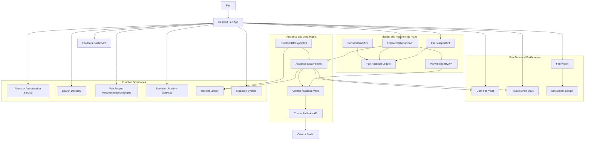

## 3. Transaction Packet Envelope

All workflows in this function use the shared packet envelope from `01-overall-system-architecture.md`, with these required fields.

| Field | Required meaning in this function |
| --- | --- |
| `fanIdentity` | `FanPassportClaim`, persona context, app session, and key state. |
| `appScope` | Certified app id, app capability scope, requested permissions, and app grant version. |
| `relationshipContext` | Creator id, follow state, `FollowVisibilityPolicy`, `PairwiseIdentityAPI` id, block state, tombstone state, and notification preferences. |
| `grantContext` | `AppPermissionGrant`, `ConsentGrantAPI`, `DataUseGrant`, `CampaignDataGrant`, `DirectContactGrant`, `CreatorInterestDataGrant`, creator-category defaults, revocation state, purpose, destination, ad-use flag, offer context, and retention. |
| `vaultContext` | Core Fan Vault scopes, Private Event Vault scopes, vault provider, data mode, and retention policy. |
| `interestContext` | Explicit interests, inferred interest tokens, liked/disliked content, disliked interests, disliked creators, muted providers, ad preferences, and feedback source/confidence. |
| `walletContext` | Fan Wallet account, payment intent, entitlement target, membership tier, allocation policy, and refund/chargeback state. |
| `dataRightsPolicy` | `AudienceDataFirewallPolicy`, `SensitiveRelationshipDefaultPolicy`, `CreatorAudienceExportPolicy`, and disclosure requirements. |
| `auditContext` | Correlation id, idempotency key, actor, timestamp, API version, certification scope, and receipt requirements. |

## 4. Interfaces And Contracts

| Interface or contract | Packet responsibility |
| --- | --- |
| `FanPassportAPI` | Create, resolve, update, recover, or migrate fan identity. |
| `FanPassportClaim` | Signed root identity claim, public keys, account pointers, vault pointers, and revocation state. |
| `FollowRelationshipAPI` | Create, update, revoke, or tombstone creator follow relationships. |
| `PairwiseIdentityAPI` | Produce creator-scoped fan identifiers and prevent broad cross-creator correlation. |
| `ConsentGrantAPI` | Create/revoke app, creator, campaign, AI, provider, and data-use grants. |
| `AppPermissionGrant` | Certified app access scope, duration, destination, and revocation behavior. |
| `DataUseGrant` | Purpose-bound private or sensitive data use. |
| `CampaignDataGrant` | Campaign-specific fan data-for-value grant. |
| `DirectContactGrant` | Explicit fan permission for creator direct contact or CRM export. |
| `CreatorDataGrantRequestAPI` | Creator request lifecycle for interests, likes, dislikes, creator dislikes, muted providers, and ad preferences. |
| `CreatorInterestDataGrant` | Fan-approved creator-scoped grant with approved fields, purpose, retention, ad-use flag, offer context, and revocation state. |
| `CreatorCategoryPermissionPolicy` | Fan defaults that allow, deny, narrow, or ask each time for creator categories. |
| `FollowVisibilityPolicy` | Fan-selected public, creator-visible, private, or pseudonymous/anonymous relationship visibility. |
| `CreatorRelationshipActionRecord` | Audit record for follow visibility changes, unfollows, blocks, direct-contact revocations, and deletion requests. |
| `CreatorScopedTombstoneRecord` | Minimal retained marker preventing rehydration of deleted creator-scoped relationship data. |
| `CreatorAudienceExportPolicy` | Field, destination, retention, watermarking, no-resale, revocation, and breach-notice rules for creator audience exports. |
| `SensitiveRelationshipDefaultPolicy` | Stricter defaults for minors, vulnerable users, sensitive creator categories, private mode, and regulated regions. |
| `CoreFanVaultAPI` | Read/write portable fan state, saves, preferences, notification state, app settings, explicit interests, dislikes, ad preferences, and blocks. |
| `PrivateEventVaultAPI` | Store richer behavior and AI/recommendation memory under strict scopes. |
| `FanInterestProfileAPI` | Manage fan-owned interests, disliked interests, liked/disliked creators, muted providers, source, confidence, and recency. |
| `FanAdPreferencesAPI` | Manage fan-owned ad preferences shown in Fan App settings and used only where grants allow. |
| `FanWalletAPI` | Memberships, subscriptions, tips, paid content, events, premium modes, boosts, and AI credits. |
| `EntitlementLedgerAPI` | Signed access rights for paid and premium experiences. |
| `CreatorAudienceAPI` | Creator-scoped audience records and analytics state. |
| `PermissionedAudienceInterestDataAPI` | Creator-side query surface returning only approved creator-scoped fan interest/ad-preference fields or aggregate counts. |
| `CreatorCRMExportAPI` | Permissioned creator audience export and direct-contact eligibility. |
| `AudienceDataFirewallPolicy` | Boundary policy among fan private data, creator audience data, providers, sponsors, apps, extensions, and AI. |
| `DataAccessReceipt` | Audit evidence for grant-protected data access. |
| `DataDashboard` | Fan-facing visibility, grant, access history, export, delete, dispute, and report controls. |

## 5. Workflow Transaction Packet Models

### 5.1 Fan Identity, Relationship, And Portability

| Ref | Trigger | Packet path | Required packet context | Durable writes / receipts | Completion response |
| --- | --- | --- | --- | --- | --- |
| `03/W1`: Fan onboarding and first follow | Fan opens a certified app, creates/resolves passport, and follows creator. | Fan -> Fan App -> `FanPassportAPI` -> `FollowRelationshipAPI` -> `PairwiseIdentityAPI` -> Audience Data Firewall -> `CreatorAudienceAPI` -> Core Fan Vault. | `fanIdentity`, app id, creator id, persona, `FollowVisibilityPolicy`, notification preference, privacy mode, idempotency key. | `FanPassportClaim` if new, follow record, pairwise id, creator audience record, Core Fan Vault preference state, optional `CreatorRelationshipActionRecord`. | Fan sees followed creator and available content; creator receives only allowed creator-scoped audience state. |
| `03/W1A`: Fan revokes or limits creator relationship data | Fan changes relationship visibility, revokes contact, unfollows, blocks, or requests tombstoning. | Fan -> Fan App/Data Dashboard -> `FollowRelationshipAPI` and `ConsentGrantAPI` -> Audience Data Firewall -> `CreatorAudienceAPI` and `CreatorCRMExportAPI`. | Existing follow id, action type, `FollowVisibilityPolicy`, `DirectContactGrant` revocation, block/delete request, retention policy. | `CreatorRelationshipActionRecord`; optional `CreatorScopedTombstoneRecord`; updated Creator Audience Vault state; optional `DataAccessReceipt` for protected access. | Fan sees updated state; Creator Studio/export systems lose future access to restricted relationship data. |
| `03/W8`: Cross-app switch | Fan signs into another certified app and grants scoped access. | Fan -> Fan App B -> `FanPassportAPI` -> `AppPermissionGrant` -> Core Fan Vault -> Entitlement Ledger -> Creator Audience Vault where needed. | `FanPassportClaim`, requested scopes, source app revocation state, destination app certification scope, vault scopes. | New app grant; no duplicate fan identity; optional app preference write. | Fan sees permitted follows, saves, entitlements, wallet state, and privacy settings in the new app. |
| `05/W1`: Fan Passport creation | Fan creates a portable identity. | Fan -> Fan App -> `FanPassportAPI` -> Fan Passport Ledger -> Core Fan Vault provisioning. | Fan account/auth context, keys, recovery options, default persona, default privacy policy, vault provider. | `FanPassportClaim`, recovery state, default persona, vault pointers, app grant if app access approved. | Fan receives portable identity and default vault state. |
| `05/W2`: Follow creator with pairwise identity | Fan taps follow. | Fan App -> `FollowRelationshipAPI` -> `SensitiveRelationshipDefaultPolicy` -> `PairwiseIdentityAPI` -> `CreatorAudienceAPI`. | Fan passport id, creator id, selected `FollowVisibilityPolicy`, persona, notification preference, direct-contact choice. | Follow record, creator-scoped pairwise id, Creator Audience Vault relationship state, `CreatorRelationshipActionRecord`. | Creator sees follower/member status only according to policy; fan can later revoke/block/tombstone. |
| `05/W4`: App permission grant and revoke | App requests fan data scopes, or fan revokes them. | Fan App -> `ConsentGrantAPI` / `AppPermissionGrant` -> Core Fan Vault / Private Event Vault -> Audience Data Firewall. | App id, requested scopes, purpose, duration, destination, data classes, revocation behavior. | Grant or revocation record; optional `DataAccessReceipt` for grant-protected access. | App receives allowed data or loses future access; portable state remains with fan. |
| `15/W1`: App login and permission grant | Fan logs into a certified app. | Fan -> Fan App -> `FanPassportAPI` -> `ConsentGrantAPI` -> `CoreFanVaultAPI` -> `PrivateEventVaultAPI` if explicit scope exists. | App certification scope, requested app permissions, fan passport, vault scope, retention and destination. | App grant, purpose-bound `DataUseGrant`, optional `DataAccessReceipt`. | App renders permitted follows, preferences, entitlements, and controls without owning fan identity. |
| `15/W1A`: Certified app relationship controls | Fan uses any certified app to change relationship settings. | Fan App -> `FollowRelationshipAPI` / `ConsentGrantAPI` -> Audience Data Firewall -> `CreatorAudienceAPI` / `CreatorCRMExportAPI`. | Current follow state, selected visibility/contact/block/delete action, app certification scope. | `CreatorRelationshipActionRecord`, possible `CreatorScopedTombstoneRecord`, updated creator audience/export eligibility. | Relationship controls apply network-wide, not just inside one app. |

### 5.2 Wallet, Entitlements, Memberships, And Fan Support

| Ref | Trigger | Packet path | Required packet context | Durable writes / receipts | Completion response |
| --- | --- | --- | --- | --- | --- |
| `03/W4`: Membership purchase and access | Fan buys a creator membership and opens member content. | Fan App -> Fan Wallet -> Payment Provider -> Entitlement Ledger -> Playback Authorization -> Receipt Ledger. | Fan passport, creator id, membership tier, price, region, payment method, refund policy. | `PaymentReceipt`, `MembershipEntitlement`, subscription record, membership receipt, access check. | Fan can access member content; creator settlement receives membership evidence. |
| `03/W13`: Wallet support allocation and boosts | Fan views premium allocation or sends boost/tip/support. | Fan App -> `FanWalletAPI` -> Entitlement Ledger / Receipt Ledger -> Settlement Engine boundary. | Fan identity, creator id, support type, amount, allocation policy, disclosure rules. | Payment/support receipt, optional boost entitlement, fan allocation statement reference. | Fan sees support confirmation and allocation; settlement function handles payout. |
| `05/W3`: Wallet purchase and entitlement | Fan buys membership, paid content, event, AI credits, or premium mode. | Fan Wallet -> Payment Provider -> `EntitlementLedgerAPI` -> Receipt Ledger -> Fan App. | Product id, access mode, price, tax/payment context, entitlement class, fan passport. | `PaymentReceipt`, entitlement claim, subscription state where applicable, refund/chargeback hooks. | Fan receives access right; downstream playback/app surfaces can verify entitlement. |
| `09/W3B` boundary: Paid private mode | Fan purchases stricter data mode. | Fan App -> Fan Wallet -> Entitlement Ledger -> Audience Data Firewall -> Private Event Vault. | Private mode product, fan data mode, vault policy, payment state. | `PrivateVaultEntitlement`, `PaymentReceipt`, `VaultServiceReceipt` where applicable. | Data mode defaults narrow, raw behavior remains inside stricter vault boundaries. |

### 5.3 Vaults, Private Data, Grants, And Data Rights

| Ref | Trigger | Packet path | Required packet context | Durable writes / receipts | Completion response |
| --- | --- | --- | --- | --- | --- |
| `03/W7`: Fan revokes app, campaign, or creator data access | Fan revokes an app, campaign, AI, creator interest-data, category default, sponsor-linked, or provider grant. | Data Dashboard -> `ConsentGrantAPI` / `CreatorCategoryPermissionPolicy` -> Audience Data Firewall -> affected vault/API providers. | Grant id or category id, actor, approved fields, purpose, destination, ad-use flag, revocation time, retained-record policy. | Grant revocation record; optional `DataAccessReceipt` or revocation audit record. | Future access is denied; retained receipts and legal/safety exceptions remain visible. |
| `03/W10`: Premium private data mode | Fan selects paid/private data mode. | Fan App -> Fan Wallet -> Entitlement Ledger -> Audience Data Firewall -> Core Fan Vault / Private Event Vault. | Fan passport, selected mode, payment entitlement, current grants, private ranking/AI defaults. | `PrivateVaultEntitlement`, narrowed grant defaults, vault policy update, optional `VaultServiceReceipt`. | App, AI, recommendations, and campaign surfaces use stricter defaults. |
| `05/W5`: Private event storage and AI memory | Fan behavior or AI memory is stored under purpose-bound scopes. | Fan App / AI boundary -> `PrivateEventVaultAPI` -> Audience Data Firewall -> optional AI Gateway. | Event type, retention class, fan privacy mode, AI memory policy, `DataUseGrant` if access is requested. | Private event record; optional AI memory record; `DataAccessReceipt` if accessed by tool/provider. | Private behavior is available only through permitted in-vault or purpose-bound access. |
| `05/W6`: Campaign data grant | Fan joins campaign and grants campaign-specific data. | Fan App -> `CampaignDataGrant` / `ConsentGrantAPI` -> Audience Data Firewall -> Campaign Ledger / Creator Audience Vault. | Campaign id, sponsor disclosure, data fields, purpose, reward, alternate entry, age/region rules. | `CampaignDataGrant`, campaign participation state, optional `DataAccessReceipt`. | Campaign receives only permitted data; fan can revoke future access. |
| `05/W7`: Fan export or migration | Fan requests export or vault/provider migration. | Data Dashboard -> `FanExportAPI` / `VaultExportAPI` / `MigrationPlanAPI` -> vault providers -> Migration System. | Export scope, portability class, destination provider, privacy policy, retained-record exceptions. | Export package, migration plan, `MigrationReceipt` where migration occurs. | Fan receives portable identity/vault/permission/entitlement export or migration plan. |
| `14/W1`: App data grant | App requests data access. | Fan App -> `ConsentGrantAPI` -> Audience Data Firewall -> Core Fan Vault / Private Event Vault -> Receipt Ledger. | Scope, purpose, duration, destination, app certification, data class. | `DataUseGrant`, optional `DataAccessReceipt`, grant version. | App receives only permitted data; fan can revoke future access. |
| `14/W2`: Creator analytics | Creator requests segment or analytics. | Creator Studio -> `CreatorAudienceAPI` -> Audience Data Firewall -> Creator Audience Vault / Private Event Vault -> Receipt Ledger. | Creator id, analytics purpose, segment definition, aggregate/private boundary, fan privacy mode. | Aggregate query record; `DataAccessReceipt` if protected private data is used. | Creator sees creator-scoped analytics without raw cross-creator fan history. |
| `14/W2A`: Creator relationship visibility and revocation | Fan changes relationship state. | Fan App -> `FollowRelationshipAPI` -> Audience Data Firewall -> `CreatorAudienceAPI` -> Creator Studio. | Follow id, visibility/contact/block/delete action, retention rules. | `CreatorRelationshipActionRecord`, optional tombstone, updated audience/export eligibility. | Creator tools and future exports reflect the restricted state. |
| `14/W2B`: Creator CRM export and direct-contact gating | Creator requests direct-message, CRM sync, or export. | Creator Studio -> `CreatorCRMExportAPI` -> Audience Data Firewall -> `CreatorAudienceAPI` -> Receipt Ledger -> Data Dashboard. | Creator id, segment id, purpose, destination, retention, `DirectContactGrant`, `CreatorAudienceExportPolicy`. | `DataAccessReceipt`, export log, denied-record aggregate counts, access history. | Creator receives only eligible fields; fan access/export history updates where disclosure is required. |
| `14/W2C`: Creator interest-data grant for ads and promotions | Creator requests fan interests, likes, dislikes, disliked creators, muted providers, or ad preferences. | Creator Studio -> `CreatorDataGrantRequestAPI` -> Fan App Settings/Data Dashboard -> `ConsentGrantAPI` -> Audience Data Firewall -> `PermissionedAudienceInterestDataAPI` -> Receipt Ledger. | Creator id, requested fields, purpose, retention, ad-use flag, offer context, creator category, fan category defaults, privacy mode. | `CreatorInterestDataGrant` or denial, category policy update if selected, `DataAccessReceipt` for allowed access. | Fan sees request/grant state; creator receives only approved creator-scoped fields or aggregate counts. |
| `14/W3`: Campaign data grant | Fan accepts campaign data exchange. | Fan App -> Campaign Extension -> `CampaignDataGrant` -> Audience Data Firewall -> Campaign Ledger / Reward Ledger. | Campaign id, sponsor, reward, eligibility, alternate entry, requested fields. | `CampaignDataGrant`, `CampaignEntryReceipt`, optional `RewardReceipt`, optional `DataAccessReceipt`. | Fan enters campaign or alternate route; sponsor/creator get only permitted reporting. |
| `14/W4`: Data mode selection and premium private mode | Fan chooses free personalized, no-ad premium, or premium private. | Fan App -> Fan Wallet / Entitlement Ledger -> Audience Data Firewall -> Private Event Vault / AI / Recommendation boundaries. | Selected mode, entitlement, existing grants, AI memory policy, recommendation policy. | Entitlement if paid, data mode policy update, vault service funding record if applicable. | Data access defaults, AI training/memory, ads, and recommendations follow selected mode. |
| `14/W5`: Data export/delete | Fan requests export, migration, deletion, or tombstoning. | Data Dashboard -> `FanExportAPI` / `VaultDeleteAPI` / `MigrationPlanAPI` -> vault providers -> Governance boundary. | Data scope, vaults, portability class, delete/tombstone selection, retained-record exceptions. | Export package, deletion/tombstone records, migration/export receipt, dispute evidence if failure. | Fan sees completed export/delete state and any retained audit/safety/settlement exceptions. |

### 5.4 Fan App Shell Boundary Flows

| Ref | Trigger | Packet path | Required packet context | Durable writes / receipts | Completion response |
| --- | --- | --- | --- | --- | --- |
| `03/W12`: Multi-format creator engagement | Fan opens a creator surface with videos, posts, events, memberships, campaigns, and community features. | Fan App -> Public Catalog / Creator Metadata Host -> Entitlement Ledger -> Audience Data Firewall -> domain services. | Fan identity, creator id, content type, access mode, privacy mode, entitlements. | Domain-specific receipts from playback, campaign, event, or commerce functions. | Fan sees a coherent creator surface across content types without separate identities. |
| `15/W2`: Content rendering and playback | Fan App renders channel/content and starts playback. | Fan App -> Public Catalog -> Creator Metadata Host -> Playback Authorization -> Content Host boundary. | App certification, content id, manifest versions, entitlement refs, safety labels. | Playback/ad/delivery receipts handled by playback architecture. | App renders content according to manifests and starts authorized playback. |
| `15/W3`: App search and intent-based recommendation | Fan App invokes search, startup tile, and recommendation surfaces. | Fan App -> `StartupTileSurfaceAPI` / `SessionIntentAPI` / Search Directory / Fan Scoped Recommendation Engine -> Public Catalog / Creator manifests. | Fan settings, privacy mode, query, selected `ContentTile`, `FanInterestProfile`, dislike filters, `SessionIntent`, neutral/search vs recommendation boundary. | Session intent state, tile/interest feedback, `SearchReceipt`, or `DiscoveryReceipt` handled by search/recommendation architecture. | App shows search results or trusted recommendations with platform-intent disclosures, score explanations, and feedback controls. |
| `15/W4`: Extension rendering | Fan App renders a certified extension. | Fan App -> Extension Runtime Gateway -> Extension Registry -> Audience Data Firewall -> domain ledgers. | Extension id/version, artifact signature, permissions, grants, fan app certification. | Extension/campaign/data-access receipts handled by extension/campaign architecture. | Extension renders or fails closed if certification, artifact, or grant checks fail. |

## 6. Step-By-Step Life Of A Packet Overlays

These overlays expand the transaction summaries above. Boundary steps that enter playback, search, recommendation, campaign, extension, AI, settlement, or migration systems stop at the receiving function and will be expanded in that function's architecture packet doc.

### 6.1 `03/W1`: Fan Onboarding And First Follow

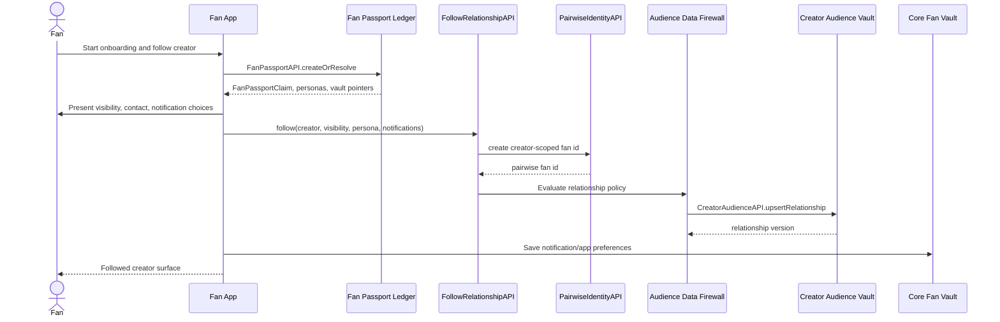

1. Fan opens a certified Fan App; packet starts with app id, device/session context, requested scopes, and creator discovery source.
2. Fan App calls `FanPassportAPI.createOrResolve`.
3. Fan Passport Ledger returns `FanPassportClaim`, key state, persona defaults, and vault pointers.
4. Fan App presents follow visibility, notification, persona, and direct-contact options.
5. Fan App calls `FollowRelationshipAPI.follow` with creator id, selected `FollowVisibilityPolicy`, persona, notification preference, and idempotency key.
6. `FollowRelationshipAPI` calls `SensitiveRelationshipDefaultPolicy` and `PairwiseIdentityAPI`.
7. `PairwiseIdentityAPI` returns a creator-scoped fan id.
8. Audience Data Firewall checks visibility, grants, blocks, and tombstone state, then calls `CreatorAudienceAPI.upsertRelationship`.
9. Creator Audience Vault writes allowed creator-scoped relationship state and returns a relationship version.
10. Fan App writes notification/app preferences to Core Fan Vault and returns the followed creator surface to the fan.

### 6.2 `03/W1A`: Fan Revokes Or Limits Creator Relationship Data

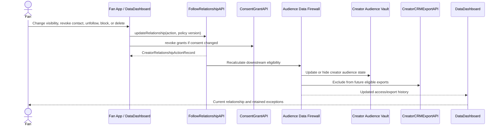

1. Fan opens relationship settings from Fan App or `DataDashboard`.
2. Fan chooses visibility change, direct-contact revocation, unfollow, block, or creator-scoped deletion.
3. Fan App calls `FollowRelationshipAPI.updateRelationship` with follow id, action, policy version, and idempotency key.
4. If consent changed, Fan App also calls `ConsentGrantAPI.revoke` for `DirectContactGrant` or related creator/app grants.
5. `FollowRelationshipAPI` writes `CreatorRelationshipActionRecord`.
6. Audience Data Firewall recalculates creator, sponsor, app, extension, analytics, and export eligibility.
7. `CreatorAudienceAPI` updates Creator Audience Vault state; `CreatorCRMExportAPI` excludes newly ineligible records.
8. If deletion is requested, `CreatorScopedTombstoneRecord` is written.
9. `DataDashboard` shows updated visibility, retained-record exceptions, export/access history, and report/dispute options.

### 6.3 `03/W4`: Membership Purchase And Access

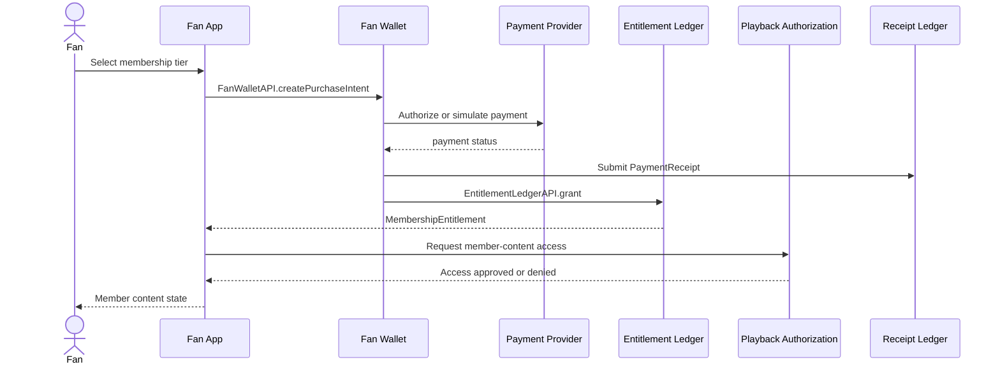

1. Fan selects creator membership tier in Fan App.
2. Fan App calls `FanWalletAPI.createPurchaseIntent` with creator id, tier id, price, region, and fan passport.
3. Fan Wallet calls the payment provider or prototype payment simulator.
4. Payment provider returns payment success, failure, or pending state.
5. Fan Wallet writes `PaymentReceipt` and calls `EntitlementLedgerAPI.grant`.
6. Entitlement Ledger creates `MembershipEntitlement` and subscription state.
7. Fan App requests member content through Playback Authorization.
8. Playback Authorization checks `ContentManifest`, membership entitlement, and safety policy.
9. Fan App receives access approval; playback and settlement receipts are handled in the playback/settlement architecture doc.

### 6.4 `03/W7`: Fan Revokes App, Campaign, Or Creator Data Access

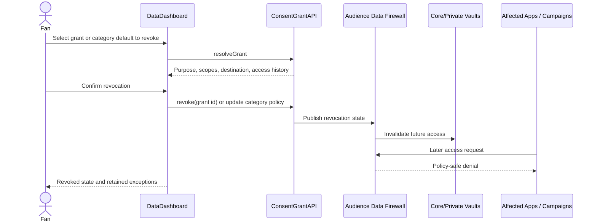

1. Fan opens `DataDashboard` and selects an app, campaign, AI tool, creator interest-data grant, creator-category default, provider, or sponsor grant.
2. `DataDashboard` calls `ConsentGrantAPI.resolveGrant` to show purpose, scopes, destination, ad-use flag, offer context, retention, and access history.
3. Fan confirms revocation.
4. `ConsentGrantAPI.revoke` writes the revocation state and effective time.
5. Audience Data Firewall invalidates future access for affected vault scopes, campaign data, app reads, direct-contact paths, or creator interest/ad-preference fields.
6. Affected API calls receive policy-safe denial after the effective time.
7. Existing required receipts, safety records, settlement records, and legal exceptions remain retained and visible.
8. If the revoked grant affected a campaign or app surface, Fan App refreshes UI and removes unavailable features.

### 6.5 `03/W8`: Cross-App Switch

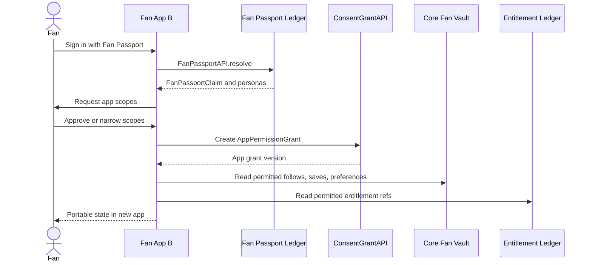

1. Fan opens Fan App B and chooses Fan Passport sign-in.
2. Fan App B calls `FanPassportAPI.resolve`.
3. Fan Passport Ledger returns `FanPassportClaim`, identity status, and available personas.
4. Fan App B declares requested scopes through `AppPermissionGrant`.
5. Fan approves or narrows scopes.
6. `ConsentGrantAPI` records app grant state.
7. Fan App B reads permitted follows, saves, app settings, and wallet display state from Core Fan Vault.
8. Fan App B reads entitlement references from Entitlement Ledger where scope allows.
9. Fan App B renders the same creator relationships without owning or duplicating the fan identity graph.
10. Fan may revoke Fan App A separately without changing portable follow or entitlement state.

### 6.6 `03/W10`: Premium Private Data Mode

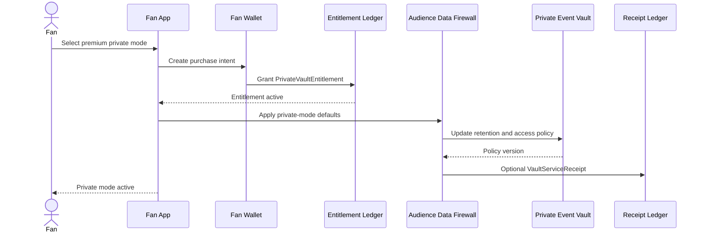

1. Fan selects premium private mode in Fan App.
2. Fan App calls `FanWalletAPI.createPurchaseIntent`.
3. Fan Wallet records payment result and calls `EntitlementLedgerAPI.grant`.
4. Entitlement Ledger creates `PrivateVaultEntitlement`.
5. Fan App calls Audience Data Firewall to apply private-mode defaults.
6. Audience Data Firewall narrows default grants, ad personalization, AI memory, recommendation access, and external private-context use.
7. Private Event Vault updates retention and access policy.
8. Optional `VaultServiceReceipt` records utility funding for private vault operations.
9. Fan App shows private mode state and explains retained receipt/safety exceptions.

### 6.7 `03/W12`: Multi-Format Creator Engagement

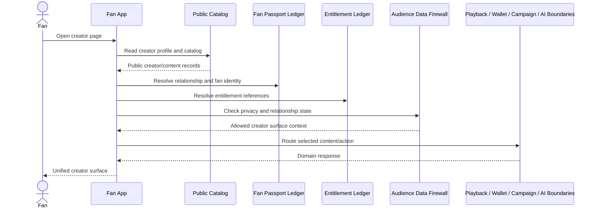

1. Fan opens a creator page in Fan App.
2. Fan App reads public creator profile and content catalog from Public Catalog or Creator Metadata Host projection.
3. Fan App resolves fan identity and entitlement references.
4. Fan App checks relationship state and privacy mode with Fan Passport Ledger and Audience Data Firewall where needed.
5. For videos or posts, Fan App hands off to playback/content rendering boundary.
6. For memberships or paid products, Fan App hands off to Fan Wallet and Entitlement Ledger.
7. For campaigns, Fan App hands off to Extension Runtime and Campaign Ledger.
8. For AI archive Q&A or recommendations, Fan App hands off to AI/search/recommendation boundaries.
9. Fan App keeps a single coherent creator surface while preserving the same fan identity and privacy controls.

### 6.8 `03/W13`: Wallet Support Allocation And Boosts

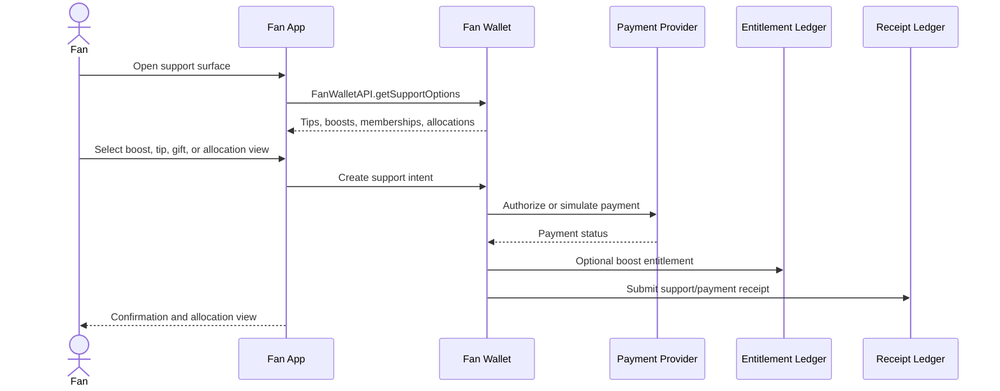

1. Fan opens wallet/support surface for a creator.
2. Fan App calls `FanWalletAPI.getSupportOptions`.
3. Fan Wallet returns tips, boosts, memberships, premium allocation visibility, and applicable disclosures.
4. Fan selects boost, tip, gift, or views allocation.
5. Fan Wallet creates payment or support intent.
6. Payment provider/simulator returns status.
7. Fan Wallet writes payment/support receipt and optional boost entitlement.
8. Receipt Ledger accepts support receipt.
9. Fan App shows confirmation; Settlement Engine allocation is handled by the monetization/settlement architecture doc.

### 6.9 `05/W1`: Fan Passport Creation

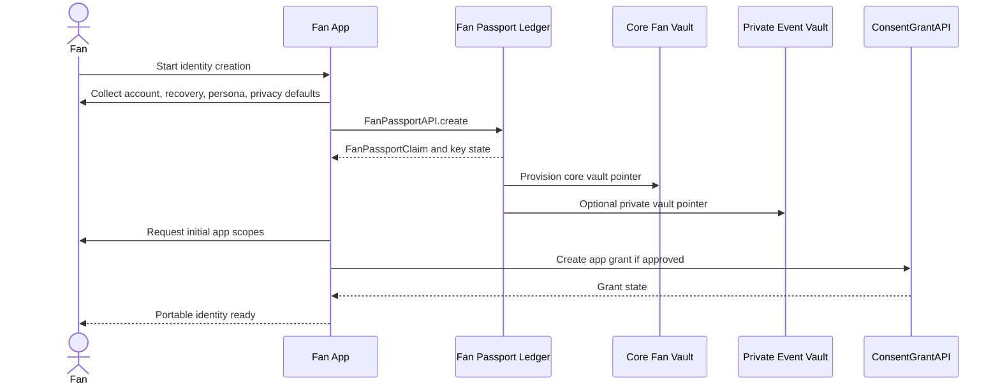

1. Fan starts identity creation in a certified Fan App.
2. Fan App collects account method, recovery preference, initial persona, and default privacy mode.
3. Fan App calls `FanPassportAPI.create`.
4. Fan Passport Ledger creates key records, `FanPassportClaim`, account pointers, and revocation status.
5. Fan Passport Ledger provisions Core Fan Vault pointer and optional Private Event Vault pointer.
6. Fan App requests initial app scopes.
7. `ConsentGrantAPI` creates app grant if approved.
8. Fan App receives identity, vault pointers, default persona, and grant state.
9. Fan can now follow, buy, save, search, and use compatible certified apps.

### 6.10 `05/W2`: Follow Creator With Pairwise Identity

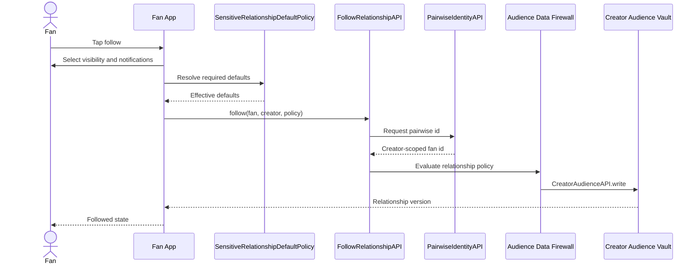

1. Fan taps follow on a creator surface.
2. Fan App asks fan to select `FollowVisibilityPolicy` and notification preference.
3. `SensitiveRelationshipDefaultPolicy` adjusts defaults for protected classes, private mode, sensitive categories, or regulated regions.
4. Fan App calls `FollowRelationshipAPI.follow`.
5. `FollowRelationshipAPI` writes follow state in Fan Passport Ledger.
6. `PairwiseIdentityAPI` returns creator-scoped fan id.
7. Audience Data Firewall evaluates visibility, block, contact, and tombstone constraints.
8. `CreatorAudienceAPI` writes creator-scoped audience state.
9. `CreatorRelationshipActionRecord` records lifecycle evidence.
10. Fan App shows followed state; Creator Studio receives only allowed audience signal.

### 6.11 `05/W3`: Wallet Purchase And Entitlement

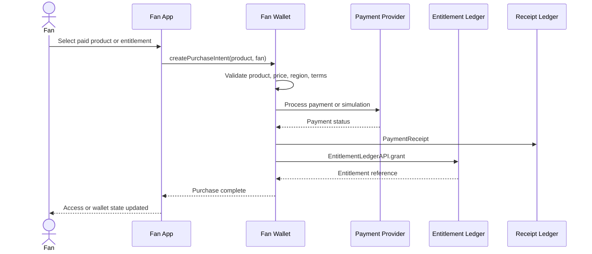

1. Fan selects membership, paid content, event, AI credits, premium mode, bundle, or gift.
2. Fan App calls `FanWalletAPI.createPurchaseIntent`.
3. Fan Wallet validates product, price, region, refund terms, and fan identity.
4. Fan Wallet calls payment provider or simulator.
5. Payment provider returns authorized, failed, pending, refunded, or chargeback status.
6. Fan Wallet creates `PaymentReceipt`.
7. Fan Wallet calls `EntitlementLedgerAPI.grant` for the purchased access right.
8. Entitlement Ledger writes entitlement claim and returns entitlement reference.
9. Fan App updates wallet UI and downstream access checks use the entitlement reference.

### 6.12 `05/W4`: App Permission Grant And Revoke

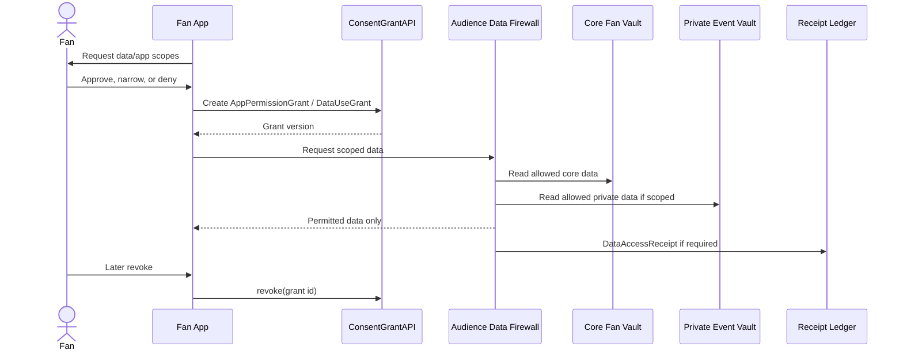

1. Certified app requests scopes for identity, follows, saves, wallet display, private data, notifications, or extension runtime.
2. Fan App displays purpose, duration, destination, and revocation behavior.
3. Fan approves, narrows, or denies.
4. Fan App calls `ConsentGrantAPI.create` or `AppPermissionGrant.create`.
5. Audience Data Firewall records allowed vault and data classes.
6. App reads permitted state from Core Fan Vault or Private Event Vault.
7. If grant-protected private data is accessed, `DataAccessReceipt` is submitted to Receipt Ledger.
8. On revocation, `ConsentGrantAPI.revoke` changes future access and apps receive policy-safe denial.

### 6.13 `05/W5`: Private Event Storage And AI Memory

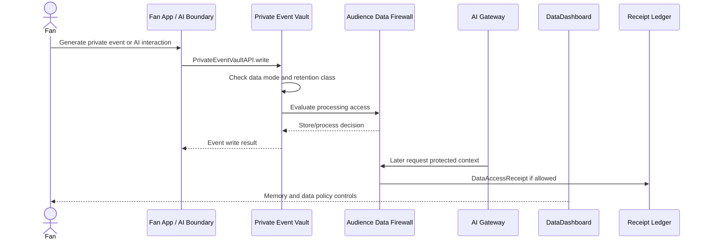

1. Fan action, recommendation feedback, search history, watch/read event, or AI interaction produces a private event packet.
2. Fan App or AI boundary calls `PrivateEventVaultAPI.write`.
3. Private Event Vault checks fan data mode, retention class, and allowed event type.
4. Audience Data Firewall evaluates whether any app/provider/tool can read or process the event.
5. Private Event Vault stores event or rejects it according to policy.
6. If AI memory is enabled, AI memory policy writes limited memory metadata.
7. If a provider/tool later accesses protected context, Audience Data Firewall requires `DataUseGrant` and creates `DataAccessReceipt`.
8. Fan can view or revoke memory/data policy through `DataDashboard`.

### 6.14 `05/W6`: Campaign Data Grant

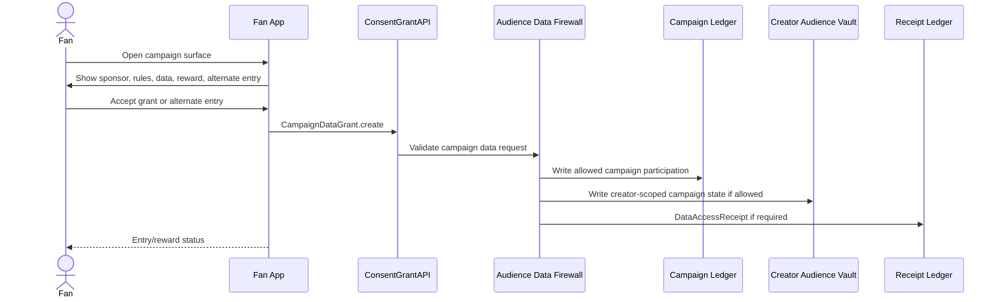

1. Fan opens campaign surface in Fan App.
2. Fan App displays sponsor disclosure, campaign rules, requested data, reward, eligibility, and alternate entry.
3. Fan accepts requested campaign data grant or chooses alternate entry.
4. Fan App calls `CampaignDataGrant.create` through `ConsentGrantAPI`.
5. Audience Data Firewall validates requested fields, purpose, duration, destination, and fan privacy mode.
6. Allowed campaign state is written to Creator Audience Vault or Campaign Ledger boundary.
7. `DataAccessReceipt` is created if grant-protected access occurs.
8. Fan App shows campaign entry/reward status; campaign execution continues in sponsor/extension architecture.

### 6.15 `05/W7`: Fan Export Or Migration

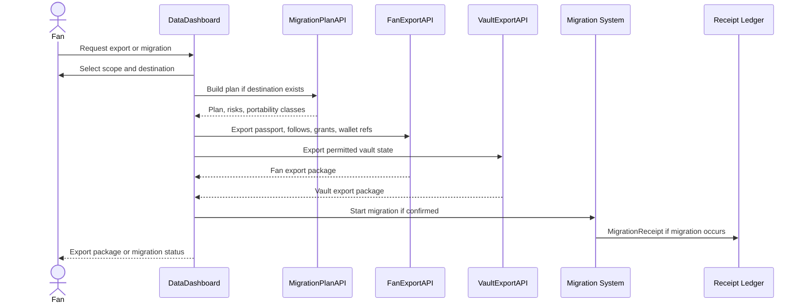

1. Fan opens export or migration controls in `DataDashboard`.
2. Fan selects identity, vault, permission, entitlement, app settings, or full package export.
3. `DataDashboard` calls `MigrationPlanAPI` when a destination provider is involved.
4. Export planner classifies canonical portable state, required export state, optional export state, and retained non-exportable records.
5. `FanExportAPI` exports Fan Passport records, follows, grants, wallet/entitlement refs, and vault pointers.
6. `VaultExportAPI` exports permitted Core Fan Vault and Private Event Vault state according to policy.
7. `MigrationReceipt` is created if provider migration occurs.
8. Fan receives export package or migration plan; failures route to governance/dispute boundary.

### 6.16 `14/W1`: App Data Grant

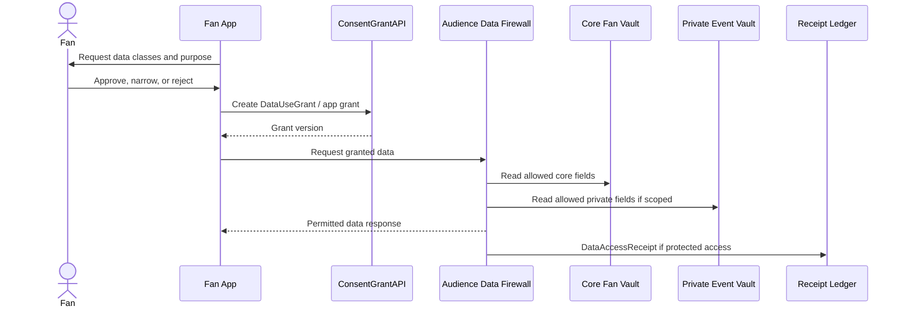

1. App requests access to fan data classes.
2. Fan App shows requested data, purpose, duration, destination, app identity, and certification scope.
3. Fan approves, narrows, or rejects.
4. `ConsentGrantAPI.create` writes `DataUseGrant` and app grant state.
5. Audience Data Firewall evaluates vault, data class, policy, and app certification.
6. Core Fan Vault or Private Event Vault returns only permitted data.
7. `DataAccessReceipt` is submitted to Receipt Ledger when protected private or sensitive data is accessed.
8. Fan can later revoke future access from `DataDashboard`.

### 6.17 `14/W2`: Creator Analytics

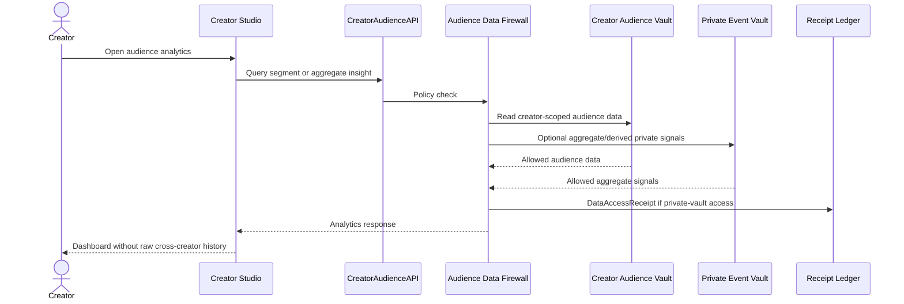

1. Creator opens audience dashboard in Creator Studio.
2. Creator requests segment, aggregate insight, or creator-scoped activity report.
3. Creator Studio calls `CreatorAudienceAPI.query`.
4. `CreatorAudienceAPI` sends policy check to Audience Data Firewall.
5. Audience Data Firewall checks creator-scoped rights, fan privacy mode, grants, relationship visibility, and private-event boundaries.
6. Creator Audience Vault returns allowed creator-scoped data.
7. Private Event Vault contributes only permitted aggregate or derived signals when allowed.
8. `DataAccessReceipt` is created if protected private-vault access occurs.
9. Creator Studio displays analytics without raw cross-creator fan history.

### 6.18 `14/W2A`: Creator Relationship Visibility And Revocation

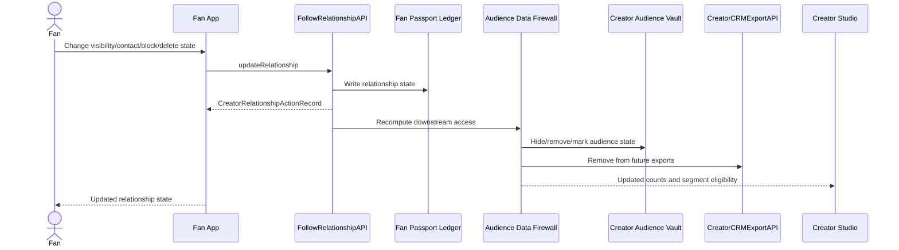

1. Fan initiates visibility change, unfollow, block, direct-contact revocation, or deletion.
2. Fan App calls `FollowRelationshipAPI.update`.
3. Fan Passport Ledger updates relationship state.
4. `CreatorRelationshipActionRecord` records lifecycle event.
5. Audience Data Firewall recomputes what creator, app, extension, sponsor, analytics, and export systems can access.
6. `CreatorAudienceAPI` hides, removes, or marks state in Creator Audience Vault according to policy.
7. `CreatorCRMExportAPI` excludes no-longer-eligible fan records.
8. Optional `CreatorScopedTombstoneRecord` prevents rehydration of deleted relationship state.
9. Creator Studio sees count/segment updates without restricted fan data.

### 6.19 `14/W2B`: Creator CRM Export And Direct-Contact Gating

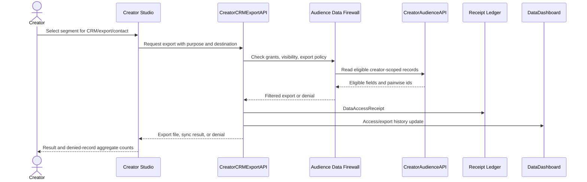

1. Creator selects segment for direct message, CRM sync, or audience export.
2. Creator Studio submits purpose, destination, retention, and requested fields to `CreatorCRMExportAPI`.
3. `CreatorCRMExportAPI` calls Audience Data Firewall.
4. Audience Data Firewall checks `FollowVisibilityPolicy`, `DirectContactGrant`, `CreatorAudienceExportPolicy`, block state, revocation state, and tombstones.
5. `CreatorAudienceAPI` returns only eligible creator-scoped fields and pairwise ids.
6. Denied records are omitted or counted only in aggregate.
7. `DataAccessReceipt` records actor, provider key, grant id, purpose, destination, retention, and dispute reference.
8. `DataDashboard` shows fan-visible export/access history where required.
9. Creator Studio receives export file, CRM sync result, or policy-safe denial.

### 6.20 `14/W2C`: Creator Interest-Data Grant For Ads And Promotions

```mermaid
sequenceDiagram
  actor C as Creator
  participant CS as Creator Studio
  participant CDR as CreatorDataGrantRequestAPI
  actor F as Fan
  participant DD as Fan App Settings / DataDashboard
  participant CG as ConsentGrantAPI
  participant Vault as Core Fan Vault
  participant ADF as Audience Data Firewall
  participant AID as PermissionedAudienceInterestDataAPI
  participant RL as Receipt Ledger

  C->>CS: Create data-for-value offer
  CS->>CDR: Request fields, purpose, retention, ad-use flag
  CDR->>DD: Deliver pending creator request
  DD->>F: Show fields, offer, sponsor context, category default option
  F->>DD: Approve, narrow, deny, or apply category default
  DD->>CG: Create creator_interest_data grant or denial
  CG->>Vault: Store grant, category policy, ad preference state
  CS->>AID: Query approved interest/ad-preference fields
  AID->>ADF: Enforce grant, category, privacy, age, block policies
  ADF->>Vault: Read approved fan data fields
  Vault-->>ADF: Approved fields only
  ADF-->>AID: Creator-scoped records or aggregate counts
  AID->>RL: DataAccessReceipt
  AID-->>CS: Allowed fields/counts or denial
  DD-->>F: Updated grants, ad preferences, access history
```

1. Creator Studio creates an `AudienceDataGrantRequest` with requested fields, creator category, purpose, retention, ad-use flag, sponsor/offer context, and alternate path where required.
2. `CreatorDataGrantRequestAPI` delivers the pending request to Fan App settings and any relevant campaign or promotion surface.
3. Fan reviews requested interests, likes, dislikes, disliked creators, muted providers, ad preferences, value exchange, and category-default option.
4. Fan approves, denies, narrows fields, revokes an existing grant, or applies a creator-category default.
5. `ConsentGrantAPI` records a `creator_interest_data` grant or denial; Core Fan Vault stores active grants, category policies, ad preferences, and access history.
6. When Creator Studio later queries approved data, `PermissionedAudienceInterestDataAPI` calls Audience Data Firewall.
7. Audience Data Firewall applies privacy mode, age/region policy, sensitive-category defaults, relationship state, blocks, disliked creators, category policy, grant scope, purpose, retention, and ad-use flag.
8. Core Fan Vault returns only approved creator-scoped fields; raw Private Event Vault behavior is never exported.
9. `DataAccessReceipt` records actual grant-protected access.
10. Fan App settings shows pending requests, grants, ad preferences, interests/dislikes, disliked creators, revocation controls, and access history.

### 6.21 `14/W3`: Campaign Data Grant

```mermaid
sequenceDiagram
  actor F as Fan
  participant FA as Fan App / Extension
  participant CG as ConsentGrantAPI
  participant ADF as Audience Data Firewall
  participant CL as Campaign Ledger
  participant RWL as Reward Ledger
  participant RL as Receipt Ledger

  F->>FA: Open sponsored campaign
  FA->>F: Show terms, reward, data request, alternate entry
  F->>FA: Accept CampaignDataGrant or alternate entry
  FA->>CG: Create campaign grant
  CG->>ADF: Validate requested data
  ADF->>CL: Write campaign entry/participation
  CL->>RL: CampaignEntryReceipt
  RWL->>RL: RewardReceipt if reward occurs
  FA-->>F: Campaign and reward status
```

1. Fan opens campaign with sponsor disclosure and reward terms.
2. Fan App or extension requests campaign-specific data.
3. Fan accepts `CampaignDataGrant` or chooses alternate entry.
4. Audience Data Firewall evaluates requested fields, purpose, eligibility, age/region rules, and private mode.
5. Allowed campaign participation is written to Creator Audience Vault or Campaign Ledger boundary.
6. `DataAccessReceipt` records protected access where applicable.
7. Campaign Ledger creates `CampaignEntryReceipt` when entry is completed.
8. Reward Ledger creates `RewardReceipt` where reward issuance or redemption occurs.
9. Fan sees campaign and reward status; sponsor reporting is handled by sponsor architecture.

### 6.22 `14/W4`: Data Mode Selection And Premium Private Mode

```mermaid
sequenceDiagram
  actor F as Fan
  participant FA as Fan App
  participant FW as Fan Wallet
  participant EL as Entitlement Ledger
  participant ADF as Audience Data Firewall
  participant PEV as Private Event Vault
  participant AIRec as AI / Recommendation Boundaries

  F->>FA: Choose data mode
  alt Paid mode
    FA->>FW: Purchase mode entitlement
    FW->>EL: Grant entitlement
    EL-->>FA: Active entitlement
  end
  FA->>ADF: Apply selected mode
  ADF->>PEV: Update private vault access policy
  ADF->>AIRec: Update AI/recommendation access defaults
  ADF-->>FA: Data mode policy version
  FA-->>F: Active mode and retained exceptions
```

1. Fan opens data mode controls.
2. Fan selects free personalized, no-ad premium, or premium private.
3. If paid, Fan App calls Fan Wallet and Entitlement Ledger for payment/entitlement.
4. Audience Data Firewall receives selected mode and entitlement state.
5. Free personalized mode allows scoped data use through explicit grants.
6. No-ad premium disables ad targeting/delivery on premium surfaces while preserving neutral search and fan-controlled recommendations.
7. Premium private narrows grant defaults and keeps raw behavior inside Private Event Vault.
8. AI memory, private ranking, campaign eligibility, and recommendation access update to the selected mode.
9. Fan App displays active data mode and retained receipt/safety exceptions.

### 6.23 `14/W5`: Data Export/Delete

```mermaid
sequenceDiagram
  actor F as Fan
  participant DD as DataDashboard
  participant MP as MigrationPlanAPI
  participant FE as FanExportAPI
  participant VE as VaultExportAPI
  participant VD as VaultDeleteAPI
  participant Gov as Governance / Dispute Boundary

  F->>DD: Request export, migration, delete, or tombstone
  DD->>F: Show affected data and retained exceptions
  DD->>MP: Return destination options if migration requested
  MP-->>DD: Migration plan and risks
  F->>DD: Confirm action
  DD->>FE: Export fan identity, follows, grants, wallet refs
  DD->>VE: Export permitted vault state
  DD->>VD: Delete or tombstone eligible records
  VD-->>DD: Deletion/tombstone result
  DD->>Gov: Route failures if any
  DD-->>F: Completion status
```

1. Fan requests export, migration, deletion, or tombstoning in `DataDashboard`.
2. System lists affected data by vault, app, creator relationship, grant, entitlement, and portability class.
3. If migration is possible, `MigrationPlanAPI` returns destination options and risks.
4. Fan confirms export, migration, deletion, or tombstone action.
5. `FanExportAPI` exports portable fan identity, follows, grants, app permissions, wallet refs, and entitlement refs.
6. `VaultExportAPI` exports permitted vault state.
7. `VaultDeleteAPI` deletes or tombstones deletable records according to policy.
8. Required audit, safety, receipt, tax, chargeback, and settlement records remain retained and visible as exceptions.
9. Export/deletion records and migration receipts are created; failures route to governance/dispute boundary.

### 6.24 `15/W1`: App Login And Permission Grant

```mermaid
sequenceDiagram
  actor F as Fan
  participant FA as Fan App
  participant FPL as Fan Passport Ledger
  participant CG as ConsentGrantAPI
  participant CFV as Core Fan Vault
  participant EL as Entitlement Ledger
  participant PEV as Private Event Vault
  participant RL as Receipt Ledger

  F->>FA: Open certified app
  FA->>FPL: FanPassportAPI.resolve
  FPL-->>FA: Identity, personas, vault pointers
  FA->>F: Request app permissions
  F->>FA: Approve or narrow scopes
  FA->>CG: Record AppPermissionGrant
  FA->>CFV: Read permitted follows/preferences
  FA->>EL: Read permitted entitlement refs
  FA->>PEV: Read private data only if scoped
  PEV->>RL: DataAccessReceipt if required
  FA-->>F: App shell with portable state
```

1. Fan opens certified app.
2. App starts Fan Passport login and declares requested scopes.
3. `FanPassportAPI.resolve` returns identity, key state, persona choices, and vault pointers.
4. Fan reviews requested app permissions.
5. `ConsentGrantAPI` and `AppPermissionGrant` record approved purpose, duration, vault scopes, destination, and revocation behavior.
6. App reads permitted follows, preferences, and entitlements from Core Fan Vault and Entitlement Ledger.
7. App can access Private Event Vault only with explicit scope and Audience Data Firewall approval.
8. `DataAccessReceipt` records grant-protected private access where required.
9. App renders the fan shell and relationship controls without owning portable state.

### 6.25 `15/W1A`: Certified App Relationship Controls

```mermaid
sequenceDiagram
  actor F as Fan
  participant FA as Fan App
  participant FR as FollowRelationshipAPI
  participant CG as ConsentGrantAPI
  participant ADF as Audience Data Firewall
  participant CAA as CreatorAudienceAPI
  participant CRM as CreatorCRMExportAPI

  F->>FA: Open relationship controls
  FA->>FR: Read current relationship state
  FR-->>FA: Visibility, contact, block, tombstone status
  F->>FA: Change relationship settings
  FA->>FR: Update relationship action
  FA->>CG: Update grant if needed
  FR->>ADF: Recalculate access
  ADF->>CAA: Update audience state
  ADF->>CRM: Enforce export restrictions
  FA-->>F: Refreshed canonical relationship state
```

1. Fan opens relationship controls in a certified app.
2. App reads current follow state, visibility, notification preference, direct-contact grant, block state, and tombstone status.
3. Fan changes visibility, revokes contact, unfollows, blocks, or requests deletion.
4. App calls `FollowRelationshipAPI` and `ConsentGrantAPI` as needed.
5. `CreatorRelationshipActionRecord` records the lifecycle event.
6. Audience Data Firewall recalculates downstream access.
7. `CreatorAudienceAPI`, `CreatorCRMExportAPI`, and `CreatorAudienceExportPolicy` prevent reappearance through other apps, sponsor tools, or exports.
8. App refreshes UI from canonical state and clears local cached relationship views.

### 6.26 `15/W2`: Content Rendering And Playback

```mermaid
sequenceDiagram
  actor F as Fan
  participant FA as Fan App
  participant PC as Public Catalog
  participant CMH as Creator Metadata Host
  participant EL as Entitlement Ledger
  participant PA as Playback Authorization
  participant CH as Content Host Boundary

  F->>FA: Open creator content
  FA->>PC: Read public catalog record
  FA->>CMH: Resolve content and policy manifests
  CMH-->>FA: Manifest versions and labels
  FA->>EL: Check entitlement refs if needed
  FA->>PA: Request playback authorization
  PA-->>FA: Token, route, or denial
  FA->>CH: Handoff playback packet
  FA-->>F: Render content or denial
```

1. Fan opens creator content in a certified app.
2. App reads public catalog and creator/content manifests.
3. App enforces visible metadata, access labels, safety labels, monetization labels, and policy manifests.
4. App resolves fan entitlements and relationship state when needed.
5. App requests playback authorization with content id, fan identity context, app certification, and manifest versions.
6. Playback Authorization returns access decision, playback token, ad/no-ad route, or denial.
7. App renders content or denial state.
8. Playback receipts, ad/no-ad receipts, and settlement are handled by the content/settlement architecture doc.

### 6.27 `15/W3`: App Search And Intent-Based Recommendation

```mermaid
sequenceDiagram
  actor F as Fan
  participant FA as Fan App
  participant Tiles as StartupTileSurfaceAPI
  participant SI as SessionIntentAPI
  participant Vault as Fan Vault
  participant SD as Search Directory
  participant RE as Fan Recommendation Engine
  participant ADF as Audience Data Firewall
  participant SR as Search/Recommendation Boundary

  F->>FA: Open app, search, or switch intent
  FA->>Tiles: Request startup content tiles
  Tiles->>Vault: Read FanInterestProfile and dislikes
  Tiles-->>FA: ContentTile list and disclosures
  F->>FA: Select tile, search, dislike, mute, or clear
  FA->>SI: Create SessionIntent with platform intent and interests
  SI->>ADF: Check data posture
  ADF-->>SI: Allowed posture or denial
  alt Search
    FA->>SD: Route neutral search query with optional sessionIntentId
    SD-->>FA: Signed result sets
  else Recommendation
    FA->>RE: Request candidates for SessionIntent and interest filters
    RE-->>FA: Ranked candidates with disclosures
  end
  FA->>ADF: Request private personalization if allowed
  ADF-->>FA: Allowed context or denial
  FA->>SR: Submit receipt/event boundary
  FA-->>F: Results or intent-specific recommendations
```

1. Fan opens the app, initiates search, or switches what they want now.
2. App calls `StartupTileSurfaceAPI` for content tiles based on platform intents, allowed follows, explicit interests, disliked interests, disliked creators, muted providers, and privacy-safe private summaries.
3. Fan selects a tile, enters search intent, dislikes an interest, mutes a creator/provider, clears the current intent, or starts from Creator Updates.
4. App calls `SessionIntentAPI` to create or switch `SessionIntent` with `platformIntentId`, active interests, and dislike filters.
5. Audience Data Firewall checks platform intent, interest/dislike posture, privacy mode, grants, age/region rules, and vault policy.
6. For search, App calls Search Directory and certified host search APIs with neutral-search context and optional `sessionIntentId`; the intent cannot alter search ranking or add search ads.
7. For recommendations, App calls Fan Scoped Recommendation Engine with fan settings, `FanInterestProfile`, trusted candidate boundaries, and `SessionIntent`.
8. App receives signed search results or ranked recommendation candidates with intent disclosures and score explanations.
9. Audience Data Firewall mediates private personalization only when fan settings and grants allow it.
10. App renders results or recommendations with clear search/recommendation distinction and controls to like, dislike, flag, follow, unfollow, save, mute, switch, or clear intent.
11. `SearchReceipt`, `DiscoveryReceipt`, interest feedback, safety flag, or `DataAccessReceipt` is created in the downstream search/recommendation function where required.
12. Fan opening content hands off to playback packet flow with optional `sessionIntentId` and contextual ad constraints.

### 6.28 `15/W4`: Extension Rendering

```mermaid
sequenceDiagram
  actor F as Fan
  participant FA as Fan App
  participant ERG as Extension Runtime Gateway
  participant ER as Extension Registry
  participant ADF as Audience Data Firewall
  participant DL as Domain Ledgers

  F->>FA: Open extension surface
  FA->>ERG: Request extension session
  ERG->>ER: Resolve manifest, artifact, certification
  ER-->>ERG: Manifest and artifact status
  ERG->>ADF: Check requested fan/creator/campaign data
  ADF-->>ERG: Allowed scopes or denial
  ERG-->>FA: Sandboxed bundle/session or fail-closed
  FA-->>F: Render extension
  ERG->>DL: Write campaign/reward/data-access events if required
```

1. App encounters an extension surface on creator channel, campaign, commerce, community, or AI feature.
2. App calls Extension Runtime Gateway with extension id, creator id, fan context, and app certification scope.
3. Runtime resolves `ExtensionManifest`, artifact signature, certification status, permissions, and revocation state.
4. Runtime asks Audience Data Firewall to check requested fan, creator, campaign, or private data access.
5. If valid, runtime returns sandboxed extension bundle/session to Fan App.
6. App renders extension inside sandbox.
7. Extension activity writes campaign, reward, data-access, or usage receipts where required.
8. Runtime fails closed if artifact, certification, key, permission, grant, or policy state is invalid.

## 7. Error, Denial, And Revocation Behavior

| Condition | Required behavior |
| --- | --- |
| Missing or invalid `FanPassportClaim` | Fan App must re-authenticate or create identity through `FanPassportAPI`; downstream writes are denied. |
| App lacks requested scope | API returns scoped denial; app may request consent but cannot silently widen access. |
| Creator relationship visibility blocks access | `CreatorAudienceAPI` and `CreatorCRMExportAPI` omit restricted fields or return policy-safe denial. |
| `DirectContactGrant` revoked | Future direct-contact export or CRM sync is denied; prior retained access remains visible where disclosure is required. |
| Fan blocks creator | Creator-initiated contact and community interactions are denied; retained safety/audit records remain. |
| Creator-scoped deletion requested | `CreatorScopedTombstoneRecord` prevents rehydration of creator-visible relationship data while retaining required audit, safety, settlement, and legal records. |
| Private mode active | Default grants narrow, raw private behavior stays in Private Event Vault, and AI/recommendation access must run in-vault or through explicit grants. |
| Grant-protected access succeeds | `DataAccessReceipt` is created when required and appears in fan access history. |
| Export/delete fails | Failure creates dispute evidence and routes to governance or provider remediation. |

## 8. Open Architecture Questions

- Should `CreatorRelationshipActionRecord` live only in Fan Passport Ledger, or also mirror into Creator Audience Vault for low-latency enforcement?
- Should `DataAccessReceipt` be generated for every creator audience export, or only when grant-protected/sensitive fields are included?
- Should `FanPassportClaim` point directly to vault providers, or should vault pointers be indirect through a registry to reduce migration churn?
- What minimum relationship controls must every certified fan app expose locally versus deep-linking to a system Data Dashboard?
- Should fan wallet payment instruments be portable, or should only entitlements and receipts be portable while payment methods remain provider-local?
