# Loom Architecture 04: Creator Tools And Channel Metadata

Status: Draft for review  
Source workflow map: `docs/Architecture/02-workflow-inventory-and-function-map.md`

## 1. Purpose

This document defines transaction packet models for creator-facing workflows whose primary function is Creator Studio, creator channel identity, creator metadata, manifest writes, content metadata publication, creator audience tools, business rule changes, metadata validation, and metadata host recovery.

## 2. Functional System Diagram

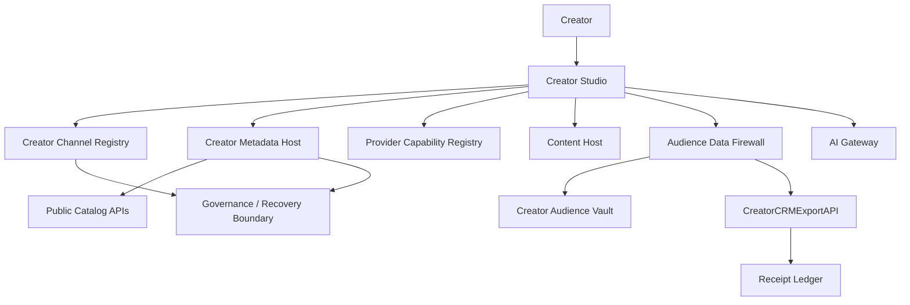

## 3. Packet Envelope

| Field | Meaning |
| --- | --- |
| `creatorIdentity` | Creator account, channel id, channel signing key, and active `CreatorChannelManifest`. |
| `studioSession` | Creator Studio session, actor role, provider context, and idempotency key. |
| `metadataContext` | Current metadata host, metadata version, manifest ids, manifest versions, and write grants. |
| `contentContext` | Content id, content type, media references, access mode, lifecycle state, search policy, and AI policy. |
| `businessContext` | Monetization, hosting, settlement, membership, sponsorship, referral, and provider-role settings. |
| `audienceContext` | Creator-scoped segment, purpose, destination, `FollowVisibilityPolicy`, `DirectContactGrant`, and export policy. |
| `policyContext` | Manifest validation, safety state, data-rights policy, provider certification, and governance state. |
| `auditContext` | Correlation id, signed actor, timestamp, API version, certification scope, and receipt requirements. |

## 4. Interfaces And Contracts

| Interface or contract | Packet responsibility |
| --- | --- |
| `CreatorChannelManifest` | Root creator identity, metadata host pointer, public keys, and portable channel state. |
| `CreatorMetadataAPI` | Read/write creator profile, catalog, manifests, provider settings, and versioned channel state. |
| `CreatorChannelRegistry` | Canonical channel id, channel keys, metadata host pointer, and pointer history. |
| `ContentManifest` | Title, required creator-approved summary, content metadata, type, access mode, media references, searchability, AI policy, and lifecycle metadata. |
| `ContentCatalogAPI` | Public/private channel catalog projections. |
| `PublicCatalogAPI` | App/search-facing public catalog view. |
| `HostingContractManifest` | Hosting tier, provider role, ad control, revenue split, lifecycle, export, and support obligations. |
| `MonetizationManifest` | Ads, memberships, paid content, premium/no-ad, sponsor, AI, and commerce rules. |
| `SettlementManifest` | Revenue allocation, required receipts, utility fees, provider allocations, and payout rules. |
| `SearchAccessPolicy` | Indexability, snippets, transcript exposure, and search policy version. |
| `AIContentPolicy` | AI indexing, source use, attribution, retention, and training policy. |
| `CreatorAudienceAPI` | Creator-scoped audience records, segments, analytics, and relationship state. |
| `CreatorCRMExportAPI` | Permissioned direct-contact and creator audience export. |
| `CreatorAudienceExportPolicy` | Field, destination, retention, watermarking, no-resale, revocation, and breach-notice rules. |
| `DataAccessReceipt` | Audit evidence for grant-protected audience or private-vault access. |
| `MetadataAuditReceipt` | Audit evidence for sensitive metadata changes, exports, migrations, and key recovery. |

## 5. Workflow Transaction Packet Models

| Ref | Trigger | Primary packet path | Durable writes / receipts | Completion response |
| --- | --- | --- | --- | --- |
| `02/W1` | Creator onboards and publishes first content. | Creator -> Creator Studio -> Registry -> Metadata Host -> Content Host -> Public Catalog. | Channel id, manifests, media refs, public catalog projection. | Creator has portable channel and first published content. |
| `02/W2` | Creator launches memberships. | Creator Studio -> Metadata Host -> Monetization/Settlement manifests -> Entitlement boundary. | Membership tier metadata, monetization and settlement versions. | Fan apps can sell and authorize member access. |
| `02/W2A` | Creator exports or contacts permissioned audience. | Creator Studio -> `CreatorCRMExportAPI` -> Audience Data Firewall -> Creator Audience Vault -> Receipt Ledger. | Export/access log, `DataAccessReceipt`. | Creator receives eligible fields or policy denial. |
| `02/W7` | Creator enables AI archive Q&A. | Creator Studio -> Metadata Host -> AI Gateway -> AI indexing boundary. | `AIContentPolicy`, indexing request, source policy version. | Archive Q&A becomes available under creator policy. |
| `04/W1` | Channel creation. | Creator Studio -> Creator Channel Registry -> Creator Metadata Host. | Channel id, keys, root manifest, metadata host pointer. | Creator can manage portable channel state. |
| `04/W2` | Publish content metadata. | Creator Studio -> Metadata Host -> Content Catalog -> Public Catalog. | `ContentManifest`, catalog version, search/AI policy. | Fan apps/search can read eligible metadata. |
| `04/W3` | Update business rules. | Creator Studio -> Metadata Host -> manifest validation -> public/runtime projections. | Updated monetization/hosting/settlement/search/AI manifests. | Runtime services use new manifest versions. |
| `04/W4` | Multi-provider channel operation. | Creator Studio -> Provider registry -> Metadata Host -> role manifests. | Provider role grants and provider pointers. | Channel can route different roles to certified providers. |
| `04/W6` | Invalid or conflicting manifest update. | Creator Studio -> Metadata Host -> validation service -> error/audit boundary. | Rejected version or conflict audit. | Creator sees specific conflict and remediation path. |
| `04/W7` | Metadata host key rotation or recovery. | Creator/Governance -> Registry -> Metadata Host -> Key recovery boundary. | New key record, pointer/version audit, recovery evidence. | Channel control restored without losing portable state. |

## 6. Step-By-Step Life Of A Packet Overlays

### 6.1 `02/W1`: Creator Onboarding To First Publish

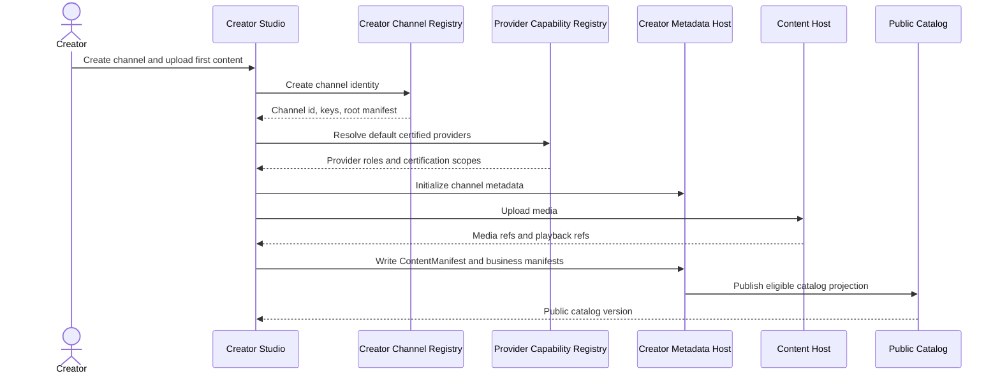

1. Creator starts the packet in Creator Studio with channel profile, handle, domain, provider preference, and first content metadata.
2. Creator Studio creates canonical channel identity through Creator Channel Registry.
3. Provider Capability Registry returns certified default provider options.
4. Creator Metadata Host stores root channel metadata, provider pointers, and initial business manifests.
5. Content Host stores media and returns media/playback references.
6. Creator Metadata Host writes `ContentManifest` and public catalog state.
7. Public Catalog exposes eligible metadata to Fan Apps and Search.

### 6.2 `02/W2`: Membership Launch

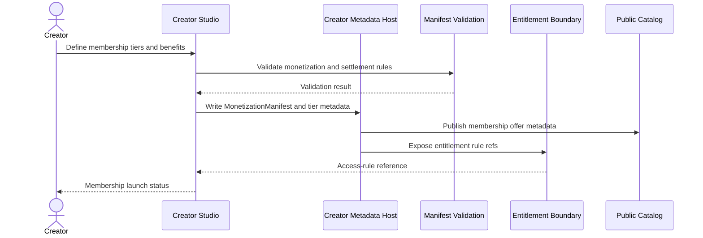

1. Creator defines membership tiers, benefits, prices, renewal terms, and member-only surfaces.
2. Manifest validation checks pricing, region, entitlement, settlement, and content access compatibility.
3. Metadata Host stores tier metadata, `MonetizationManifest`, and `SettlementManifest` versions.
4. Public Catalog exposes permitted offer metadata to Fan Apps.
5. Entitlement boundary receives access-rule references for purchase and playback checks.
6. Creator Studio shows launch status and membership analytics hooks.

### 6.3 `02/W2A`: Creator Audience Export And Direct Contact

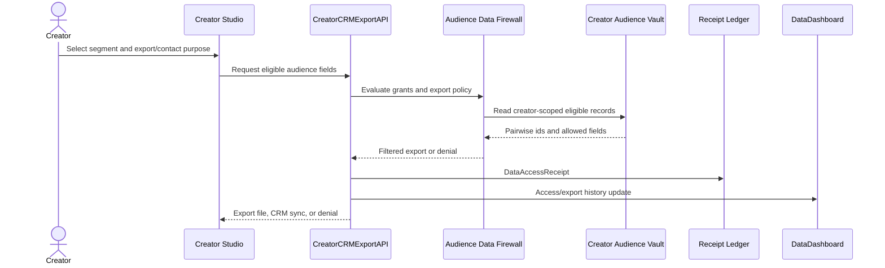

1. Creator selects segment, purpose, destination, requested fields, and retention period.
2. `CreatorCRMExportAPI` asks Audience Data Firewall to evaluate `FollowVisibilityPolicy`, `DirectContactGrant`, and `CreatorAudienceExportPolicy`.
3. Creator Audience Vault returns only eligible creator-scoped records.
4. Denied records are omitted or counted in aggregate.
5. `DataAccessReceipt` records export/access evidence.
6. Data Dashboard receives fan-visible access/export history where required.
7. Creator Studio returns export file, sync status, or policy-safe denial.

### 6.4 `02/W7`: Creator Enables AI Archive Q&A

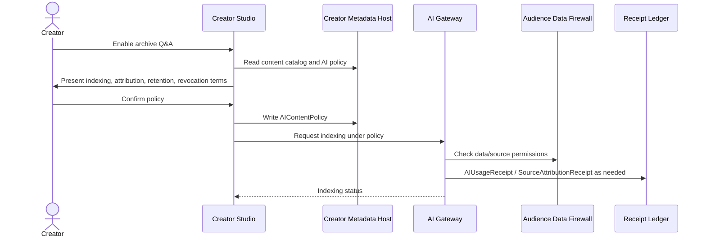

1. Creator starts from Creator Studio and selects eligible archive content.
2. Metadata Host returns content catalog, source policy, and current `AIContentPolicy`.
3. Creator confirms AI indexing, attribution, retention, no-training, and revocation rules.
4. Metadata Host writes updated `AIContentPolicy`.
5. AI Gateway indexes permitted content and checks source/data permissions.
6. AI usage/source receipts are created where applicable.
7. Creator Studio shows Q&A availability and revocation controls.

### 6.5 `04/W1`: Channel Creation

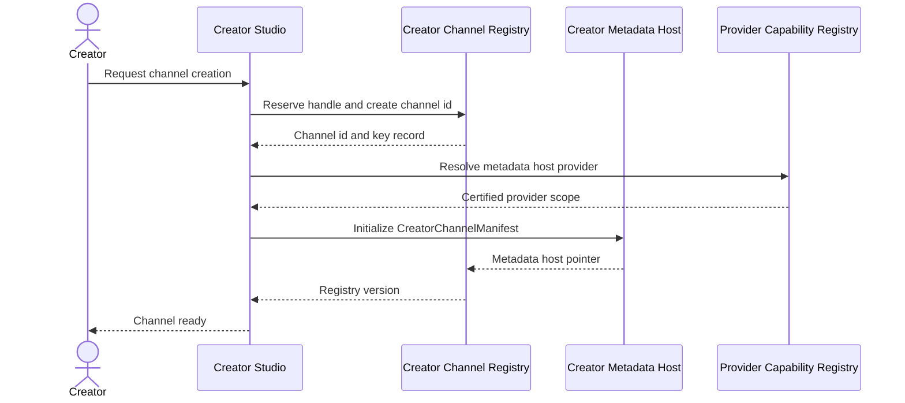

1. Creator submits channel name, handle, profile, optional domain, and provider preference.
2. Registry reserves handle, creates canonical id, and binds creator keys.
3. Provider registry resolves metadata host capability.
4. Metadata Host initializes `CreatorChannelManifest`.
5. Registry stores metadata host pointer and manifest root.
6. Creator Studio returns channel-ready state.

### 6.6 `04/W2`: Publish Content Metadata

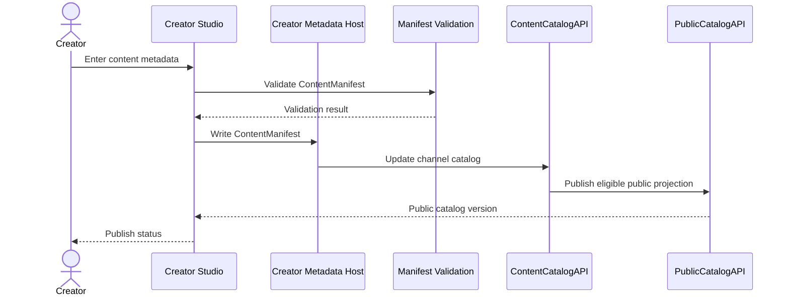

1. Creator enters title, required summary, description, content type, access mode, media refs, AI policy, and search policy.
2. Validation checks manifest shape, rights, search policy, monetization, safety, and hosting refs.
3. Metadata Host writes versioned `ContentManifest`.
4. Content Catalog updates private and public channel views.
5. Public Catalog exposes eligible metadata to apps and search.
6. Creator Studio shows publish status and manifest version.

### 6.7 `04/W3`: Update Channel Business Rules

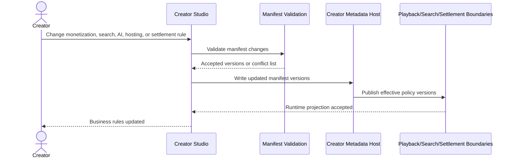

1. Creator edits business rule packet in Creator Studio.
2. Manifest validation checks compatibility across monetization, hosting, settlement, search, AI, and safety.
3. Metadata Host writes versioned manifest updates.
4. Runtime boundaries receive effective manifest versions.
5. Creator Studio shows the change, effective time, and impacted surfaces.

### 6.8 `04/W4`: Multi-Provider Channel Operation

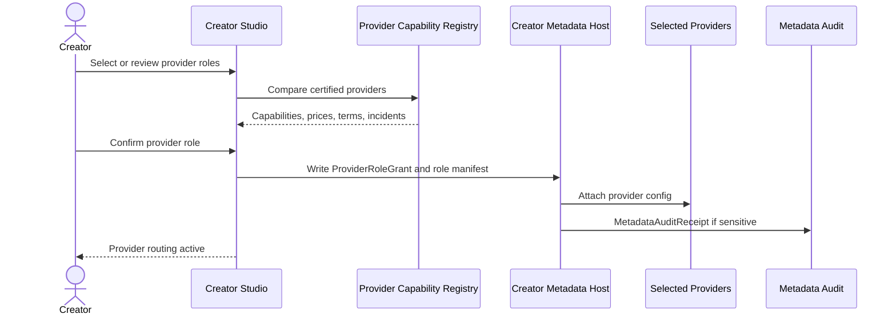

1. Creator compares certified providers by role.
2. Provider registry returns capability, terms, cost, incident, export, and certification data.
3. Creator confirms role selection.
4. Metadata Host writes `ProviderRoleGrant` and provider-specific contract manifest.
5. Provider receives required configuration.
6. Audit evidence is created for sensitive provider role changes.

### 6.9 `04/W6`: Manifest Conflict Or Invalid Update

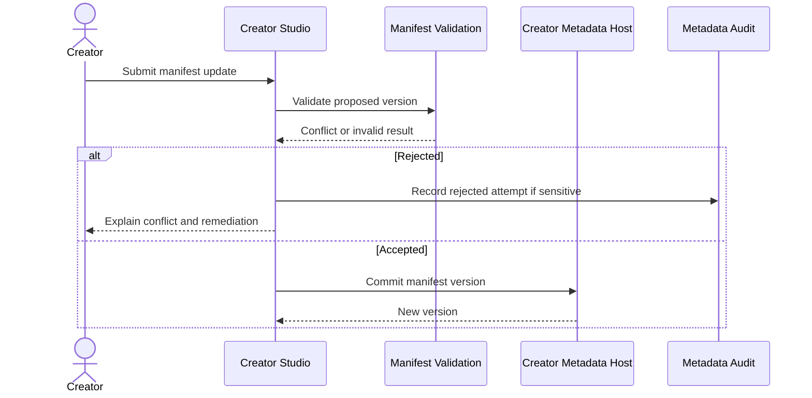

1. Creator submits a manifest update.
2. Validation checks schema, version, provider role, access mode, settlement, search, AI, and safety compatibility.
3. Invalid changes are rejected before metadata mutation.
4. Sensitive rejected attempts may create audit evidence.
5. Creator Studio shows specific conflicting fields and remediation.

### 6.10 `04/W7`: Metadata Host Key Rotation Or Recovery

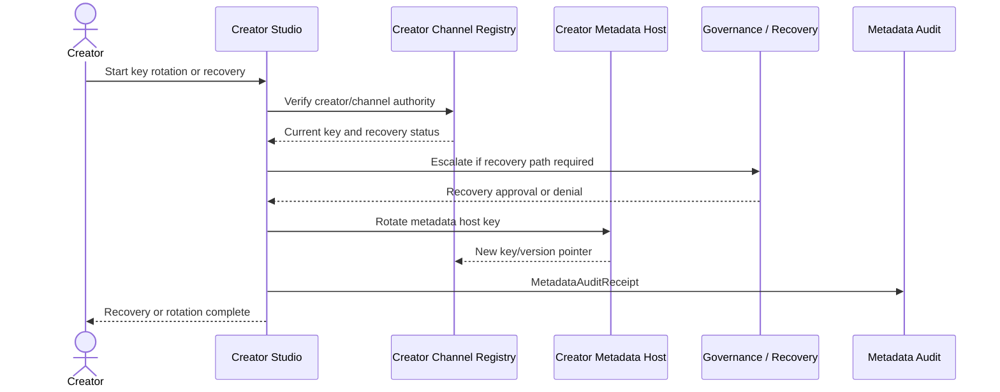

1. Creator starts key rotation or recovery.
2. Registry verifies channel authority and current key status.
3. Governance/recovery boundary approves high-risk recovery paths.
4. Metadata Host rotates keys or restores write authority.
5. Registry updates key and pointer state.
6. `MetadataAuditReceipt` records recovery evidence.
7. Creator Studio confirms channel control is restored.

## 7. Error And Recovery Behavior

| Condition | Required behavior |
| --- | --- |
| Handle conflict | Registry denies reservation and returns alternatives; no channel id is created. |
| Provider not certified for role | Creator Studio blocks provider role attachment and points to certified alternatives. |
| Manifest validation failure | Metadata Host must not commit the proposed version; Creator Studio shows field-level conflicts. |
| Content host upload succeeds but metadata write fails | Content Host keeps upload in pending/unpublished state until metadata write is retried or cleaned up. |
| Audience export denied | `CreatorCRMExportAPI` returns policy-safe denial or aggregate counts only. |
| Metadata host key compromised | Registry, governance, and key management suspend old key, record audit evidence, and require recovery flow. |
