# Loom Architecture 05: Content Hosting, Playback, Monetization, And Settlement

Status: Draft for review  
Source workflow map: `docs/Architecture/02-workflow-inventory-and-function-map.md`

## 1. Purpose

This document defines transaction packet models for hosting, playback authorization, ad/no-ad delivery, monetization configuration, payments, entitlements, receipts, settlement, refunds, chargebacks, provider economics, and creator payout statements.

## 2. Functional System Diagram

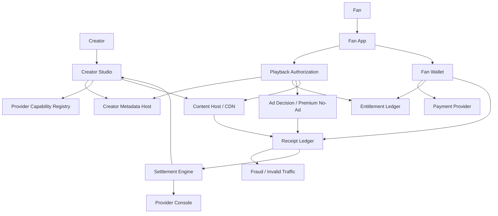

## 3. Packet Envelope

| Field | Meaning |
| --- | --- |
| `creatorBusinessContext` | Creator id, channel id, hosting tier, monetization mode, settlement manifest, and provider role grants. |
| `contentAccessContext` | Content id, access mode, content manifest version, entitlement requirements, safety state, and playback route. |
| `fanPaymentContext` | Fan identity, wallet state, payment intent, entitlement target, refund/chargeback state, and subscription allocation policy. |
| `deliveryContext` | Host id, playback token, CDN/rendition refs, delivery region, ad/no-ad route, and invalid-traffic signals. |
| `receiptContext` | Receipt type, schema version, signing key, manifest versions, idempotency key, and correlation id. |
| `settlementContext` | Settlement run id, eligible receipts, provider contracts, fees, caps, adjustments, payout readiness, and dispute state. |

## 4. Interfaces And Contracts

| Interface or contract | Packet responsibility |
| --- | --- |
| `HostingContractManifest` | Hosting tier, revenue share, direct fees, export, lifecycle, ad control, and support obligations. |
| `MonetizationManifest` | Ads, no-ad, memberships, paid content, events, AI, sponsors, commerce, and eligibility rules. |
| `SettlementManifest` | Required receipts, revenue splits, provider allocations, utility fees, reserves, and payout rules. |
| `PlaybackAuthorizationAPI` | Access decision against content, monetization, entitlement, safety, and fan mode. |
| `AdDecisionAPI` | Eligible ad/sponsor delivery and targeting constraints. |
| `FanWalletAPI` | Payment intents, subscriptions, premium modes, boosts, credits, refunds, and wallet display. |
| `EntitlementLedgerAPI` | Signed access rights for paid/premium/member content. |
| `ReceiptIngestAPI` | Receipt validation, schema checks, signature checks, and ledger submission. |
| `ReceiptLedger` | Immutable economic, audit, and utility-funding receipt storage. |
| `SettlementEngineAPI` | Settlement run calculation and statement generation. |
| `CreatorPayoutStatement` | Creator gross-to-net statement. |
| `ProviderPayoutStatement` | Provider service payout statement. |
| `FanSubscriptionAllocationStatement` | Fan-facing premium/no-ad allocation explanation. |
| `RefundChargebackRecord` | Refund or chargeback evidence and settlement adjustment input. |
| `FraudAdjustmentRecord` | Invalid activity adjustment for settlement. |

## 5. Workflow Transaction Packet Models

| Ref | Trigger | Primary packet path | Durable writes / receipts | Completion response |
| --- | --- | --- | --- | --- |
| `02/W1A` | Creator selects free managed hosting. | Creator Studio -> Provider Registry -> Metadata Host -> Settlement boundary. | Hosting, monetization, settlement manifests. | Managed hosting terms active. |
| `02/W5` | Creator upgrades/unbundles provider. | Creator Studio -> Provider Registry -> Metadata Host -> provider role update. | Updated provider contracts and manifests. | New provider role active. |
| `03/W2` | Fan watches ad-supported content. | Fan App -> Playback Authorization -> Ad Decision -> Content Host -> Receipt Ledger. | Playback/ad/delivery receipts. | Fan watches content; receipts feed settlement. |
| `03/W3` | Fan watches premium no-ad content. | Fan App -> Entitlement Ledger -> Playback Authorization -> Content Host -> Receipt Ledger. | Premium no-ad and playback receipts. | Fan watches no-ad; subscription allocation eligible. |
| `06/W1` | Free managed hosting onboarding. | Creator Studio -> Provider Registry -> Metadata Host -> Content Host. | Hosting contract and role grants. | Creator has default hosting. |
| `06/W2` | Hosting upgrade simulation. | Creator Studio -> Provider comparison -> Settlement simulator. | Simulation record, no production change. | Creator sees cost/revenue impact. |
| `06/W3` | Upgrade to direct paid hosting. | Creator Studio -> Payment/Provider config -> Metadata Host. | Direct-fee hosting contract. | Hosting economics switch. |
| `06/W4` | Unbundle ad provider. | Creator Studio -> Provider Registry -> Metadata Host -> Ad Decision boundary. | Ad provider role grant and ad policy. | External ad provider route active. |
| `06/W6` | Self-host certification. | Creator -> Provider certification boundary -> Registry -> Metadata Host. | Certification record and host role. | Self-host can serve certified role. |
| `06/W7` | Hosting downgrade or rollback. | Creator Studio -> Provider contracts -> Metadata Host -> Settlement boundary. | Reverted role/contract versions. | Prior or lower hosting tier active. |
| `08/W1` | Receipt generation and ingestion. | Runtime service -> `ReceiptIngestAPI` -> Receipt Ledger. | Validated receipt. | Receipt accepted for audit/settlement. |
| `08/W2` | Monthly creator settlement. | Settlement Engine -> Receipt Ledger -> manifests/contracts -> statements. | Settlement run, creator/provider statements. | Payout estimates generated. |
| `08/W3` | Premium no-ad allocation. | Settlement Engine -> premium receipts -> allocation policy. | Allocation statement. | Creator/fan/provider allocations calculated. |
| `08/W3A` | Payment/refund/chargeback. | Fan Wallet -> Payment Provider -> Entitlement Ledger -> Receipt Ledger. | Payment, refund, chargeback, entitlement updates. | Access and settlement state adjusted. |
| `08/W4` | AI source royalty settlement. | AI receipts -> Settlement Engine -> source policy. | Royalty allocation. | Source creators/providers credited. |
| `08/W5` | Campaign settlement. | Campaign receipts -> Settlement Engine -> sponsor/campaign terms. | Campaign settlement run. | Creator/sponsor/provider/dev allocations calculated. |
| `08/W6` | Dispute and adjustment. | Dispute -> evidence -> Settlement Engine. | Settlement adjustment record. | Statements corrected or held. |
| `09/W1` | Configure monetization. | Creator Studio -> Metadata Host -> manifest validation. | Monetization and settlement manifest versions. | Runtime uses new monetization rules. |
| `09/W2` | Free ad-supported revenue. | Playback -> ad receipts -> settlement. | Ad/playback/delivery receipts. | Creator revenue allocated. |
| `09/W3` | Membership monetization. | Wallet -> entitlement -> receipts -> settlement. | Membership receipts and entitlements. | Recurring support monetized. |
| `09/W3A` | Global no-ad premium. | Wallet -> entitlement -> premium receipts -> allocation. | Premium entitlement and allocation records. | No-ad access and creator allocation. |
| `09/W3B` | Paid private mode. | Wallet -> private entitlement -> vault service receipts. | Private vault entitlement and service receipts. | Privacy utility funded. |
| `09/W3C` | Paid content/events/courses/bundles/gifts/commerce. | Wallet -> entitlement/order -> receipts. | Payment/order/entitlement receipts. | Access or fulfillment enabled. |
| `09/W4` | AI source royalty. | AI usage -> receipts -> settlement. | AI/source attribution receipts. | Royalty allocated. |
| `09/W5` | Sponsor campaign monetization. | Campaign/sponsor receipts -> settlement. | Sponsor delivery/conversion/reward receipts. | Sponsor funds allocated. |
| `09/W6` | Referral monetization. | Referral receipt -> settlement. | Discovery/referral receipt. | Referral revenue allocated. |

## 6. Step-By-Step Life Of A Packet Overlays

### 6.1 `02/W1A`: Free Managed Hosting Setup

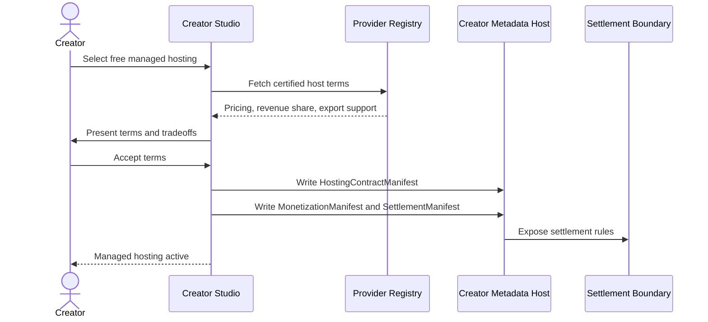

1. Creator selects free managed hosting during onboarding or provider controls.
2. Creator Studio requests certified host terms and pricing.
3. Creator accepts ad control, revenue share, export, lifecycle, support, and storage terms.
4. Metadata Host stores `HostingContractManifest`, `MonetizationManifest`, and `SettlementManifest`.
5. Settlement boundary receives effective provider economics.
6. Creator Dashboard shows managed hosting status and upgrade paths.

### 6.2 `02/W5`: Provider Upgrade Or Unbundling

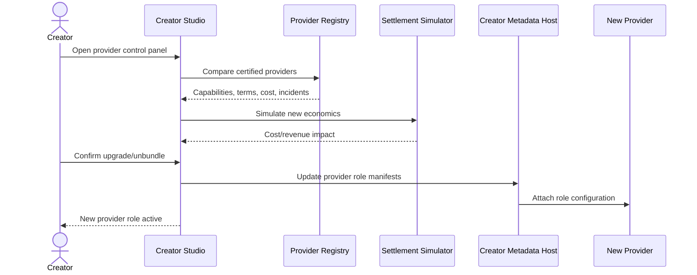

1. Creator compares provider alternatives for hosting, ads, AI, analytics, or settlement.
2. Provider registry returns certified capabilities and terms.
3. Settlement simulator calculates impact.
4. Creator confirms provider role change.
5. Metadata Host writes updated provider contracts and role manifests.
6. New provider receives role configuration; runtime begins using the new role.

### 6.3 `03/W2`: Free Ad-Supported Playback

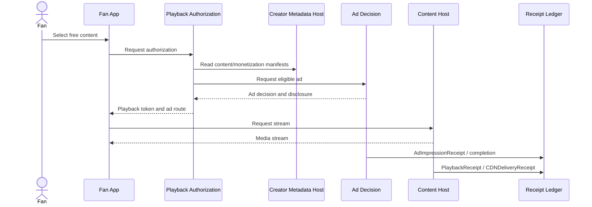

1. Fan selects ad-supported content.
2. Playback Authorization checks content, monetization, safety, and entitlement state.
3. Ad Decision returns eligible ad or no-fill.
4. Fan App receives playback token and ad route.
5. Content Host serves media.
6. Runtime submits playback, delivery, and ad receipts.
7. Receipts become settlement inputs.

### 6.4 `03/W3`: Premium No-Ad Playback

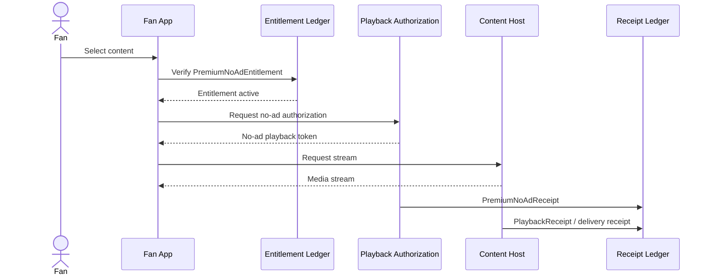

1. Fan opens content while no-ad entitlement is active.
2. Entitlement Ledger verifies premium state.
3. Playback Authorization skips ad route and returns no-ad token.
4. Content Host streams media.
5. Premium no-ad and playback receipts are submitted.
6. Premium allocation is handled in settlement.

### 6.5 `06/W1`: Free Managed Hosting Onboarding

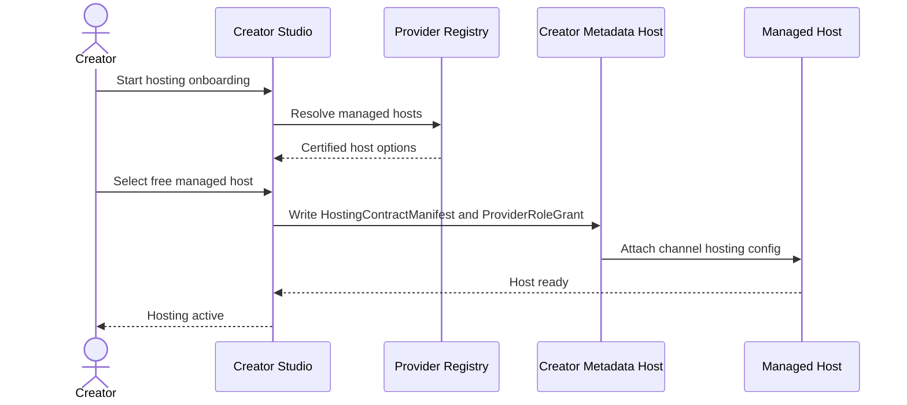

1. Creator starts with managed hosting path.
2. Registry returns certified free managed hosts.
3. Creator accepts terms.
4. Metadata Host writes hosting contract and provider role grant.
5. Host receives configuration.
6. Creator can upload and publish content.

### 6.6 `06/W2`: Hosting Upgrade Simulation

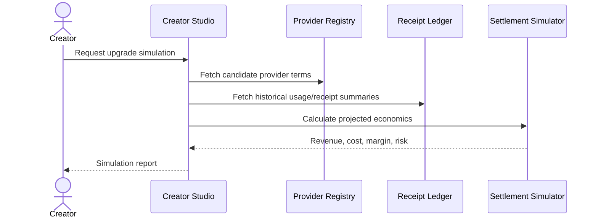

1. Creator selects candidate hosting/provider tier.
2. Creator Studio fetches terms and historical usage.
3. Settlement simulator calculates provider costs, revenue share, direct fees, and margin impact.
4. No production state changes are made.
5. Creator sees projected economics and migration/rollback implications.

### 6.7 `06/W3`: Upgrade From Free Managed To Direct Paid

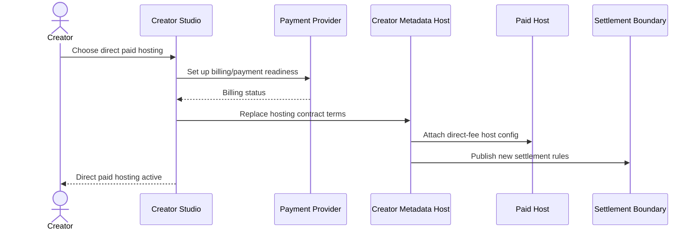

1. Creator chooses direct paid hosting.
2. Payment readiness is confirmed.
3. Metadata Host updates hosting contract from revenue share to direct fee.
4. Host receives updated role configuration.
5. Settlement rules change to reflect direct provider cost and creator revenue share.

### 6.8 `06/W4`: Unbundle Ad Provider

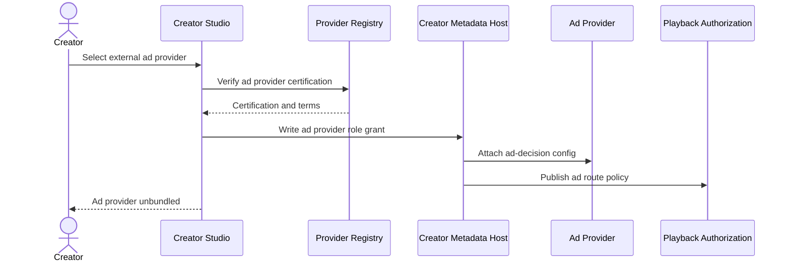

1. Creator selects certified ad provider.
2. Registry verifies ad-decision certification and terms.
3. Metadata Host writes provider role grant and monetization route.
4. Playback Authorization routes eligible ad calls to new ad provider.
5. Ad receipts bind to the new provider key and certification scope.

### 6.9 `06/W6`: Self-Host Certification

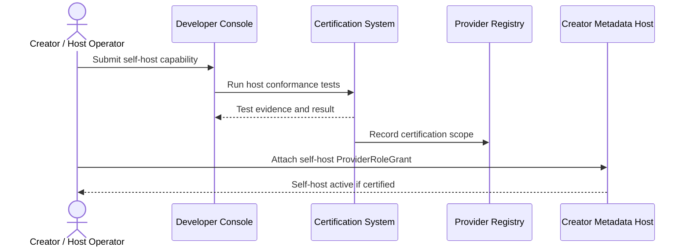

1. Creator/operator submits self-host capability.
2. Certification tests host APIs, search exposure, export support, receipts, and key behavior.
3. Registry records certification scope if passed.
4. Creator attaches self-host role in metadata.
5. Fan apps and playback services can use the self-host only within certified scope.

### 6.10 `06/W7`: Hosting Downgrade Or Rollback

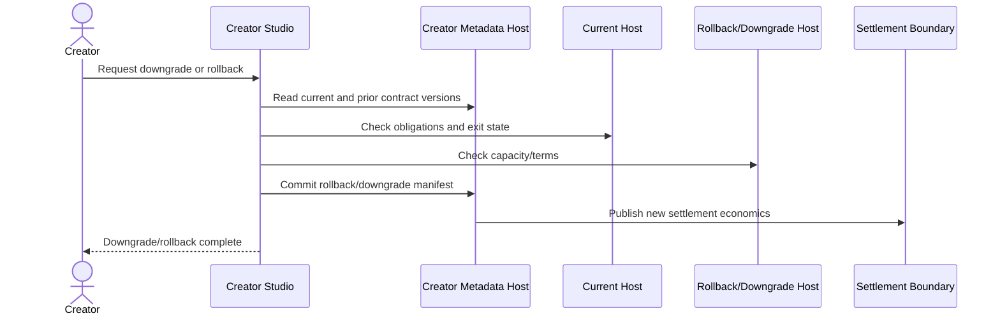

1. Creator selects downgrade or rollback.
2. Current and prior hosting contracts are read.
3. Exit obligations, fees, export state, and capacity are checked.
4. Metadata Host commits new or prior hosting manifest.
5. Settlement boundary uses the new effective economics.

### 6.11 `08/W1`: Receipt Generation And Ingestion

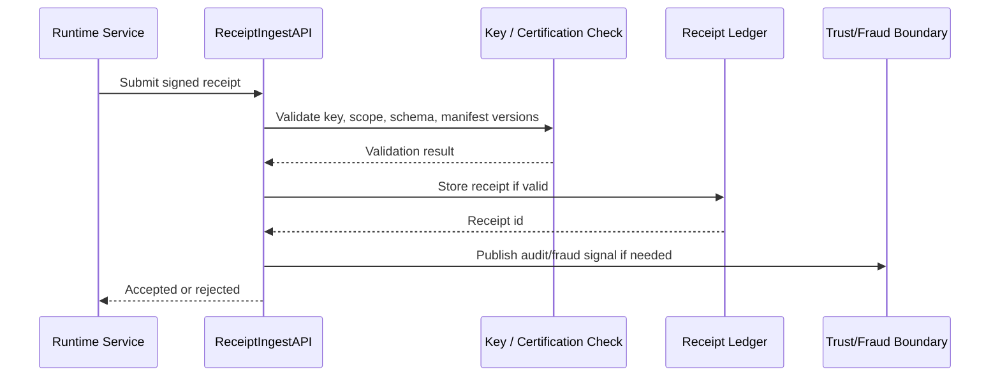

1. Runtime service creates signed receipt with schema, manifest versions, key id, and idempotency key.
2. Receipt ingest validates schema, signature, certification scope, manifest binding, and duplicate status.
3. Valid receipts are stored in Receipt Ledger.
4. Invalid receipts are rejected with reason.
5. Trust/fraud systems can consume receipt events.

### 6.12 `08/W2`: Monthly Creator Settlement

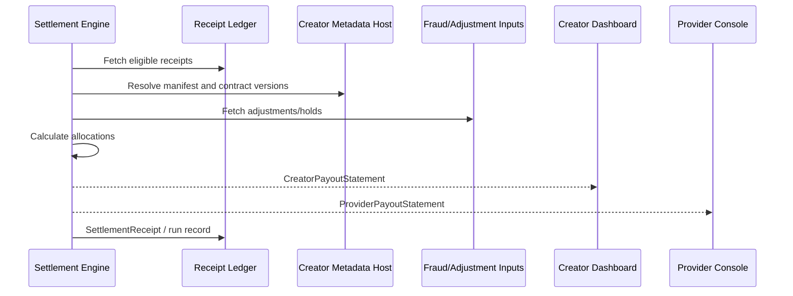

1. Settlement Engine starts scheduled run.
2. Receipt Ledger returns eligible receipts.
3. Metadata Host returns historical manifests and provider contracts.
4. Fraud and dispute adjustments are applied.
5. Creator and provider statements are generated.
6. Settlement run record is stored.

### 6.13 `08/W3`: Premium No-Ad Allocation

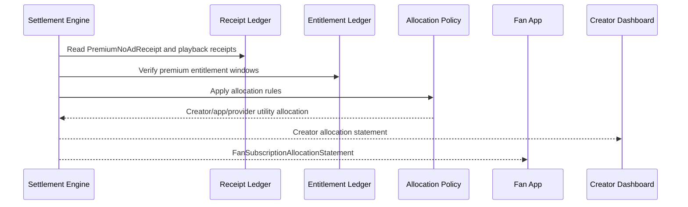

1. Settlement reads premium/no-ad and playback receipts.
2. Entitlement windows validate fan premium state.
3. Allocation policy splits fan premium value across creators, apps, providers, and utilities.
4. Creator sees premium allocation.
5. Fan can see allocation statement where applicable.

### 6.14 `08/W3A`: Payment, Entitlement, Refund, And Chargeback

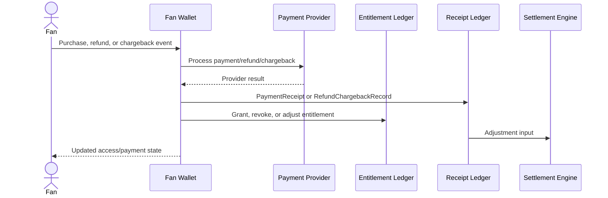

1. Wallet receives purchase/refund/chargeback trigger.
2. Payment provider returns result.
3. Wallet writes payment or refund/chargeback record.
4. Entitlement Ledger grants, revokes, or adjusts access.
5. Settlement Engine receives adjustment input.
6. Fan sees updated wallet and access state.

### 6.15 `08/W4`: AI Source Royalty Settlement

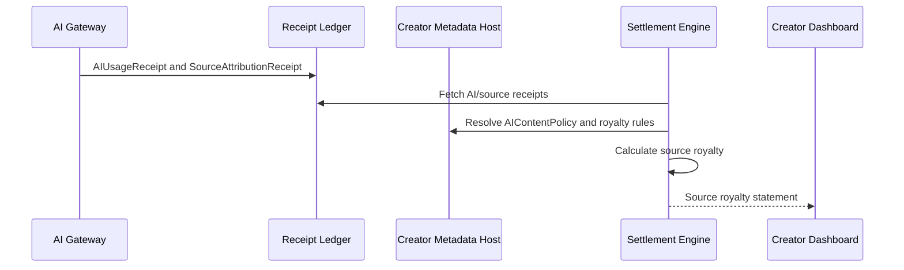

1. AI Gateway records usage and source attribution receipts.
2. Settlement fetches source receipts.
3. Metadata Host provides AI content policy and royalty terms.
4. Settlement calculates provider/source/creator allocations.
5. Source royalty appears in creator statement.

### 6.16 `08/W5`: Campaign Settlement

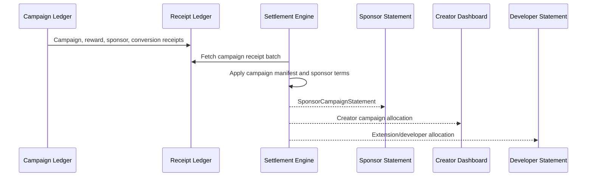

1. Campaign systems generate entry, reward, delivery, conversion, and sponsor receipts.
2. Settlement groups receipts by campaign manifest and sponsor terms.
3. Sponsor spend, creator revenue, extension fees, provider costs, and utility fees are calculated.
4. Sponsor, creator, developer, and provider statements are produced.

### 6.17 `08/W6`: Dispute And Adjustment

```mermaid
sequenceDiagram
  actor Actor as Creator / Provider / Fan / Sponsor
  participant DS as Dispute System
  participant RL as Receipt Ledger
  participant SE as Settlement Engine
  participant Statements as Statements

  Actor->>DS: Open dispute
  DS->>RL: Fetch receipts and evidence
  DS->>SE: Request adjustment or hold
  SE->>SE: Calculate correction
  SE->>RL: SettlementAdjustmentRecord
  SE-->>Statements: Updated statements
  DS-->>Actor: Outcome
```

1. Actor opens dispute with receipt, payout, entitlement, or campaign evidence.
2. Dispute system gathers receipts, manifests, contracts, and audit records.
3. Settlement Engine calculates hold, correction, clawback, or credit.
4. `SettlementAdjustmentRecord` updates statements.
5. Actor receives outcome and appeal path.

### 6.18 `09/W1`: Configure Monetization For Content

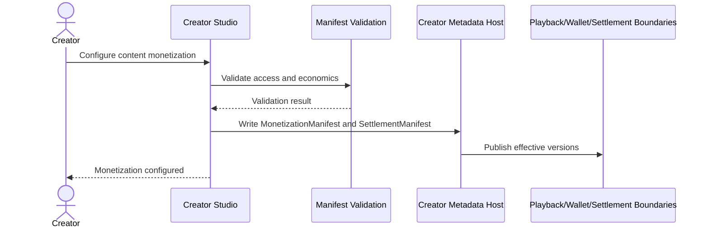

1. Creator selects ads, no-ad eligibility, memberships, paid access, sponsor-free, events, AI, or commerce.
2. Manifest validation checks conflicts and required receipts.
3. Metadata Host stores monetization and settlement versions.
4. Runtime boundaries use new rules for playback, wallet, and settlement.

### 6.19 `09/W2`: Free Ad-Supported Revenue

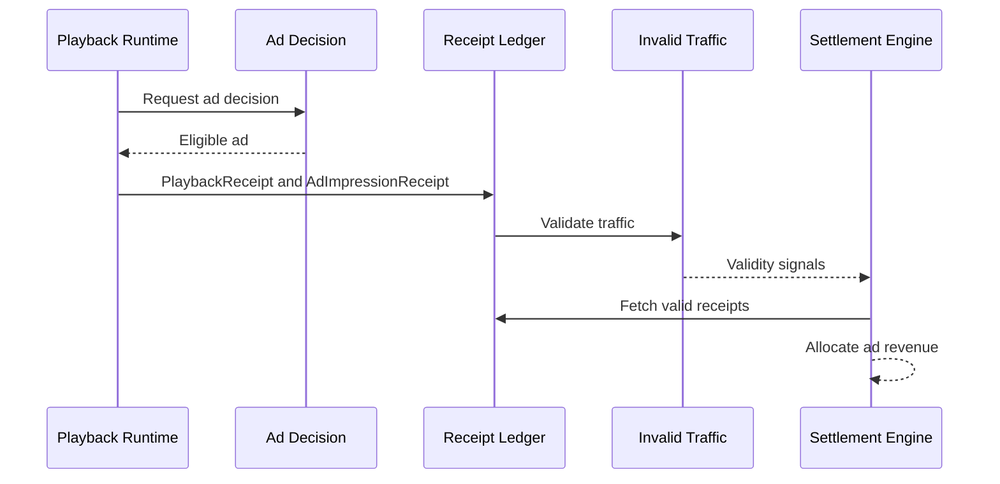

1. Playback route uses ad-supported monetization.
2. Ad decision returns eligible ad/sponsor disclosure.
3. Playback and ad receipts are ingested.
4. Invalid traffic signals can adjust eligibility.
5. Settlement allocates revenue from valid receipts.

### 6.20 `09/W3`: Membership Monetization

```mermaid
sequenceDiagram
  actor F as Fan
  participant FW as Fan Wallet
  participant EL as Entitlement Ledger
  participant RL as Receipt Ledger
  participant SE as Settlement Engine

  F->>FW: Buy or renew membership
  FW->>RL: PaymentReceipt / MembershipReceipt
  FW->>EL: Grant or renew membership entitlement
  EL-->>FW: Active entitlement
  RL->>SE: Membership settlement input
  SE-->>SE: Allocate membership revenue
```

1. Fan purchases or renews membership.
2. Wallet records payment and membership receipts.
3. Entitlement Ledger grants access.
4. Settlement allocates recurring membership revenue according to manifest and contracts.

### 6.21 `09/W3A`: Global No-Ad Premium

```mermaid
sequenceDiagram
  actor F as Fan
  participant FW as Fan Wallet
  participant EL as Entitlement Ledger
  participant PA as Playback Authorization
  participant RL as Receipt Ledger
  participant SE as Settlement Engine

  F->>FW: Purchase global no-ad
  FW->>EL: Grant PremiumNoAdEntitlement
  EL-->>PA: Entitlement available
  PA->>RL: PremiumNoAdReceipt on eligible views
  RL->>SE: Premium allocation input
  SE-->>F: Fan allocation statement where applicable
```

1. Fan buys no-ad premium.
2. Entitlement Ledger grants global no-ad entitlement.
3. Playback Authorization skips eligible ads.
4. Premium no-ad receipts record creator support eligibility.
5. Settlement allocates premium value.

### 6.22 `09/W3B`: Paid Private Mode

```mermaid
sequenceDiagram
  actor F as Fan
  participant FW as Fan Wallet
  participant EL as Entitlement Ledger
  participant ADF as Audience Data Firewall
  participant RL as Receipt Ledger

  F->>FW: Purchase private mode
  FW->>EL: Grant PrivateVaultEntitlement
  EL-->>ADF: Entitlement active
  ADF->>ADF: Narrow data defaults
  ADF->>RL: VaultServiceReceipt / DataAccessReceipt as needed
  FW-->>F: Private mode active
```

1. Fan purchases private mode.
2. Entitlement Ledger grants private vault entitlement.
3. Audience Data Firewall applies stricter data defaults.
4. Vault service funding receipts are created where applicable.
5. Fan sees private mode active.

### 6.23 `09/W3C`: Paid Content, Events, Courses, Bundles, Gifts, And Commerce

```mermaid
sequenceDiagram
  actor F as Fan
  participant FW as Fan Wallet
  participant PP as Payment Provider
  participant EL as Entitlement Ledger
  participant Fulfill as Fulfillment / Access Boundary
  participant RL as Receipt Ledger

  F->>FW: Buy paid item or gift
  FW->>PP: Process payment
  PP-->>FW: Payment status
  FW->>EL: Grant entitlement or order access
  FW->>Fulfill: Send fulfillment/access request
  FW->>RL: Payment/order receipt
  FW-->>F: Access or fulfillment status
```

1. Fan buys paid content, event, course, bundle, gift, or commerce item.
2. Wallet processes payment.
3. Entitlement Ledger grants access where needed.
4. Fulfillment/access boundary handles product-specific delivery.
5. Receipts feed settlement and support refunds/chargebacks.

### 6.24 `09/W4`: AI Source Royalty

```mermaid
sequenceDiagram
  participant AI as AI Gateway
  participant RL as Receipt Ledger
  participant SE as Settlement Engine
  participant CS as Creator Dashboard

  AI->>RL: AIUsageReceipt
  AI->>RL: SourceAttributionReceipt
  SE->>RL: Fetch source usage receipts
  SE->>SE: Apply royalty policy
  SE-->>CS: AI royalty allocation
```

1. AI usage creates usage and source attribution receipts.
2. Settlement groups usage by source creator/content.
3. Royalty policy allocates AI value.
4. Creator statement shows source royalty.

### 6.25 `09/W5`: Sponsor Campaign Monetization

```mermaid
sequenceDiagram
  participant Sponsor as Sponsor Tools
  participant CL as Campaign Ledger
  participant RL as Receipt Ledger
  participant SE as Settlement Engine
  participant CS as Creator Dashboard

  Sponsor->>CL: Fund campaign / delivery terms
  CL->>RL: SponsorDeliveryReceipt and campaign receipts
  SE->>RL: Fetch sponsor campaign receipts
  SE->>SE: Apply campaign settlement rules
  SE-->>Sponsor: Sponsor spend statement
  SE-->>CS: Creator sponsor revenue
```

1. Sponsor campaign produces delivery, entry, reward, and conversion receipts.
2. Settlement reads campaign manifest and sponsor terms.
3. Sponsor spend is allocated to creator, extension developer, providers, and utilities.
4. Sponsor and creator statements are produced.

### 6.26 `09/W6`: Referral Monetization

```mermaid
sequenceDiagram
  participant FA as Fan App
  participant RL as Receipt Ledger
  participant SE as Settlement Engine
  participant Source as Source Creator Statement
  participant Dest as Destination Creator Statement

  FA->>RL: DiscoveryReceipt / CreatorReferralReceipt
  SE->>RL: Fetch referral receipts
  SE->>SE: Apply ReferralTermsManifest and caps
  SE-->>Source: Referral revenue
  SE-->>Dest: Referral cost / attribution
```

1. Fan action qualifies under referral terms.
2. Fan App submits discovery or referral receipt.
3. Settlement validates manifest version, caps, fraud holds, and eligibility.
4. Source and destination creator statements reflect referral economics.

## 7. Error And Recovery Behavior

| Condition | Required behavior |
| --- | --- |
| Playback entitlement denied | Playback Authorization returns denial reason and required purchase/upgrade path. |
| Ad decision no-fill | Playback proceeds if content policy allows no-fill fallback; receipts reflect no ad delivery. |
| Receipt signature invalid | `ReceiptIngestAPI` rejects receipt; no settlement input is created. |
| Duplicate receipt | Receipt Ledger uses idempotency key and rejects or links duplicate. |
| Chargeback after settlement | `RefundChargebackRecord` creates downstream settlement adjustment. |
| Provider contract changed mid-period | Settlement resolves historical manifest/contract versions by event timestamp. |
| Fraud signal invalidates receipts | Settlement applies hold or `FraudAdjustmentRecord`. |

