# Loom Architecture 06: Provider Certification, Governance, And Developer Supply Chain

Status: Draft for review  
Source workflow map: `docs/Architecture/02-workflow-inventory-and-function-map.md`

## 1. Purpose

This document defines transaction packet models for provider/app/extension certification, provider marketplace discovery, continuous audit, API version governance, key revocation, developer tooling, conformance tests, supply-chain incidents, disputes, privacy governance, and utility fee governance.

## 2. Functional System Diagram

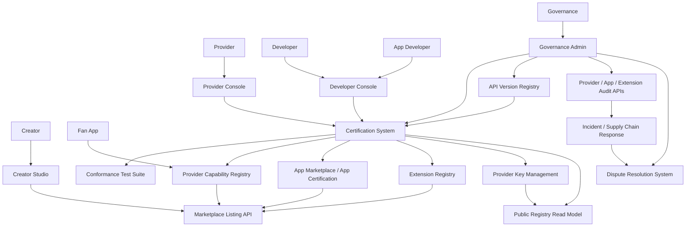

## 3. Packet Envelope

| Field | Meaning |
| --- | --- |
| `actorIdentity` | Provider, developer, app, extension, governance, or creator identity and signing keys. |
| `capabilityContext` | Service role, capability, API version, manifest version, geography, data scope, and certification target. |
| `evidenceContext` | Test results, artifacts, build attestation, SBOM, audit logs, incident evidence, and manual review notes. |
| `keyContext` | Public keys, signing keys, key scope, rotation state, suspension state, and revocation evidence. |
| `registryContext` | Provider/app/extension listing state, certification state, restrictions, incidents, and public records. |
| `versionContext` | API version, deprecation window, migration fixture, compatibility matrix, and required upgrade timeline. |
| `governanceContext` | Policy authority, dispute case, privacy/data-rights issue, utility fee policy, and public comment state. |

## 4. Interfaces And Contracts

| Interface or contract | Packet responsibility |
| --- | --- |
| `ProviderCapabilityManifest` | Declares provider roles, versions, regions, pricing, data use, export support, and keys. |
| `ProviderCertificationAPI` | Submits and resolves provider certification requests. |
| `AppCertificationAPI` | Submits and resolves fan-app certification requests. |
| `ExtensionManifest` | Declares extension surfaces, permissions, risk tier, pricing, export behavior, and runtime needs. |
| `ExtensionArtifactAPI` | Stores and retrieves signed extension artifacts. |
| `ExtensionBuildAttestation` | Build provenance evidence for extension artifacts. |
| `SoftwareBillOfMaterials` | Dependency and supply-chain transparency evidence. |
| `ConformanceTestSuite` | Capability-specific tests pinned to API/manifest versions. |
| `AppConformanceTestSuite` | App tests for login, grants, manifests, receipts, search, recommendations, privacy controls, and sandboxing. |
| `CertificationScopeRecord` | Certified role, version, state, restrictions, expiration, key scope, and public status. |
| `ProviderCapabilityRegistry` | Durable provider capability, certification, key, incident, and version state. |
| `MarketplaceListingAPI` | Public and creator/app-facing listings and comparisons. |
| `ProviderAuditAPI` | Audit probes, evidence, incidents, and remediation. |
| `AppAuditAPI` | App privacy, receipt, manifest, search, recommendation, and extension audits. |
| `ProviderKeyManagementAPI` | Key issuance, rotation, suspension, revocation, and recovery. |
| `APIVersionRegistry` | API and manifest versions, deprecation windows, migration fixtures, and certification impact. |
| `DisputeCaseRecord` | Append-only dispute evidence and outcome record. |
| `PublicRegistryReadModel` | Public status for providers, apps, extensions, keys, incidents, versions, and marks. |
| `UtilityFeePolicy` | Shared utility funding scope, caps, covered utilities, and reporting requirements. |

## 5. Workflow Transaction Packet Models

| Ref | Trigger | Primary packet path | Durable writes / receipts | Completion response |
| --- | --- | --- | --- | --- |
| `07/W1` | Provider registers/certifies. | Provider Console -> Certification -> Conformance -> Registry -> Marketplace. | Capability manifest, certification scope, key state, listing. | Provider listed by certified role. |
| `07/W2` | Creator selects provider. | Creator Studio -> Marketplace -> Registry -> Metadata boundary. | Provider role grant. | Provider attached to creator role. |
| `07/W3` | App discovers capabilities. | App -> Provider Discovery -> Registry. | No durable write unless selection stored. | Certified provider endpoint/key returned. |
| `07/W4` | Continuous provider audit. | Governance/Audit -> Provider -> Registry/Incident. | Audit evidence, incident, remediation state. | Certification unchanged, limited, suspended, or revoked. |
| `07/W5` | Provider version migration. | Provider/Governance -> API Version Registry -> Certification -> Marketplace. | Version state and migration schedule. | Apps/creators migrate before deprecation. |
| `15/W5` | App certification. | App Developer -> App Certification -> App conformance -> Marketplace. | App certification scope and listing. | Certified app can operate. |
| `16/W1` | Extension development. | Developer -> SDK/test/build/sign -> Extension Registry. | Signed artifact, manifest, attestation, listing. | Extension ready for certification/listing. |
| `16/W2` | Provider certification. | Developer Console -> Provider Certification -> Conformance. | Certification evidence and scope. | Provider capability certified or denied. |
| `16/W3` | Fan app development. | App Developer -> SDK -> app tests -> certification. | App manifest, test evidence, certification request. | App approved or remediation returned. |
| `16/W4` | API version upgrade. | Governance -> API Version Registry -> SDK/tests -> certification impact. | Version record, compatibility matrix, deprecation windows. | Ecosystem migration plan published. |
| `16/W5` | Supply chain incident. | Audit/incident -> registry/key revocation -> apps/runtime. | Incident record, revocation/suspension, remediation. | Unsafe artifacts blocked. |
| `19/W1` | Capability certification. | Actor -> Certification -> Conformance -> Registry/Public read model. | `CertificationScopeRecord`. | Capability approved, limited, or rejected. |
| `19/W2` | Continuous audit. | Governance -> Audit APIs -> registry state. | Audit case, evidence, lifecycle state. | Scope remains or changes state. |
| `19/W3` | Dispute resolution. | Actor -> Dispute System -> evidence systems -> outcome. | `DisputeCaseRecord`. | Outcome and appeal/remediation path. |
| `19/W4` | API version governance. | Foundation -> API Version Registry -> public comment -> migration. | Version policy and deprecation state. | New API/manifest version lifecycle. |
| `19/W5` | Key revocation. | Incident/governance -> Key Management -> public registry/runtime. | Key suspension/revocation record. | Runtime rejects invalid key scope. |
| `19/W6` | Privacy/data-rights governance. | Report/audit -> governance -> audit APIs -> remediation. | Privacy case, restrictions, notices. | Grants/scopes revoked or corrected. |
| `19/W7` | Utility fee governance. | Foundation -> policy -> settlement/public reports. | `UtilityFeePolicy` and reports. | Shared infrastructure funding rules active. |

## 6. Step-By-Step Life Of A Packet Overlays

### 6.1 `07/W1`: Provider Registration And Certification

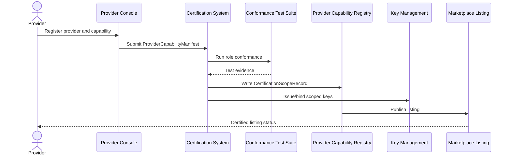

1. Provider submits identity, public keys, role, API versions, pricing, data use, export support, and terms.
2. Certification system runs role-specific conformance tests.
3. Approved capability creates `CertificationScopeRecord`.
4. Key management binds signing keys to capability scope.
5. Marketplace publishes provider listing and restrictions.

### 6.2 `07/W2`: Creator Selects A Provider

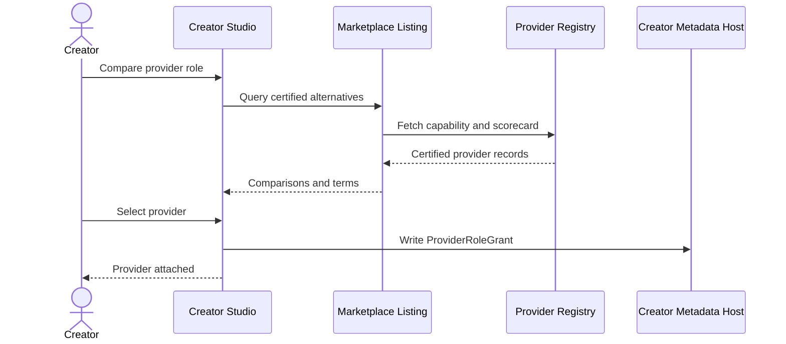

1. Creator chooses a provider role such as host, AI, analytics, ads, or settlement.
2. Marketplace returns certified alternatives, prices, incidents, and export support.
3. Creator confirms provider.
4. Metadata Host stores `ProviderRoleGrant` and role manifest.
5. Runtime services can route calls to the selected certified provider.

### 6.3 `07/W3`: App Discovers Provider Capabilities

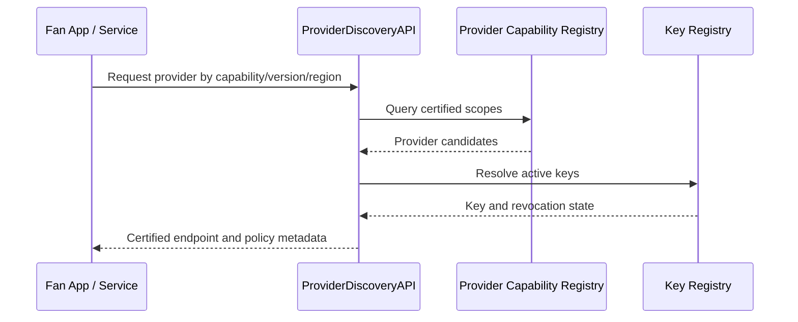

1. App requests provider by capability, version, geography, and policy requirements.
2. Registry returns certified provider scopes.
3. Discovery resolves active keys and revocation state.
4. App receives endpoint, key, API version, and restrictions.

### 6.4 `07/W4`: Continuous Provider Audit

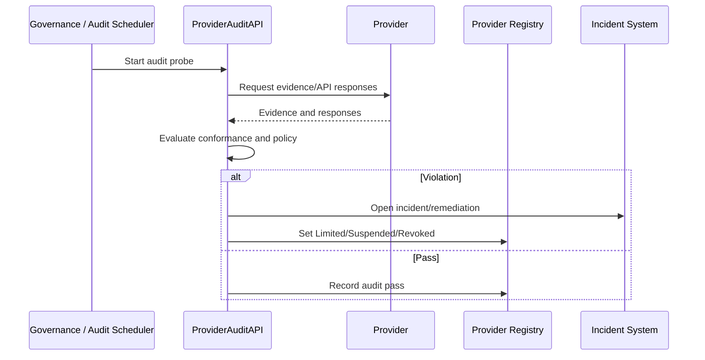

1. Audit is scheduled or triggered.
2. Provider supplies evidence or API responses.
3. Audit checks conformance, receipts, data use, export, keys, and incident obligations.
4. Registry state remains certified or changes to limited/suspended/revoked.
5. Incident system tracks remediation.

### 6.5 `07/W5`: Provider Version Migration

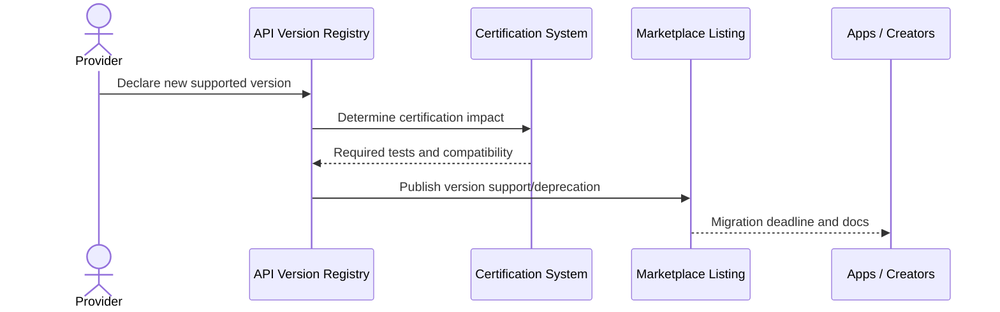

1. Provider declares new API or manifest version.
2. API Version Registry records support and compatibility.
3. Certification system identifies required tests.
4. Marketplace publishes support and deprecation windows.
5. Apps and creators migrate before old versions retire.

### 6.6 `15/W5`: App Certification

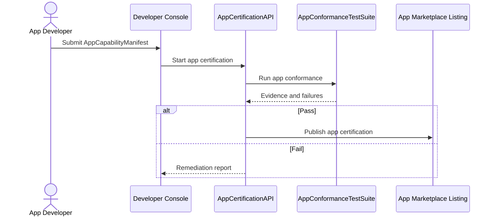

1. App developer submits app manifest, surfaces, data use, devices, and extension runtime support.
2. App tests verify login, grants, manifests, receipts, search neutrality, recommendation boundaries, privacy controls, and sandboxing.
3. Passing app receives certification scope and listing.
4. Failing app receives remediation report.

### 6.7 `16/W1`: Extension Development

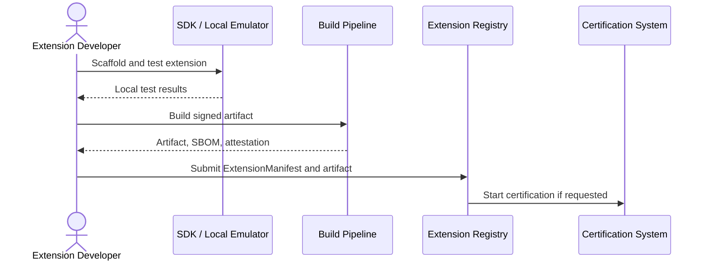

1. Developer scaffolds extension using SDK.
2. Local emulator runs manifest, permission, and sandbox tests.
3. Build pipeline signs artifact and emits SBOM/attestation.
4. Extension Registry stores manifest and artifact.
5. Certification can proceed using submitted evidence.

### 6.8 `16/W2`: Provider Certification

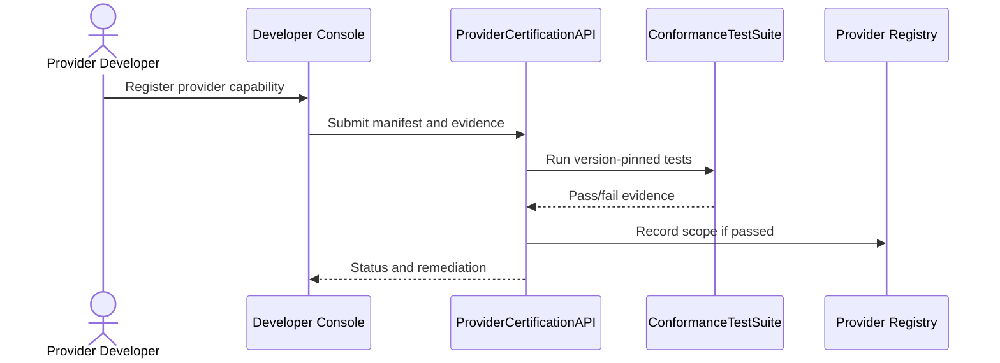

1. Provider developer submits capability manifest and evidence.
2. Version-pinned tests validate API behavior.
3. Certification records approved scope or returns remediation.
4. Registry and marketplace update on approval.

### 6.9 `16/W3`: Fan App Development

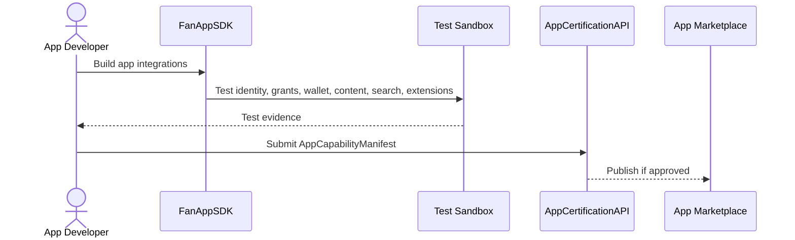

1. Developer integrates Fan Passport, grants, entitlements, content, search, recommendations, receipts, and extension runtime.
2. Test sandbox produces conformance evidence.
3. App capability manifest is submitted.
4. Certification publishes approved app or returns fixes.

### 6.10 `16/W4`: API Version Upgrade

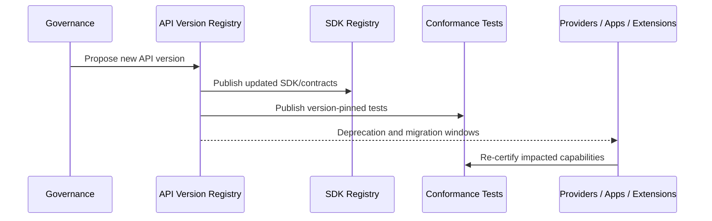

1. Governance proposes version change.
2. Registry records compatibility, migration fixtures, and deprecation dates.
3. SDKs and tests update.
4. Impacted actors re-certify.
5. Older versions retire after migration window.

### 6.11 `16/W5`: Supply Chain Incident

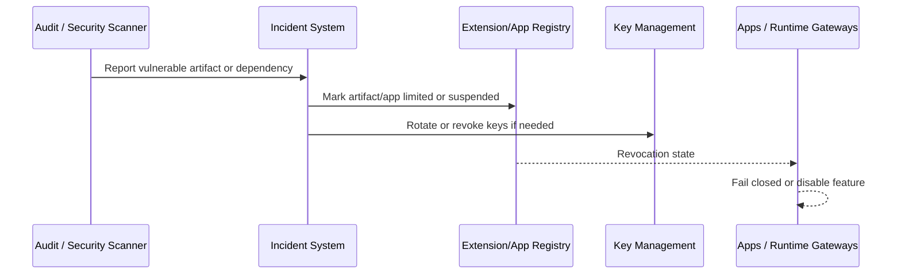

1. Scanner or report identifies supply-chain risk.
2. Incident system records affected artifact, app, provider, or extension.
3. Registry changes lifecycle state.
4. Keys rotate or revoke if needed.
5. Runtime gates fail closed until remediation.

### 6.12 `19/W1`: Capability Certification

```mermaid
sequenceDiagram
  actor Actor as Provider / App / Extension
  participant Cert as Certification System
  participant Tests as Conformance Tests
  participant Gov as Governance Admin
  participant Registry as Canonical Registries
  participant Public as Public Registry Read Model

  Actor->>Cert: Submit manifest and terms
  Cert->>Tests: Run required tests
  Tests-->>Cert: Evidence
  Cert->>Gov: Manual review if high risk
  Gov-->>Cert: Decision
  Cert->>Registry: Write CertificationScopeRecord
  Registry->>Public: Publish status
```

1. Actor submits correct manifest and accepts terms.
2. Tests run for capability, version, geography, data scope, and signing role.
3. Governance reviews high-risk scopes.
4. Certification scope is recorded.
5. Public registry exposes status, keys, incidents, and versions.

### 6.13 `19/W2`: Continuous Audit

```mermaid
sequenceDiagram
  participant Gov as Governance
  participant Audit as Audit APIs
  participant Actor as Provider/App/Extension
  participant Registry as Canonical Registries
  participant Notify as User Notices

  Gov->>Audit: Schedule or trigger audit
  Audit->>Actor: Request evidence
  Actor-->>Audit: Evidence/API responses
  Audit->>Registry: Update audit state
  alt Revoked/Suspended
    Registry->>Notify: Notify affected users/runtimes
  end
```

1. Audit is triggered by schedule, incident, or probe.
2. Actor provides evidence.
3. Audit checks conformance, data use, receipts, manifests, keys, export, and policy.
4. Certification status changes if needed.
5. Affected users/runtimes are notified.

### 6.14 `19/W3`: Dispute Resolution

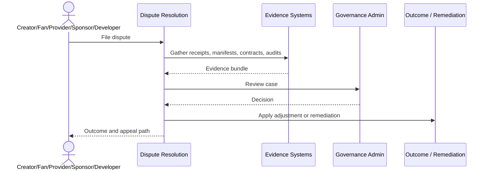

1. Actor files dispute.
2. System gathers receipts, manifests, contracts, audit records, and provider evidence.
3. Governance reviews evidence.
4. Outcome can adjust settlement, require export, reinstate access, revoke scope, or deny claim.
5. Append-only case record stores decision and appeal path.

### 6.15 `19/W4`: API Version Governance

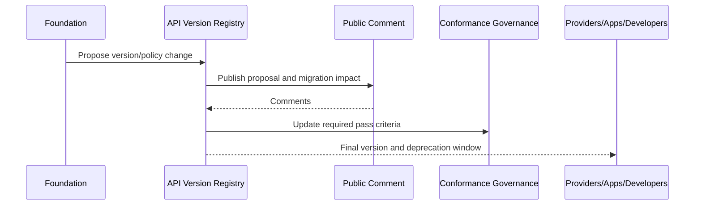

1. Foundation proposes API or manifest version change.
2. Public proposal includes compatibility and migration impact.
3. Comments are reviewed.
4. Test ownership and pass criteria update.
5. Final version and deprecation windows are published.

### 6.16 `19/W5`: Key Revocation

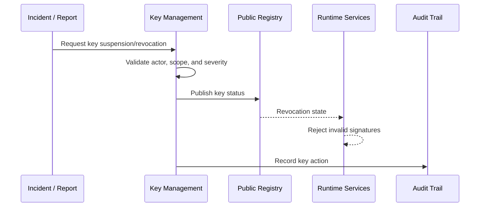

1. Incident, audit, or governance action triggers key review.
2. Key Management validates affected actor, capability, version, service role, and severity.
3. Key status is suspended or revoked.
4. Runtime systems reject invalid signatures.
5. Audit trail preserves pre-revocation receipt validity by key-time evidence.

### 6.17 `19/W6`: Privacy And Data-Rights Governance

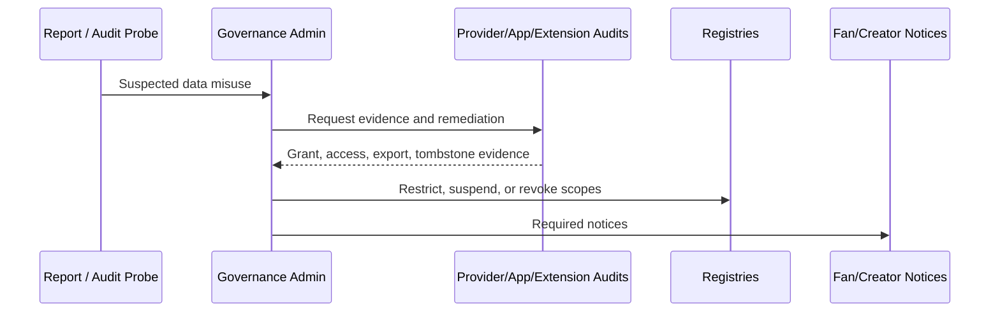

1. Report or audit identifies possible privacy misuse.
2. Governance reviews grants, receipts, export/delete records, relationship records, tombstones, and revocation state.
3. Audit systems collect remediation evidence.
4. Governance can revoke grants, rotate keys, block runtime, require deletion, or suspend scopes.
5. Fan/creator notices and disputes follow policy.

### 6.18 `19/W7`: Utility Fee Governance

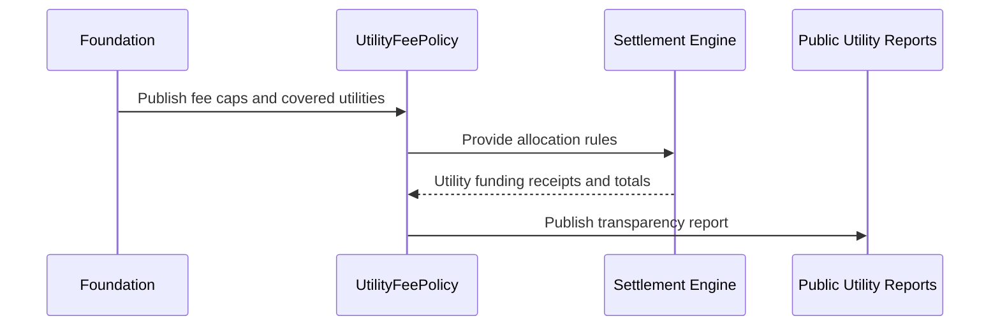

1. Foundation publishes utility fee caps, covered utilities, conflict rules, and transparency requirements.
2. Settlement applies the policy through settlement manifests.
3. Utility funding receipts explain identity, vault, search, settlement, and governance funding.
4. Public reports show budgets, fees, and policy changes.

## 7. Error And Recovery Behavior

| Condition | Required behavior |
| --- | --- |
| Conformance test fails | Certification remains draft/submitted; remediation report is returned. |
| High-risk capability lacks manual approval | Certification remains blocked or limited. |
| Provider key revoked | Runtime rejects signatures for affected key scope and exposes fallback/degraded state. |
| Version deprecation missed | Capability can become limited or suspended until upgraded. |
| Supply-chain artifact revoked | Extension/app runtime fails closed and notifies affected creators/apps. |
| Privacy audit finds misuse | Grants/scopes can be revoked, data deletion verified, and affected users notified. |
