# Loom Architecture 07: Search, Recommendations, And AI

Status: Draft for review  
Source workflow map: `docs/Architecture/02-workflow-inventory-and-function-map.md`

## 1. Purpose

This document defines transaction packet models for public search, AI-assisted discovery, creator archive Q&A, creator AI tooling, recommendation workbenches, session intent feeds, private in-vault assistance, AI provider certification, creator-led referrals, community feed subscriptions, recommendation abuse review, search policy, and search audit probes.

## 2. Functional System Diagram

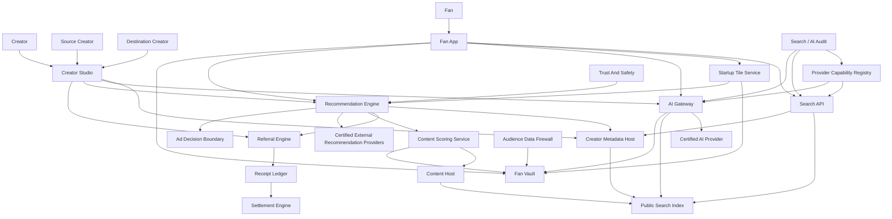

## 3. Packet Envelope

| Field | Meaning |
| --- | --- |
| `actorContext` | Creator, source creator, destination creator, fan, app, provider, or governance actor and session. |
| `queryContext` | Search query, AI prompt, language, filters, app context, safety state, and request id. |
| `sourceContext` | Channel, content, title, `ContentManifest.summary`, transcript, metadata, fan-vault memory, and policy versions used as sources. |
| `policyContext` | Search access policy, AI content policy, privacy mode, indexing consent, data retention, and safety constraints. |
| `intentContext` | Platform intent id, session intent id, active interest tokens, active dislike filters, creator/provider blend, storage preference, and session state. |
| `interestContext` | Fan-owned interests, disliked interests, liked/disliked creators, muted providers, confidence/source metadata, and vault policy. |
| `recommendationContext` | Source creator, destination creator, recommendation provider, audience segment, recommendation surface, score, disclosure text, and session intent. |
| `adContext` | Platform intent ad posture, ad load/breadth policy, creator-approved-only flag, sponsor eligibility boundary, and no-behavioral-targeting flag. |
| `referralContext` | Referral terms, attribution window, eligible action, destination creator, source creator, and settlement rule. |
| `receiptContext` | Impression, click, conversion, AI source use, abuse signal, and settlement receipts. |
| `auditContext` | Correlation id, provider capability version, model/provider id, prompt/source log policy, and probe evidence. |

## 4. Interfaces And Contracts

| Interface or contract | Packet responsibility |
| --- | --- |
| `SearchAccessPolicy` | Creator rules for indexing metadata, posts, transcripts, snippets, and ranking participation. |
| `AIContentPolicy` | Creator rules for AI Q&A, source use, attribution, retention, model access, translation, dubbing, and clipping. |
| `SearchQueryAPI` | Public and app-facing search request and response contract. |
| `SearchIndexWriteAPI` | Index update contract from metadata hosts and content hosts. |
| `AIArchiveQAAPI` | Creator and fan Q&A over approved creator archives. |
| `AICopilotAPI` | Creator drafting, packaging, clipping, and publishing assistance under creator policy. |
| `AIProviderCertificationRecord` | Certified model/provider capabilities, restrictions, audit scope, and source-handling obligations. |
| `FanVaultAssistantAPI` | Private fan-owned AI assistance that reads only fan-granted in-vault data. |
| `FanRecommendationMCPServer` | Fan-controlled AI tool surface for trusted recommendation filtering over eligible creator/follow/recommendation candidates; may use `ContentManifest.summary` and fan title-deemphasis instructions without adding new candidate sources. |
| `ContentManifest.summary` | Required creator-approved short summary used by search, fan apps, recommendation scoring, MCP agents, and accessibility surfaces to evaluate content without over-weighting title wording. |
| `PlatformIntentRegistry` | Certified platform-defined session motives and policy effects. |
| `StartupTileSurfaceAPI` | Returns launch and mid-session content tiles from platform intents, allowed fan interests/dislikes, follows, and public/trending context. |
| `ContentTile` | Fan-facing tile with platform intent, active interest tokens, dislike filters, why-suggested explanation, and disclosure summary. |
| `FanInterestProfileAPI` | Reads and updates fan-owned interests, disliked interests, liked/disliked creators, muted providers, confidence, source, and recency. |
| `SessionIntentAPI` | Creates, switches, clears, and optionally saves the current platform intent plus scoped interest context. |
| `SessionIntent` | Current-session object carrying platform intent, interest tokens, dislike filters, creator/provider blend, ad posture, score weights, and session shape. |
| `SessionIntentDisclosure` | Fan-facing explanation of purpose, creator/provider blend, data posture, ad posture, and session shape. |
| `SessionIntentAdContext` | Ad posture, contextual category, creator-approved-only flag, and ad-load/breadth constraints passed to ad decision systems without raw private behavior. |
| `ContentScoringService` | Scores candidates by platform intent, fan interests/dislikes, source, `ContentManifest.summary` relevance, title-risk/title-summary mismatch, creator reputation, provider score, and host performance metadata. |
| `ContentScoreExplanation` | Fan-facing why-shown factors and suppression reasons. |
| `FanContentFeedbackAPI` | Like, dislike, not interested, flag, save, follow, unfollow, mute, block, and provider mute feedback. |
| `RecommendationGraphAPI` | Creates, reads, ranks, and serves creator-led recommendations. |
| `RecommendationModePolicy` | Machine-readable policy envelope behind a session intent. |
| `ReferralTermsManifest` | Destination creator's referral offer, attribution rules, eligibility, caps, and settlement contract. |
| `RecommendationReceipt` | Signed record for recommendation impression, click, follow, purchase, or conversion. |
| `ReferralSettlementReceipt` | Settlement input for referral revenue allocation. |
| `CommunityFeedSubscription` | Fan subscription to a creator/community recommendation feed. |
| `RecommendationAbuseCase` | Abuse report, evidence, moderation state, and enforcement outcome. |
| `SearchAuditProbeAPI` | Governance or certification probes for neutrality, policy enforcement, and index correctness. |

## 5. Workflow Transaction Packet Models

| Ref | Trigger | Primary packet path | Durable writes / receipts | Completion response |
| --- | --- | --- | --- | --- |
| `02/W4` | Creator publishes recommendation/referral. | Creator Studio -> Recommendation Engine -> Referral Engine -> Metadata Host. | Recommendation object, referral binding, disclosure. | Recommendation becomes eligible for feeds and attribution. |
| `03/W5` | Fan searches or asks for AI-assisted discovery. | Fan App -> Search API -> Search Index -> AI Gateway. | Query telemetry under privacy policy. | Results and optional AI answer returned. |
| `03/W9` | Fan receives creator-led recommendation. | Fan App -> Recommendation Engine -> Metadata Host -> Referral Engine. | Impression/click receipt when eligible. | Fan sees disclosed recommendation. |
| `03/W9A` | Fan chooses platform intent and interests from startup tiles. | Fan App -> Startup Tile Service -> Fan Vault -> Recommendation Engine -> Scoring -> Data Firewall -> Ad Decision boundary. | Session intent record, optional saved preference, interest feedback, discovery receipts. | Fan sees an intent-and-interest-specific feed with score explanations and policy-safe ads. |
| `03/W11` | Fan asks AI archive question. | Fan App -> AI Gateway -> policy/source resolver -> certified AI provider. | AI source-use receipt if monetized or audited. | Answer with citations/limits returned. |
| `11/W1` | Creator enables archive Q&A. | Creator Studio -> AI Gateway -> Metadata Host -> index builder. | AI policy, source grant, index job. | Q&A surface enabled. |
| `11/W2` | Fan uses AI search. | Fan App -> AI Gateway -> Search API -> AI Provider. | Query/source audit subject to fan mode. | AI response and source links returned. |
| `11/W3` | Creator uses AI copilot. | Creator Studio -> AICopilotAPI -> AI Provider -> Metadata Host. | Draft artifact, provenance, accepted edits. | Creator accepts, revises, or discards output. |
| `11/W4` | Creator opens recommendation workbench. | Creator Studio -> Recommendation Engine -> Search/analytics inputs. | Candidate shortlist and selected recommendations. | Creator publishes or rejects recommendations. |
| `11/W5` | Fan uses private in-vault assistant. | Fan App -> Fan Vault -> FanVaultAssistantAPI -> AI Provider. | Local/private memory update per fan grant. | Personalized private answer returned. |
| `11/W6` | AI provider is certified/audited. | Provider -> Certification/Audit -> Provider Registry. | Certification record, restrictions, audit evidence. | AI provider becomes available or limited. |
| `11/W7` | Creator revokes AI indexing/source access. | Creator Studio -> Metadata Host -> AI Gateway -> Search Index. | Revocation record, reindex/delete job. | Future AI access blocked after propagation. |
| `11/W8` | Creator requests AI translation/dubbing/clipping. | Creator Studio -> AI Gateway -> AI Provider -> Content Host. | Derived asset manifest and source royalty receipt if applicable. | Creator receives generated asset for review. |
| `12/W1` | Destination creator publishes referral terms. | Creator Studio -> Referral Engine -> Metadata Host. | Referral terms manifest. | Terms become discoverable to source creators. |
| `12/W2` | Source creator publishes recommendation. | Creator Studio -> Recommendation Engine -> Referral Engine. | Recommendation, referral binding, disclosure. | Recommendation distributed to selected surfaces. |
| `12/W3` | Fan receives trusted recommendation. | Fan App -> Recommendation Engine -> Fan controls -> Metadata Host. | Impression/click/follow receipts as eligible. | Fan can inspect source and opt out. |
| `12/W3A` | Fan switches platform intent, interest, or dislike filters mid-session. | Fan App -> SessionIntentAPI -> Recommendation Engine -> Scoring -> Ad Decision boundary. | Superseded/active session intent state and optional interest/dislike feedback. | Feed is re-ranked under the new platform intent and interest context. |
| `12/W4` | Referral conversion settles. | Referral Engine -> Receipt Ledger -> Settlement Engine. | Conversion and settlement receipts. | Source/destination allocation calculated. |
| `12/W5` | Fan subscribes to community feed. | Fan App -> Community Feed API -> Recommendation Engine. | Feed subscription and preferences. | Feed begins delivering creator/community recommendations. |
| `12/W6` | Recommendation abuse is reviewed. | Report -> Trust And Safety -> Recommendation Engine -> Referral Engine. | Abuse case, enforcement action, adjustment receipt. | Content/reward visibility is preserved, limited, or reversed. |
| `13/W1` | Public search query. | User/App -> Search API -> Search Index -> Metadata Host. | Query metrics under privacy policy. | Ranked public results returned. |
| `13/W2` | Creator sets search policy. | Creator Studio -> Metadata Host -> Search Index. | Search policy version and index update. | Search behavior follows new policy. |
| `13/W3` | Host search certification. | Host -> Certification -> Search Audit -> Provider Registry. | Certification evidence and searchable capability scope. | Host can provide searchable content. |
| `13/W4` | Fan AI search assistant. | Fan App -> AI Gateway -> Search API -> Fan Vault optional. | Source-use and private-memory receipts where applicable. | Assistant response respects public and private boundaries. |
| `13/W5` | Search audit probe. | Governance -> SearchAuditProbeAPI -> Search API -> Registry. | Probe evidence and audit outcome. | Search provider remains certified or gets remediation. |

## 6. Step-By-Step Life Of A Packet Overlays

### 6.1 `02/W4`: Recommendation And Referral

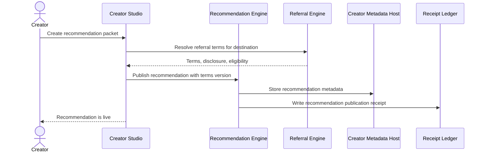

1. Creator Studio signs the recommendation packet with source creator, destination creator, target surfaces, and disclosure copy.
2. `ReferralEngine` validates the destination creator's active `ReferralTermsManifest`.
3. `RecommendationEngine` stores the recommendation and binds it to the terms version used at publication time.
4. `CreatorMetadataAPI` exposes the recommendation to eligible fan apps and community feeds.
5. `ReceiptLedger` records the publication event so later referral conversion disputes can reference the exact terms.

### 6.2 `03/W5`: Search And AI-Assisted Discovery

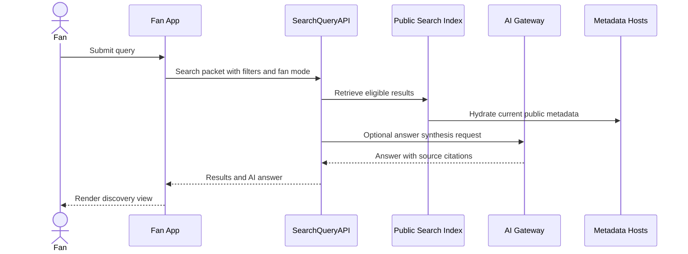

1. The app sends query text, filters, locale, privacy mode, and app certification context.
2. `SearchQueryAPI` uses `SearchAccessPolicy` to exclude content that cannot be indexed, quoted, or ranked.
3. Metadata hosts hydrate results so stale index rows do not override current creator policy.
4. If the fan requests AI assistance, `AIGateway` uses only eligible sources and returns citations.
5. The app renders results with creator, content, monetization, and source-policy indicators.

### 6.3 `03/W9`: Fan Receives Creator-Led Recommendations

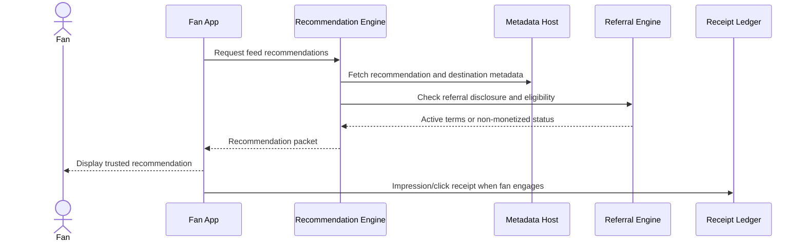

1. The fan app requests recommendations for a feed, search result, channel page, or community subscription.
2. `RecommendationEngine` returns only recommendations compatible with the fan's controls and the app's certification.
3. Referral disclosures travel with the recommendation packet so the fan can inspect commercial context.
4. Fan engagement creates an impression, click, follow, or conversion receipt as allowed by privacy mode.
5. Later settlement uses those receipts rather than app-private logs.

### 6.4 `03/W11`: Fan AI Archive Q&A

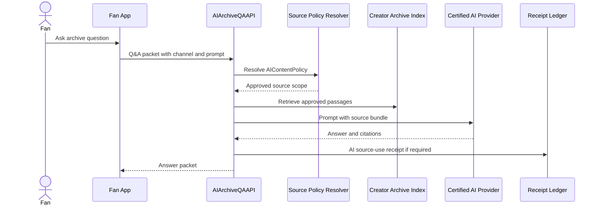

1. The fan selects a creator archive and submits a prompt.
2. `AIArchiveQAAPI` checks the creator's active `AIContentPolicy`, fan entitlement, and safety state.
3. The source bundle contains only permitted transcripts, posts, media metadata, and snippets.
4. The certified AI provider returns an answer with citations and confidence boundaries.
5. Monetized or auditable source use writes a receipt for creator statement and dispute traceability.

### 6.5 `11/W1`: Creator Enables AI Archive Q&A

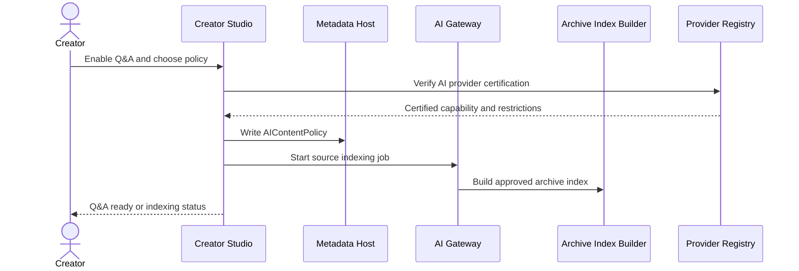

1. Creator Studio captures approved surfaces, retention, attribution, monetization, and model restrictions.
2. `ProviderCapabilityRegistry` verifies that the selected AI provider is certified for archive Q&A.
3. `CreatorMetadataAPI` stores the `AIContentPolicy` as a versioned channel rule.
4. `AIGateway` starts indexing only approved source classes and records index job status.
5. Fan apps expose Q&A only after the policy and index are both active.

### 6.6 `11/W2`: Fan AI Search

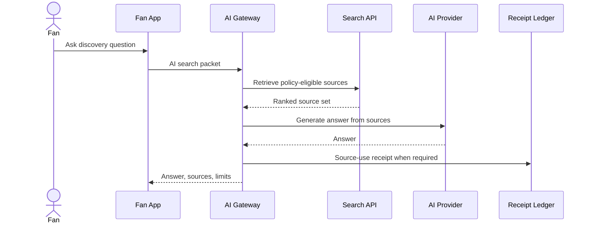

1. The app marks whether the fan wants a public search answer, personalized answer, or mixed answer.
2. `AIGateway` requests eligible public results and applies fan privacy mode before adding any personalization.
3. The model receives source-limited context and cannot persist fan data beyond the certified retention window.
4. The answer includes source links and policy indicators.
5. Source-use receipts feed AI royalty settlement when creator policy requires it.

### 6.7 `11/W3`: Creator AI Copilot For Publishing

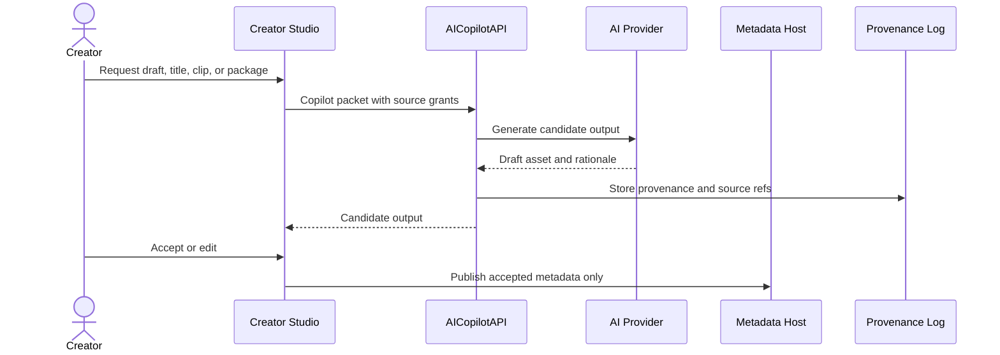

1. Creator Studio sends explicit source grants and task type to `AICopilotAPI`.
2. The provider uses creator-owned or licensed materials under the creator's policy.
3. Generated drafts are provenance logged but are not published automatically.
4. The creator remains the actor for final metadata or content publication.
5. Accepted outputs carry provenance references for later edit history, disputes, or royalty handling.

### 6.8 `11/W4`: AI Recommendation Workbench

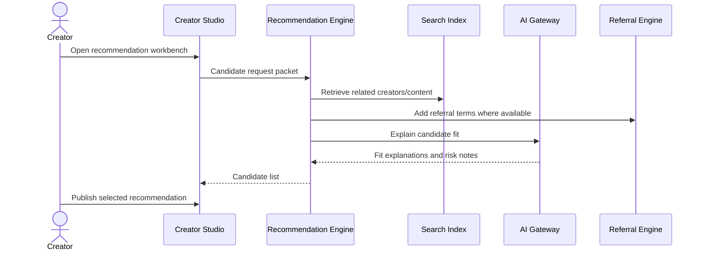

1. The workbench combines creator-declared audience intent with public metadata and referral availability.
2. `RecommendationEngine` excludes candidates that violate policy, safety, or blocked relationship rules.
3. AI explanation helps the creator understand audience fit and disclosure obligations.
4. Publishing still uses the normal recommendation/referral packet model.
5. Rejected candidates are not treated as endorsements or public signals.

### 6.9 `11/W5`: Private In-Vault Recommendation Assistant

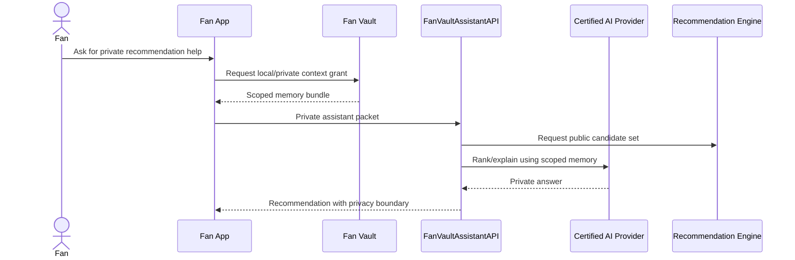

1. The fan grants a scoped memory bundle from the fan vault for the current request.
2. Public candidates come from the recommendation/search layer; private memory does not enter the public graph.
3. The certified AI provider receives the minimum scoped context needed for the answer.
4. The answer explains that personalization came from private vault context.
5. No creator or sponsor receives private in-vault data unless the fan separately grants it.

### 6.10 `11/W6`: AI Provider Certification And Audit

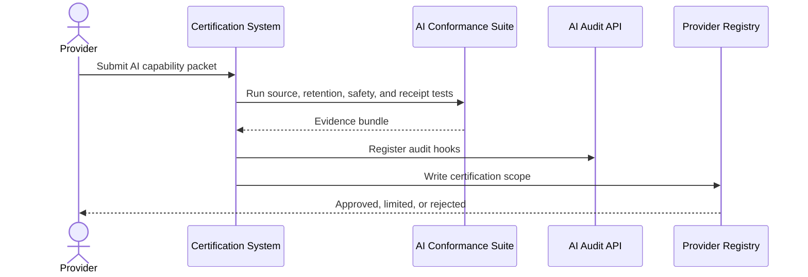

1. The provider declares model capability, source handling, retention, training use, safety limits, and API versions.
2. The conformance suite tests source restrictions, deletion, citation, receipt, and privacy behavior.
3. Audit hooks are registered before the provider is available to apps or creators.
4. `ProviderCapabilityRegistry` publishes the certified scope and any limitations.
5. Runtime calls must include the provider certification version used.

### 6.11 `11/W7`: Creator Revokes AI Indexing Or Source Access

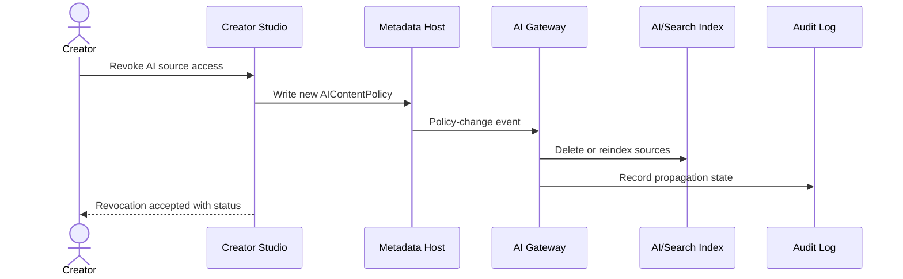

1. Creator Studio writes a new policy version that removes indexing or source-use permission.
2. Metadata host emits the policy-change event to AI and search indexing services.
3. Existing source indexes are deleted or rebuilt based on the new policy.
4. Audit state tracks propagation so fan apps can display pending restrictions if needed.
5. New AI answers must stop using revoked sources once the revocation is active.

### 6.12 `11/W8`: AI Translation, Dubbing, Or Clipping

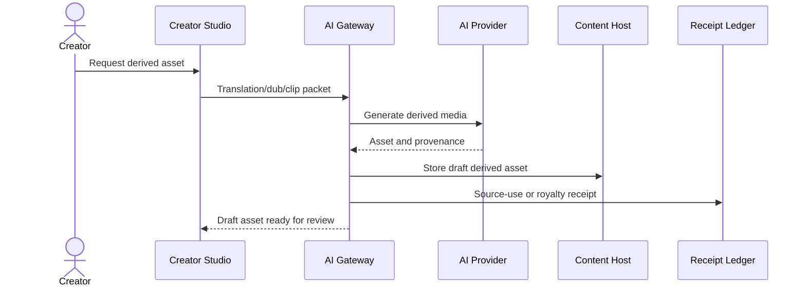

1. The creator selects source media, target language or clip settings, and publication constraints.
2. `AIGateway` verifies source rights and provider certification for the requested derived work.
3. The AI provider generates a draft asset and returns provenance.
4. The content host stores the asset as a draft until the creator approves publication.
5. If source royalties apply, the receipt ledger records the source-use event.

### 6.13 `12/W1`: Destination Creator Publishes Referral Terms

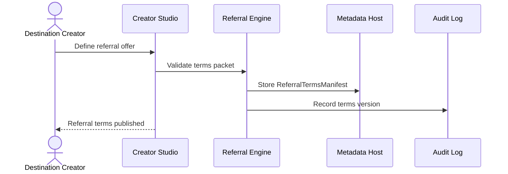

1. The destination creator defines eligible products, attribution windows, rates, caps, exclusions, and disclosures.
2. `ReferralEngine` validates that terms are compatible with settlement, safety, and platform policy.
3. The terms manifest is stored on the metadata host and assigned a stable version.
4. Source creators can discover and bind to that version.
5. Later settlement never applies unpublished or retroactively changed terms to prior referrals.

### 6.14 `12/W2`: Source Creator Publishes Recommendation

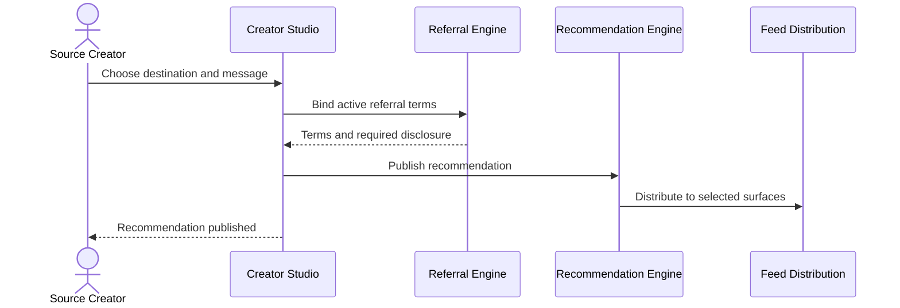

1. The source creator selects the destination creator, content, or offer to recommend.
2. Active referral terms are bound before publication.
3. Required disclosure is stored with the recommendation packet.
4. Feed distribution respects fan controls, creator settings, and app surface eligibility.
5. The source creator can later pause the recommendation without deleting historical receipts.

### 6.15 `12/W3`: Fan Receives Trusted Recommendation

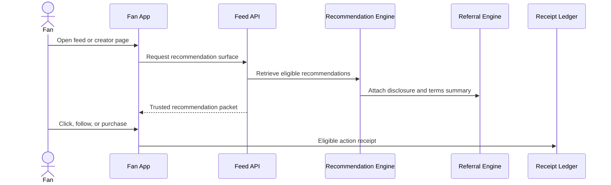

1. The fan app asks for a recommendation surface tied to a creator, community feed, or discovery context.
2. Recommendations are filtered against blocks, opt-outs, safety state, and privacy mode.
3. The fan sees source creator, destination creator, and referral disclosure before acting.
4. Eligible engagement produces a signed receipt with the bound terms version.
5. The fan can mute recommendation sources or referral-backed recommendations.

### 6.16 `12/W4`: Referral Settlement

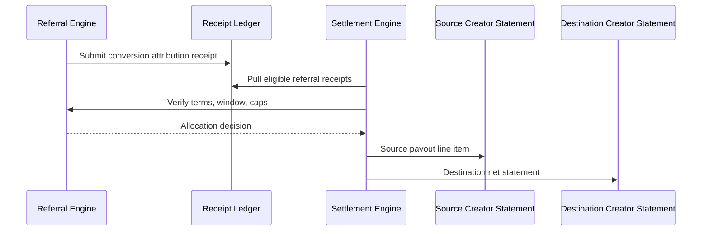

1. Conversion receipts carry fan action, source recommendation, destination product, and terms version.
2. `SettlementEngine` checks eligibility, duplicate claims, attribution windows, and caps.
3. `ReferralEngine` returns the allocation rule for the bound terms version.
4. Settlement statements show gross conversion, referral allocation, platform utility fees, and adjustments.
5. Disputes reference the same immutable receipts.

### 6.17 `12/W5`: Community Feed Subscription

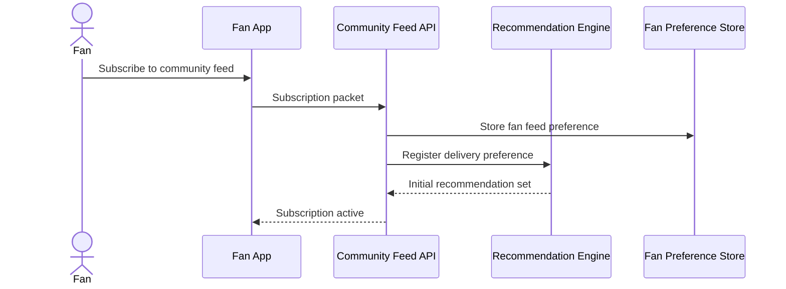

1. The fan selects a community, creator, topic, or curated recommendation feed.
2. The subscription stores delivery preferences and muting controls in the fan-owned preference store.
3. `RecommendationEngine` uses the subscription only for feed delivery and not as a public endorsement.
4. The initial feed packet contains recommendation provenance and disclosures.
5. The fan can unsubscribe or export preferences through fan data portability flows.

### 6.18 `12/W6`: Recommendation Abuse Review

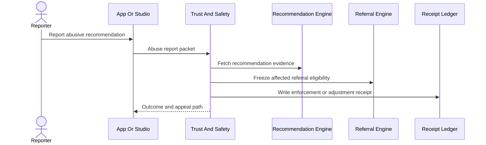

1. A fan, creator, sponsor, or reviewer submits the report with recommendation id and evidence.
2. Trust and Safety retrieves the recommendation, disclosure, targeting, and referral terms.
3. The referral engine can freeze pending rewards while review is active.
4. Enforcement may remove the recommendation, limit distribution, reverse rewards, or require disclosure changes.
5. Outcome and appeal state are attached to the recommendation abuse case.

### 6.19 `13/W1`: Public Search Query

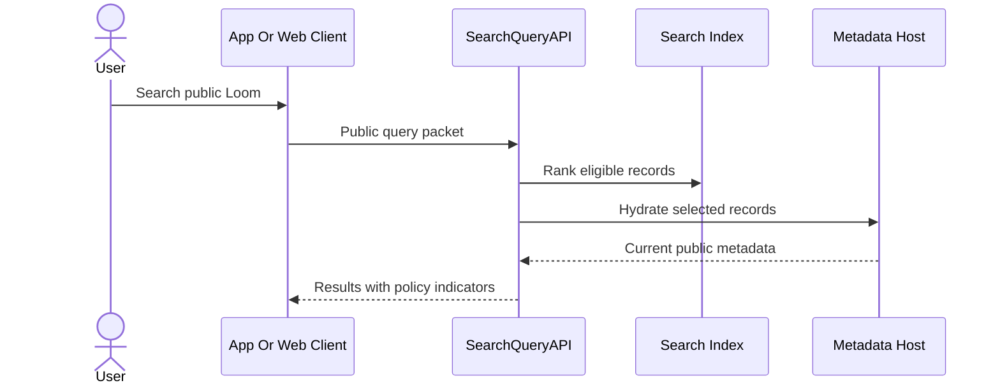

1. The client sends query, filters, locale, and app context without requiring fan login for public search.
2. `SearchQueryAPI` ranks only policy-eligible public records.
3. Metadata hydration ensures takedowns, private status, and creator policy changes are reflected.
4. Results include content type, creator, access mode, and snippet rules.
5. Public query metrics are aggregated under privacy and search audit policy.

### 6.20 `13/W2`: Creator Sets Search Policy

```mermaid
sequenceDiagram
  actor Creator
  participant Studio as Creator Studio
  participant CMH as Metadata Host
  participant Index as Search Index
  participant Search as Search API

  Creator->>Studio: Update search policy
  Studio->>CMH: Write SearchAccessPolicy
  CMH->>Index: Emit reindex event
  Index->>Search: Publish refreshed searchable state
  Studio-->>Creator: Policy active or propagating
```

1. The creator chooses indexability, snippets, transcript exposure, region limits, and ranking participation.
2. `CreatorMetadataAPI` validates policy against content access mode and platform safety rules.
3. The metadata host emits a reindex event with the new policy version.
4. Search surfaces mark results as updated once the index confirms propagation.
5. Apps must honor the latest policy version returned with search results.

### 6.21 `13/W3`: Host Search Certification

```mermaid
sequenceDiagram
  actor Host
  participant Cert as Certification System
  participant Probe as Search Audit Probe
  participant Registry as Provider Registry
  participant Search as Search API

  Host->>Cert: Submit searchable-host capability
  Cert->>Probe: Run index freshness and policy tests
  Probe->>Search: Probe sample content
  Search-->>Probe: Probe results
  Probe-->>Cert: Evidence bundle
  Cert->>Registry: Write certified search capability
```

1. A host declares it can publish searchable metadata, transcript references, freshness signals, and deletion events.
2. Certification probes validate policy enforcement, freshness, deletion, and snippet handling.
3. Probe results become evidence in the provider certification record.
4. The registry publishes certified search roles and restrictions.
5. Apps and search services can rely on the host's certified endpoint only within that scope.

### 6.22 `13/W4`: Fan AI Search Assistant

```mermaid
sequenceDiagram
  actor Fan
  participant App as Fan App
  participant AI as AI Gateway
  participant Search as Search API
  participant Vault as Fan Vault
  participant Model as AI Provider

  Fan->>App: Ask assistant
  App->>AI: Assistant packet with mode
  AI->>Search: Retrieve public eligible sources
  AI->>Vault: Request optional fan-granted context
  Vault-->>AI: Scoped private context or denial
  AI->>Model: Generate answer from allowed context
  Model-->>AI: Answer with source boundaries
  AI-->>App: Assistant response
```

1. The fan chooses whether the assistant may use only public data or also private vault context.
2. Public sources come through `SearchQueryAPI` and retain creator policy limits.
3. Fan vault context is optional, scoped, and not written to public recommendation systems.
4. The AI provider receives a combined source bundle only if both creator policy and fan grant allow it.
5. The response labels public sources and private personalization separately.

### 6.23 `13/W5`: Search Audit Probe

```mermaid
sequenceDiagram
  actor Governance
  participant Probe as SearchAuditProbeAPI
  participant Search as Search API
  participant Index as Search Index
  participant Registry as Provider Registry
  participant Incident as Incident System

  Governance->>Probe: Launch audit probe
  Probe->>Search: Execute controlled queries
  Search->>Index: Retrieve ranked records
  Search-->>Probe: Results, policy versions, logs
  Probe->>Registry: Record audit evidence
  Probe->>Incident: Open incident if probe fails
```

1. Governance launches a probe for neutrality, freshness, deletion, policy enforcement, or abuse handling.
2. Controlled queries exercise known records and expected policy outcomes.
3. `SearchQueryAPI` returns result ids, policy versions, ranking metadata, and diagnostic logs.
4. The provider registry records pass/fail evidence against the certified scope.
5. Serious failures open an incident and can limit search certification until remediation.

### 6.24 `03/W9A` / `12/W3A`: Startup Tile Selection And Intent-Aware Scoring

```mermaid
sequenceDiagram
  actor Fan
  participant App as Fan App
  participant Tiles as StartupTileSurfaceAPI
  participant Vault as Fan Vault
  participant Intent as SessionIntentAPI
  participant ADF as Audience Data Firewall
  participant Rec as Recommendation Engine
  participant MCP as FanRecommendationMCPServer
  participant Provider as External Recommendation Providers
  participant Score as Content Scoring Service
  participant Host as HostingTrendingStatsAPI
  participant Ad as Ad Decision Boundary
  participant Ledger as Receipt Ledger

  Fan->>App: Open app or switch what they want now
  App->>Tiles: Request startup content tiles
  Tiles->>Vault: Read allowed FanInterestProfile and dislikes
  Tiles-->>App: ContentTile list with platform intent and interests
  Fan->>App: Select tile, dislike interest, mute creator/provider, or clear
  App->>Intent: Create SessionIntent with PlatformIntent and interest filters
  Intent->>ADF: Check platform intent and interest posture against policy
  ADF-->>Intent: Allowed posture or policy denial
  Intent->>Rec: Request candidates for SessionIntent
  Rec->>Provider: Pull external candidates within platform-intent quota
  Rec->>Host: Pull aggregate performance stats if policy permits
  Rec->>MCP: Optional fan instruction: deemphasize clickbait/ragebait titles
  MCP-->>Rec: Metadata weighting preference, not new candidates
  Rec->>Score: Score candidates using summary, source, title risk, and performance
  Score->>Vault: Apply interest match and dislike suppression
  Score-->>Rec: Ranked items and ContentScoreExplanation
  Rec->>Ad: Pass SessionIntentAdContext and creator-approved-only posture
  Rec-->>App: Feed items, score explanations, disclosures, ad constraints
  App->>Ledger: DiscoveryReceipt or feedback receipt when eligible
  App-->>Fan: Render intent-and-interest-specific feed
```

1. Fan App opens with startup tiles instead of a generic engagement feed.
2. `StartupTileSurfaceAPI` combines certified `PlatformIntent` definitions with allowed `FanInterestProfile` tokens, disliked interests, disliked creators, muted providers, follows, and public/trending context.
3. A `ContentTile` contains one platform intent and optional interest/dislike filters, such as Learning + Tennis, Reviews + Video Games, Entertainment + Comedy, Creator Updates, or Friends and Family.
4. Fan selection creates a `SessionIntent` with platform intent, active interest tokens, active dislike filters, creator/provider blend, ad posture, and storage preference.
5. Audience Data Firewall evaluates platform intent and interest/dislike posture against privacy mode, age/region policy, grants, vault policy, and direct-connection restrictions.
6. Recommendation Engine fetches followed-creator candidates, creator recommendations, community feed candidates, direct-connection candidates, neutral search-derived candidates, certified external provider candidates, and host performance signals only as permitted by the platform intent.
7. Candidate metadata includes title plus required creator-approved `ContentManifest.summary`; fan agents and recommendation engines may use the summary for relevance instead of over-weighting promotional title wording.
8. If the fan uses a Claude, ChatGPT, Gemini, or other MCP-based recommendation agent and instructs it to ignore clickbait/ragebait titles, `FanRecommendationMCPServer` returns metadata weighting preferences only; it does not add candidates outside followed creators, trusted creators, or creator-authored recommendations for Fan Recommendation AI.
9. `ContentScoringService` assigns scores using followed creator, creator recommendation, external provider score where allowed, content summary relevance, title risk/title-summary mismatch, host trending/freshness/being-watched/view-count signals, creator reputation, fan interest relevance, dislike suppression, and safety labels.
10. Platform intent sets first-line protection by limiting provider quota and engagement-maximizing signals; creator reputation, summary/title mismatch, and safety labels are second-line defenses against clickbait and ragebait.
11. Recommendation Engine sends only `SessionIntentAdContext` and ad posture to the ad decision boundary; raw private behavior does not become ad targeting input.
12. Ad Decision still requires `CreatorAdPolicy`, sponsor policy, safety labels, and campaign compliance before any ad or sponsor placement can appear.
13. Fan App renders the platform intent label, title, summary where appropriate, active interests, source disclosures, funding/referral labels, score explanation, and controls to like, dislike, flag, follow, unfollow, mute, block, switch, save, or clear.
14. Discovery, referral, search, data-access, interest-feedback, or safety receipts are created only where the downstream workflow requires them.

## 7. Error And Recovery Behavior

| Failure mode | Recovery behavior |
| --- | --- |
| Index result conflicts with latest creator policy. | Search hydrates metadata, suppresses stale result, and emits a reindex repair event. |
| AI provider cannot satisfy source or retention policy. | `AIGateway` denies the call or routes to another certified provider. |
| Referral terms changed after recommendation publication. | Settlement uses the terms version bound in the recommendation receipt. |
| Fan privacy mode blocks personalization. | Search and AI return public-only results and label personalization as unavailable. |
| Session intent requests blocked data. | Audience Data Firewall narrows the data posture, returns a policy-safe disclosure, or denies the intent if no compliant version exists. |
| Fan dislikes an interest or creator. | Fan Vault records a negative signal and scoring suppresses matching candidates without deleting required receipts. |
| External recommendation provider exceeds intent quota. | Recommendation Engine drops excess provider candidates and records audit evidence for provider/app conformance. |
| Recommendation abuse case is opened. | Recommendation distribution and referral eligibility can be frozen until outcome. |
| Audit probe fails. | Provider registry marks remediation, limitation, suspension, or revocation state. |
