# Loom Architecture 08: Extensions, Campaigns, And Sponsor Tools

Status: Draft for review  
Source workflow map: `docs/Architecture/02-workflow-inventory-and-function-map.md`

## 1. Purpose

This document defines transaction packet models for the extension platform, campaign runtime, sponsor campaign setup, data grants, CRM/direct-contact extension access, fan participation, reward settlement, extension suspension, extension state export, sponsor reporting, and sponsor-free premium variants.

## 2. Functional System Diagram

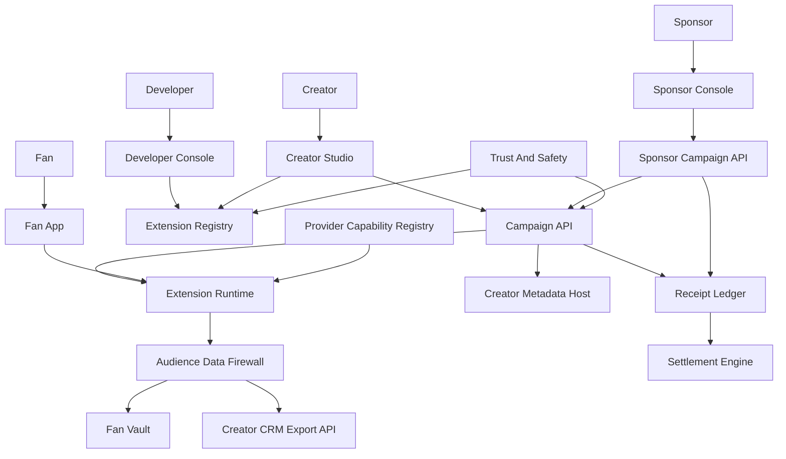

## 3. Packet Envelope

| Field | Meaning |
| --- | --- |
| `extensionContext` | Extension id, developer id, manifest version, artifact version, permissions, surfaces, risk tier, and suspension state. |
| `campaignContext` | Campaign id, creator id, sponsor id, objective, audience, budget, schedule, reward rules, and compliance state. |
| `fanGrantContext` | Fan identity, pairwise creator identity, requested fields, creator interest-data fields, purpose, retention, revocation, ad-use flag, offer context, category defaults, and private-mode state. |
| `sponsorContext` | Sponsor account, brand safety constraints, accepted session intent ad contexts, requested fan-interest fields, reporting scope, invoicing, allowed metrics, and denied data fields. |
| `runtimeContext` | App surface, extension runtime session, sandbox permissions, event id, idempotency key, and provider version. |
| `receiptContext` | Participation, reward, conversion, sponsor spend, developer fee, and settlement receipts. |
| `auditContext` | Artifact attestation, permission grant, data-access receipt, compliance review, suspension, and export evidence. |

## 4. Interfaces And Contracts

| Interface or contract | Packet responsibility |
| --- | --- |
| `ExtensionManifest` | Declares surfaces, requested permissions, data scopes, risk tier, pricing, export behavior, and runtime needs. |
| `ExtensionArtifactAPI` | Stores signed extension bundles, versions, attestations, and rollback targets. |
| `ExtensionInstallGrant` | Creator approval for extension install, surfaces, permissions, and campaign use. |
| `ExtensionRuntimeAPI` | Sandboxed runtime calls between fan apps, extensions, campaign services, and platform APIs. |
| `CampaignManifest` | Creator/sponsor campaign objective, eligibility, data grants, reward rules, schedule, and settlement rules. |
| `SponsorCampaignAPI` | Sponsor setup, approvals, budget, reporting, invoicing, and sponsor-safe metrics. |
| `SessionIntentAdContext` | Platform-intent ad posture, contextual category, creator-approved-only flag, and ad-load/breadth boundary from the current fan session intent; never raw private behavior, raw interest tokens, or dislike records. |
| `AudienceDataFirewallPolicy` | Data minimization, field gating, aggregation thresholds, denial reasons, retention, and revocation. |
| `CampaignDataGrant` | Fan-granted campaign data scope, purpose, expiration, and revocation state. |
| `FanDataGrantOffer` | Data-for-value offer terms, requested fan interest/ad-preference fields, reward/promo value, retention, ad-use flag, and alternate path. |
| `CreatorInterestDataGrant` | Fan-approved creator-scoped grant for interests, likes, dislikes, creator dislikes, muted providers, and ad preferences. |
| `CreatorCategoryPermissionPolicy` | Fan defaults for broad creator categories that campaign and sponsor tools must honor. |
| `FanAdPreferencesAPI` | Fan ad preference settings available to campaign/ad tools only through explicit grants. |
| `PermissionedAudienceInterestDataAPI` | Creator-side query path for approved creator-scoped fan interest/ad-preference fields or aggregate counts. |
| `CreatorCRMExportAPI` | Direct-contact and CRM export path for permissioned audience data. |
| `CampaignParticipationReceipt` | Signed participation, reward, conversion, and spend events. |
| `SponsorReport` | Aggregated campaign performance report with privacy thresholds and settlement reconciliation. |
| `ExtensionSuspensionRecord` | Suspension reason, affected versions, blocked permissions, remediation, and export window. |
| `ExtensionStateExport` | Portable extension state owned by creator/fan and constrained by export policy. |

## 5. Workflow Transaction Packet Models

| Ref | Trigger | Primary packet path | Durable writes / receipts | Completion response |
| --- | --- | --- | --- | --- |
| `02/W3` | Creator launches extension-powered campaign. | Creator Studio -> Extension Registry -> Campaign API -> Fan App runtime. | Install grant, campaign manifest, runtime config. | Campaign is available to fans. |
| `03/W6` | Fan participates in campaign and earns reward. | Fan App -> Extension Runtime -> Campaign API -> Receipt Ledger. | Participation grant, reward receipt. | Fan receives reward or ineligible reason. |
| `10/W1` | Developer publishes extension. | Developer Console -> Extension Registry -> Certification. | Manifest, signed artifact, attestation, listing. | Extension listed or remediation returned. |
| `10/W2` | Creator installs extension. | Creator Studio -> Extension Registry -> permission review -> Metadata Host. | `ExtensionInstallGrant`. | Extension becomes active on approved surfaces. |
| `10/W3` | Fan participates in campaign extension. | Fan App -> Extension Runtime -> Data Firewall -> Campaign API. | Campaign grant, optional creator interest-data grant, participation receipt. | Fan completes campaign step and sees data-use status. |
| `10/W3A` | Extension requests CRM or direct-contact access. | Extension Runtime -> CreatorCRMExportAPI -> Audience Data Firewall. | Data-access receipt or denial. | Access is granted, narrowed, or denied. |
| `10/W4` | Sponsor campaign executes. | Sponsor Console -> SponsorCampaignAPI -> Campaign API -> Fan App. | Sponsor budget, delivery, participation, spend receipts. | Campaign runs and reports aggregate performance. |
| `10/W5` | Extension is suspended. | Trust/Safety -> Extension Registry -> Runtime blocklist. | Suspension record and remediation state. | Extension runtime calls are blocked or limited. |
| `10/W6` | Extension state is exported. | Creator/Fan -> Extension Registry -> Extension Runtime -> export package. | Export receipt and package manifest. | Portable extension state is delivered. |
| `18/W1` | Sponsor sets up campaign. | Sponsor Console -> SponsorCampaignAPI -> Creator approval -> Campaign API. | Campaign proposal, approvals, budget reservation. | Campaign ready for creator or platform approval. |
| `18/W2` | Fan participates in sponsor campaign. | Fan App -> Extension Runtime -> Data Firewall -> Campaign API. | Campaign grant, optional creator interest-data grant, participation, reward receipt. | Fan sees reward and data-use status. |
| `18/W2B` | Fan grants sponsor-linked creator interest data. | Fan App -> `ConsentGrantAPI` -> Audience Data Firewall -> `PermissionedAudienceInterestDataAPI`. | `CreatorInterestDataGrant`, data-access receipt, category policy update if selected. | Creator/sponsor tooling receives approved fields, aggregate counts, or denial. |
| `18/W2A` | Sponsor asks for too much audience data. | SponsorCampaignAPI -> Audience Data Firewall -> Creator/Sponsor response. | Denial or narrowed scope record. | Sponsor receives approved aggregate or denial reason. |
| `18/W3` | Sponsor reporting and settlement. | SponsorCampaignAPI -> Receipt Ledger -> Settlement Engine. | Spend, reward, developer, creator, and sponsor reports. | Statements and invoices are produced. |
| `18/W4` | Fan chooses sponsor-free premium variant. | Fan App -> Fan Wallet -> Campaign API/ad decision. | Premium entitlement and no-sponsor delivery state. | Sponsor campaign is suppressed for that fan. |

## 6. Step-By-Step Life Of A Packet Overlays

### 6.1 `02/W3`: Extension-Powered Campaign

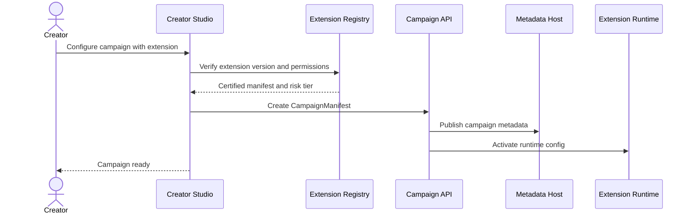

1. Creator Studio composes the campaign objective, surfaces, schedule, reward rules, and extension version.
2. `ExtensionRegistry` validates certification, suspension state, permission scopes, and risk tier.
3. `CampaignAPI` writes the campaign manifest and connects it to creator metadata.
4. `ExtensionRuntimeAPI` receives sandbox configuration for the approved app surfaces.
5. Fan apps discover the campaign through channel metadata and render the extension surface.

### 6.2 `03/W6`: Campaign Participation And Reward

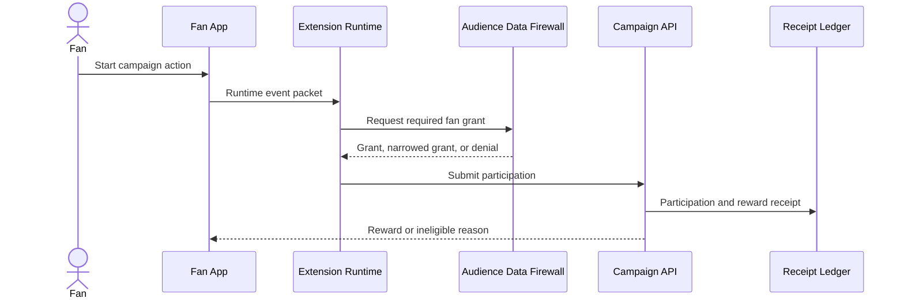

1. The fan app launches the certified extension in the approved surface.
2. The extension requests only the fields declared in the campaign manifest.
3. `AudienceDataFirewallPolicy` applies fan privacy mode, minimization, and revocation state.
4. `CampaignAPI` validates eligibility and writes the participation receipt.
5. The fan receives a reward, pending state, or precise ineligible reason.

### 6.3 `10/W1`: Developer Publishes Extension

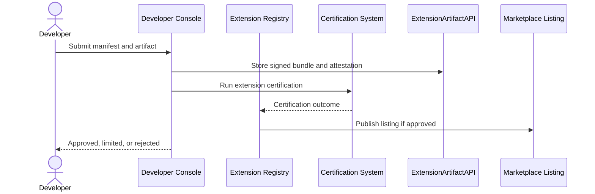

1. The developer submits `ExtensionManifest`, signed artifact, build attestation, pricing, and export behavior.
2. `ExtensionArtifactAPI` stores immutable artifact versions.
3. Certification checks permissions, sandbox behavior, receipts, privacy, and supply-chain evidence.
4. Approved versions are listed with explicit risk tier and data scopes.
5. Rejected versions return remediation without becoming installable.

### 6.4 `10/W2`: Creator Installs Extension

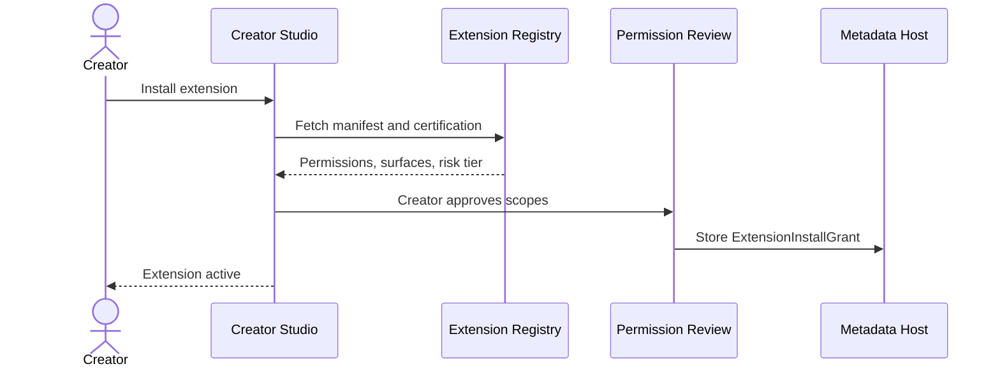

1. Creator Studio presents requested surfaces, data scopes, sponsor access, fees, and risk tier.
2. The creator approves, narrows, or rejects extension permissions.
3. `ExtensionInstallGrant` is stored as creator metadata and can be revoked later.
4. The extension runtime activates only on approved surfaces.
5. Existing campaigns must revalidate if install permissions change.

### 6.5 `10/W3`: Fan Participates In Campaign Extension

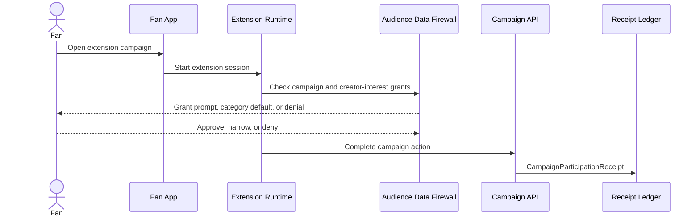

1. The fan app creates a runtime session tied to extension version, campaign id, and app surface.
2. The firewall evaluates requested fan data against campaign purpose, creator interest-data purpose, creator category defaults, fan ad preferences, and fan privacy mode.
3. The fan can approve, narrow, deny, apply a creator-category default, or choose alternate entry before participation continues.
4. `ConsentGrantAPI` records purpose, fields, retention, ad-use flag, offer context, and revocation behavior for grant-backed access.
5. The extension submits the completed action to `CampaignAPI`.
6. The receipt ledger stores data-access, participation, and reward evidence for reporting and settlement.

### 6.6 `10/W3A`: CRM Or Direct-Contact Extension Access

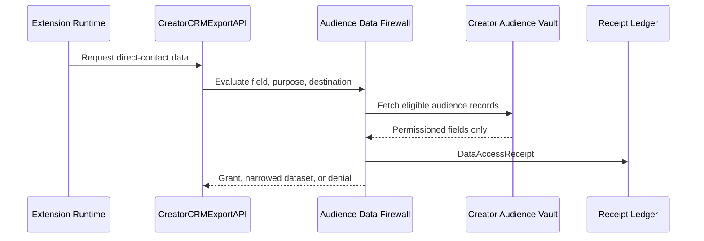

1. The extension declares fields, destination, retention, sponsor involvement, and contact purpose.
2. `CreatorCRMExportAPI` routes all direct-contact requests through the Audience Data Firewall.
3. The firewall removes fans who revoked visibility, blocked export, are in private mode, or lack direct-contact grants.
4. Every granted or denied access writes a `DataAccessReceipt`.
5. The extension receives only the narrowed dataset or a machine-readable denial reason.

### 6.7 `10/W4`: Sponsor Campaign Execution

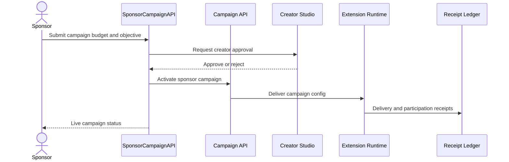

1. Sponsor setup includes objective, budget, brand constraints, accepted session intent ad contexts, reward rules, reporting scope, and requested data.
2. Creator approval is required before campaign delivery on creator-controlled surfaces.
3. `CampaignAPI` activates the campaign only after budget and compliance checks pass.
4. Runtime delivery and participation events write signed receipts.
5. Sponsor reporting is built from approved aggregate metrics and settlement receipts.

### 6.8 `10/W5`: Extension Suspension

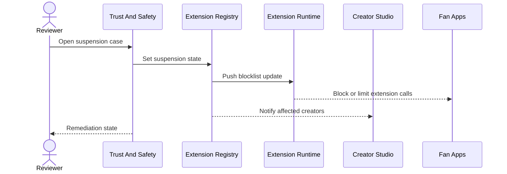

1. Trust and Safety opens a case tied to extension id, version, artifact hash, and reason.
2. The registry marks affected versions as limited, suspended, or revoked.
3. Runtime blocklists prevent new sessions and can terminate active sessions.
4. Creators and fans receive product-safe messaging and export/remediation options.
5. Reinstatement requires new evidence or a certified replacement version.

### 6.9 `10/W6`: Extension State Export

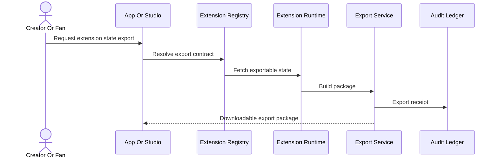

1. The owner requests export from the creator studio, fan app, or provider exit flow.
2. `ExtensionManifest` defines what state is creator-owned, fan-owned, sponsor-owned, or non-exportable.
3. The runtime returns exportable state using the manifest's schema and version.
4. The export service creates a signed package with schema, owner, timestamp, and integrity hash.
5. The audit ledger records the export for portability and compliance.

### 6.10 `18/W1`: Sponsor Campaign Setup

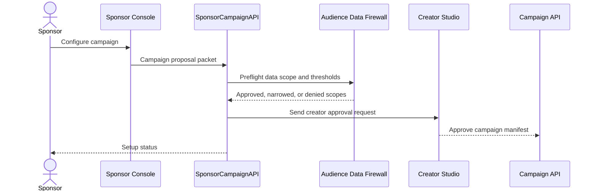

1. Sponsor Console captures objective, contextual session intent categories, target constraints, budget, reward, requested fan interest/ad-preference fields, data needs, and reporting needs.
2. `AudienceDataFirewallPolicy` preflights whether requested fields require explicit fan grants, must be aggregated, or must be denied.
3. Creator Studio receives a campaign proposal with the narrowed data scope and brand terms.
4. Campaign activation requires creator approval, budget reservation, and `FanDataGrantOffer` terms when the campaign asks fans to share interest/ad-preference data.
5. Denied scopes are returned with specific policy reasons.

### 6.11 `18/W2`: Fan Campaign Participation

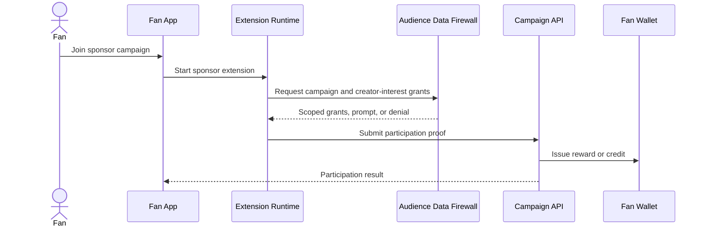

1. The fan joins from a clearly labeled sponsor campaign surface.
2. The extension requests only data allowed by campaign scope, `FanDataGrantOffer`, creator category defaults, and fan choice.
3. Fan can approve, narrow, deny, or use alternate entry before grant-protected data is accessed.
4. `CampaignAPI` validates the participation proof and anti-fraud constraints.
5. Rewards are issued to the fan wallet or marked pending.
6. The fan can inspect, revoke, or export the campaign grant and creator interest-data grant later.

### 6.12 `18/W2B`: Sponsor-Linked Creator Interest-Data Grant

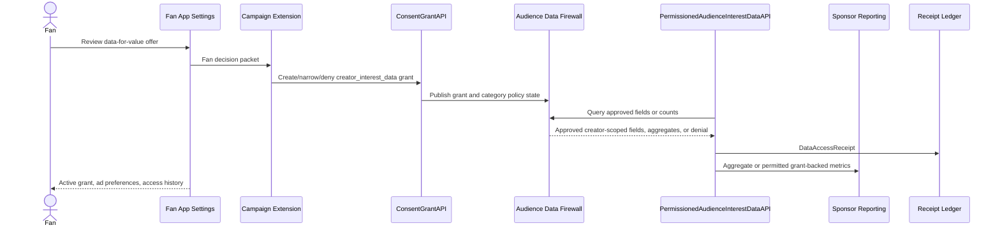

1. Fan opens the campaign or Fan App settings request for a sponsor-linked creator offer.
2. The offer names the creator, sponsor, requested interests/likes/dislikes/ad preferences, purpose, retention, ad-use flag, reward value, and alternate path.
3. Fan approves, denies, narrows fields, revokes an existing grant, or applies a creator-category default.
4. `ConsentGrantAPI` records the `creator_interest_data` grant or denial.
5. Audience Data Firewall applies privacy mode, relationship state, block/dislike state, age/region rules, category policy, purpose, retention, and ad-use limits.
6. `PermissionedAudienceInterestDataAPI` returns only approved creator-scoped fields or aggregate counts.
7. Sponsor reporting receives aggregate, clean-room, or explicitly grant-backed metrics according to the campaign contract.
8. `DataAccessReceipt` and Fan App settings expose actual access and revocation state.

### 6.13 `18/W2A`: Sponsor Request For Audience Data Is Narrowed Or Denied

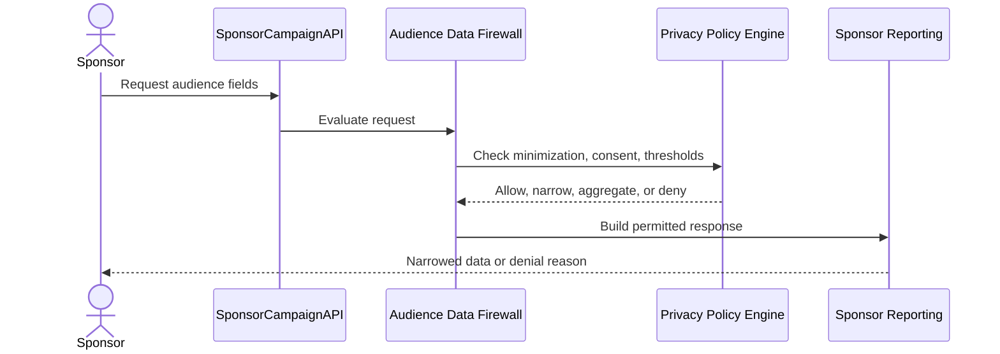

1. Sponsor requests are evaluated by field, purpose, audience size, retention, and destination.
2. The firewall applies fan grants, creator interest-data grants, creator category defaults, creator policy, private mode, minor/vulnerable-user rules, and aggregation thresholds.
3. Direct identifiers, interest records, ad preferences, and disliked-creator data are denied unless explicit grants and creator policy allow the requested purpose.
4. Sponsor receives aggregate metrics, a narrowed dataset, or a structured denial reason.
5. The decision is logged for privacy audit and later campaign disputes.

### 6.14 `18/W3`: Sponsor Reporting And Settlement

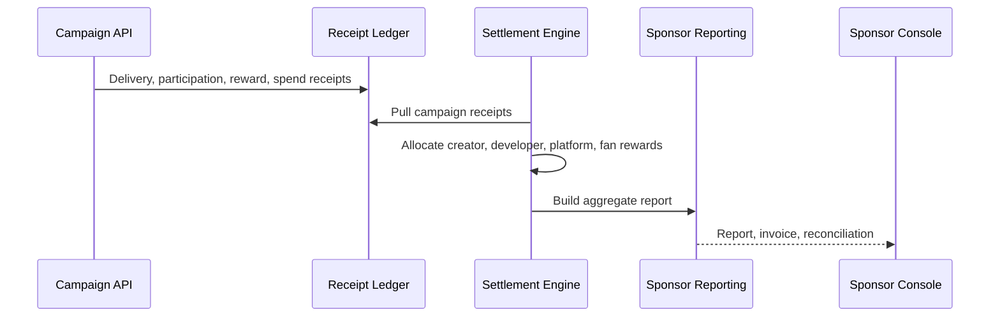

1. Campaign runtime writes delivery, participation, reward, and sponsor-spend receipts.
2. Settlement validates budget caps, fraud adjustments, reward eligibility, and developer fees.
3. Sponsor reports use aggregated metrics and privacy thresholds, not raw fan exports.
4. Creator, developer, fan reward, and platform utility allocations are reconciled.
5. The sponsor receives an invoice and a report linked to the receipt set.

### 6.15 `18/W4`: Sponsor-Free Premium Variant

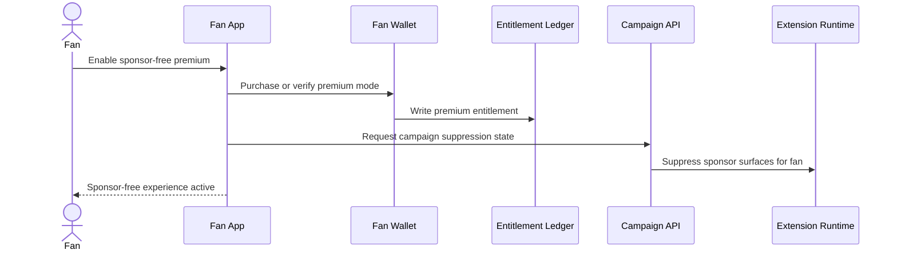

1. The fan buys or activates a premium variant that suppresses sponsor campaign surfaces.
2. The entitlement ledger records sponsor-free status and expiration.
3. Campaign delivery checks entitlement state before rendering sponsor extensions.
4. Suppression affects ads/sponsor surfaces but does not delete prior campaign receipts.
5. Creator and sponsor reporting excludes future sponsor-free impressions for that fan.

## 7. Error And Recovery Behavior

| Failure mode | Recovery behavior |
| --- | --- |
| Extension manifest requests unapproved data. | Install or runtime grant is denied with required scope reduction. |
| Fan denies campaign grant. | Campaign returns an ineligible or limited participation result without exposing denied fields. |
| Sponsor asks for identifying audience data without grants. | Audience Data Firewall returns aggregate-only response or denial. |
| Extension artifact is suspended. | Runtime blocklist stops sessions and Creator Studio exposes replacement/export options. |
| Campaign receipts conflict with budget or fraud rules. | Settlement places affected rewards or payouts in pending adjustment state. |
| Premium sponsor-free entitlement is active. | Campaign API suppresses sponsor surfaces and reports non-delivery reason. |
