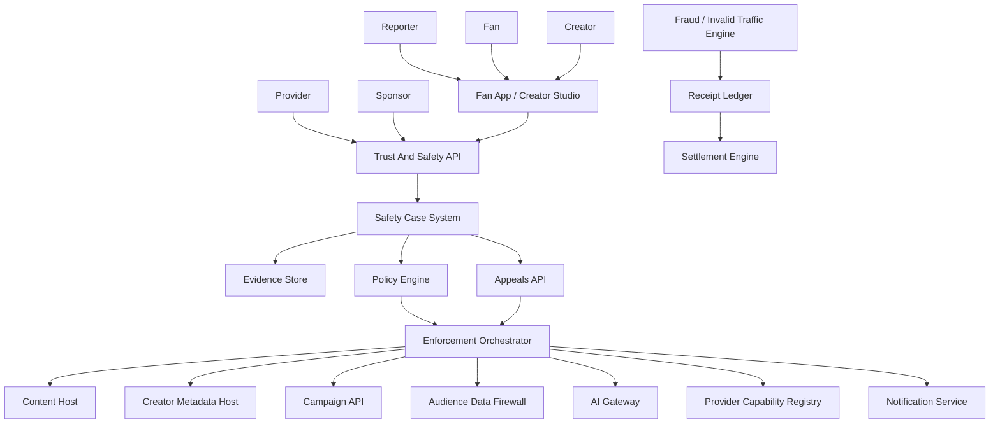
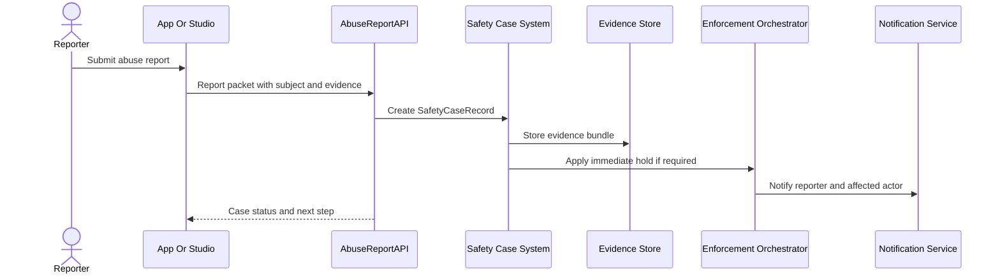
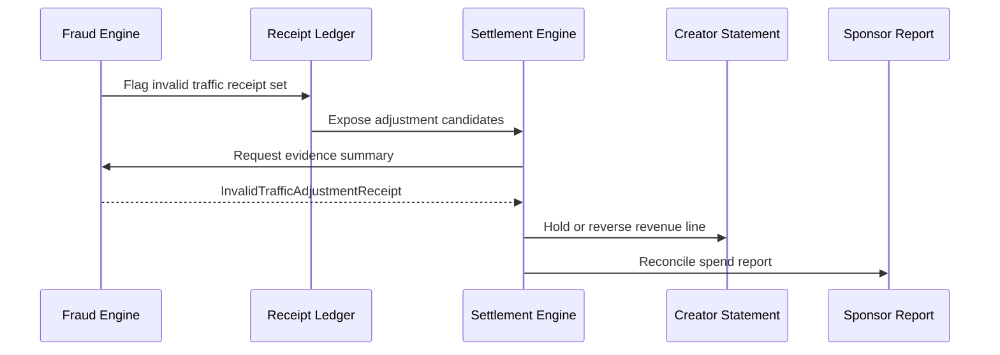
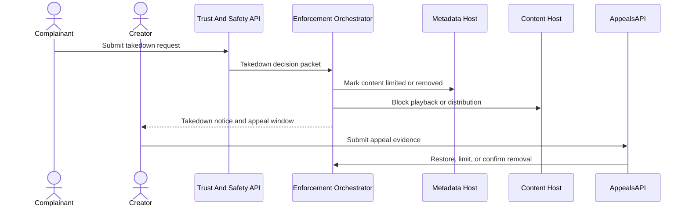
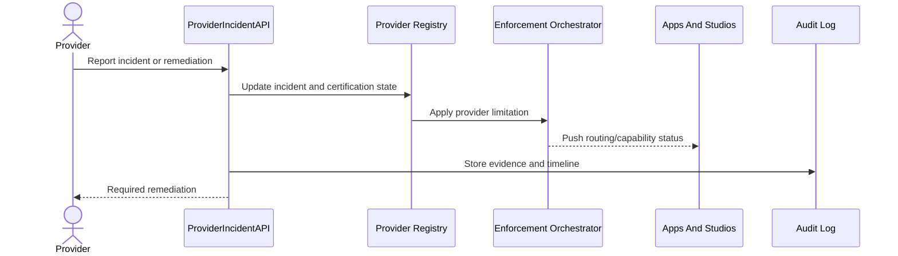
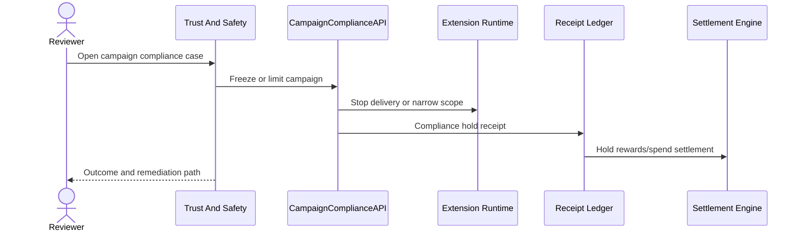
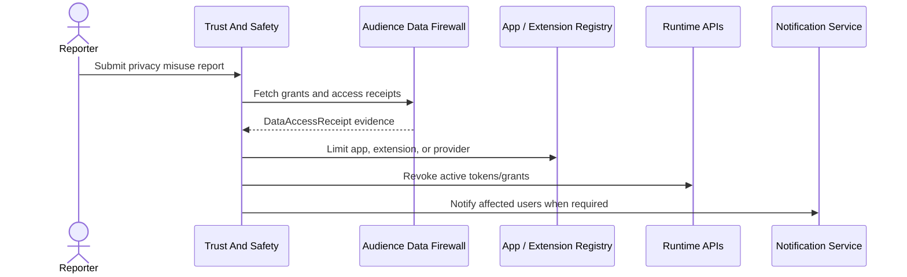
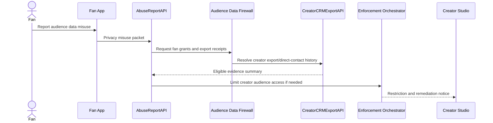
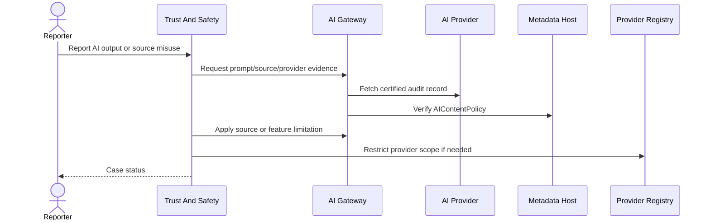

# Loom Architecture 09: Trust, Safety, Fraud, And Compliance

Status: Draft for review  
Source workflow map: `docs/Architecture/02-workflow-inventory-and-function-map.md`

## 1. Purpose

This document defines transaction packet models for abuse reporting, invalid traffic adjustments, takedowns and appeals, provider incidents, campaign compliance enforcement, privacy/data-misuse enforcement, creator audience misuse reports, and AI safety/source misuse.

## 2. Functional System Diagram

## 3. Packet Envelope

| Field | Meaning |
| --- | --- |
| `reportContext` | Reporter identity, actor role, report type, subject ids, jurisdiction, priority, and correlation id. |
| `subjectContext` | Content, creator, fan, app, extension, provider, sponsor, campaign, recommendation, or AI source under review. |
| `evidenceContext` | User evidence, logs, receipts, manifests, data-access receipts, provider probes, and reviewer annotations. |
| `policyContext` | Safety rule, privacy rule, data-rights rule, campaign rule, provider certification scope, and jurisdictional requirement. |
| `enforcementContext` | Action type, scope, duration, affected surfaces, notification requirements, and rollback condition. |
| `financialContext` | Invalid traffic signals, frozen rewards, settlement adjustment, chargeback, clawback, and dispute state. |
| `appealContext` | Appealing actor, appeal window, submitted evidence, reviewer outcome, and restoration action. |
| `auditContext` | Case id, signed decisions, timestamps, reviewer identity, API version, and public/private audit visibility. |

## 4. Interfaces And Contracts

| Interface or contract | Packet responsibility |
| --- | --- |
| `AbuseReportAPI` | Accepts reports from fans, creators, apps, sponsors, providers, and governance actors. |
| `SafetyCaseRecord` | Append-only case state, subjects, evidence, decisions, notifications, and appeal history. |
| `EvidenceBundle` | Normalized evidence references from user reports, receipts, logs, manifests, and provider probes. |
| `PolicyDecisionLog` | Signed policy evaluation and reviewer rationale for enforcement actions. |
| `EnforcementActionAPI` | Applies takedown, limitation, suspension, revocation, freeze, restoration, or notification actions. |
| `AppealsAPI` | Appeal intake, evidence submission, review outcome, and restoration contract. |
| `FraudSignalAPI` | Invalid traffic and reward abuse detection inputs. |
| `InvalidTrafficAdjustmentReceipt` | Adjustment record used by settlement to reverse or hold revenue and rewards. |
| `ProviderIncidentAPI` | Provider incident creation, status, remediation, and certification impact. |
| `CampaignComplianceAPI` | Campaign freeze, sponsor reporting hold, reward hold, and compliance remediation. |
| `PrivacyMisuseReport` | Report and evidence contract for data misuse, export misuse, or consent violation. |
| `AudienceMisuseEnforcement` | Creator audience visibility/export restrictions, direct-contact lockout, and breach-notice state. |
| `AISafetyCase` | AI source misuse, unsafe output, model/provider issue, and indexing revocation state. |

## 5. Workflow Transaction Packet Models

| Ref | Trigger | Primary packet path | Durable writes / receipts | Completion response |
| --- | --- | --- | --- | --- |
| `17/W1` | Abuse report is submitted. | App -> AbuseReportAPI -> Case System -> Enforcement. | Safety case, evidence bundle, decision log. | Reporter and affected actor receive status. |
| `17/W2` | Invalid traffic is detected. | Fraud Engine -> Receipt Ledger -> Settlement Engine. | Invalid traffic adjustment receipt. | Revenue/rewards are held, reversed, or cleared. |
| `17/W3` | Takedown and appeal. | Safety API -> Enforcement -> Content/Metadata -> Appeals. | Takedown record, appeal evidence, outcome. | Content remains down, restored, or limited. |
| `17/W4` | Provider incident. | Provider/Audit -> ProviderIncidentAPI -> Registry -> Enforcement. | Incident record and certification state change. | Providers, creators, and apps get routing status. |
| `17/W5` | Campaign compliance enforcement. | Safety API -> CampaignComplianceAPI -> Campaign/Settlement. | Compliance case, freeze/adjustment receipts. | Campaign resumes, changes, or is terminated. |
| `17/W6` | Privacy/data-misuse enforcement. | Report/Audit -> Case System -> ADF/Registry/Runtime. | Privacy case, access revocation, notification log. | Misuse is remediated and grants are constrained. |
| `17/W6A` | Creator audience misuse report. | Fan/App -> AbuseReportAPI -> ADF/CRM receipts -> Enforcement. | Audience misuse case and export restriction. | Creator access is limited and affected fans are protected. |
| `17/W7` | AI safety or source misuse. | Report/Audit -> AISafetyCase -> AI Gateway/Registry. | AI case, source revocation, provider restriction. | AI feature is corrected, limited, or suspended. |

## 6. Step-By-Step Life Of A Packet Overlays

### 6.1 `17/W1`: Abuse Report

1. The app sends reporter role, subject ids, report category, evidence refs, and safety priority.
2. `AbuseReportAPI` normalizes the packet into a `SafetyCaseRecord`.
3. Evidence is copied or referenced in immutable form so later appeals can inspect the same record.
4. Severe reports can trigger an immediate temporary hold before full review.
5. Notifications expose status without leaking private reporter information.

### 6.2 `17/W2`: Invalid Traffic Adjustment

1. Fraud detection groups suspicious impressions, clicks, referrals, rewards, or playback receipts.
2. The receipt ledger stores adjustment evidence without deleting original receipts.
3. Settlement applies holds, reversals, or clawbacks using `InvalidTrafficAdjustmentReceipt`.
4. Creator and sponsor statements show the adjustment reason and affected receipt set.
5. Appeals or disputes can clear the adjustment and release held funds.

### 6.3 `17/W3`: Takedown And Appeal

1. The takedown request includes subject content, legal/safety basis, jurisdiction, and evidence.
2. The policy engine decides whether immediate removal, geo-limit, age-limit, or no action is required.
3. Metadata and content hosts receive matching enforcement instructions.
4. The creator receives a notice with appeal path and visible product impact.
5. Appeal outcome updates the enforcement state and audit record.

### 6.4 `17/W4`: Provider Incident

1. Provider or audit monitoring opens an incident with affected capability, timeframe, and impact.
2. The registry marks the provider as healthy, degraded, limited, suspended, or revoked for affected roles.
3. Apps and studios receive updated routing guidance and user-visible status.
4. Enforcement can disable unsafe keys, APIs, or provider surfaces.
5. Remediation evidence is required before capability restoration.

### 6.5 `17/W5`: Campaign Compliance Enforcement

1. Compliance review can be triggered by reports, sponsor content, extension behavior, data scope, or fraud signals.
2. `CampaignComplianceAPI` freezes delivery, narrows target scope, or blocks reward payout while under review.
3. Runtime receives updated delivery state so fans do not continue an unsafe campaign.
4. Settlement receives hold receipts for rewards, sponsor spend, creator revenue, and developer fees.
5. The campaign resumes, changes, or terminates based on remediation outcome.

### 6.6 `17/W6`: Privacy And Data-Misuse Enforcement

1. Privacy misuse reports identify the actor, data fields, purpose violation, destination, or breach concern.
2. The Audience Data Firewall supplies grant history, data-access receipts, revocation state, and export logs.
3. Enforcement can revoke grants, suspend app/extension/provider scope, force deletion attestations, or require breach notice.
4. Runtime tokens are invalidated so misuse cannot continue during review.
5. Affected users and creators receive notices when policy or law requires it.

### 6.7 `17/W6A`: Creator Audience Misuse Report

1. A fan can report unwanted direct contact, resale, off-platform upload, harassment, or breach tied to creator audience access.
2. The firewall compares the fan's grants, relationship visibility, revocations, and creator export receipts.
3. `CreatorCRMExportAPI` provides export destination, fields, retention promise, watermark, and access timestamp.
4. Enforcement can suspend creator CRM export, require deletion attestation, notify affected fans, or restrict visible follower data.
5. Fan revocation and block controls are preserved even if the broader case remains under review.

### 6.8 `17/W7`: AI Safety And Source Misuse

1. The report identifies output, prompt context, cited source, creator policy, model, or provider behavior.
2. `AIGateway` returns audit-safe prompt/source metadata according to retention and privacy rules.
3. Metadata host verification determines whether the source was eligible under `AIContentPolicy`.
4. Enforcement can remove source access, regenerate indexes, disable a feature, or limit provider certification.
5. Serious provider failures flow into provider incident and certification review.

## 7. Error And Recovery Behavior

| Failure mode | Recovery behavior |
| --- | --- |
| Evidence is insufficient for immediate enforcement. | Case remains open, additional evidence is requested, and only reversible holds are applied. |
| Enforcement conflicts with latest manifest state. | Enforcement Orchestrator rehydrates current metadata and writes a corrected action. |
| Invalid traffic adjustment is overturned. | Settlement releases held funds and writes a reversal adjustment receipt. |
| Provider incident affects active traffic. | Apps receive routing status and move to alternate certified providers where possible. |
| Privacy misuse involves exported data. | Platform enforces deletion attestation, export lockout, fan notice, and creator/app restrictions. |
| AI source misuse involves revoked content. | AI indexes are rebuilt and provider/source access is blocked pending audit. |
