# Loom Architecture 10: Migration, Export, And Portability

Status: Draft for review  
Source workflow map: `docs/Architecture/02-workflow-inventory-and-function-map.md`

## 1. Purpose

This document defines transaction packet models for creator export and migration, metadata host migration, fan export and migration, media host migration, extension state export, data export/delete, existing-platform migration, public metadata import, membership migration, cross-post/exclusive migration, and provider exit-button flows.

## 2. Functional System Diagram

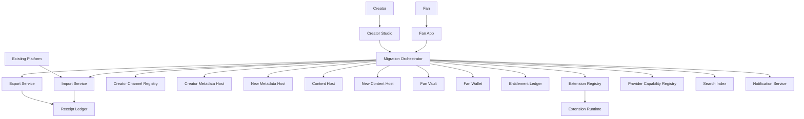

## 3. Packet Envelope

| Field | Meaning |
| --- | --- |
| `ownerContext` | Creator, fan, channel, wallet, vault, app, provider, or extension owner and authorization proof. |
| `sourceContext` | Source provider, source platform, source host, export endpoint, object ids, schema version, and integrity hashes. |
| `targetContext` | Target provider, target host, import endpoint, schema version, key scope, and activation plan. |
| `assetContext` | Metadata, media, transcripts, manifests, entitlements, memberships, wallet state, fan vault data, or extension state. |
| `policyContext` | Export rights, privacy mode, fan grants, creator policy, retention, deletion, and provider exit obligations. |
| `verificationContext` | Checksum, manifest signature, sample playback, entitlement reconciliation, and index verification. |
| `cutoverContext` | Freeze window, pointer update, routing state, rollback plan, notification plan, and completion marker. |
| `auditContext` | Export receipt, import receipt, deletion receipt, migration job id, actor signature, and timestamp. |

## 4. Interfaces And Contracts

| Interface or contract | Packet responsibility |
| --- | --- |
| `CreatorExportBundle` | Portable channel metadata, manifests, provider roles, catalog, business rules, and audit receipts. |
| `FanExportBundle` | Fan passport, follows, grants, wallet references, vault export, preferences, and deletion markers. |
| `MediaExportManifest` | Media objects, renditions, transcripts, captions, checksums, rights, and playback verification. |
| `MetadataHostMigrationAPI` | Moves creator metadata host pointer and verifies target host readiness. |
| `ContentHostMigrationAPI` | Copies media, verifies playback, and updates content host pointers. |
| `ProviderExitAPI` | One-click export, transfer, revocation, and cutover contract exposed by certified providers. |
| `ImportValidationAPI` | Schema validation, duplicate detection, identity matching, and remediation response. |
| `MembershipMigrationMap` | Mapping between external members, Loom fan identities, entitlements, and opt-in state. |
| `CrossPostPolicy` | Rules for mirrored, exclusive, and staged content migration. |
| `DataDeletionReceipt` | Durable proof that deleted or revoked data was removed or tombstoned. |
| `ExtensionStateExport` | Portable creator/fan-owned extension state and schema version. |
| `MigrationAuditReceipt` | Signed export/import/cutover evidence for portability and disputes. |

## 5. Workflow Transaction Packet Models

| Ref | Trigger | Primary packet path | Durable writes / receipts | Completion response |
| --- | --- | --- | --- | --- |
| `02/W6` | Creator exports and migrates. | Creator Studio -> Migration Orchestrator -> Export/Import -> Registry. | Creator export bundle, import receipt, pointer update. | Channel runs from new provider. |
| `04/W5` | Metadata host migration. | Creator Studio -> MetadataHostMigrationAPI -> Registry -> Search Index. | Host pointer update and verification receipt. | Metadata reads route to new host. |
| `05/W7` | Fan export or migration. | Fan App -> Export Service -> Fan Vault/Wallet/Passport. | Fan export bundle and optional deletion receipt. | Fan receives portable data or migrated account state. |
| `06/W5` | Media export and host migration. | Creator Studio -> ContentHostMigrationAPI -> source/target hosts. | Media manifest, checksums, playback verification. | Playback routes to target host. |
| `10/W6` | Extension state export. | Owner -> Extension Registry -> Runtime -> Export Service. | Extension export package and receipt. | Portable extension state delivered. |
| `14/W5` | Data export/delete. | Fan/App -> Data Rights API -> vault/wallet/grants/services. | Export bundle, deletion/tombstone receipts. | Fan receives export or deletion confirmation. |
| `21/W1` | Existing creator starts owned hub. | Creator Studio -> Import Service -> Registry/Metadata Host. | Channel manifest, imported profile/catalog. | Creator hub is live with imported public metadata. |
| `21/W2` | Public metadata import. | Import Service -> Existing Platform -> Metadata Host. | Import manifest, source links, validation results. | Public profile/content metadata appears in Loom. |
| `21/W3` | Membership migration. | Creator Studio -> Import Service -> Fan opt-in -> Entitlement Ledger. | Membership map, opt-in grants, entitlements. | Members gain Loom access after opt-in. |
| `21/W4` | Cross-post and exclusive migration. | Creator Studio -> CrossPostPolicy -> Content/Metadata hosts. | Cross-post rules, exclusive schedule, content refs. | Content moves in stages without confusing fans. |
| `21/W5` | Provider exit button. | Creator/Fan -> ProviderExitAPI -> Migration Orchestrator. | Export, revocation, cutover, and deletion receipts. | Owner exits provider with portable state. |

## 6. Step-By-Step Life Of A Packet Overlays

### 6.1 `02/W6`: Creator Export And Migration

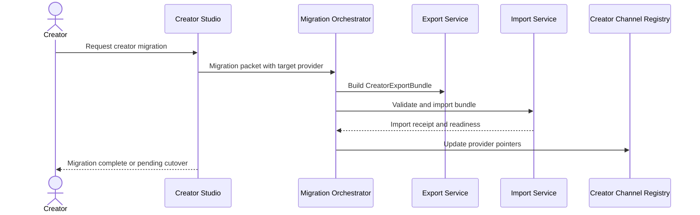

1. Creator Studio collects target provider, assets, cutover timing, and rollback preference.
2. The export service builds a signed bundle of channel metadata, manifests, catalog, business rules, and receipts.
3. The target import service validates schema, keys, provider capability, and duplicate records.
4. The registry updates provider pointers only after target readiness checks pass.
5. The creator receives completion status, propagation state, and rollback window.

### 6.2 `04/W5`: Metadata Host Migration

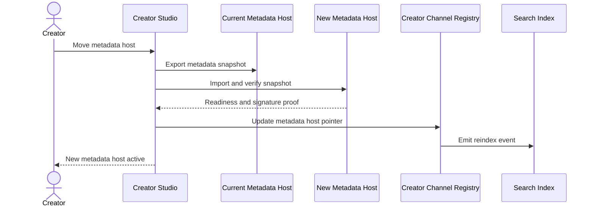

1. The current host exports the latest channel manifest, catalog, policies, and version history.
2. The new host imports the snapshot and proves it can serve required certified APIs.
3. Creator Channel Registry updates the canonical metadata host pointer.
4. Search and fan apps receive reindex/routing events with the new pointer.
5. The old host remains read-only during the rollback window if policy allows it.

### 6.3 `05/W7`: Fan Export Or Migration

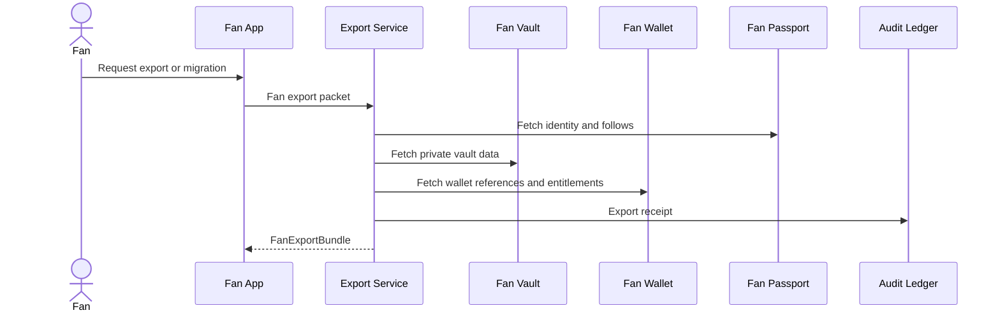

1. The fan chooses export, migration to another app/provider, or deletion after export.
2. Export scopes include passport, follows, grants, preferences, vault data, wallet references, and entitlements as allowed.
3. Private vault exports use fan authorization and may require local encryption.
4. Wallet export references avoid exposing payment credentials.
5. The fan receives a signed bundle and audit receipt.

### 6.4 `06/W5`: Media Export And Host Migration

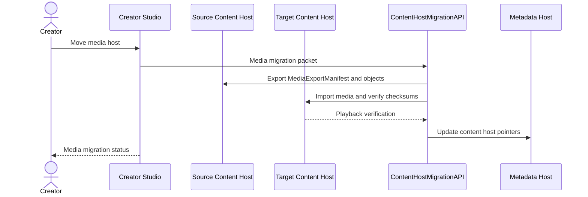

1. The migration packet names content ids, target host, renditions, transcript/caption scope, and cutover plan.
2. Source host exports media objects and checksums through the certified export API.
3. Target host imports objects, verifies checksums, and proves playback for required renditions.
4. Metadata host updates content pointers after verification.
5. Fan apps continue using old URLs until the new pointers are active.

### 6.5 `10/W6`: Extension State Export

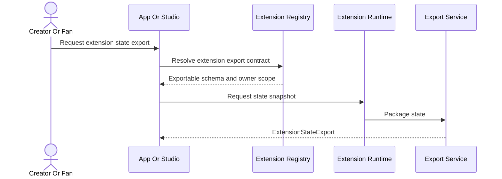

1. The owner initiates export for a specific extension, campaign, or provider exit flow.
2. `ExtensionManifest` determines which state is creator-owned, fan-owned, sponsor-owned, or excluded.
3. Runtime returns state using the declared export schema.
4. Export service signs the package and records schema version.
5. The owner can import the package into a compatible certified extension or archive it.

### 6.6 `14/W5`: Data Export/Delete

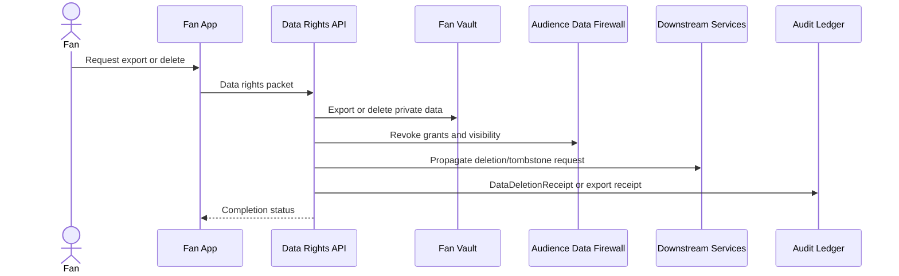

1. The fan chooses export, delete, revoke grants, or a combined action.
2. `Data Rights API` coordinates fan vault, grants, app permissions, campaign data, and downstream service records.
3. Deletion uses tombstones where legal, security, or financial audit records must remain.
4. Grant revocation propagates to apps, creators, sponsors, and extensions.
5. The fan receives status for completed, pending, and exempt records.

### 6.7 `21/W1`: Existing Creator Starts Owned Hub

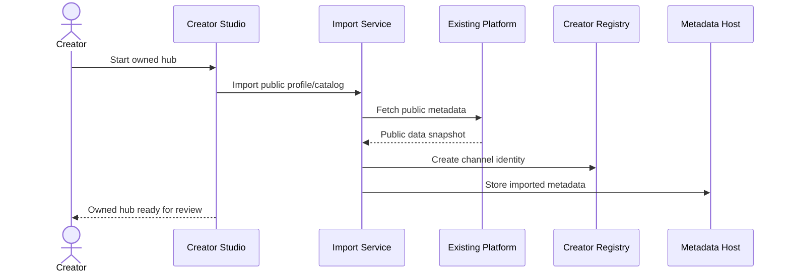

1. The creator proves control of the existing public profile where possible.
2. Import service fetches only public metadata unless the creator provides additional authorized export data.
3. Loom creates a portable creator channel and stores imported metadata as reviewable draft or live records.
4. Source links and import provenance remain attached for transparency.
5. The creator can edit the hub before promoting it to fans.

### 6.8 `21/W2`: Public Metadata Import

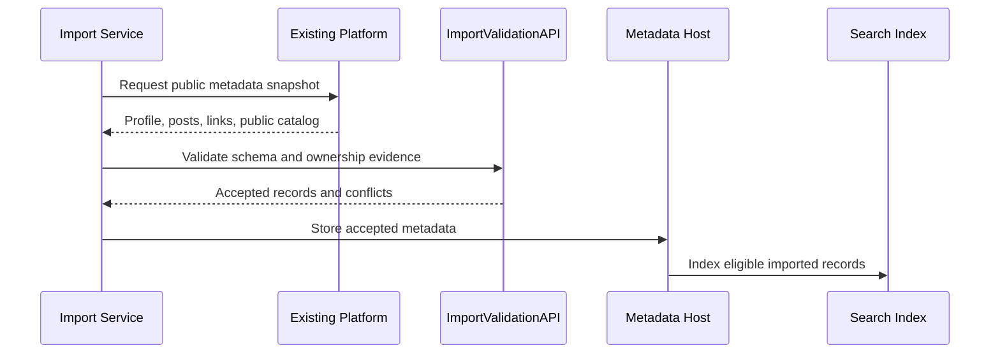

1. Import service reads public profile and content metadata from the existing platform.
2. `ImportValidationAPI` checks ownership, duplicates, broken links, unsupported fields, and policy conflicts.
3. Conflicts are returned to Creator Studio for review rather than silently overwritten.
4. Accepted records are stored with source provenance and import timestamp.
5. Search indexes only records that satisfy creator search policy and public eligibility.

### 6.9 `21/W3`: Membership Migration

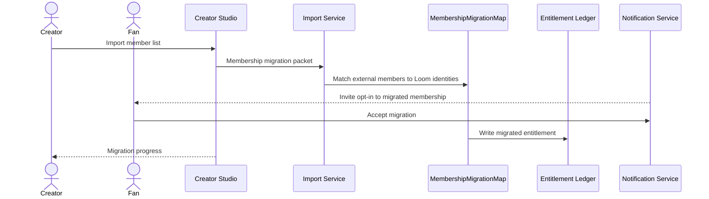

1. Creator imports a member list or external platform export under proof of rights.
2. `MembershipMigrationMap` separates matched, unmatched, invited, accepted, declined, and blocked users.
3. Fans must opt in before Loom entitlements or direct relationship state are activated.
4. Accepted fans receive migrated membership access and can review data grants.
5. Creator Studio reports progress without exposing unmatched private user data.

### 6.10 `21/W4`: Cross-Post And Exclusive Migration

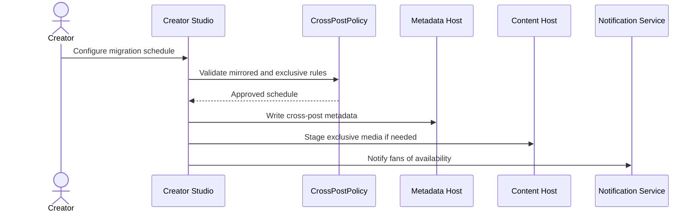

1. The creator chooses which content is mirrored, delayed, exclusive to Loom, or retired from legacy platforms.
2. `CrossPostPolicy` checks rights, access modes, monetization, and fan messaging requirements.
3. Metadata host stores availability windows and source links.
4. Content host stages exclusive media before fan-facing promotion.
5. Fan notifications distinguish mirrored content from Loom-exclusive releases.

### 6.11 `21/W5`: Provider Exit Button

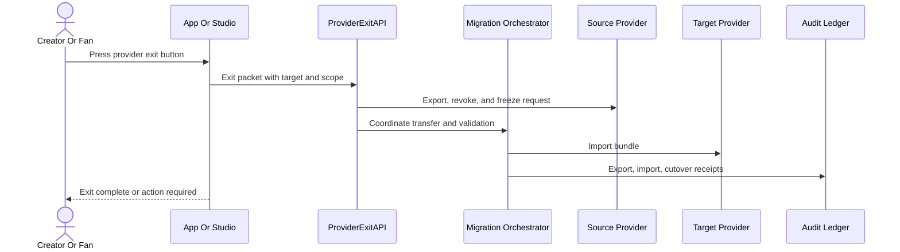

1. The owner selects target provider, data scope, revocation/deletion options, and cutover timing.
2. `ProviderExitAPI` is a certified provider obligation and must expose export status and blockers.
3. Migration orchestrator validates the transfer before pointers or app routing change.
4. Source provider receives revocation, freeze, or deletion requests based on owner choice.
5. The owner receives a clear completion, pending, or blocked state with receipts.

## 7. Error And Recovery Behavior

| Failure mode | Recovery behavior |
| --- | --- |
| Target provider fails import validation. | Migration remains staged, source stays active, and remediation details return to the owner. |
| Checksums or playback verification fail. | Content host pointers are not updated and failed assets are retried or excluded. |
| External platform import is incomplete. | Imported records are marked partial and creator review is required before publish. |
| Fan declines membership migration. | No Loom entitlement or direct relationship is activated for that fan. |
| Deletion cannot remove financial/audit records. | Data Rights API writes tombstones and explains retained audit categories. |
| Provider exit is blocked by unpaid invoices or legal hold. | Exit packet returns blocker type, affected assets, and available partial export path. |
