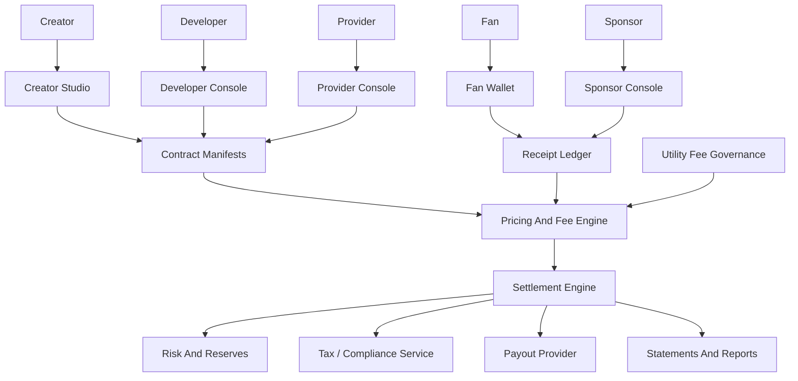
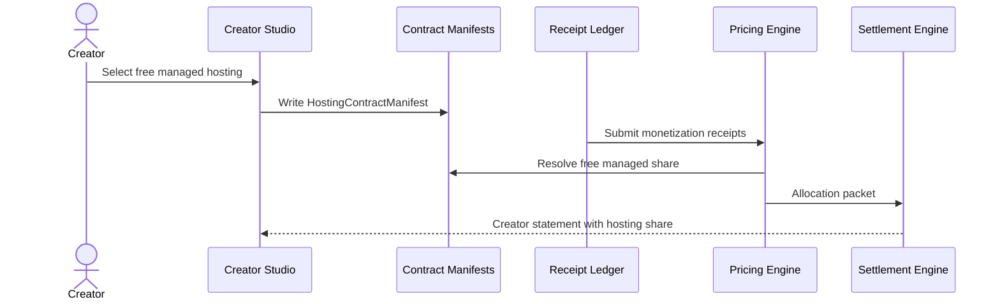
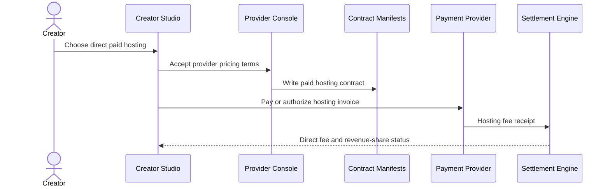
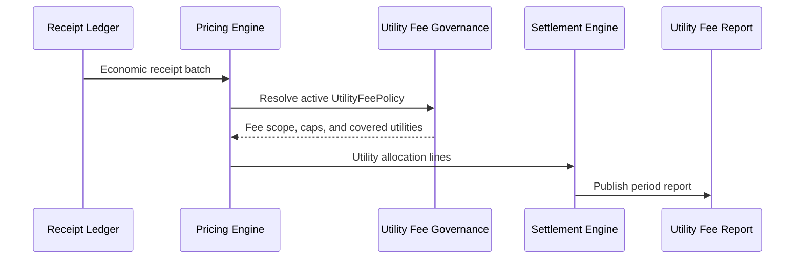
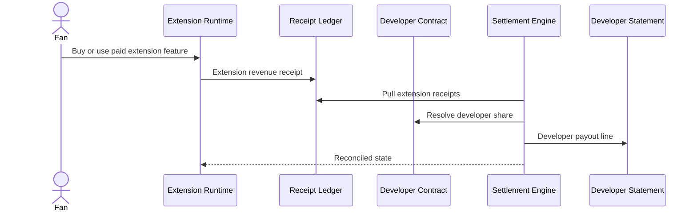
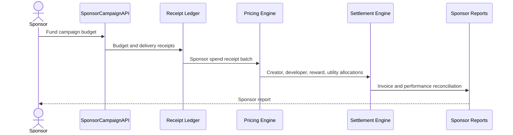
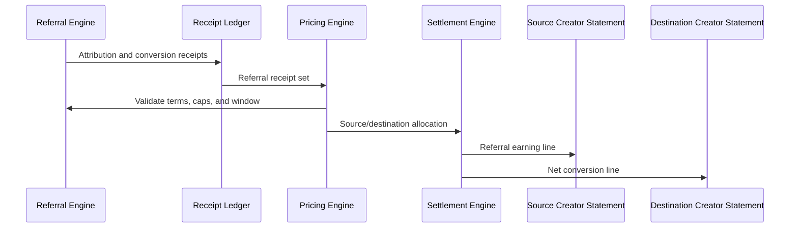
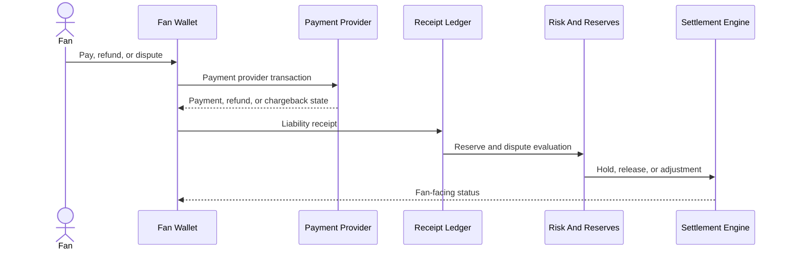

# Loom Architecture 11: Business Model And Incentive Architecture

Status: Draft for review  
Source workflow map: `docs/Architecture/02-workflow-inventory-and-function-map.md`

## 1. Purpose

This document defines transaction packet models for Loom's economic incentives: free managed hosting revenue share, direct paid hosting economics, utility fee allocation, developer extension revenue, sponsor campaign economics, referral economics, and payment/settlement liability.

## 2. Functional System Diagram

## 3. Packet Envelope

| Field | Meaning |
| --- | --- |
| `economicActorContext` | Creator, fan, sponsor, developer, provider, platform utility, or payout account. |
| `contractContext` | Hosting, monetization, settlement, extension, sponsor, referral, or utility fee manifest version. |
| `eventContext` | Playback, payment, subscription, sponsor delivery, extension use, referral conversion, refund, or chargeback. |
| `pricingContext` | Gross amount, currency, price rule, fee rule, revenue share, caps, reserves, and tax treatment. |
| `liabilityContext` | Merchant of record, provider liability, refund state, chargeback state, reserves, and dispute owner. |
| `allocationContext` | Creator, provider, developer, source creator, sponsor, fan reward, utility fund, and tax allocations. |
| `receiptContext` | Signed economic receipt, idempotency key, ledger position, adjustment reference, and settlement run id. |
| `statementContext` | Payout readiness, statement line items, reporting period, payment rail, and reconciliation state. |

## 4. Interfaces And Contracts

| Interface or contract | Packet responsibility |
| --- | --- |
| `HostingContractManifest` | Free managed, paid hosted, self-hosted, provider fee, revenue share, and exit obligations. |
| `MonetizationManifest` | Active economic model for ads, memberships, premium, paid content, commerce, AI, sponsors, and referrals. |
| `SettlementManifest` | Revenue split, required receipts, utility fee, reserves, payout schedule, and dispute handling. |
| `UtilityFeePolicy` | Shared platform utility fee scope, caps, covered services, governance, and reporting. |
| `PricingAndFeeEngineAPI` | Applies contracts, fees, taxes, reserves, and allocation rules to receipts. |
| `ReceiptLedger` | Immutable economic event storage and adjustment chain. |
| `SettlementEngineAPI` | Runs settlement, produces statements, and reconciles receipts to payouts. |
| `DeveloperRevenueShareContract` | Extension price, developer fee, creator share, platform utility share, and refund handling. |
| `SponsorEconomicContract` | Budget, pricing model, reward pool, creator/developer/platform allocations, and reporting terms. |
| `ReferralEconomicContract` | Referral rate, attribution window, caps, source/destination allocation, and dispute rules. |
| `PaymentLiabilityPolicy` | Merchant of record, chargeback owner, refund owner, reserve policy, and compliance responsibility. |
| `PayoutStatement` | Actor-specific gross-to-net statement and reconciliation references. |

## 5. Workflow Transaction Packet Models

| Ref | Trigger | Primary packet path | Durable writes / receipts | Completion response |
| --- | --- | --- | --- | --- |
| `22/W1` | Creator uses free managed hosting. | Creator Studio -> Hosting contract -> Receipt Ledger -> Settlement. | Free managed hosting contract and revenue-share receipts. | Provider/platform share is deducted from creator revenue. |
| `22/W2` | Creator pays directly for hosting. | Creator Studio -> Provider contract -> Payment/Settlement. | Provider invoice, direct hosting fee, settlement rule. | Creator keeps higher revenue share and pays provider fee. |
| `22/W3` | Utility fee is allocated. | Receipt Ledger -> Pricing Engine -> Utility Fee Governance -> Settlement. | Utility fee line item and governance report. | Shared platform utilities are funded transparently. |
| `22/W4` | Extension generates revenue. | Extension Runtime -> Receipt Ledger -> Settlement. | Extension sale/use receipts and developer share. | Developer, creator, and utility allocations are paid. |
| `22/W5` | Sponsor campaign economics run. | SponsorCampaignAPI -> Receipt Ledger -> Settlement. | Sponsor spend, reward, creator, developer, and utility receipts. | Sponsor invoice and actor statements are produced. |
| `22/W6` | Referral economics run. | Referral Engine -> Receipt Ledger -> Settlement. | Referral attribution and conversion receipts. | Source and destination creator allocations are applied. |
| `22/W7` | Payment/refund/chargeback liability occurs. | Fan Wallet/Payment Provider -> Receipt Ledger -> Risk/Settlement. | Payment, refund, chargeback, reserve, adjustment receipts. | Liability is assigned and statements are adjusted. |

## 6. Step-By-Step Life Of A Packet Overlays

### 6.1 `22/W1`: Free Managed Hosting Revenue Share

1. Creator Studio stores the free managed hosting contract with provider role, revenue share, exit terms, and support scope.
2. Playback, ad, membership, sponsor, or commerce receipts arrive in the ledger.
3. `PricingAndFeeEngineAPI` resolves the active hosting contract version for each receipt.
4. Settlement deducts the managed hosting share before creator payout.
5. The creator statement shows gross revenue, provider share, utility fees, reserves, and net payout.

### 6.2 `22/W2`: Direct Paid Hosting Economics

1. The creator selects a certified host and accepts direct provider pricing.
2. The hosting contract changes from revenue share to fixed, metered, or committed fees.
3. Payment provider records invoice, payment, refund, or delinquency state.
4. Settlement no longer deducts free managed hosting share for covered revenue.
5. Provider nonpayment rules and downgrade/exit obligations remain attached to the contract.

### 6.3 `22/W3`: Utility Fee Allocation

1. The pricing engine groups eligible economic receipts by contract and reporting period.
2. `UtilityFeePolicy` defines which receipts are eligible, fee caps, covered services, and exemptions.
3. Utility fee lines are added before actor-specific net payout calculation.
4. Settlement reconciles collected fees to platform utility funding accounts.
5. Public or governance-facing reports show collections, caps, and funded utility categories.

### 6.4 `22/W4`: Developer Extension Revenue

1. Extension runtime writes paid install, usage, reward, or campaign-related revenue receipts.
2. The developer contract determines price, revenue share, refunds, and creator/platform allocations.
3. Settlement validates extension version, install grant, and suspension state.
4. Developer, creator, and utility fee allocations are added to statements.
5. Refunds or suspensions write adjustment receipts rather than mutating original revenue events.

### 6.5 `22/W5`: Sponsor Campaign Economics

1. Sponsor campaign setup reserves budget and defines pricing model, rewards, reporting scope, and data constraints.
2. Delivery, participation, conversion, reward, and spend receipts accumulate in the ledger.
3. Pricing applies campaign contract, fraud adjustments, reward pools, creator share, developer share, and utility fees.
4. Settlement produces actor statements and sponsor invoice reconciliation.
5. Reports expose aggregate performance within privacy thresholds.

### 6.6 `22/W6`: Referral Economics

1. Referral conversion receipts reference source recommendation, destination offer, fan action, and terms version.
2. Pricing validates attribution window, caps, duplicate claims, and eligible monetization event.
3. Source creator allocation is calculated before destination creator net payout.
4. Settlement statements show referral gross, referral fee, utility fee, and adjustments.
5. Disputes use immutable referral receipts and bound terms version.

### 6.7 `22/W7`: Payment And Settlement Liability

1. Fan wallet creates payment, subscription, refund, or dispute packets with merchant-of-record context.
2. Payment provider response is normalized into receipt ledger events.
3. `PaymentLiabilityPolicy` assigns refund, chargeback, reserve, tax, and compliance responsibility.
4. Risk and reserves can hold actor payouts until liability clears.
5. Settlement statements and fan wallet status update from the same liability receipts.

## 7. Error And Recovery Behavior

| Failure mode | Recovery behavior |
| --- | --- |
| Contract version is missing for a receipt. | Settlement holds the receipt and requests manifest repair before payout. |
| Utility fee cap is exceeded. | Pricing applies the cap and records the capped amount in the governance report. |
| Sponsor campaign overspends budget. | Settlement holds excess receipts and reconciles against budget or sponsor approval. |
| Referral attribution has multiple claimants. | Referral Engine resolves by terms; unresolved claims enter dispute state. |
| Chargeback arrives after payout. | Risk policy creates negative balance, reserve claim, or future payout offset. |
| Developer extension is suspended. | New revenue is blocked and existing receipts settle or adjust according to suspension outcome. |
