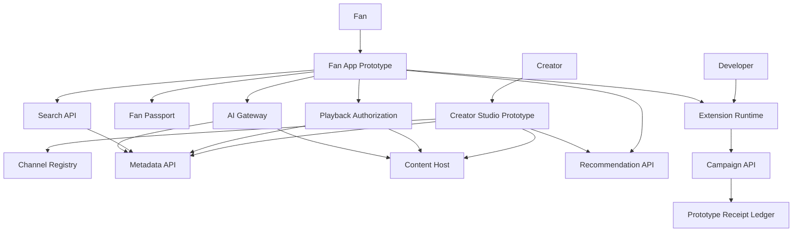
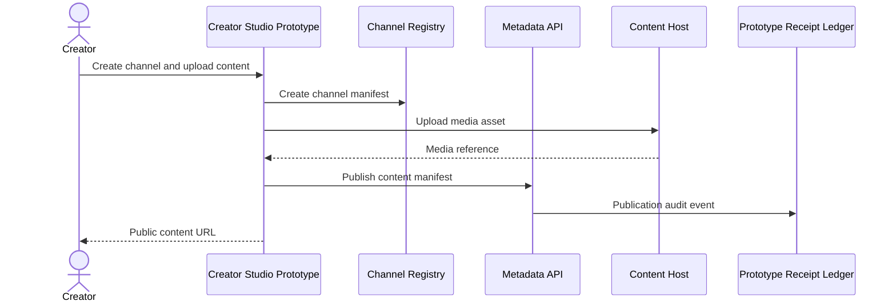
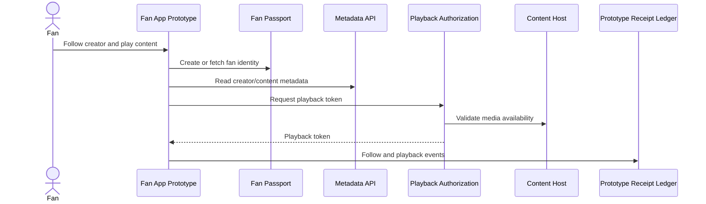
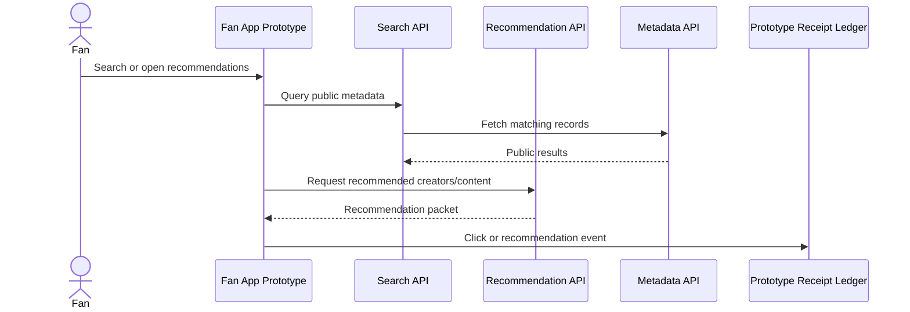
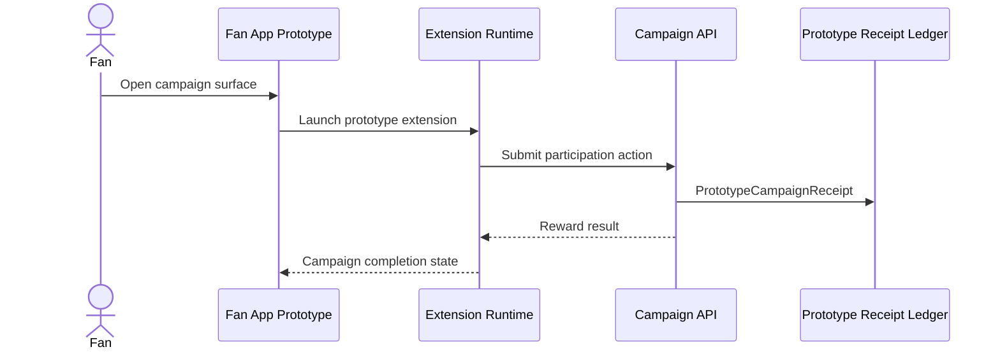
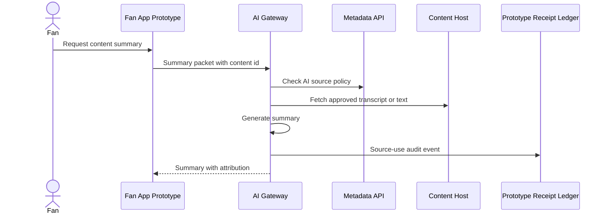

# Loom Architecture 12: MVP Prototype Transaction Slices

Status: Draft for review  
Source workflow map: `docs/Architecture/02-workflow-inventory-and-function-map.md`

## 1. Purpose

This document defines the smallest coherent prototype transaction slices for Loom: creator onboarding to public content, fan follow and playback, search and recommendation, extension campaign, and AI summary. These slices intentionally reuse the same packet boundaries as the larger architecture docs so the prototype can grow without redefining core contracts.

## 2. Functional System Diagram

## 3. Packet Envelope

| Field | Meaning |
| --- | --- |
| `prototypeActorContext` | Creator, fan, app, or developer test identity and session. |
| `channelContext` | Channel id, metadata host, public profile, content id, and manifest versions used in prototype. |
| `fanContext` | Fan passport id, follow state, app permission, playback mode, and privacy defaults. |
| `contentContext` | Uploaded asset, metadata, public access mode, playback token, and content status. |
| `discoveryContext` | Search query, recommendation source, candidate content, and result click state. |
| `campaignContext` | Prototype extension id, campaign id, fan participation state, and reward receipt. |
| `aiContext` | AI summary request, approved source text, model/provider id, and source attribution. |
| `receiptContext` | Minimal receipt id, idempotency key, event type, and audit log position. |

## 4. Interfaces And Contracts

| Interface or contract | Packet responsibility |
| --- | --- |
| `PrototypeCreatorChannelManifest` | Minimal creator id, channel id, profile, metadata pointer, and signing key. |
| `PrototypeContentManifest` | Minimal content metadata, media reference, public access mode, and searchability. |
| `PrototypeFanPassport` | Fan id, app session, follow relationships, grants, and private defaults. |
| `PrototypePlaybackAuthorizationAPI` | Public playback authorization and token issuance. |
| `PrototypeSearchAPI` | Query over public metadata and return ranked results. |
| `PrototypeRecommendationAPI` | Creator-led or system recommendation publication and delivery. |
| `PrototypeExtensionManifest` | Extension identity, surface, permissions, and campaign action. |
| `PrototypeCampaignReceipt` | Campaign participation and reward audit event. |
| `PrototypeAIContentPolicy` | Minimal AI source permission and summary attribution rule. |
| `PrototypeReceiptLedger` | Append-only event log for playback, follow, recommendation, campaign, and AI source-use events. |

## 5. Workflow Transaction Packet Models

| Ref | Trigger | Primary packet path | Durable writes / receipts | Completion response |
| --- | --- | --- | --- | --- |
| `20/W1` | Creator onboards and publishes public content. | Creator Studio -> Channel Registry -> Metadata API -> Content Host. | Channel manifest, content manifest, media ref. | Creator has a public channel and content page. |
| `20/W2` | Fan follows and plays content. | Fan App -> Fan Passport -> Follow API -> Playback Authorization -> Content Host. | Follow record and playback receipt. | Fan follows creator and views content. |
| `20/W3` | Search and recommendation. | Fan App -> Search API/Recommendation API -> Metadata API. | Search click or recommendation receipt. | Fan discovers creator/content. |
| `20/W4` | Extension campaign. | Fan App -> Extension Runtime -> Campaign API -> Receipt Ledger. | Campaign participation and reward receipt. | Fan completes campaign action. |
| `20/W5` | AI summary. | Fan App -> AI Gateway -> Metadata/Content source -> AI Provider. | AI source-use receipt if enabled. | Fan receives summary with source attribution. |

## 6. Step-By-Step Life Of A Packet Overlays

### 6.1 `20/W1`: Creator Onboarding To Public Content

1. Creator Studio creates a minimal channel profile and channel id.
2. The content host stores the uploaded asset and returns a media reference.
3. Metadata API stores the public content manifest with title, media ref, creator id, and searchability.
4. Prototype receipt ledger records publication for debugging and later settlement expansion.
5. The creator receives a public content URL that fan apps and search can read.

### 6.2 `20/W2`: Fan Follow And Playback

1. The fan app creates or reuses a prototype fan passport.
2. The follow packet stores creator relationship state with privacy defaults.
3. Playback authorization checks that the content is public and available.
4. The content host serves the asset using the token.
5. Follow and playback events are recorded in the prototype ledger.

### 6.3 `20/W3`: Search And Recommendation

1. Search returns only public prototype metadata.
2. Recommendation API can serve creator-led picks or simple related-content candidates.
3. The fan app renders results with creator, content, and source labels.
4. Fan clicks or follows generate discovery receipts.
5. The same packet shape can later add referral terms, privacy controls, and ranking audits.

### 6.4 `20/W4`: Extension Campaign

1. The prototype extension runs in a constrained surface inside the fan app.
2. Runtime sends a simple campaign participation event.
3. Campaign API validates campaign id, fan id, and one-time completion rules.
4. The receipt ledger records participation and reward state.
5. The fan app displays completion and reward status.

### 6.5 `20/W5`: AI Summary

1. The fan requests a summary from a content page.
2. AI Gateway verifies that the content is public and summary is allowed by prototype policy.
3. The content host returns transcript or text source when available.
4. AI Gateway generates a short summary with source attribution.
5. Source-use audit event preserves the path for later AI royalty and policy expansion.

## 7. Error And Recovery Behavior

| Failure mode | Recovery behavior |
| --- | --- |
| Creator upload fails. | Content manifest is not published and Creator Studio shows retry state. |
| Fan passport is unavailable. | Fan app can read public content but cannot follow or record private state. |
| Playback token cannot be issued. | Fan app shows unavailable state and records no playback receipt. |
| Search index is stale. | Prototype search hydrates metadata directly before rendering result details. |
| Extension campaign is invalid. | Runtime returns ineligible state and writes no reward receipt. |
| AI source text is unavailable or disallowed. | AI Gateway returns a no-summary response with the policy reason. |
