# Phase Validation Walkthrough

This is the manual validation playbook for the Demo App while implementation continues in parallel. Use it to validate the latest installed Android emulator build, record pass/fail notes, and send issues back as they appear. Implementation can continue unless a blocker makes the app unusable.

## How To Use

### 1. Launch the latest installed Demo App on the Flutter Android emulator

Run everything in **WSL Ubuntu**. Commands assume the workspace root at `app/` and the demo app at `app/apps/loom_demo` (Android package id `com.example.loom_demo`).

**a. Start an emulator and confirm it is attached:**

```bash
flutter emulators --launch PantryVision_API_36 # — wait for the Android home screen
flutter emulators --launch PantryVision_Manual_API_36 # — wait for the Android home screen
adb devices                                # confirm a line "emulator-5554   device" apears
```

**b. Relaunch an already-installed build** (no rebuild needed):

```bash
cd app/apps/loom_demo
adb -s emulator-5554 install -r build/app/outputs/flutter-apk/app-debug.apk
adb -s emulator-5554 shell monkey -p com.example.loom_demo -c android.intent.category.LAUNCHER 1
or
adb -s emulator-5556 install -r build/app/outputs/flutter-apk/app-debug.apk
adb -s emulator-5556 shell monkey -p com.example.loom_demo -c android.intent.category.LAUNCHER 1
```

**c (OPTIONAL IF NEW UPDATES ARE NOT YET IN THE APP). Build, install, and launch.** Simplest — one command from `app/apps/loom_demo`:

```bash
cd app/apps/loom_demo
flutter run -d emulator-5554               # builds the debug APK, installs, and launches on automated emulator
flutter run -d emulator-5556               # builds the debug APK, installs, and launches on manual emulator
```

Or mirror the phase-doc steps (build → install → launch separately):

```bash
flutter build apk --debug
adb -s emulator-5554 install -r build/app/outputs/flutter-apk/app-debug.apk
adb -s emulator-5554 shell monkey -p com.example.loom_demo -c android.intent.category.LAUNCHER 1
```

**d. Capture a screenshot for evidence** (run from the repo root; `data/` is gitignored):

```bash
cd /mnt/c/Users/fahd_/OneDrive/Documents/Loom
adb -s emulator-5554 exec-out screencap -p > data/validation/<phase>-<screen>.png
```

Confirm the app reaches the first rendered screen (not stuck on the Flutter splash) before validating. *(Phase 26 only: replace `emulator-5554` with the physical phone's `adb devices` id; the rest is identical.)*

> **Want to validate manually while agents run automated checks?** Automated runs use **`emulator-5554`** (the `PantryVision_API_36` AVD). Run a **second emulator on `emulator-5560`** for your manual work so the two never collide — see [Running a separate manual emulator (parallel to the agent)](#running-a-separate-manual-emulator-parallel-to-the-agent).

### 2. Find the phase to validate

Check the [Demo App Implementation Plan](./Demo%20App%20Implementation%20Plan.md) "Phase completion tracker" and the **Current Phase Availability** table below for the latest **Complete / ready for validation** phase. Validate that phase plus any phase changed by the most recent build.

### 3. Walk the phase section

Work top-to-bottom through that phase's table(s) below. Skip phases still marked **Pending** until a build that includes them is installed.

### 4. Record a result per step

In the **Result (Completed or Correction Needed)** column, write `Completed` or `Correction Needed` (or `N/A` if that surface isn't in the current build).

### 5. Leave inline correction notes

For any step that needs changes, write the details on the **`Correction Needed:`** line directly beneath that step — what you did, what you expected, what actually happened, and a screenshot path if useful. Keeping notes inline (next to the step) replaces a separate issue log, so each correction lives with the step it affects.

Authoritative final physical Android phone validation is now deferred until Phase 26. Phases 0 through 25 are validated on the Flutter Android emulator unless physical hardware is available for a preliminary smoke pass.

## Parallel Validation Protocol

- Use the currently installed emulator build unless I explicitly say a new build is installed.
- Continue validating the phase you are on while implementation moves ahead. A failed row does not block the next implementation phase unless the app cannot launch or the role switcher/navigation is unusable.
- When logging an issue, write it on the step's `Correction Needed:` line (see the Correction & Completion Protocol below). I will keep implementing forward and patch validation issues in parallel.
- After I install a new build, repeat only the rows affected by the change unless I ask for a broader regression pass.

## Running a separate manual emulator (parallel to the agent)

Yes — you can run two Android emulators side by side in WSL2 so **you validate manually while AI agents keep
using the original emulator for automated runs**. Each running emulator gets its own adb serial
(`emulator-<port>`); commands target one with `-d`/`-s`. Two **writable** instances need **two AVDs** (an AVD
holds a userdata write-lock, so the same AVD can't boot twice writable).

**Convention:**

| Role | AVD | adb serial | Used by |
| ---- | --- | ---------- | ------- |
| Automated | `PantryVision_API_36` | `emulator-5554` | AI agents — `melos run test:integration` is pinned here |
| Manual | `PantryVision_Manual_API_36` (new) | `emulator-5560` | You |

> **One-time setup** (creating the `PantryVision_Manual_API_36` AVD, and WSL prerequisites) is in the
> [Prereqs appendix](#appendix--prereqs-one-time-setup). On this machine the manual AVD is already created.

**Launch both (pin ports so serials never swap):**

```bash
flutter emulators --launch PantryVision_API_36                  # agent → emulator-5554 (launch FIRST)
emulator -avd PantryVision_Manual_API_36 -port 5560 -no-snapshot-save &   # you → emulator-5560
adb devices                                                     # expect emulator-5554 AND emulator-5560
```

**Target each emulator explicitly:**

```bash
# You (manual) — emulator-5560:
cd app/apps/loom_demo && flutter run -d emulator-5560
adb -s emulator-5560 shell monkey -p com.example.loom_demo -c android.intent.category.LAUNCHER 1
adb -s emulator-5560 exec-out screencap -p > data/validation/<phase>-<screen>.png   # run from repo root

# Agents (automated) — emulator-5554 (unchanged):
melos run test:integration          # pinned to emulator-5554; override with LOOM_EMULATOR if ever needed
flutter run -d emulator-5554
```

Because `melos run test:integration` defaults to `emulator-5554`, the agents' automated validation never
touches your `emulator-5560`, and vice versa. Prefer `-port` (or launch the agent AVD first) so serials stay
deterministic; if WSLg graphics are flaky, add `-gpu swiftshader_indirect` to the manual launch.

**Loading the latest code onto your manual emulator.** Booting the AVD does **not** update the app — the
emulator keeps whatever APK is installed, and an agent rebuild installs only to `emulator-5554`. You don't
restart the emulator to update; you **reinstall the APK** (the app updates in place, keeping its data):

```bash
# Option A — rebuild current source + install + launch on 5560 (guarantees latest):
cd app/apps/loom_demo && flutter run -d emulator-5560

# Option B — reinstall the APK the agent already built (only if it was built AFTER your edits):
adb -s emulator-5560 install -r app/apps/loom_demo/build/app/outputs/flutter-apk/app-debug.apk
adb -s emulator-5560 shell monkey -p com.example.loom_demo -c android.intent.category.LAUNCHER 1
```

Don't run Option A while an agent is building from the same `apps/loom_demo` dir (concurrent Flutter builds
contend on `build/`); wait for that build, then use Option B with its fresh artifact. `-r` keeps your test
data — add `adb -s emulator-5560 uninstall com.example.loom_demo` first if you want a clean install.

## Correction & Completion Protocol (for the implementing agent)

This document is a **two-way log**. A human validator records an issue on the `Correction Needed:` line beneath a step; the **implementing agent** records the fix on the `Applied Correction:` line directly below it. Use stable IDs so each issue and its fix are traceable across builds and commits.

**How a validator (human) logs an issue:**
- Write the problem on that step's `Correction Needed:` line — what you did, expected vs. actual, and a screenshot path if useful. Leave `Applied Correction:` blank.
- Set the step's **Result** column to `Correction Needed`.

**How the implementing agent must respond (do this for every non-empty `Correction Needed:` you act on):**

1. **Assign a Correction ID.** Prefix the validator's text with an ID in brackets:
   `Correction Needed [C-P<phase>-<NN>]: <validator text>` — e.g., `C-P0-02` = Phase 0, correction 02. Number sequentially **per phase**; never reuse or renumber an ID.
2. **Make the fix** in code/docs through the normal phase workflow, and commit it.
3. **Record the completion** on the matching `Applied Correction:` line with a **Completion ID that mirrors the Correction ID** (same phase + number), a one-line summary, and evidence:
   `Applied Correction [F-P<phase>-<NN>]: <what changed> · files/commit <sha> · <re-validate note>` — e.g., `F-P0-02`.
4. **Flip the Result.** Change the step's **Result** column from `Correction Needed` to `Completed` once verified, or `Completed (re-validate)` if it needs a human re-check on the next build.
5. **Leave empty placeholders untouched.** Rows with a blank `Correction Needed:` (no issue) get **no** ID and need no `Applied Correction:` entry.

**ID format:**
- Correction ID — `C-P<phase>-<NN>` on the `Correction Needed:` line (the issue).
- Completion ID — `F-P<phase>-<NN>` on the `Applied Correction:` line (the fix). Same phase + number ⇒ 1:1 traceability between an issue and its resolution.

**Example:**

```
| 2 | Inspect the first viewport. | The shell looks like a modern mobile app, not a bare test harness. | Completed |
Correction Needed [C-P0-02]: Top bar gives too much space to "settings"; search should open a slide-out panel (YouTube-style) then a search-results page with a back button.
Applied Correction [F-P0-02]: Collapsed the header to a one-line "Recommendation Type: For you"; moved search into a slide-out panel + results page with back nav. files: feature_discovery/*, loom_design_system/* · commit abc1234 · re-validate on next build.
```

## Current Phase Availability

| Phase | Validation type                                  | Current state                                 | Primary entry point                                                   |
| ----- | ------------------------------------------------ | --------------------------------------------- | --------------------------------------------------------------------- |
| 0     | Foundation regression                            | Complete                                      | App launch and role switcher                                          |
| 1     | High UX checkpoint                               | Complete                                      | Fan App and Creator Studio                                            |
| 2     | High UX checkpoint                               | Complete                                      | Creator Studio publishing setup                                       |
| 3     | Major UX checkpoint                              | Complete                                      | Fan App discovery feed                                                |
| 4     | Medium UX checkpoint                             | Complete                                      | Fan creator channel and playback                                      |
| 5     | Medium UX checkpoint                             | Complete                                      | Fan App archive Q&A                                                   |
| 6     | Medium UX checkpoint                             | Complete                                      | Fan wallet and Creator revenue dashboard                              |
| 7     | High UX checkpoint                               | Complete                                      | Fan data rights and Creator audience                                  |
| 8     | Medium UX checkpoint                             | Complete / ready for validation               | Recommendations, referral, and campaigns                              |
| 9     | Export/transparency full-app emulator validation | Complete / ready for validation               | Export, transparency, reset, emulator                                 |
| 10    | Launch contracts/data smoke                      | Complete / ready for validation               | App launch and reset after launch API state                           |
| 11    | High UX checkpoint                               | Complete / ready for validation               | Creator Studio Launch/Grow                                            |
| 12    | High UX checkpoint                               | Complete / ready for validation               | Fan capture landing and starter pack                                  |
| 13    | High UX checkpoint                               | Complete / ready for validation               | Creator conversion analytics and utility consoles                     |
| 14    | Emulator UX hardening + launch regression        | Complete / ready for validation               | UX hardening, full launch demo, optional phone smoke                  |
| 15    | Extension platform smoke                         | Complete / ready for validation               | Gaming creators and extension slots                                   |
| 16    | Config-driven creator channels                   | Complete / ready for validation               | Five creator worlds and generic channel regression                    |
| 17    | Competitive/economy extensions                   | Complete / ready for validation               | Clip Arena, Pick'Em, HypeWars                                         |
| 18    | Collaborative/creative extensions                | Complete / ready for validation               | Quest Log, Build Showcase, Guild Quest                                |
| 19    | Creator Studio customization                     | Complete / ready for validation               | Customize console and fan preview                                     |
| 20    | Customization showcase                           | Complete / ready for validation after install | Five-world fan showcase and Studio authoring on emulator              |
| 21    | AI search foundation                             | Complete / ready for validation               | Contract/fake/store smoke for AI search and external content          |
| 22    | Fan AI search settings                           | Complete / ready for validation               | Settings, simulated agent/source connections, disclosures             |
| 23    | AI search results                                | Complete / ready for validation               | Creator-preferred merged results and title/source handling            |
| 24    | Embedded external playback                       | Complete / ready for validation after install | YouTube player, AI-driven next rail, offline/error states             |
| 25    | Creator external content in feeds                | Complete / ready for validation after install | Studio external content linking and fan feed attribution              |
| 26    | Final showcase + physical phone                  | Pending                                       | Full AI-search showcase, emulator regression, physical-phone sign-off |

## Phase 0 - Foundation And Shell

Goal: confirm the app launches cleanly, uses the modern shell, and the role switcher is usable.

| Step | Action                                     | Expected result                                                                     | Result (Completed or Correction Needed) |
| ---- | ------------------------------------------ | ----------------------------------------------------------------------------------- | --------------------------------------- |
| 1    | Launch the app on the emulator.            | App reaches the first rendered screen without hanging on the Flutter splash screen. |        Complete                         |
Correction Needed: 
Applied Correction: 
| 2    | Inspect the first viewport.                | The shell looks like a modern mobile app, not a bare test harness.                  |        Complete                         |
Correction Needed [C-P0-01]: 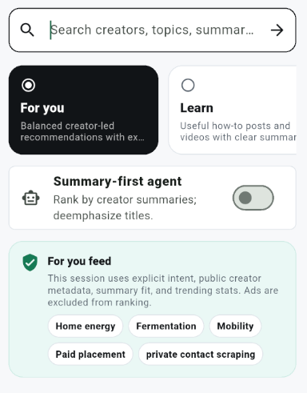 The shell is "modern looking" but the initial screen gives too much real estate to "settings" at the stop of the app screen. Note there is already a "search" button at the very top bar 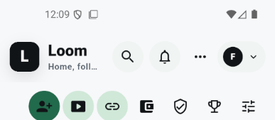 this is the correct location for search. The expected mobile pattern is that when i click the search button, a slide out panel apears (simialr to youtube mobile app) . Searching for a keyword then takes me to the "search" feeds page where results are shown based on my search (this page should be similar to youtube). Content in this page should be populated based on the ranking patterns we have defined already and dependent on if its an AI enabled searchor not, There should be a navigational "back" button to return to the main feeds screen like in youtube mobile app.
The options "for you/ learn/ summary-first agent " should occupy much less space. The top label should be a single "Recommendation Type: For you" with a skinny one line space saving description. Clicking this should again open a slide out panel with the current Ux embedded in it, with details of the other recomendation engines and all the recommdndations related settings. 
Applied Correction [F-P0-01]: Moved search to the shell search button with a slide-up panel, dedicated search-results page, and back navigation; collapsed feed controls into a compact "Recommendation Type" row with the full recommendation settings in a slide-up panel. files: app/packages/features/fan/feature_discovery/lib/src/discovery_home_screen.dart, app/packages/core/loom_design_system/lib/components/shell/nav_scaffold.dart, app/packages/core/loom_app_shell/lib/loom_app_shell.dart, app/apps/loom_demo/lib/main.dart · commit 9cc6801 · validated: app/design/discovery analyzers, widget_test, it_p3_search_no_ads, it_p23_ai_search_results, it_p3_tiles_session_intent.
| 3    | Switch between Fan App and Creator Studio. | Both surfaces load without blank screens, crashes, or stale navigation state.       |       Complete                          |
Correction Needed: 
Applied Correction: 
| 4    | Return to Fan App.                         | Bottom navigation, toolbar, and content area remain aligned and responsive.         |       Complete                          |
Correction Needed: 
Applied Correction: 
| 5    | Rotate or resize only if convenient.       | Layout still avoids clipped text, overlapping controls, and unstable card sizing.   |       Complete                          |
Correction Needed: 
Applied Correction: 

## Phase 1 - Identity And Onboarding

Goal: validate the identity foundation, fan interest picker, creator onboarding, and creator-card follow flow.

### Fan Onboarding

| Step | Action                                                      | Expected result                                                                                    | Result (Completed or Correction Needed) |
| ---- | ----------------------------------------------------------- | -------------------------------------------------------------------------------------------------- | --------------------------------------- |
| 1    | Open Fan App and start fan onboarding.                      | Fan onboarding opens with polished social-app styling and clear progress.                          |        Complete                         |
Correction Needed: 
Applied Correction: 
| 2    | Create the demo fan passport.                               | Passport creation completes and the interest picker appears.                                       |        Complete                         |
Correction Needed: 
Applied Correction: 
| 3    | Select interests across categories.                         | Chips are scannable, selected state is clear, and scrolling is smooth.                             |        Complete                         |
Correction Needed: 
Applied Correction: 
| 4    | Save interests.                                             | App advances to privacy/persona setup without losing selections.                                   |        Complete                         |
Correction Needed: 
Applied Correction: 
| 5    | Continue through privacy defaults.                          | Defaults are understandable and not overly technical.                                              |        Complete                         |
Correction Needed: 
Applied Correction: 
| 6    | Tap the suggested creator card itself, not only its button. | Creator card is clickable and follow state completes.                                              |        Complete                         |
Correction Needed: 
Applied Correction: 
| 7    | Review final state.                                         | Final state shows fan onboarding complete, plural starter-creator follows, and private visibility. |        Completed (re-validate)          |
Correction Needed [C-P1-01]: 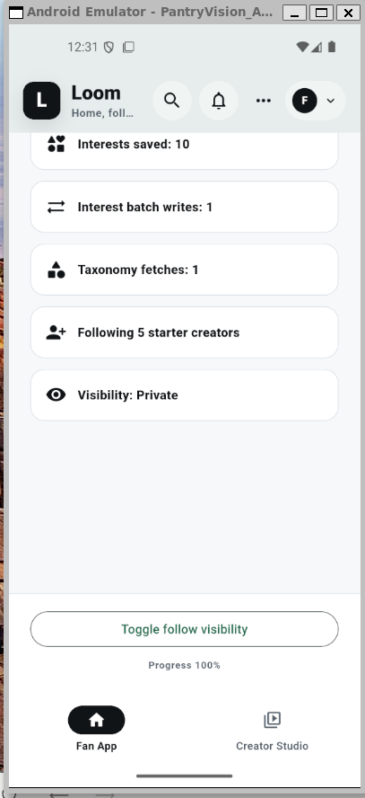 I wanted to update some of the settings. I was expecting to click on the setting tile i.e "Following 5 Starter Creators" to return to that screen and make edits, but there is no back button in this flow and no way to go back. There is also no way to return to the main Fan App Feeds page, i.e there is no "complete" button that takes me back. Also these set of screens are not following the same consistent navigational pattern as the other items in that navigational panel, when i click on the other icons 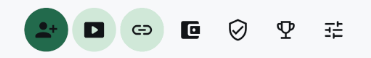 sometimes the navigational panel stays 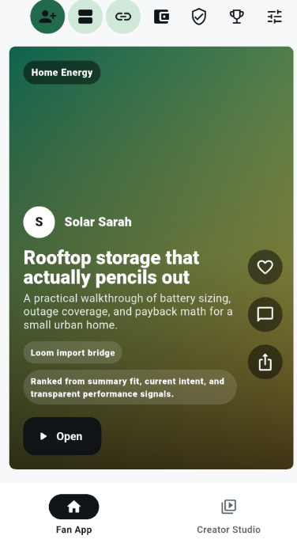 and some times it disapears 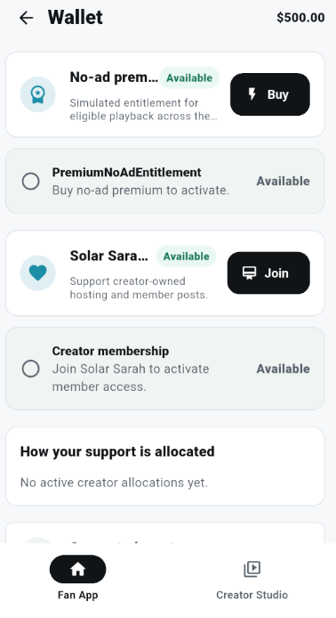. Lets fix the pattern so that this navigational panel is always present for us to quickly flip to another item in that panel. However this is a secondary panel that scrolls away, keep that behaviour and the user can scroll back to the top of the app to access this panel.
Updates to Applied Corrections: The navigation patterns are better, but we also need a way to return back quickly to the "feeds" screen 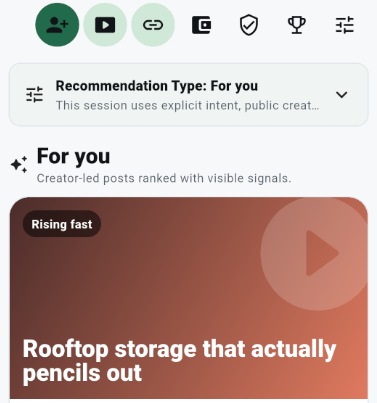. There is a "Back to Feed" button in the fan passport setup, but the other screens do not have a "Quick" button to return to the feeds at any given moment. We need a Return to feed in every view when we click the icons in the panel. There is no easy way to return to the feed here 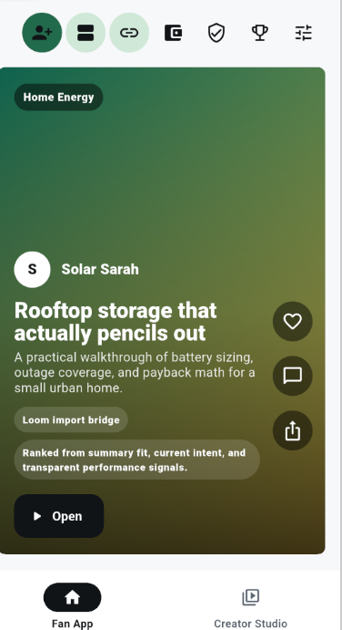. There is a "back" button in Wallet, Data Rights, Campaigns and AI Search. Lets label these back buttons as "Return to Feed" and use this pattern across all the panel actions.
Updated to Applied Corrections #2: The "retrun to feed" btttons are now present but there is inconsistency across the panel screens on where they apear  (Top Left and Bottom),  (No Retrun to Feed),  , (Duplicated on top of each other, then disapears when scrolling),   (Appears twice, then when scrolling it stays anchored, I like the anchored behavior here). Lets make sure return to feed only apears once in these screens, and stays anchored as you scroll. So keep this pattern  and remove the "Retrun to Feed" from the top panel  and from the bottom of the "Setup your fan Passport" .
Applied Correction [F-P1-01]: Added editable completion rows for interests/starter creators/privacy, back navigation through onboarding substeps, a Complete action returning to the Fan App feed, a shared fan secondary action rail on onboarding/wallet/data-rights/campaigns/capture/AI settings surfaces, and visible "Return to Feed" controls in the rail plus each opened fan panel. files: app/packages/features/fan/feature_fan_onboarding/lib/src/screens/fan_onboarding_screen.dart, app/packages/features/fan/feature_fan_onboarding/lib/src/screens/fan_capture_landing_screen.dart, app/packages/features/fan/feature_wallet/lib/src/wallet_screen.dart, app/packages/features/fan/feature_data_rights/lib/src/data_rights_dashboard_screen.dart, app/packages/features/fan/feature_campaigns/lib/src/campaign_entry_screen.dart, app/packages/features/fan/feature_fan_settings/lib/src/fan_ai_search_settings_screen.dart, app/apps/loom_demo/lib/main.dart, app/apps/loom_demo/integration_test/it_p1_FE-W1_test.dart · commits 9cc6801, b5dfeec · validated: feature_fan_onboarding analyzer, loom_demo analyzer, widget_test, it_p1_FE-W1; re-validated with flutter test integration_test/it_p1_FE-W1_test.dart.

### Creator Onboarding

| Step | Action                       | Expected result                                                              | Result (Completed or Correction Needed) |
| ---- | ---------------------------- | ---------------------------------------------------------------------------- | --------------------------------------- |
| 1    | Open Creator Studio.         | Creator onboarding screen appears with a polished Studio-style channel card. |             Corrections Needed          |
Correction Needed [C-P1-02]: The creator Studio have many buttons already displayed and the organization of the buttons is not clear. 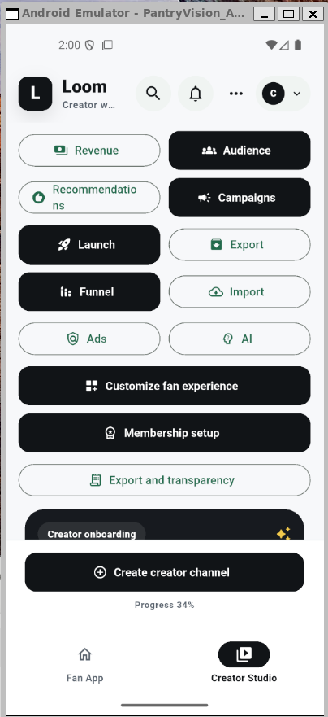. Create "Sections" and organize the buttons in proper sections. There is scrolable content after the buttons at the top 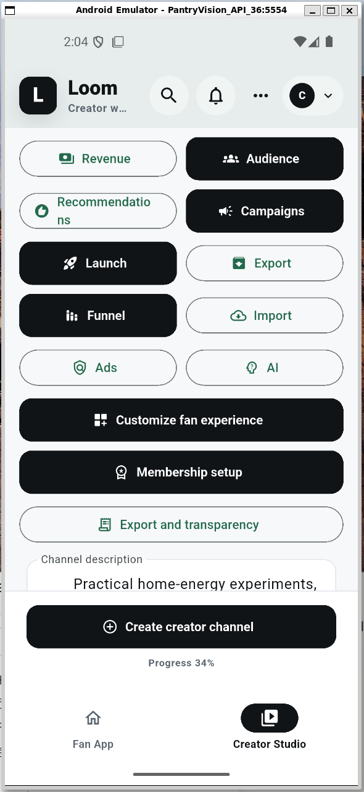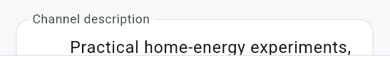, but the "fixed" buttons take up so much "real estate that the "scrolable" section is completely hidden. Replicate the top "Panel" from the Fan App 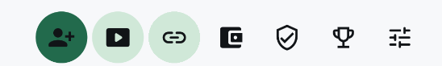 and use that pattern to navigate the different settings for the Creator Studio as opposed to these buttuns. The scrolable content should be the "main screen" for the creator studio where we navigate back to. "create channel" should also be a button in this top panel. Replicate the patterns we have implemented for the Fan App for the panel including the fixes we have applied to its Ux in terms of navigation patterns.  
Updates to Applied Corrections: We have now 4 panels, which again take up too much real estate. Condence to a single top level panel like , then when you click that top level panel the next screen can have the  panels for that screen like  , , , . Keep a "Return to Studio" button visible at all times in these sub screens. For for instance keep this header banner anchored for Launch  and where the current back arrow is, just replace that with a "Return to Studio" link with a house icon similar to "Return to Feed". Make this the pattern for all such screens in creator studio.
Also the current back buttons just return us back to the setup page. Even if I have completed the setting up the channel. We should create a distinct landing page for creators where "Return to Studio" lands. At the top f this page it should have a tile that says complete onboarding (Phase 1 2 3 etc. with some text on what needs to be done next). And the rest of the page should start with relevant analytics for the content creator to help them run their business. things like (and elaborate by researching other platforms) most watched content (filtered by categories, content type etc.), average search ranking of content from your fans, most served adds, MAU+Change, MRU+Change, Total Monthly/Weekly Subscriptions+Change. Implement these items as scrollable tiles on this main Creator Studio page which we are now going to create. We will need to implement the APIs and workflows to address this gap. But put seed data right into the app for the creator.
Applied Correction [F-P1-02]: Replaced the tall fixed Creator Studio button stack with a compact sectioned top action panel for Setup, Growth, Signals, and Demo; kept create-channel as the Studio home action and wrapped Studio sub-surfaces in the same persistent top-panel navigation pattern so the onboarding screen remains the main scrollable content. files: app/apps/loom_demo/lib/main.dart · commit b5dfeec · validated: flutter analyze apps/loom_demo, flutter test integration_test/it_p1_CE-W1_test.dart.
| 2    | Create the creator channel.  | Channel profile is created and the managed-hosting step appears.             |             Completed                   |
Correction Needed: 
Applied Correction: 
| 3    | Review managed-hosting copy. | The value of managed hosting is clear without feeling like legal text.       |             Completed                   |
Correction Needed [C-P1-03]: It was not clear what "Managed Hosting" will provide.
Applied Correction [F-P1-03]: Rewrote managed-hosting copy and checklist to explain that Loom keeps uploaded demo media playable, exposes thumbnails/metadata to feeds, and links future receipts/monetization records to hosted assets. files: app/packages/features/creator/feature_creator_onboarding/lib/src/screens/creator_onboarding_screen.dart · commit b5dfeec · validated: flutter analyze packages/features/creator/feature_creator_onboarding, flutter test integration_test/it_p1_CE-W1_test.dart.
| 4    | Accept managed hosting.      | Completion state appears.                                                    |             Completed                   |
Correction Needed: 
Applied Correction: 
| 5    | Review final state.          | Channel name, handle, and hosting status are visible.                        |            Completed                    |
Correction Needed [C-P1-04]: 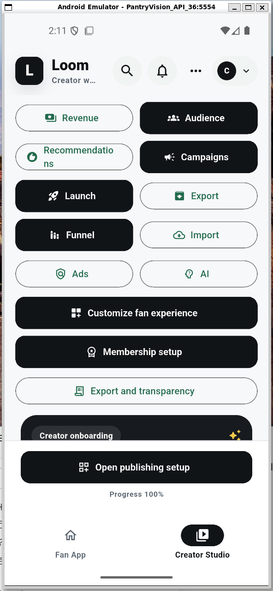 I did not see the channel name apear. I see "Open Publishing Setup"
Applied Correction [F-P1-04]: Promoted the created channel display name and handle into the final-state hero card, kept explicit fact rows for completion/channel/handle/hosting, and preserved the publishing setup CTA below that state. files: app/packages/features/creator/feature_creator_onboarding/lib/src/screens/creator_onboarding_screen.dart · commit b5dfeec · validated: flutter analyze packages/features/creator/feature_creator_onboarding, flutter test integration_test/it_p1_CE-W1_test.dart.
| 6    | Open publishing setup.       | Phase 2 Studio setup opens.                                                  |           Completed                     |
Correction Needed: 
Applied Correction: 

## Phase 2 - Creator Publishing And Monetization Setup

Goal: validate that Creator Studio setup feels like a modern creator workflow, not a basic admin form.

### Setup Entry

| Step | Action                                 | Expected result                                                                             | Result (Completed or Correction Needed) |
| ---- | -------------------------------------- | ------------------------------------------------------------------------------------------- | --------------------------------------- |
| 1    | Open Creator Studio.                   | Creator onboarding or completed creator state appears.                                      |           Completed                     |
Correction Needed [C-P2-01]: Nvaigating to the Fan App and then back to Creator Studio resets the Ui back to "Create Creator Channel" wizard state. 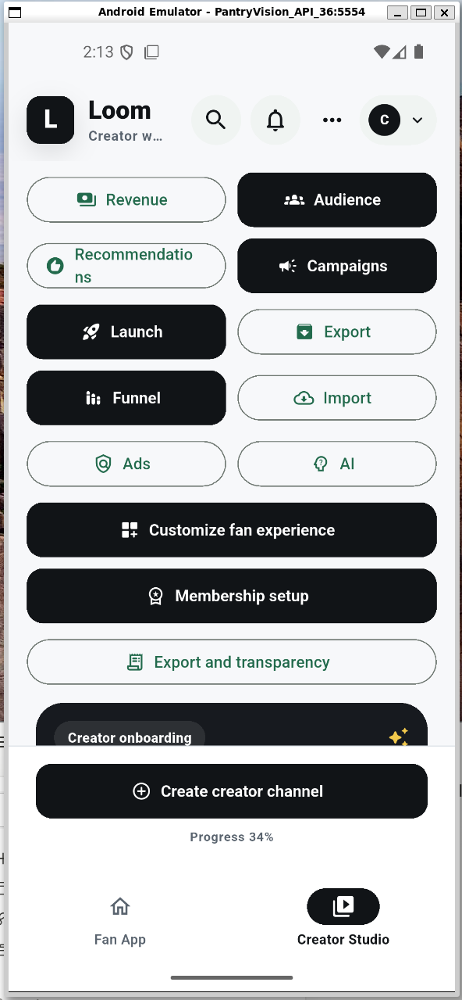. The previous setup seems to have disapeared.
Applied Correction [F-P2-01]: Changed the role shell from rebuilding a role-keyed surface to preserving Fan App and Creator Studio in an IndexedStack, while still resetting both surfaces only on demo reset. Added a retention integration test that completes creator onboarding, switches to Fan App, switches back, and verifies the completed channel state and publishing setup CTA remain visible. files: app/packages/core/loom_app_shell/lib/loom_app_shell.dart, app/apps/loom_demo/integration_test/it_p2_creator_state_retained_test.dart · commit b5dfeec · validated: flutter analyze packages/core/loom_app_shell, flutter test integration_test/it_p2_creator_state_retained_test.dart.
| 2    | Complete creator onboarding if needed. | The publishing setup entry point is visible.                                                |                                         |
Correction Needed: 
Applied Correction: 
| 3    | Open publishing setup.                 | Phase 2 setup screen opens with header, status cards, and publish composer.                 |              Completed                  |
Correction Needed: 
Applied Correction: 
| 4    | Review first viewport.                 | The page feels dense, modern, and creator-focused; status cards and publish path are clear. |              Completed                  |
Correction Needed: 
Applied Correction: 

### Publish Composer

| Step | Action                                         | Expected result                                                               | Result (Completed or Correction Needed) |
| ---- | ---------------------------------------------- | ----------------------------------------------------------------------------- | --------------------------------------- |
| 1    | Review media preview and title/summary fields. | Media preview comes first; title and required summary are easy to understand. |           Completed                     |
Correction Needed: 
Applied Correction: 
| 2    | Test missing summary.                          | Inline error appears for the required summary.                                |            Completed                    |
Correction Needed [C-P2-02]:  text apears below the summary text box and not "inline"
Applied Correction [F-P2-02]: Rendered the `summary_required` message as an inline error chip inside the creator-approved summary control instead of below the text box. files: app/packages/core/loom_design_system/lib/components/studio/publish_composer.dart - commit pending - validated: loom_design_system/feature_creator_publishing/loom_demo analyzers, flutter test -d emulator-5554 integration_test/it_p2_publish_requires_summary_test.dart.
| 3    | Generate an AI draft summary.                  | Summary field receives a usable draft.                                        |           Completed                     |
Correction Needed [C-P2-03]: The AI Draft Summary Button is unresponsive at first. After publishing the video it became responsive. Its a bit confusing as it seems like the flow is publish video, the create summary and publish post. So the Publish video action should be then above the "create approved summary box" if that is the flow.
Applied Correction [F-P2-03]: Kept Publish video above the approved summary box and left AI draft summary available before publishing; video upload can save with a pending-summary placeholder while member post still requires an approved summary. files: app/packages/core/loom_design_system/lib/components/studio/publish_composer.dart, app/packages/features/creator/feature_creator_publishing/lib/src/screens/creator_publishing_setup_screen.dart - commit pending - validated: flutter test -d emulator-5554 integration_test/it_p2_publish_requires_summary_test.dart.
| 4    | Publish video.                                 | Success state shows manifest version.                                         |         Completed                       |
Correction Needed: 
Applied Correction: 
| 5    | Publish post.                                  | Member-only post publishes successfully after summary exists.                 |          Completed                      |
Correction Needed: 
Applied Correction: 

### Import, Membership, Ads, AI

| Step | Action                             | Expected result                                                          | Result (Completed or Correction Needed) |
| ---- | ---------------------------------- | ------------------------------------------------------------------------ | --------------------------------------- |
| 1    | Start catalog import.              | Import completes and external references success state appears.          |           Completed                     |
Correction Needed: 
Applied Correction: 
| 2    | Define membership tiers.           | Membership setup reports entitlement definitions registered.             |           Completed                     |
Correction Needed: 
Applied Correction: 
| 3    | Save creator ad policy.            | Saved state appears and blocked categories are clear.                    |          Completed                      |
Correction Needed [C-P2-04]:  I can't select any of te option like Allow home energy, Block gambling etc. Let me select the actions to allow and block before clicking save policy. Also insert an "expando" that populates more add policy choises.
Applied Correction [F-P2-04]: Replaced static ad-policy chips with selectable Allow/Block policy rows plus a More policy choices expander, and persisted the selected allow/block categories in both Phase 2 setup and the Phase 13 ad-policy console. files: app/packages/core/loom_design_system/lib/components/studio/ad_policy_editor.dart, app/packages/features/creator/feature_creator_publishing/lib/src/state/creator_publishing_controller.dart, app/packages/features/creator/feature_creator_publishing/lib/src/screens/creator_publishing_setup_screen.dart, app/packages/features/creator/feature_creator_ads/lib/src/creator_ad_policy_console_screen.dart, app/apps/loom_demo/integration_test/it_p13_ad_policy_console_test.dart - commit pending - validated: flutter test -d emulator-5554 integration_test/it_p2_ad_policy_test.dart integration_test/it_p13_ad_policy_console_test.dart.
| 4    | Enable AI archive access.          | AI content policy stored state appears.                                  |          Completed                      |
Correction Needed: 
Applied Correction: 
| 5    | Review the whole page after setup. | Controls are compact; saved states are easy to verify; no text overlaps. |          Completed                      |
Correction Needed [C-P2-05]:  once actions are completed, the top tile should mention the updated status instead of generically "Phase 2 Setup". It should update to the latest status.
Applied Correction [F-P2-05]: Added a dynamic Phase 2 status chip/headline/detail that advances from setup to content published, catalog imported, memberships ready, ad policy saved, AI ready, and complete based on saved controller state. files: app/packages/features/creator/feature_creator_publishing/lib/src/screens/creator_publishing_setup_screen.dart - commit pending - validated: feature_creator_publishing analyzer and loom_demo analyzer.

## Phase 3 - Discovery Core

Goal: validate Fan App discovery: startup tiles, session intent, glass-box feed, feedback, mid-session switching, trending, and neutral search.

### Startup Tiles And Intent

| Step | Action                                            | Expected result                                                        | Result (Completed or Correction Needed) |
| ---- | ------------------------------------------------- | ---------------------------------------------------------------------- | --------------------------------------- |
| 1    | Open Fan App after Phase 3 or later is installed. | Home or Discover surface shows modern intent/topic entry points.       |           Completed                     |
Correction Needed [C-P3-01]:  putting the "why" click link in its own line occupies too much space, move this Why link next to the line above, along side here .
Applied Correction [F-P3-01]: Moved the Why action into the creator metadata row on each feed card so it no longer wraps into a standalone bottom line. files: app/packages/features/fan/feature_discovery/lib/src/discovery_home_screen.dart - commit pending - validated: feature_discovery analyzer, flutter test -d emulator-5554 integration_test/it_p3_feed_ranked_test.dart.
| 2    | Select a startup tile or intent chip.             | A session intent is created and the disclosure is visible.             |            Completed                    |
Correction Needed [C-P3-02]:  once I click an "Intent" Recommendation Type, it becomes unselectable/unclicable. So i can;t click for instance "for you" or "Learn" again and the session is stuck at "Trending".
Applied Correction [F-P3-02]: Replaced the large horizontal intent cards with compact selectable intent controls that remain visible/tappable and added a controller selecting state while the feed refreshes. files: app/packages/features/fan/feature_discovery/lib/src/discovery_home_screen.dart, app/packages/features/fan/feature_discovery/lib/src/discovery_controller.dart - commit pending - validated: flutter test -d emulator-5554 integration_test/it_p3_tiles_session_intent_test.dart integration_test/it_p3_mid_session_switch_test.dart.
| 3    | Review tile design.                               | Tiles are visual, scannable, and explain what kind of feed they start. |        Completed                        |
Correction Needed [C-P3-03]: Not enough content is displayed, we want a denser design like youtube   or spotify  so more content can be shown to the fans to pick from quicker.
Applied Correction [F-P3-03]: Converted feed cards to dense media rows with compact thumbnails, title/summary, creator metadata, provider pill, and compact feedback controls so more recommendations fit on screen. files: app/packages/features/fan/feature_discovery/lib/src/discovery_home_screen.dart - commit pending - validated: flutter test -d emulator-5554 integration_test/it_p3_feed_ranked_test.dart integration_test/it_p3_feedback_test.dart.
Correction Needed [C-P3-05]: There is still excessive white space in the top recommendation controls and the grid/list card rows: the top recommendation label should not include a separate “For you” chip, spacing between "Play/Read" and thumbs rows should be much tighter, icon controls are too large, and cards still show generic poster art.
Applied Correction [F-P3-05]: Removed redundant top "For you" block, compressed recommendation-type panel spacing, moved the copy text into the Recommendation Type row/sub-panel description, reduced action icon and row spacing across rows by ~75%, and switched poster rendering to seeded network clip media with image fallbacks for realistic content previews. files: app/packages/features/fan/feature_discovery/lib/src/discovery_home_screen.dart - commit pending - validated: feature_discovery analyzer, flutter test -d emulator-5554 integration_test/it_p3_feed_ranked_test.dart integration_test/it_p3_feedback_test.dart.

### Glass-Box Feed

| Step | Action                              | Expected result                                                                    | Result (Completed or Correction Needed) |
| ---- | ----------------------------------- | ---------------------------------------------------------------------------------- | --------------------------------------- |
| 1    | Review feed cards.                  | Cards show thumbnail/media, title, summary, creator, and compact why-shown badges. |                                         |
Correction Needed [C-P3-06]: Cards still need denser use of header/title/summary/feedback areas and less wasted vertical space between title/read controls and recommendation signals, especially in Grid view.
Applied Correction [F-P3-06]: Reduced card paddings, compacted action strip heights and icon sizes, removed spacer-induced dead space in grid rows, and inserted optional summary lines between creator and action controls for better scan density.
| 2    | Open a why-shown explanation.       | Sheet or detail view explains top ranking factors without overwhelming the feed.   |                                         |
Correction Needed: 
Applied Correction: 
| 3    | Load more feed content.             | Page 2 loads without duplicate content or jarring layout shifts.                   |                                         |
Correction Needed: 
Applied Correction: 
| 4    | Review trending/entertainment mode. | Trending items use host aggregate stats and feel visually distinct enough.         |                                         |
Correction Needed: 
Applied Correction: 

### Feedback And Search

| Step | Action                                          | Expected result                                                                           | Result (Completed or Correction Needed) |
| ---- | ----------------------------------------------- | ----------------------------------------------------------------------------------------- | --------------------------------------- |
| 1    | Like, dislike, mute, or block from a feed card. | Feedback affordances are icon-based, clear, and optimistic.                               |          Completed                      |
Correction Needed [C-P3-04]: Switching to grid view triggers a `RenderFlex` overflow and unstable rendering near the card action row, which can crash/hang during emulator interactions.
Applied Correction [F-P3-04]: Reworked grid tile action row to wrap/shrink its controls (`_GridTile` now uses `Wrap`; action chips/icons/pills use compact sizing and width constraints), preventing overflow in narrow cards and eliminating the crash. files: app/packages/features/fan/feature_discovery/lib/src/discovery_home_screen.dart · validated: flutter test -d emulator-5554 integration_test/it_p3_feed_ranked_test.dart integration_test/it_p3_feedback_test.dart integration_test/it_p3_tiles_session_intent_test.dart integration_test/it_p3_mid_session_switch_test.dart.
| 2    | Refresh or fetch next page.                     | Disliked or muted content is suppressed or visibly affected.                              |                                         |
Correction Needed: 
Applied Correction: 
| 3    | Switch session intent mid-session.              | Disclosure updates and feed re-ranks for the new intent.                                  |                                         |
Correction Needed: 
Applied Correction: 
| 4    | Search for a topic or creator.                  | Search feels neutral, uses thumbnails or creator rows, paginates, and shows no ad fields. |                                         |
Correction Needed: 
Applied Correction: 

### Hover Mode (3×4 Grid, Swipe Gestures, Undo)

| Step | Action | Expected result | Result (Completed or Correction Needed) |
| ---- | ------ | --------------- | --------------------------------------- |
| 1    | Switch to Hover view via ⋮ menu. | 3-column dense grid renders. Current layout mode highlighted in ⋮ menu (moss). | |
Correction Needed:
Applied Correction:
| 2    | Tap a tile in Hover mode. | Expanded card animates into center of viewport (spring, easeOutBack). Background blurs + dims. Feed behind card is fully inert — scroll is blocked. Load more button and all content below the grid are blurred. | |
Correction Needed [C-P3-07]: Expanded hover card opens off-screen when grid is scrolled to the bottom. Background feed remains scrollable while card is open, dragging the card off-screen. Load more button not covered by blur.
Applied Correction [F-P3-07]: Lifted blur + card overlays from inside `_DiscoveryFeedHoverGrid` to a viewport-level `Stack` wrapping the body `ListView`. `AbsorbPointer` makes the feed inert. `Center` now resolves to viewport center. files: app/packages/features/fan/feature_discovery/lib/src/discovery_home_screen.dart
| 3    | Tap the blurred background or ✕ button. | Card springs back (easeInCubic). Background becomes interactive again. | |
Correction Needed:
Applied Correction:
| 4    | Long-press a tile in Hover mode. | 👎 coral circle appears on the left, 👍 moss circle appears on the right. Tile lifts slightly. | |
Correction Needed:
Applied Correction:
| 5    | Long-press + drag left past threshold (~32% tile width). | Tile removed from grid. Grid reflows. Undo overlay appears at bottom: label "Thumbs down", circle-with-X icon (`p3_undo_button`), "Undo" text. Entire background inert. | |
Correction Needed:
Applied Correction:
| 6    | While dismiss undo overlay is visible, tap circle-with-X within 3 s. | Tile restored at original index. Overlay closes. No feedback sent. | |
Correction Needed:
Applied Correction:
| 7    | Dismiss a tile and tap anywhere on feed (not the ✕) within 3 s. | Overlay closes immediately. Dislike committed. Tile stays gone. | |
Correction Needed:
Applied Correction:
| 8    | Dismiss a tile and wait 3 s without tapping. | Overlay auto-closes. Dislike committed. Tile stays gone. | |
Correction Needed:
Applied Correction:
| 9    | Long-press + drag right past threshold. | Tile springs back to original position. Undo overlay appears: "Thumbs up", circle-with-X, "Undo". | |
Correction Needed:
Applied Correction:
| 10   | After thumbs-up, wait 3 s (or tap elsewhere). | Like committed. Ranking boosted for that item and creator. `pullAdditionalContent` may append a new tile at grid end. | |
Correction Needed:
Applied Correction:
| 11   | Open a Video hover card, tap the play button on the poster. | Video plays inline in the poster area (or navigates to content viewer). Non-video cards show no play button. | |
Correction Needed [C-P3-08]: Hover mode cards show no play button on the poster for Video content. The small "Play" chip in the action strip is not prominent and did not trigger playback.
Applied Correction [F-P3-08]: Added a centered play-button circle overlay on the poster image inside `_HoverCard` when `contentTypeLabel == 'Video'`. Tapping the poster or the play circle calls `onOpen` (routes to content viewer). files: app/packages/features/fan/feature_discovery/lib/src/discovery_home_screen.dart

## Phase 4 - Channel, Follow, Playback, And Ads

Goal: validate creator-channel browsing, follow/block controls, playback, post consumption, and privacy-safe ad presentation.

### Creator Channel

| Step | Action                                     | Expected result                                                                                    | Result (Completed or Correction Needed) |
| ---- | ------------------------------------------ | -------------------------------------------------------------------------------------------------- | --------------------------------------- |
| 1    | Open a creator from discovery.             | Creator channel opens with strong visual hierarchy, avatar/header, follow state, and content tabs. |                                         |
Correction Needed: 
Applied Correction: 
| 2    | Follow and unfollow the creator.           | State changes are immediate, clear, and reversible.                                                |                                         |
Correction Needed: 
Applied Correction: 
| 3    | Change relationship visibility if exposed. | Visibility copy is understandable and does not feel buried.                                        |                                         |
Correction Needed: 
Applied Correction: 
| 4    | Block the creator if exposed.              | Block action is clear, guarded where needed, and removes future eligibility.                       |                                         |
Correction Needed: 
Applied Correction: 

### Playback And Ads

| Step | Action                                        | Expected result                                                                          | Result (Completed or Correction Needed) |
| ---- | --------------------------------------------- | ---------------------------------------------------------------------------------------- | --------------------------------------- |
| 1    | Open a video item.                            | Player chrome appears with title, creator, progress/status, and no layout jump.          |                                         |
Correction Needed: 
Applied Correction: 
| 2    | Start or review playback authorization state. | Playback decision is clear and content is playable.                                      |                                         |
Correction Needed: 
Applied Correction: 
| 3    | Inspect the ad slot on ad-supported playback. | Ad slot is labeled, compact, creator-policy aware, and not behaviorally targeted.        |                                         |
Correction Needed: 
Applied Correction: 
| 4    | Complete playback or close the player.        | Playback completion and receipt state do not disrupt navigation.                         |                                         |
Correction Needed: 
Applied Correction: 
| 5    | Open a post item.                             | Post renders with summary, creator context, and receipt/completion state where expected. |                                         |
Correction Needed: 
Applied Correction: 

## Phase 5 - AI Archive Q&A

Goal: validate cited creator-archive Q&A and source-attribution receipts.

### Fan Q&A

| Step | Action                                                     | Expected result                                                      | Result (Completed or Correction Needed) |
| ---- | ---------------------------------------------------------- | -------------------------------------------------------------------- | --------------------------------------- |
| 1    | Open a creator or content item with archive Q&A available. | Q&A entry point is visible but does not crowd the primary content.   |                                         |
Correction Needed: 
Applied Correction: 
| 2    | Ask a recommended question.                                | Answer returns with cited sources and a clear answer/citation split. |                                         |
Correction Needed: 
Applied Correction: 
| 3    | Ask a custom question if available.                        | Query works without exposing implementation jargon.                  |                                         |
Correction Needed: 
Applied Correction: 
| 4    | Open source citations.                                     | Citations link back to relevant content summaries or source rows.    |                                         |
Correction Needed: 
Applied Correction: 
| 5    | Inspect usage or source-attribution receipt.               | Receipt is understandable and includes source attribution.           |                                         |
Correction Needed: 
Applied Correction: 

### Creator AI Setup Regression

| Step | Action                                | Expected result                                                               | Result (Completed or Correction Needed) |
| ---- | ------------------------------------- | ----------------------------------------------------------------------------- | --------------------------------------- |
| 1    | Open Creator Studio publishing setup. | AI archive policy state from Phase 2 is still visible.                        |                                         |
Correction Needed: 
Applied Correction: 
| 2    | Enable or review archive Q&A policy.  | Creator understands what archive access enables and what content is eligible. |                                         |
Correction Needed: 
Applied Correction: 
| 3    | Return to Fan App Q&A.                | Fan Q&A still works after role switching.                                     |                                         |
Correction Needed: 
Applied Correction: 

## Phase 6 - Wallet And Revenue Dashboard

Goal: validate simulated no-ad premium, creator membership, entitlement status, fan allocation, and creator revenue by source/intent.

### Fan Wallet

| Step | Action                                    | Expected result                                                                                                | Result (Completed or Correction Needed) |
| ---- | ----------------------------------------- | -------------------------------------------------------------------------------------------------------------- | --------------------------------------- |
| 1    | Open Fan Wallet.                          | Wallet uses modern subscriptions/payments styling with entitlement rows and clear simulated-money language.    |                                         |
Correction Needed: 
Applied Correction: 
| 2    | Start no-ad premium purchase.             | Confirmation sheet appears with amount, benefit, and simulated-payment state.                                  |                                         |
Correction Needed: 
Applied Correction: 
| 3    | Confirm no-ad purchase.                   | Premium no-ad entitlement appears, receipt is visible, and no duplicate charge appears on repeat confirmation. |                                         |
Correction Needed: 
Applied Correction: 
| 4    | Play ad-supported content after purchase. | Playback skips the ad slot or clearly shows no-ad premium eligibility.                                         |                                         |
Correction Needed: 
Applied Correction: 
| 5    | Start creator membership purchase.        | Confirmation sheet shows creator, tier, amount, and membership benefit.                                        |                                         |
Correction Needed: 
Applied Correction: 
| 6    | Confirm membership purchase.              | Membership subscription appears and member entitlement state is visible.                                       |                                         |
Correction Needed: 
Applied Correction: 
| 7    | Open fan allocation statement.            | Statement explains how the subscription supported creators with amounts and receipt context.                   |                                         |
Correction Needed: 
Applied Correction: 

### Creator Revenue

| Step | Action                                 | Expected result                                                                                | Result (Completed or Correction Needed) |
| ---- | -------------------------------------- | ---------------------------------------------------------------------------------------------- | --------------------------------------- |
| 1    | Open Creator Studio revenue dashboard. | Dashboard opens with metric cards, source breakdown, intent breakdown, and recent receipts.    |                                         |
Correction Needed: 
Applied Correction: 
| 2    | Review by-source revenue.              | Source breakdown is readable and reconciles with simulated purchases/receipts.                 |                                         |
Correction Needed: 
Applied Correction: 
| 3    | Review by-intent revenue.              | Intent breakdown appears in one dashboard view and is not hidden behind developer terminology. |                                         |
Correction Needed: 
Applied Correction: 
| 4    | Inspect recent receipts.               | Receipt rows include amount, source, intent or support context, and status.                    |                                         |
Correction Needed: 
Applied Correction: 
| 5    | Switch back to Fan App and return.     | Revenue dashboard remains stable after role switching.                                         |                                         |
Correction Needed: 
Applied Correction: 

## Phase 7 - Data Rights And Data For Value

Goal: validate consent, data grants, relationship controls, and DataAccessReceipts.

### Fan Data Rights

| Step | Action                                        | Expected result                                                                        | Result (Completed or Correction Needed) |
| ---- | --------------------------------------------- | -------------------------------------------------------------------------------------- | --------------------------------------- |
| 1    | Open data rights dashboard.                   | Dashboard explains active consents, data categories, and revocation paths clearly.     |                                         |
Correction Needed: 
Applied Correction: 
| 2    | Review a creator data-request.                | Request explains actor, purpose, value exchange, categories, duration, and revocation. |                                         |
Correction Needed: 
Applied Correction: 
| 3    | Approve a request.                            | Approval is obvious, persisted, and reflected in dashboard state.                      |                                         |
Correction Needed: 
Applied Correction: 
| 4    | Narrow a request.                             | Sheet or control lets the fan choose allowed fields/categories without confusion.      |                                         |
Correction Needed: 
Applied Correction: 
| 5    | Deny a request in a separate run if possible. | Denial state is clear and creator access is blocked.                                   |                                         |
Correction Needed: 
Applied Correction: 
| 6    | Set a category default.                       | Future matching requests honor the default and explain why.                            |                                         |
Correction Needed: 
Applied Correction: 
| 7    | Revoke a grant.                               | Revocation updates dashboard state and blocks future access.                           |                                         |
Correction Needed: 
Applied Correction: 

### Creator Audience

| Step | Action                                           | Expected result                                                                              | Result (Completed or Correction Needed) |
| ---- | ------------------------------------------------ | -------------------------------------------------------------------------------------------- | --------------------------------------- |
| 1    | Open Creator audience or data request screen.    | Creator sees aggregate insight panels and permission status, not raw surveillance-like data. |                                         |
Correction Needed: 
Applied Correction: 
| 2    | Create or review interest-data request.          | Request flow uses purpose, fields, retention, and value exchange clearly.                    |                                         |
Correction Needed: 
Applied Correction: 
| 3    | Query approved audience data after fan approval. | Only approved fields or aggregates appear.                                                   |                                         |
Correction Needed: 
Applied Correction: 
| 4    | Inspect DataAccessReceipt.                       | Receipt shows who accessed what, when, why, and under which grant.                           |                                         |
Correction Needed: 
Applied Correction: 

## Phase 8 - Recommendations, Campaigns, And Referral

Goal: validate creator recommendations, referral transparency, campaign setup, giveaway participation, and sponsor data-for-value reuse.

### Creator Recommendations And Campaigns

| Step | Action                               | Expected result                                                                      | Result (Completed or Correction Needed) |
| ---- | ------------------------------------ | ------------------------------------------------------------------------------------ | --------------------------------------- |
| 1    | Open Creator recommendation builder. | Builder follows Studio patterns with preview, status, validation, and publish state. |                                         |
Correction Needed: 
Applied Correction: 
| 2    | Publish a recommendation.            | Recommendation publishes with disclosure-ready metadata.                             |                                         |
Correction Needed: 
Applied Correction: 
| 3    | Publish or review referral terms.    | Terms, window, caps, and destination creator are clear.                              |                                         |
Correction Needed: 
Applied Correction: 
| 4    | Settle the demo referral.            | Creator revenue shows referral source revenue and a referral receipt.                |                                         |
Correction Needed: 
Applied Correction: 
| 5    | Open campaign builder.               | Campaign setup uses preview, reward, eligibility, schedule, and final review.        |                                         |
Correction Needed: 
Applied Correction: 
| 6    | Publish giveaway campaign.           | Campaign appears ready for fan participation.                                        |                                         |
Correction Needed: 
Applied Correction: 

### Fan Discovery And Participation

| Step | Action                                              | Expected result                                                                                   | Result (Completed or Correction Needed) |
| ---- | --------------------------------------------------- | ------------------------------------------------------------------------------------------------- | --------------------------------------- |
| 1    | Open Fan discovery after recommendation publish.    | Recommendation appears with "recommended by" context and lightweight disclosure.                  |                                         |
Correction Needed: 
Applied Correction: 
| 2    | Record the recommendation as seen.                  | Discovery receipt appears near the recommendation card.                                           |                                         |
Correction Needed: 
Applied Correction: 
| 3    | Convert through recommendation from Creator Studio. | Referral attribution receipt is emitted and visible in creator revenue.                           |                                         |
Correction Needed: 
Applied Correction: 
| 4    | Open giveaway campaign card.                        | Card feels like a social/community post with visual media, concise terms, and clear CTA.          |                                         |
Correction Needed: 
Applied Correction: 
| 5    | Enter giveaway.                                     | Entry flow confirms eligibility, consent/data-value offer if present, reward status, and receipt. |                                         |
Correction Needed: 
Applied Correction: 
| 6    | Accept sponsor data-for-value offer if present.     | Flow reuses Phase 7 consent language and does not introduce behavioral-targeting copy.            |                                         |
Correction Needed: 
Applied Correction: 

## Phase 9 - Export, Transparency, And Full Demo

Goal: validate export/portability, transparency surfaces, demo reset, full author-to-consume flow, and emulator run.

### Export And Transparency

| Step | Action                                            | Expected result                                                                                    | Result (Completed or Correction Needed) |
| ---- | ------------------------------------------------- | -------------------------------------------------------------------------------------------------- | --------------------------------------- |
| 1    | Open Creator export screen.                       | Export uses job/status pattern with start, progress, completed summary, and share/open affordance. |                                         |
Correction Needed: 
Applied Correction: 
| 2    | Create export job.                                | Job completes and reports portable bundle contents.                                                |                                         |
Correction Needed: 
Applied Correction: 
| 3    | Review export contents summary.                   | Bundle includes channel, content/catalog, receipts, settlement history, and policy data.           |                                         |
Correction Needed: 
Applied Correction: 
| 4    | Open fan transparency or supported-creators view. | Fan sees allocation and receipt-ledger context in clear language.                                  |                                         |
Correction Needed: 
Applied Correction: 
| 5    | Open creator transparency/revenue reconciliation. | Creator view reconciles receipts, allocation, and revenue without conflicting totals.              |                                         |
Correction Needed: 
Applied Correction: 

### Full Demo

| Step | Action                           | Expected result                                                                            | Result (Completed or Correction Needed) |
| ---- | -------------------------------- | ------------------------------------------------------------------------------------------ | --------------------------------------- |
| 1    | Run the author-to-consume loop.  | Creator authors content/policies, switches role, and Fan App consumes the authored output. |                                         |
Correction Needed: 
Applied Correction: 
| 2    | Run the six-step wow demo.       | Flow is smooth and understandable without developer explanation.                           |                                         |
Correction Needed: 
Applied Correction: 
| 3    | Reset demo from debug/demo menu. | App returns to seeded baseline without stale authored state.                               |                                         |
Correction Needed: 
Applied Correction: 
| 4    | Relaunch after reset.            | App starts cleanly and seed world is restored.                                             |                                         |
Correction Needed: 
Applied Correction: 
| 5    | Validate on emulator.            | APK installs, launches, and full demo works on the Flutter Android emulator.               |                                         |
Correction Needed: 
Applied Correction: 

## Phase 10 - Launch Contracts, Store, And Fakes

Goal: validate that the app still launches and resets cleanly after launch API contracts, local-store tables, fakes, and seed data are added. This phase has no main UX checkpoint.

| Step | Action                                     | Expected result                                                                        | Result (Completed or Correction Needed) |
| ---- | ------------------------------------------ | -------------------------------------------------------------------------------------- | --------------------------------------- |
| 1    | Launch the app on the emulator.            | App reaches the first rendered screen without hanging or showing a schema/reset error. |                                         |
Correction Needed: 
Applied Correction: 
| 2    | Switch between Fan App and Creator Studio. | Existing Phase 0-9 surfaces still load.                                                |                                         |
Correction Needed: 
Applied Correction: 
| 3    | Reset demo from debug/demo menu.           | App resets without errors and returns to seeded baseline.                              |                                         |
Correction Needed: 
Applied Correction: 
| 4    | Relaunch after reset.                      | App starts cleanly and existing seed world is restored.                                |                                         |
Correction Needed: 
Applied Correction: 

## Phase 11 - Creator Launch Funnel

Goal: validate the Creator Studio launch-growth workflow: announcement templates, link-in-bio preview, QR/capture link, external account context, and cross-post stub.

| Step | Action                                  | Expected result                                                                                                             | Result (Completed or Correction Needed) |
| ---- | --------------------------------------- | --------------------------------------------------------------------------------------------------------------------------- | --------------------------------------- |
| 1    | Open Creator Studio Launch / Grow area. | Creator sees a modern Studio console with launch status, templates, preview, QR/capture link, and external account context. |                                         |
Correction Needed: 
Applied Correction: 
| 2    | Choose an announcement template.        | Template selection updates preview without layout shift.                                                                    |                                         |
Correction Needed: 
Applied Correction: 
| 3    | Render or copy an announcement.         | Copy is honest about inviting fans to re-follow on Loom and never implies follower import.                                  |                                         |
Correction Needed: 
Applied Correction: 
| 4    | Review link-in-bio preview.             | Preview shows creator identity, primary Loom follow link, and relevant public links.                                        |                                         |
Correction Needed: 
Applied Correction: 
| 5    | Review QR/capture link card.            | QR/copy controls are clear and capture-link state is visible.                                                               |                                         |
Correction Needed: 
Applied Correction: 
| 6    | Start simulated cross-post.             | Cross-post status is explicitly stubbed/simulated and does not imply real external posting.                                 |                                         |
Correction Needed: 
Applied Correction: 

## Phase 12 - Fan Starter-Pack Onboarding

Goal: validate fan arrival through a creator capture link, one-tap starter-pack follow, idempotency, and non-empty feed landing.

| Step | Action                                     | Expected result                                                                                                    | Result (Completed or Correction Needed) |
| ---- | ------------------------------------------ | ------------------------------------------------------------------------------------------------------------------ | --------------------------------------- |
| 1    | Open a creator capture link.               | Fan lands on a creator-branded follow-capture page.                                                                |                                         |
Correction Needed: 
Applied Correction: 
| 2    | Review starter-pack list.                  | Source creator and recommended creators show avatars, names/handles, why-recommended context, and selected states. |                                         |
Correction Needed: 
Applied Correction: 
| 3    | Toggle one recommended creator off and on. | Selection state is clear and primary action remains stable.                                                        |                                         |
Correction Needed: 
Applied Correction: 
| 4    | Confirm starter pack.                      | Fan follows the selected creators in one action.                                                                   |                                         |
Correction Needed: 
Applied Correction: 
| 5    | Land in Fan App feed.                      | Feed is non-empty and reflects the starter-pack follows.                                                           |                                         |
Correction Needed: 
Applied Correction: 
| 6    | Re-open the same capture link.             | App shows existing/accepted state and does not duplicate follows.                                                  |                                         |
Correction Needed: 
Applied Correction: 
| 7    | Run existing fan onboarding if reachable.  | Suggested creator UX supports multiple creators and Phase 1 completion still works.                                |                                         |
Correction Needed: 
Applied Correction: 

## Phase 13 - Conversion Analytics And Creator Utility Consoles

Goal: validate creator conversion-yield analytics and completed creator utility consoles.

### Launch Analytics

| Step | Action                                           | Expected result                                                                   | Result (Completed or Correction Needed) |
| ---- | ------------------------------------------------ | --------------------------------------------------------------------------------- | --------------------------------------- |
| 1    | Open Creator conversion analytics.               | Funnel shows reached -> re-followed -> member/premium with aggregate-only values. |                                         |
Correction Needed: 
Applied Correction: 
| 2    | Review funnel visuals at phone width.            | Visual is compact, readable, and not row-only.                                    |                                         |
Correction Needed: 
Applied Correction: 
| 3    | Inspect supporting trend/source rows if present. | Rows do not expose per-fan behavioral data or universal fan IDs.                  |                                         |
Correction Needed: 
Applied Correction: 

### Utility Consoles

| Step | Action                                                      | Expected result                                                                       | Result (Completed or Correction Needed) |
| ---- | ----------------------------------------------------------- | ------------------------------------------------------------------------------------- | --------------------------------------- |
| 1    | Review creator catalog import.                              | Import UI has preview, validation, job status, and usable imported public references. |                                         |
Correction Needed: 
Applied Correction: 
| 2    | Review ad-policy console.                                   | Creator can allow/block categories or brands and saved version is visible.            |                                         |
Correction Needed: 
Applied Correction: 
| 3    | Play or inspect ad-supported fan content after policy save. | Playback/ad decision reflects the latest creator policy.                              |                                         |
Correction Needed: 
Applied Correction: 
| 4    | Review creator archive-AI preview.                          | Creator can ask their own archive and receive cited answers before fans arrive.       |                                         |
Correction Needed: 
Applied Correction: 
| 5    | Review membership setup.                                    | Tier editor has preview, validation, and saved tier state.                            |                                         |
Correction Needed: 
Applied Correction: 

## Phase 14 - UX Hardening And Launch Regression

Goal: validate immersive discovery, richer media, async states, feed-style pagination, full launch demo, and optional preliminary physical-phone smoke. Final phone sign-off happens in Phase 26.

### UX Hardening

| Step | Action                                                                                                 | Expected result                                                                                        | Result (Completed or Correction Needed) |
| ---- | ------------------------------------------------------------------------------------------------------ | ------------------------------------------------------------------------------------------------------ | --------------------------------------- |
| 1    | Open immersive discovery surface.                                                                      | Full-height media surface renders with floating actions and bottom metadata/action panel.              |                                         |
Correction Needed: 
Applied Correction: 
| 2    | Switch between dense and immersive discovery.                                                          | Navigation feels intentional and state does not get stale.                                             |                                         |
Correction Needed: 
Applied Correction: 
| 3    | Check loading, empty, and error states where reachable.                                                | States use reusable polished components and avoid raw test scaffolding.                                |                                         |
Correction Needed: 
Applied Correction: 
| 4    | Review media assets across feed, channel, player, campaign, launch, starter-pack, and Studio surfaces. | Main social surfaces are visual-first and not mostly text or generic placeholders.                     |                                         |
Correction Needed: 
Applied Correction: 
| 5    | Trigger feed pagination.                                                                               | Additional content loads without duplicates or jarring layout shifts; explicit test path still exists. |                                         |
Correction Needed: 
Applied Correction: 

### Final Launch Demo And Optional Phone Smoke

| Step | Action                                                                                  | Expected result                                                                                                        | Result (Completed or Correction Needed) |
| ---- | --------------------------------------------------------------------------------------- | ---------------------------------------------------------------------------------------------------------------------- | --------------------------------------- |
| 1    | Run the full launch demo on emulator.                                                   | Re-acquisition -> starter pack -> consume -> conversion analytics -> utility console -> export/reset works end to end. |                                         |
Correction Needed: 
Applied Correction: 
| 2    | Reset demo and relaunch on emulator.                                                    | App returns to seeded baseline without stale launch state.                                                             |                                         |
Correction Needed: 
Applied Correction: 
| 3    | If physical hardware is available, install APK on Android phone as a preliminary smoke. | Install succeeds and app launches to first rendered screen; otherwise record phone validation as deferred to Phase 26. |                                         |
Correction Needed: 
Applied Correction: 
| 4    | If hardware is available, run key launch flows as a preliminary smoke.                  | Capture/starter pack, discovery/playback, conversion analytics, and export/reset work on hardware.                     |                                         |
Correction Needed: 
Applied Correction: 
| 5    | If hardware is available, inspect phone layout.                                         | Safe areas, scrolling, text wrapping, and tap targets work without clipping or overlap.                                |                                         |
Correction Needed: 
Applied Correction: 

## Phase 15 - Extensions Platform Foundation

Goal: validate that certified extensions, installs, creator configs, and reset behavior exist before live extension UX.

| Step | Action                                                           | Expected result                                                                                        | Result (Completed or Correction Needed) |
| ---- | ---------------------------------------------------------------- | ------------------------------------------------------------------------------------------------------ | --------------------------------------- |
| 1    | Reset demo and open a gaming creator channel such as NovaClutch. | Channel loads with a distinct gaming theme and installed extension slots.                              |                                         |
Correction Needed: 
Applied Correction: 
| 2    | Review all five gaming creators.                                 | Each has a different theme/banner/module order; no creator appears as a clone of another.              |                                         |
Correction Needed: 
Applied Correction: 
| 3    | Inspect extension slot copy.                                     | Slot names, versions, approved surfaces, and config summaries are visible and not broken placeholders. |                                         |
Correction Needed: 
Applied Correction: 
| 4    | Reset demo again.                                                | Extension slots and creator configs return to seeded baseline.                                         |                                         |
Correction Needed: 
Applied Correction: 

## Phase 16 - Config-Driven Channel Renderer

Goal: validate the fan channel renderer uses `CreatorExperienceConfig` rather than hardcoded creator UI.

| Step | Action                                                                            | Expected result                                                                                                 | Result (Completed or Correction Needed) |
| ---- | --------------------------------------------------------------------------------- | --------------------------------------------------------------------------------------------------------------- | --------------------------------------- |
| 1    | Open NovaClutch, EmberHollow, FrameByFrame, DriftAndChill, and IronVael channels. | Theme, banner, first module, and module order visibly differ per creator.                                       |                                         |
Correction Needed: 
Applied Correction: 
| 2    | Open a non-gaming creator channel.                                                | The generic renderer still shows identity, ad posture, archive entry, and content without gaming-specific copy. |                                         |
Correction Needed: 
Applied Correction: 
| 3    | Review AI archive entry and ad posture copy.                                      | Persona and ad posture read as creator-specific data and remain legible at phone width.                         |                                         |
Correction Needed: 
Applied Correction: 
| 4    | Scroll through all modules.                                                       | Unknown or inactive modules render stable safe placeholders, not crashes or raw debug text.                     |                                         |
Correction Needed: 
Applied Correction: 

## Phase 17 - Competitive And Economy Extensions

Goal: validate Clip Arena, Pick'Em, and HypeWars render as live fan modules inside creator channels.

| Step | Action                                            | Expected result                                                                              | Result (Completed or Correction Needed) |
| ---- | ------------------------------------------------- | -------------------------------------------------------------------------------------------- | --------------------------------------- |
| 1    | Open NovaClutch.                                  | Clip Arena, Pick'Em, and HypeWars appear inside the channel module stack.                    |                                         |
Correction Needed: 
Applied Correction: 
| 2    | In Clip Arena, submit a clip and vote the leader. | The leaderboard updates, shows the submitted clip, and vote/reward feedback is visible.      |                                         |
Correction Needed: 
Applied Correction: 
| 3    | In Pick'Em, choose an option.                     | The selected pick is shown and the ladder includes the fan standing/points.                  |                                         |
Correction Needed: 
Applied Correction: 
| 4    | In HypeWars, send simulated hype.                 | Wallet copy remains clearly simulated, meter advances, and contribution feedback is visible. |                                         |
Correction Needed: 
Applied Correction: 
| 5    | Compare NovaClutch and FrameByFrame Clip Arena.   | Same module renders with different creator-specific prompt/config.                           |                                         |
Correction Needed: 
Applied Correction: 

## Phase 18 - Collaborative And Creative Extensions

Goal: validate Quest Log, Build Showcase, and Guild Quest once implemented.

| Step | Action                             | Expected result                                                                                          | Result (Completed or Correction Needed) |
| ---- | ---------------------------------- | -------------------------------------------------------------------------------------------------------- | --------------------------------------- |
| 1    | Open EmberHollow.                  | Quest Log and Build Showcase render as live modules with cozy/lore-specific copy.                        |                                         |
Correction Needed: 
Applied Correction: 
| 2    | Add progress to Quest Log.         | Progress persists and aggregate progress updates without exposing fan identity beyond the demo fan view. |                                         |
Correction Needed: 
Applied Correction: 
| 3    | Submit and vote on Build Showcase. | Submission appears in the showcase and rank/vote affordances remain phone-readable.                      |                                         |
Correction Needed: 
Applied Correction: 
| 4    | Open IronVael.                     | Guild Quest renders roster/progress state and milestone rewards using the shared runtime pattern.        |                                         |
Correction Needed: 
Applied Correction: 

## Phase 19 - Creator Studio Customize Console

Goal: validate creator controls for channel theme, extension installs, module order, and preview.

| Step | Action                                          | Expected result                                                                                          | Result (Completed or Correction Needed) |
| ---- | ----------------------------------------------- | -------------------------------------------------------------------------------------------------------- | --------------------------------------- |
| 1    | Open Creator Studio customization.              | Theme/banner controls, extension list, module order, and preview are reachable from Studio.              |                                         |
Correction Needed: 
Applied Correction: 
| 2    | Change a theme/banner option.                   | Preview updates immediately and saved changes persist after navigation.                                  |                                         |
Correction Needed: 
Applied Correction: 
| 3    | Install/configure an extension.                 | Permissions/surfaces are clear, config fields are understandable, and save uses idempotent API behavior. |                                         |
Correction Needed: 
Applied Correction: 
| 4    | Reorder modules.                                | Fan channel preview reflects the new order without layout jumps.                                         |                                         |
Correction Needed: 
Applied Correction: 
| 5    | Switch to Fan App and open the creator channel. | Fan-facing channel uses the Studio-authored config.                                                      |                                         |
Correction Needed: 
Applied Correction: 

## Phase 20 - Customization Showcase

Goal: validate the complete customized demo on the Flutter Android emulator. Final physical-phone validation is Phase 26.

| Step | Action                                                      | Expected result                                                                                              | Result (Completed or Correction Needed) |
| ---- | ----------------------------------------------------------- | ------------------------------------------------------------------------------------------------------------ | --------------------------------------- |
| 1    | Run the full customized fan demo on emulator.               | Discovery -> creator channel -> extension modules -> playback/Q&A/wallet/export flows work together.         |                                         |
Correction Needed: 
Applied Correction: 
| 2    | Run the Creator Studio customization path on emulator.      | Creator can adjust appearance/extensions and immediately verify in preview/Fan App.                          |                                         |
Correction Needed: 
Applied Correction: 
| 3    | Review the five gaming creator worlds on emulator.          | Each creator has distinct generated media, theme, module order, extension content, persona, and ad posture.  |                                         |
Correction Needed: 
Applied Correction: 
| 4    | Check loading, empty, and error states on the new surfaces. | Channel, extension, and Studio customization surfaces use polished reusable states without raw placeholders. |                                         |
Correction Needed: 
Applied Correction: 
| 5    | Reset demo on emulator.                                     | App returns to seeded baseline without stale extension, wallet, or customization state.                      |                                         |
Correction Needed: 
Applied Correction: 

## Phase 21 - AI Search And External Content Foundation

Goal: validate that AI-search contracts, seed state, fakes, and reset behavior exist before user-facing search UX.

| Step | Action                                             | Expected result                                                                      | Result (Completed or Correction Needed) |
| ---- | -------------------------------------------------- | ------------------------------------------------------------------------------------ | --------------------------------------- |
| 1    | Reset demo and relaunch.                           | App starts cleanly with AI-search/external-content seed state loaded.                |                                         |
Correction Needed: 
Applied Correction: 
| 2    | Open existing Fan App search/discovery.            | Existing neutral search and creator feeds still work before AI-search UI is enabled. |                                         |
Correction Needed: 
Applied Correction: 
| 3    | Inspect five gaming creator channels if reachable. | Seeded external-content references do not break channel rendering.                   |                                         |
Correction Needed: 
Applied Correction: 
| 4    | Reset demo again.                                  | Seeded external-content and AI-search fake state returns to baseline.                |                                         |
Correction Needed: 
Applied Correction: 

## Phase 22 - Fan AI Search Settings

Goal: validate simulated agent/source connection settings and disclosure UX.

| Step | Action                                         | Expected result                                                                 | Result (Completed or Correction Needed) |
| ---- | ---------------------------------------------- | ------------------------------------------------------------------------------- | --------------------------------------- |
| 1    | Open Fan Settings.                             | AI search settings are discoverable without crowding primary social navigation. |                                         |
Correction Needed: 
Applied Correction: 
| 2    | Connect a simulated AI search agent.           | Provider, status, and simulated connection copy are explicit and honest.        |                                         |
Correction Needed: 
Applied Correction: 
| 3    | Enable external sources and simulated YouTube. | Source toggles persist and explain query egress clearly.                        |                                         |
Correction Needed: 
Applied Correction: 
| 4    | Set prefer-creators default.                   | The preference is saved and the UI explains creator-first ranking behavior.     |                                         |
Correction Needed: 
Applied Correction: 

## Phase 23 - AI Search Results

Goal: validate merged creator + external search results with creator-preferred ranking and compliant external-title handling.

| Step | Action                                        | Expected result                                                                                        | Result (Completed or Correction Needed) |
| ---- | --------------------------------------------- | ------------------------------------------------------------------------------------------------------ | --------------------------------------- |
| 1    | Search with an AI-search agent connected.     | Results merge creator-owned and external content without paid-placement copy.                          |                                         |
Correction Needed: 
Applied Correction: 
| 2    | Review creator-preferred ordering.            | Creator results are clearly prioritized when relevant and explainable.                                 |                                         |
Correction Needed: 
Applied Correction: 
| 3    | Inspect external result rows.                 | External title/thumbnail/source remain unaltered; additive match labels and source chips are separate. |                                         |
Correction Needed: 
Applied Correction: 
| 4    | Disconnect or disable the agent if reachable. | Search falls back to neutral existing behavior.                                                        |                                         |
Correction Needed: 
Applied Correction: 

## Phase 24 - Embedded Player And AI-Driven Next

Goal: validate official external playback and AI-driven next recommendations.

| Step | Action                                        | Expected result                                                                                 | Result (Completed or Correction Needed) |
| ---- | --------------------------------------------- | ----------------------------------------------------------------------------------------------- | --------------------------------------- |
| 1    | Open a YouTube external result.               | Official in-app YouTube player renders unobscured with source attribution.                      |                                         |
Correction Needed: 
Applied Correction: 
| 2    | Review the next rail.                         | "Next from your AI search" appears as Loom-owned recommendation context, not platform autoplay. |                                         |
Correction Needed: 
Applied Correction: 
| 3    | Open a non-YouTube external result if seeded. | App uses external-open behavior with clear source context.                                      |                                         |
Correction Needed: 
Applied Correction: 
| 4    | Test offline/error state if possible.         | External playback shows a polished error state and preserves navigation.                        |                                         |
Correction Needed: 
Applied Correction: 

## Phase 25 - Creator External Content In Feeds

Goal: validate creator-authored external-content linking and fan feed rendering.

| Step | Action                                                        | Expected result                                                                               | Result (Completed or Correction Needed) |
| ---- | ------------------------------------------------------------- | --------------------------------------------------------------------------------------------- | --------------------------------------- |
| 1    | Open Creator Studio external-content linking.                 | Creator can add/review external content with source, title, attribution, and gating controls. |                                         |
Correction Needed: 
Applied Correction: 
| 2    | Save an external-content item.                                | Saved state is visible and uses idempotent API behavior.                                      |                                         |
Correction Needed: 
Applied Correction: 
| 3    | Switch to Fan App and open the creator channel/feed.          | External content appears as a native tile with unaltered source title and clear attribution.  |                                         |
Correction Needed: 
Applied Correction: 
| 4    | Toggle search/indexing or AI-queryable controls if available. | Fan feed/search behavior reflects the selected gates.                                         |                                         |
Correction Needed: 
Applied Correction: 

## Phase 26 - Gaming Seed Showcase And Final Validation

Goal: validate the full AI-search + external-content showcase on emulator and complete authoritative physical Android phone sign-off.

| Step | Action                                                                                     | Expected result                                                                                                                    | Result (Completed or Correction Needed) |
| ---- | ------------------------------------------------------------------------------------------ | ---------------------------------------------------------------------------------------------------------------------------------- | --------------------------------------- |
| 1    | Run the full launch + customization + AI-search showcase on emulator.                      | Re-acquisition, starter pack, five gaming worlds, AI search, external playback, Studio authoring, export, and reset work together. |                                         |
Correction Needed: 
Applied Correction: 
| 2    | Open Fan Settings, connect the simulated agent, enable YouTube, and search a gaming topic. | Mixed creator/external results preserve original external title, source chip, accurate-match label, and no-ad/no-boost disclosure. |                                         |
Correction Needed: 
Applied Correction: 
| 3    | Open a YouTube AI-search result.                                                           | Official embedded player is unobscured, no Loom ads cover the embed, and AI-driven next rail appears.                              |                                         |
Correction Needed: 
Applied Correction: 
| 4    | Open NovaClutch, EmberHollow, FrameByFrame, DriftAndChill, and IronVael.                   | Each channel includes a native creator-linked YouTube tile with source attribution and creator note.                               |                                         |
Correction Needed: 
Applied Correction: 
| 5    | Tap one creator-linked YouTube tile.                                                       | It opens the same embedded playback flow and preserves original title/source context.                                              |                                         |
Correction Needed: 
Applied Correction: 
| 6    | Install the final APK on a physical Android phone and record device ID/model.              | `adb install` succeeds and app launches to first rendered screen on hardware.                                                      |                                         |
Correction Needed: 
Applied Correction: 
| 7    | Run the full showcase on the phone.                                                        | Safe areas, scrolling, text wrapping, tap targets, async states, and real network playback work on hardware.                       |                                         |
Correction Needed: 
Applied Correction: 
| 8    | Capture validation screenshots.                                                            | Emulator and physical-phone screenshots are stored under `data/validation/` and remain gitignored.                                 |                                         |
Correction Needed: 
Applied Correction: 
| 9    | Reset demo on phone and emulator.                                                          | Both return to seeded baseline without stale extension, wallet, customization, search, or external-content state.                  |                                         |
Correction Needed: 
Applied Correction: 

## Cross-Phase Visual Regression Pass

Run this after Phase 6, Phase 8, Phase 9, Phase 13, Phase 14, Phase 17, Phase 19, Phase 20, Phase 23, Phase 24, Phase 26, or whenever the app shell changes.

| Step | Action                                                                              | Expected result                                                                          | Result (Completed or Correction Needed) |
| ---- | ----------------------------------------------------------------------------------- | ---------------------------------------------------------------------------------------- | --------------------------------------- |
| 1    | Visit Fan App home, creator channel, playback, Q&A, wallet, data rights, campaigns. | Surfaces look like one coherent modern social app.                                       |                                         |
Correction Needed: 
Applied Correction: 
| 2    | Visit Creator Studio onboarding, publishing, revenue, audience, campaign, export.   | Studio surfaces look like one coherent creator tool.                                     |                                         |
Correction Needed: 
Applied Correction: 
| 3    | Check top bars and bottom navigation.                                               | Icons, labels, spacing, selected states, and tap targets are consistent.                 |                                         |
Correction Needed: 
Applied Correction: 
| 4    | Check sheets and dialogs.                                                           | Sheets use clear titles, primary/secondary actions, and no clipped text.                 |                                         |
Correction Needed: 
Applied Correction: 
| 5    | Check long content and scrolling.                                                   | Text does not overlap; cards maintain stable dimensions; no controls jump while loading. |                                         |
Correction Needed: 
Applied Correction: 
| 6    | Check empty/loading/success/error states where reachable.                           | States feel intentional and not like raw test scaffolding.                               |                                         |
Correction Needed: 
Applied Correction: 


## Appendix — Prereqs (one-time setup)

These run **once** per machine (in WSL Ubuntu); the repetitive launch/target commands stay in the sections above.

### A. Create the manual emulator AVD (`PantryVision_Manual_API_36`)

A second **writable** emulator needs its own AVD. Create a clean one from the same system image the agent AVD uses (`google_apis` `x86_64`, `pixel_5`):

```bash
echo "no" | avdmanager create avd -n PantryVision_Manual_API_36 -k "system-images;android-36;google_apis;x86_64" -d pixel_5
emulator -list-avds          # confirm PantryVision_API_36 AND PantryVision_Manual_API_36
```

`avdmanager`, `sdkmanager`, and `emulator` live under `/usr/lib/android-sdk/...` and are on `PATH`. Find other installed system images with `sdkmanager --list_installed`.
*(Prefer a fresh `avdmanager` AVD over cloning the agent AVD folder: copying a live `userdata` while the agent emulator is running can carry over locks/snapshots.)*

### B. WSL memory

Two emulators plus a build are RAM-heavy. WSL2 with **no `~/.wslconfig`** already takes ~50% of host RAM by default (≈31 GB on this machine), which is ample — so **no change is needed here**. Only add a cap if you specifically want to *bound* WSL. Note a value like 16 GB would *reduce* the current ~31 GB and can swap when an agent build+test on `emulator-5554` runs alongside your manual `emulator-5560`:

```ini
# in your Windows user profile: .wslconfig  (reachable from WSL at /mnt/c/Users/<you>/.wslconfig)
[wsl2]
memory=24GB
```

Apply with `wsl --shutdown` — this stops all WSL distros and any running emulators, so do it when convenient.

### C. KVM (already satisfied)

The emulators use hardware acceleration via `/dev/kvm`; this already works (the agent emulator runs), and multiple instances share it. On a fresh machine that reports no acceleration, enable WSL2 nested virtualization/KVM.
